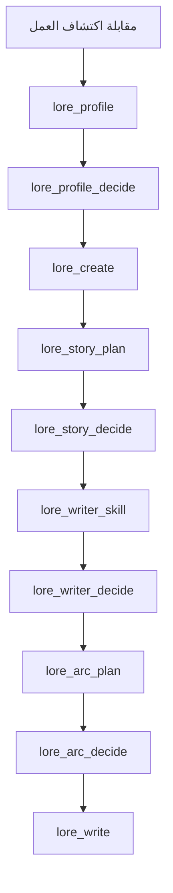
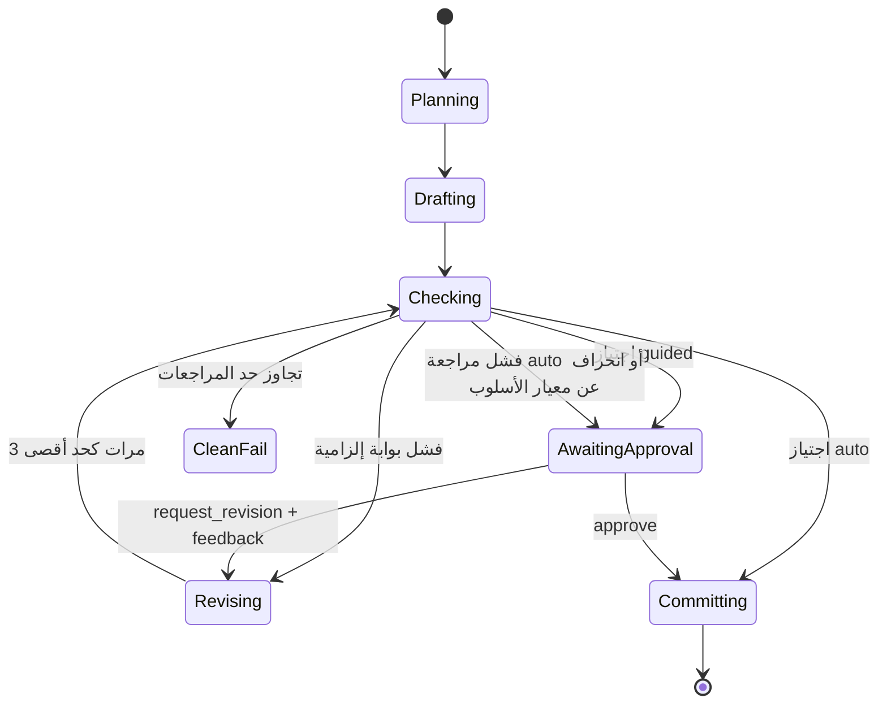
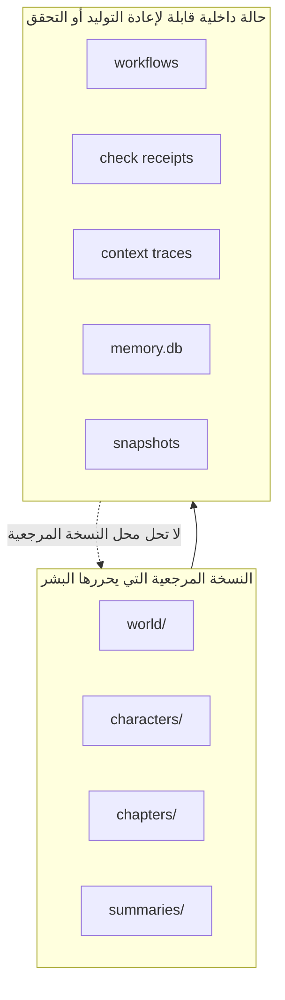

# vibelore

[한국어](README.md) | [English](README.en.md) | [日本語](README.ja.md) | [Español](README.es.md) | [Français](README.fr.md) | [繁體中文](README.zh-Hant.md) | [ไทย](README.th.md) | العربية

خادم MCP محلي يحافظ على إعدادات الرواية الطويلة وحالة الشخصيات والأقواس السردية وترتيب الفحوص.

- يتولى مضيف الذكاء الاصطناعي المتصل كتابة المتن.
- `world/` و`characters/` و`chapters/` هي النسخة المرجعية التي يحررها البشر.
- لا حاجة إلى مفتاح API منفصل ولا إلى عملية بناء.
- تبدأ الكتابة الأساسية بأداة واحدة هي `lore_write`.
- تُحدَّد لغة العمل بمعامل واحد هو `language`، ويُستخدم التدفق نفسه للغات غير الكورية أيضًا.


## التثبيت

المتطلبات: Node.js 22.13 أو أحدث (22.x) أو 24.x. لا توجد خطوة بناء ولا تثبيت للاعتماديات.

أسهل طريقة هي أن تعطي عنوان المستودع لأداة البرمجة بالذكاء الاصطناعي التي تستخدمها (Claude Code أو Codex أو Grok CLI) وتطلب منها ذلك.

> نزّل https://github.com/fbwndrud/vibelore وسجّله كخادم MCP.

بعد انتهاء التسجيل أعد تشغيل أداة الذكاء الاصطناعي مرة واحدة.

لتشغيل خادم MCP من حزمة npm [`vibelore`](https://www.npmjs.com/package/vibelore) دون تنزيل المستودع:

```bash
claude mcp add-json vibelore '{"command":"npx","args":["-y","vibelore"]}' --scope project
```

في Codex استخدم `command = "npx"` و`args = ["-y", "vibelore"]`، وفي Grok CLI استخدم `grok mcp add vibelore -- npx -y vibelore`.
لتثبيت إصدار محدد اكتبه بالشكل `vibelore@0.4.0`. مسار npm يسجّل خادم MCP فقط، لذا ثبّت مهارات المقابلة
بطريقة المستودع أدناه أو كإضافة Codex.

لتنزيل المستودع وتسجيله مباشرة:

```bash
git clone https://github.com/fbwndrud/vibelore.git
claude mcp add-json vibelore '{"command":"node","args":["/absolute/path/to/vibelore/src/server.js"]}' --scope project
```

المستودع أيضًا إضافة (plugin) لـ Codex (`.codex-plugin/plugin.json`). عند تثبيته كإضافة تُحمَّل مهارة مقابلة
اكتشاف العمل وخادم MCP معًا. مهارات Claude Code موجودة في `hosts/claude/skills/`.

يستخدم الخادم stdio، وهو ليس برنامجًا يُشغَّل مباشرة من الطرفية. سجّله أولًا كخادم MCP في
Claude Code أو Codex أو Grok، ثم اطلب من ذلك المضيف الكتابة باللغة الطبيعية.
للتسجيل والاستدعاء الأول اتبع [دليل البدء](docs/GETTING_STARTED.md).

## البيئات المدعومة والمزوّدون

في المسار الافتراضي لا يستدعي vibelore واجهات API لشركات النماذج مباشرة. بل يجيب النموذج
الحالي للمضيف الذي يشغّل MCP عن طلبات المسودة والتخطيط والنقد. لذلك لا حاجة إلى مفتاح API
منفصل، كما يُختار النموذج ومستوى التفكير من جلسة المضيف لا من vibelore.

| مسار التشغيل | مسار استجابة النموذج | الحالة |
|---|---|---|
| تطبيق Codex وواجهة CLI | نموذج جلسة Codex | تم التحقق من دورة الكتابة الكاملة |
| Claude Code | نموذج جلسة Claude Code | تم التحقق من دورة الكتابة الكاملة |
| Grok CLI | نموذج جلسة Grok | تم التحقق من دورة الكتابة الكاملة |
| Ollama وLM Studio وllama.cpp | `/chat/completions` متوافق مع OpenAI | ميزة اختيارية، مسار توافق |

لا يُدعم حاليًا وضع مفاتيح API الخاصة بـ OpenAI أو Anthropic أو Google أو xAI في vibelore
لاستدعائها مباشرة. يُستخدم النموذج المحلي بدلًا من نموذج المضيف فقط عند تحديد
`VIBELORE_LOCAL_BASE_URL` و`VIBELORE_LOCAL_MODEL` معًا. لا يدعم هذا المحوّل المصادقة ولا
تمرير مستوى التفكير، لذا يجب استخدامه مع نقاط نهاية محلية موثوقة فقط.

```bash
VIBELORE_LOCAL_BASE_URL=http://127.0.0.1:11434/v1 \
VIBELORE_LOCAL_MODEL=qwen3:14b \
node /absolute/path/to/vibelore/src/server.js
```

تُسجَّل طريقة التسجيل لكل مضيف والإصدارات التي جرى التحقق منها فعليًا في [HOSTS.md](HOSTS.md).

## النماذج ومستويات التفكير الموصى بها

فيما يلي القيم الموصى بها لتشغيل vibelore بتاريخ 2026-09-05. ليست ترتيبًا يضمن الجودة
الأدبية، بل نقطة انطلاق لتنفيذ التخطيط والمسودة والفحص في جلسة واحدة مع الحفاظ على
التعليمات الطويلة. لا يمكن استخدام سوى النماذج المعروضة في حسابك ومضيفك.

| المضيف | الأولوية للجودة | متوازن | مستوى التفكير الافتراضي |
|---|---|---|---|
| Codex | `gpt-6-astra` | `gpt-5.6-sol` | `high` |
| Claude Code | `opus` (`Claude Opus 5`) | `sonnet` (`Claude Sonnet 5`) | `high` |
| Grok CLI | `grok-4.6` | `grok-4.6` | `high` |
| محلي متوافق مع OpenAI | نموذج جرى التحقق من استجاباته الطويلة بالكورية وبصيغة JSON | لا ينطبق | لا يمكن ضبطه من الخادم |

- مقابلة اكتشاف العمل، والقصة الكاملة، وتصميم القوس الأول: `high`. لا يُنظر في `xhigh` إلا
  عندما تكون الإعدادات والسببية معقدة بشكل خاص.
- عند تخطيط الفصل وكتابته وفحصه عبر `lore_write`: يُوصى بـ `high` قيمةً افتراضية.
- الاستعلام عن الحالة، والموافقة، والتعديلات البسيطة: يكفي `medium` أو `low`.
- لا يُوصى بـ `max` قيمةً افتراضية للكتابة العادية. فهو يزيد التكلفة وزمن الانتظار وقد يعقّد
  العمل بلا داعٍ، لذا لا يُستخدم إلا عندما يتأكد أن سبب الفشل هو نقص كمية التفكير.

لا يغيّر vibelore حاليًا النموذج أو مستوى التفكير بحسب المرحلة. ومن الأفضل للاتساق إنهاء
الملف الشخصي والقوس والمتن التي بدأت في عمل واحد بالنموذج القوي نفسه وبمستوى `high`.
راجع الأسماء الحالية ونطاق الدعم لدى مزوّدي النماذج في [دليل نماذج OpenAI](https://developers.openai.com/api/docs/guides/latest-model)،
و[حالة نماذج Claude](https://docs.anthropic.com/en/docs/about-claude/model-deprecations)،
و[دليل reasoning في Grok](https://docs.x.ai/developers/model-capabilities/text/reasoning).

## طريقة الاستخدام في دقيقة واحدة

### عمل جديد



يكفي أن تطلب من المضيف ما يلي.

> أريد إنشاء عمل باسم `night_bus` في `/absolute/path/to/my-novel`. إنها قصة سائق يستمع إلى ندم الغرباء في حافلة منتصف الليل. ابدأ بمقابلة اكتشاف العمل.

تسأل مهارة `story-discovery-interview` عن 4 إلى 5 تفضيلات تغيّر النتيجة في كل جولة، وتراكم
الإجابات في `lore_profile`. لتخطي المراجعة، صرّح بعبارة «تلقائيًا» أو «من دون سؤال».
وإلا فإن الملف الشخصي والقصة الكاملة ومهارة الكاتب والقوس تُفعَّل بعد الموافقة.
عمق الموضوع وصعوبة القراءة محوران منفصلان؛ إذ يُتحقَّق من صعوبة الجمل السطحية، وسرعة إدخال
المفاهيم الجديدة، وعبء الاستدلال، وطريقة تصاعد التعقيد في البداية على حدة في مقابلة اكتشاف العمل.

### الفصل التالي

> اكتب الفصل التالي من `night_bus` في وضع guided.

ينفّذ `lore_write` التخطيط والمسودة والفحوص الحتمية وحزمة مراجعة critic وصولًا إلى إصدار إيصال الفحص. يعرض `guided` الملاحظات الاستشارية (advisory) والمخطوطة النهائية ثم ينتظر الموافقة عبر `lore_decide`. أما `auto` فلا يودع تلقائيًا إلا عند اجتياز فحوص الثوابت واكتمال critic بشكل سليم. إذا فشلت المراجعة أو كانت الاستجابة ناقصة، تُحفظ المخطوطة ويتحول العمل إلى انتظار الموافقة مع `CRITIC_INCOMPLETE`. لا تُعاد كتابة المخطوطة تلقائيًا بناءً على ملاحظات استشارية فقط مثل الأسلوب والتنويع والكثافة.

عند تحديد فصل إلى ثلاثة فصول مرجعية أعجبتك عبر `lore_style_anchor(action="approve")`، تستخدم
المسودات والمراجعات اللاحقة معيار الأسلوب نفسه للعمل. المسودة الجديدة التي تنحرف كثيرًا عن المعيار
لا تُعاد كتابتها تلقائيًا بل تُحوَّل إلى المراجعة، وتُطبَّق التعديلات كترقيعات محدودة تحافظ على فقرات النص الأصلي.
إذا كتبت في `reason` سبب إعجابك عند الموافقة على المعيار، فسيُمرَّر مع الأمثلة المرجعية إلى الكتابة اللاحقة.



### تطبيق التفضيلات وسجل المراجعة

تُمرَّر وعود القارئ المعتمدة والنبرة وطريقة سرد الشخصيات واتجاه الكتابة إلى طلب المسودة الفعلي.
يُختار مثالان أسلوبيان على الأكثر للاستئناس بهما في الفصل المعني، مع تسجيل أسباب الاختيار والاستبعاد.
إذا تجاوزت المدخلات الأساسية الميزانية، لا تُحذف بصمت بل يُبلَّغ عنها كخطأ.

حتى إذا كانت الدرجة الإجمالية للمراجعة مرتفعة، تُحفظ الملاحظات المحددة وأدلتها. اكتمال المراجعة لا يضمن المتعة،
والنتيجة التي كتبها المضيف نفسه وراجعها هي مراجعة ذاتية. وإذا لم يُتحقَّق من استقلالية السياق، تُسجَّل تلك الحالة أيضًا.

يمكنك أن تطلب من المضيف: «أرني أدلة مراجعة هذا الفصل وطلب الكتابة الفعلي».
يُستعلم عن السجل عبر `lore_workflow_history`، وعند تحديد `includeModelExchanges=true`
تُعرض أيضًا طلبات المسودة والمراجعة الفعلية واستجاباتها المرتبطة بالأحداث المستعلَم عنها. يمكن تتبع
تجزئة (hash) المخطوطة وعقد العمل، ومعرّف مصدر التنفيذ، ومصدر المراجعة وحالة الاكتمال أو الفشل معًا.
يُحفظ السجل محليًا ولا يُنشر خارجيًا تلقائيًا.

للتفاصيل راجع [استجابات المراجعة والتدقيق](docs/OPERATIONS.md#검토-응답과-감사).

### التحويل إلى ويبتون

> حوّل الفصل 1 من `night_bus` إلى ويبتون. اسألني عن الاتجاه أولًا.

يُقتبس الفصل المكتوب مع أخذ الشخصيات والعالم والحالة حتى ذلك الفصل من الأصل، فلا حاجة إلى شرحها من جديد.
يسأل `lore_webtoon_scene` أولًا عن أسلوب الرسم وكتابة النصوص والتمرير العمودي وعدد اللوحات، ثم يؤكد الرسوم
المرجعية للشخصيات والأماكن. بعد ذلك يرسم كل مشهد كاملًا مع الحوار صورةً عمودية واحدة، ويراجع الصورة الفعلية.
تتبع النصوص المرسومة لغة العمل. طريقة الموافقة على مسودة لكل لوحة على حدة قديمة (deprecated) ولا تُستخدم إلا
لمتابعة الأعمال الجارية. تُرسم الصور بأداة الصور لدى المضيف أو بواجهة API للصور؛ ولا تُستخدم واجهة مدفوعة إلا
بعد التأكيد، وموافقة الويبتون منفصلة عن موافقة الرواية. راجع [دليل الويبتون](docs/WEBTOON.md).

## لغة العمل

تُحدَّد لغة كتابة العمل بالمعامل الاختياري `language` الذي تقبله `lore_profile` و`lore_init`
و`lore_create` و`lore_write`. عندما يصرّح المستخدم بلغة الكتابة باللغة الطبيعية، يطبّعها المضيف
إلى وسم BCP 47 (مثل `ja` أو `pt-BR` أو `zh-Hant`) ويمرّرها، وإذا لم يختر لغة يُحذف المعامل.
الأعمال القائمة التي لا تحتوي مفتاح لغة تُعد ضمنيًا `ko`. لغة المحادثة ولغة العمل منفصلتان،
لذا يمكنك التحدث بالكورية وكتابة عمل باليابانية.

> أريد إنشاء عمل باسم `harbor_summer` في `/absolute/path/to/my-novel`. اكتب المتن بالإسبانية.

- هناك عائلتان من الموجّهات (prompts): تستخدم `ko` تعليمات مخصصة للكورية، بينما تستخدم اللغات
  الأخرى (بما فيها الإنجليزية) عائلة تجمع التعليمات الإنجليزية المشتركة مع اللغة الهدف. يتبع المتن
  والعنوان والملخص ووصف العالم والشخصيات والقيم الوصفية في الخطة والمراجعة اللغةَ الهدف،
  ولا تُترجم القيم التي تقرؤها الآلة مثل مفاتيح JSON وقيم enum والمعرّفات (ID).
- يُقاس الحجم بوحدة تناسب اللغة: عدد الأحرف كما كان للكورية، وعدد الوحدات الكتابية (grapheme)
  أو الكلمات للغات الأخرى، وتُعالج ضمن العقد نفسه أنظمةُ الكتابة الغنية بالأحرف المركبة مثل
  العربية والعبرية، والتايلاندية التي لا تستخدم المسافات.
- لا يمكن تغيير اللغة بعد إنشاء foundation. إذا مُرِّرت قيمة تختلف عن اللغة المحفوظة، لا تُستبدل
  بصمت بل تُرفض مع `LANGUAGE_CONTRACT_CONFLICT`.
- يُفحص في كل فصل ما إذا كان المتن والملخص والخطة مكتوبة بلغة العمل، أما الثوابت الدلالية مثل
  وجهة النظر وتسجيل الشخصيات وإعدادات العالم فيتولاها المدقق نفسه بصرف النظر عن اللغة.

اللغات التي جرى التحقق من تدفقها الكامل فعليًا بـ Claude Sonnet 5، من الملف الشخصي حتى الموافقة
على الفصل الثاني والتدقيق اللغوي النهائي، هي الإنجليزية والإسبانية واليابانية والفرنسية والكورية
والعربية والصينية التقليدية والتايلاندية. لتفاصيل عقد المعاملات راجع
[لغة العمل ووحدة الحجم](docs/TOOLS.md#작품-언어와-분량-단위).

## النسخة المرجعية وحالة الآلة

```text
my-novel/
├── world/                 النسخة المرجعية لإعدادات العالم
├── characters/            النسخة المرجعية للشخصيات
├── chapters/              النسخة المرجعية للنص
├── summaries/             ملخّصات لكل فصل
└── .vibelore/             بيانات سير العمل والفحص وإسقاط البحث والاستعادة
```

يمكنك تعديل `world/` و`characters/` و`chapters/` مباشرة. لا تعدّل `.vibelore/` يدويًا.



## آليات الأمان

- لا تبدأ كتابة المتن من دون قوس نشط.
- يُرفض الإيداع إذا اختلف hash المتن المفحوص عن hash المتن المراد إيداعه.
- عند إعادة كتابة فصل سابق، يُعاد حساب الحالات اللاحقة عبر `lore_refold`.
- تُنشأ snapshot مع كل إيداع، ويمكن الاستعادة عبر `lore_rollback`.
- في غياب مفتاح API بعيد، يُستخدم الذكاء الاصطناعي للمضيف.
- ذاكرة البحث وحالة الآلة تدعمان النسخة المرجعية فقط ولا تستبدلانها.

## الوثائق

- [خريطة الوثائق](docs/README.md): العثور على الوثيقة المطلوبة بحسب الحالة
- [التوجه والفلسفة](docs/PHILOSOPHY.md): ما الذي يتحمّله vibelore وما الذي يُترك للنموذج والكاتب
- [دليل البدء](docs/GETTING_STARTED.md): التثبيت والتسجيل والعمل الأول والفصل التالي
- [عقد MCP](docs/MCP.md): البروتوكول والاستجابات واستئناف النموذج وسير العمل
- [مرجع الأدوات](docs/TOOLS.md): العقود الفعلية للأدوات الأساسية الـ26 وأدوات الصيانة المتقدمة
- [البنية المعمارية](docs/ARCHITECTURE.md): النسخة المرجعية وآلة الحالة ومُصرِّف (compiler) المدخلات والإيداع
- [التشغيل والاستعادة](docs/OPERATIONS.md): فحص الحالة والتعامل مع الفشل وrewrite/refold/rollback
- [التثبيت لكل مضيف](HOSTS.md): سجل التحقق لـ Claude Code وCodex CLI وGrok CLI

## الاختبارات

```bash
npm test
npm run test:engine
npm run test:all
```

لا حاجة إلى تثبيت الاعتماديات ولا إلى عملية بناء.
