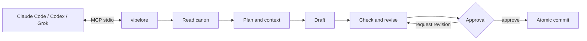
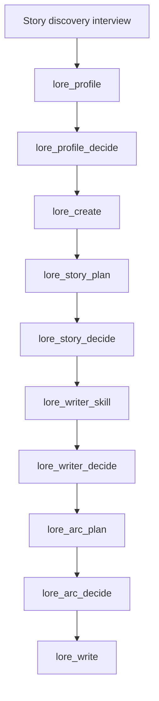
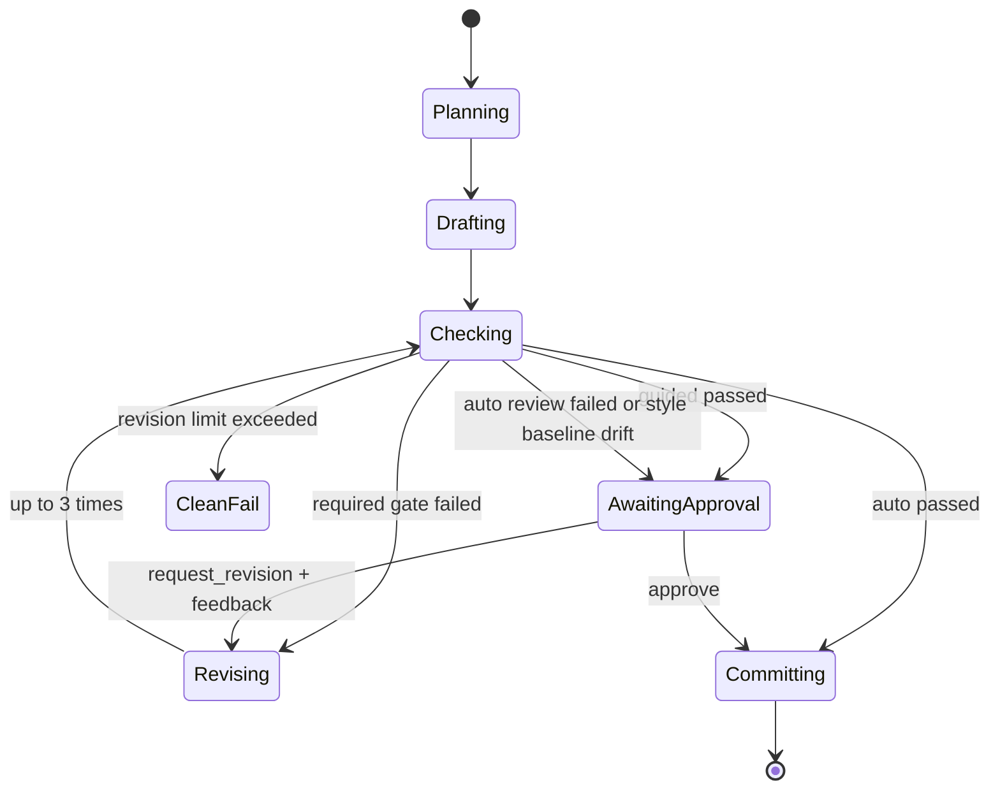
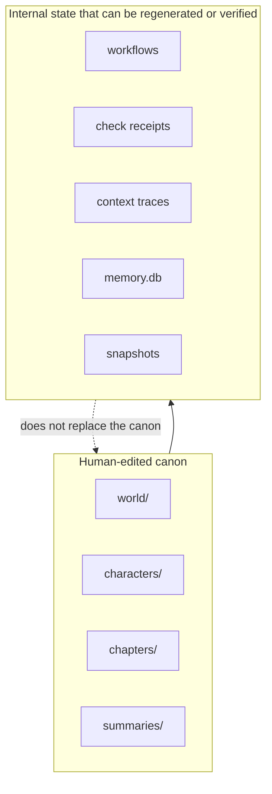

# vibelore

[한국어](README.md) | English | [日本語](README.ja.md) | [Español](README.es.md) | [Français](README.fr.md) | [繁體中文](README.zh-Hant.md) | [ไทย](README.th.md) | [العربية](README.ar.md)

A local MCP server that keeps a long-form novel's world settings, character state, arcs, and check order intact.

- The connected AI host writes the prose.
- `world/`, `characters/`, and `chapters/` are the human-edited canon.
- No separate API key or build step is required.
- Everyday writing starts with a single tool, `lore_write`.
- The work's language is set with a single `language` argument, and the same flow works for languages other than Korean.



## Installation

Requirements: Node.js 22.13 or later (22.x) or 24.x. There is no build step and no dependency installation.

The easiest way is to give your AI coding tool (Claude Code, Codex, Grok CLI) the repository address and ask.

> Clone https://github.com/fbwndrud/vibelore and register it as an MCP server.

Restart the AI tool once after registration.

To run the MCP server from the npm package [`vibelore`](https://www.npmjs.com/package/vibelore) without cloning the repository:

```bash
claude mcp add-json vibelore '{"command":"npx","args":["-y","vibelore"]}' --scope project
```

For Codex use `command = "npx"` and `args = ["-y", "vibelore"]`; for Grok CLI, `grok mcp add vibelore -- npx -y vibelore`.
To pin a version, write it as `vibelore@0.4.0`. The npm path registers only the MCP server, so install the
interview skills with the repository method below or as a Codex plugin.

To clone the repository and register it directly:

```bash
git clone https://github.com/fbwndrud/vibelore.git
claude mcp add-json vibelore '{"command":"node","args":["/absolute/path/to/vibelore/src/server.js"]}' --scope project
```

The repository is also a Codex plugin (`.codex-plugin/plugin.json`). Installing it as a plugin loads the
story discovery interview skill and the MCP server together. Claude Code skills live in `hosts/claude/skills/`.

The server uses stdio. It is not a program you run directly from a terminal. First register
it as an MCP server in Claude Code, Codex, or Grok, then ask that host to write in natural
language. Follow the [Getting Started guide](docs/GETTING_STARTED.md) for registration and the first call.

## Supported environments and providers

On the default path, vibelore does not call model vendor APIs directly. The current model of
the host running MCP answers the draft, plan, and critique requests. That is why no separate
API key is needed, and the model and reasoning level are chosen in the host session, not in vibelore.

| Execution path | Model response path | Status |
|---|---|---|
| Codex app and CLI | Codex session model | Full writing round trip verified |
| Claude Code | Claude Code session model | Full writing round trip verified |
| Grok CLI | Grok session model | Full writing round trip verified |
| Ollama, LM Studio, llama.cpp | OpenAI-compatible `/chat/completions` | Optional feature, compatibility path |

Putting OpenAI, Anthropic, Google, or xAI API keys into vibelore for direct calls is not
currently supported. A local model is used in place of the host model only when both
`VIBELORE_LOCAL_BASE_URL` and `VIBELORE_LOCAL_MODEL` are set. This adapter does not support
authentication or passing a reasoning level, so use it only with a trusted local endpoint.

```bash
VIBELORE_LOCAL_BASE_URL=http://127.0.0.1:11434/v1 \
VIBELORE_LOCAL_MODEL=qwen3:14b \
node /absolute/path/to/vibelore/src/server.js
```

Per-host registration steps and the versions actually verified are recorded in [HOSTS.md](HOSTS.md).

## Recommended models and reasoning levels

The following are the recommended operating values for vibelore as of 2026-09-05. They are
not a ranking that guarantees literary quality; they are a starting point for carrying out
planning, drafting, and checking in one session while holding long instructions. You can only
use the models that your account and host expose.

| Host | Quality first | Balanced | Default reasoning level |
|---|---|---|---|
| Codex | `gpt-6-astra` | `gpt-5.6-sol` | `high` |
| Claude Code | `opus` (`Claude Opus 5`) | `sonnet` (`Claude Sonnet 5`) | `high` |
| Grok CLI | `grok-4.6` | `grok-4.6` | `high` |
| Local OpenAI-compatible | A model verified for long-form Korean and JSON responses | Not applicable | Cannot be adjusted from the server |

- Story discovery interview, full story, and first arc design: `high`. Consider `xhigh` only
  when the world settings and causality are especially complex.
- Planning, writing, and checking a chapter with `lore_write`: `high` is the recommended default.
- Status queries, approvals, and simple touch-ups: `medium` or `low` is enough.
- `max` is not recommended as the default for everyday writing. It increases cost and wait time
  and can make the work needlessly complex, so use it only when a failure has been traced to insufficient reasoning.

vibelore does not currently switch models or reasoning levels between stages. A profile, arc,
and prose started in one task are best finished with the same strong model at the `high` level
for consistency. Check the vendors' current names and support ranges in the [OpenAI model guide](https://developers.openai.com/api/docs/guides/latest-model),
[Claude model status](https://docs.anthropic.com/en/docs/about-claude/model-deprecations),
and the [Grok reasoning guide](https://docs.x.ai/developers/model-capabilities/text/reasoning).

## One-minute usage

### A new work



Ask the host something like this.

> I want to create a work called `night_bus` in `/absolute/path/to/my-novel`. It's the story of a driver who listens to strangers' regrets on the night bus. Start with the story discovery interview.

The `story-discovery-interview` skill asks four or five outcome-changing preference questions per
round and accumulates the answers in `lore_profile`. To skip review, say "automatically" or
"don't ask me" explicitly. Otherwise the profile, full story, writer skill, and arc are activated after approval.
Thematic depth and reading difficulty are separate axes. Surface sentence difficulty, the pace of new
concepts, inference load, and how complexity ramps up early on are each confirmed separately in the story discovery interview.

### The next chapter

> Write the next chapter of `night_bus` in guided mode.

`lore_write` runs planning, drafting, deterministic checks, the critic review bundle, and issues the check receipt. `guided` shows the advisory and the final manuscript, then waits for `lore_decide` approval. `auto` commits automatically only when the invariant checks pass and the critic completes normally. If the review fails or the response is incomplete, the manuscript is preserved and the workflow switches to awaiting approval with `CRITIC_INCOMPLETE`. Advisories alone, such as style, variation, or density, never trigger an automatic rewrite of the manuscript.

Designate one to three canon chapters you like with `lore_style_anchor(action="approve")` and later
drafts and revisions will use the same style baseline for the work. A new draft that strays far from
the baseline is not rewritten automatically; it is routed for review, and revisions are applied as
constrained patches that preserve the original paragraphs. If you note why you liked it in `reason`
when approving the baseline, that is passed along with the canon example to later writing.



### Preference handling and review records

The approved reader promises, tone, character narration style, and writing direction are passed into
the actual draft request. Up to two style examples are selected for reference in the chapter, and the
reasons for selecting or excluding them are recorded. If the core inputs exceed the budget, they are
reported as an error rather than silently dropped.

Specific critiques and their evidence are preserved even when the overall review score is high. A completed
review does not guarantee the chapter is enjoyable, and a result written and reviewed by the same host is a
self-review. If the independence of the context cannot be confirmed, that state is recorded too.

You can ask the host, "Show me this chapter's review evidence and the actual writing request."
Query the history with `lore_workflow_history`, and set `includeModelExchanges=true` to also see the
actual draft and review requests and responses linked to the queried events. You can track the hashes of
the manuscript and the work contract, the execution source identifier, the review origin, and the
completion or failure status together.
Records are stored locally and are never published externally on their own.

See [Review responses and auditing](docs/OPERATIONS.md#검토-응답과-감사) for details.

### Webtoon adaptation

> Adapt chapter 1 of `night_bus` into a webtoon. Ask me about the direction first.

A written chapter is adapted with its characters, world, and state taken from the source, so nothing has
to be explained again. `lore_webtoon_scene` first asks about art style, lettering, vertical scrolling, and
panel count, then confirms reference art for characters and places. Each whole scene is then drawn,
lettering included, as one vertical image, and the actual picture is reviewed. Lettering follows the
work's language. The older per-panel rough approval flow is deprecated and only continues work already in
progress. Images come from the host's image tool or an image API; a paid API is used only after
confirmation, and webtoon approval is separate from novel approval. See the [webtoon guide](docs/WEBTOON.md).

## Work language

The language a work is written in is set with the optional `language` argument accepted by
`lore_profile`, `lore_init`, `lore_create`, and `lore_write`. When the user states the writing
language in natural language, the host normalizes it into a BCP 47 tag (`ja`, `pt-BR`, `zh-Hant`, etc.)
and passes it along; if no language is chosen, the argument is omitted. Existing works without a
language key are implicitly `ko`. The conversation language and the work language are independent,
so you can write a Japanese novel while talking in Korean.

> I want to create a work called `harbor_summer` in `/absolute/path/to/my-novel`. Write the prose in Spanish.

- There are two prompt families. `ko` uses Korean-specific instructions, while every other language
  (including English) uses the shared English instructions combined with the target language. Prose,
  titles, summaries, world and character descriptions, and descriptive values in plans and reviews
  follow the target language, while machine-read values such as JSON keys, enums, and IDs are not translated.
- Length is measured in a unit that fits the language. Korean uses the existing character count; other
  languages use grapheme or word counts, and writing systems with many combining characters such as
  Arabic and Hebrew, as well as Thai, which has no spaces between words, are handled within the same contract.
- The language cannot be changed once the foundation has been created. Passing a value that differs
  from the stored language is rejected with `LANGUAGE_CONTRACT_CONFLICT` instead of silently overwriting it.
- Every chapter is checked to confirm the prose, summary, and plan were written in the work's language,
  and semantic invariants such as point of view, character registration, and world settings are
  examined by the same checker regardless of language.

The languages verified end to end with a real Claude Sonnet 5, from profile through second-chapter
approval and the final language audit, are English, Spanish, Japanese, French, Korean, Arabic,
Traditional Chinese, and Thai. See [Work language and length units](docs/TOOLS.md#작품-언어와-분량-단위)
for the argument contract details.

## Canon and machine state

```text
my-novel/
├── world/                 world-setting canon
├── characters/            character canon
├── chapters/              chapter-text canon
├── summaries/             per-chapter summaries
└── .vibelore/             workflow, check, search-projection, and recovery data
```

You may edit `world/`, `characters/`, and `chapters/` directly. Do not edit `.vibelore/` by hand.



## Safeguards

- Prose is never written without an active arc.
- A commit is refused if the hash of the checked prose differs from the hash of the prose being committed.
- Rewriting an earlier chapter recomputes the later state with `lore_refold`.
- Every commit creates a snapshot, and `lore_rollback` can restore it.
- Without a remote API key, the host AI is used.
- Search memory and machine state only assist the canon; they never overwrite it.

## Documents

- [Documentation map](docs/README.md): find the document you need by situation
- [Direction and philosophy](docs/PHILOSOPHY.md): what vibelore is responsible for and what it leaves to the model and the writer
- [Getting Started guide](docs/GETTING_STARTED.md): installation, registration, the first work, the next chapter
- [MCP contract](docs/MCP.md): protocol, responses, model resumption, workflows
- [Tool reference](docs/TOOLS.md): the actual contracts of the 26 default tools and the advanced maintenance tools
- [Architecture](docs/ARCHITECTURE.md): canon, state machine, input compiler, commits
- [Operations and recovery](docs/OPERATIONS.md): status checks, failure handling, rewrite/refold/rollback
- [Per-host installation](HOSTS.md): verification records for Claude Code, Codex CLI, and Grok CLI

## Tests

```bash
npm test
npm run test:engine
npm run test:all
```

No dependency installation or build step is required.
