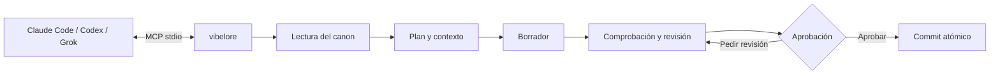
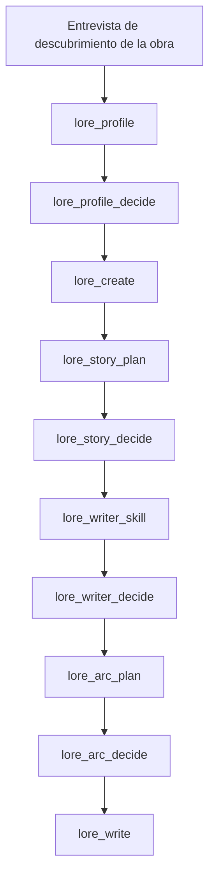
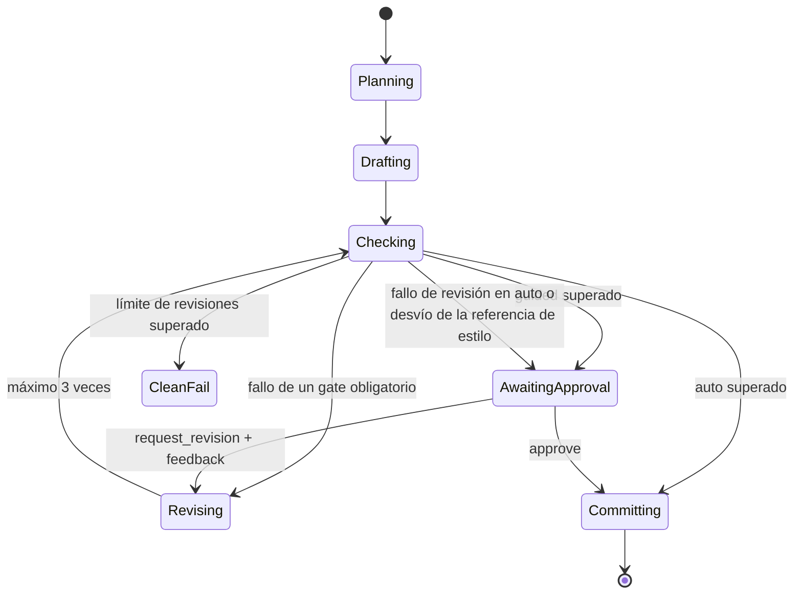
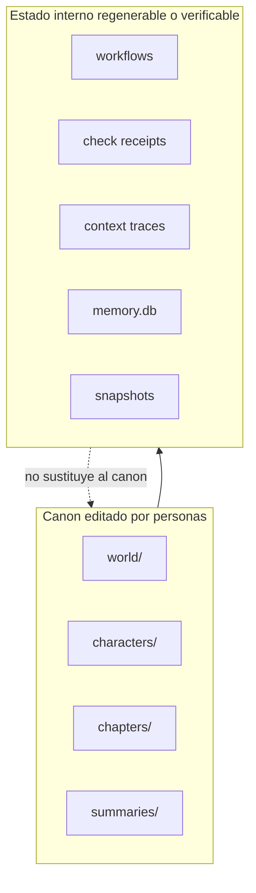

# vibelore

[한국어](README.md) | [English](README.en.md) | [日本語](README.ja.md) | Español | [Français](README.fr.md) | [繁體中文](README.zh-Hant.md) | [ไทย](README.th.md) | [العربية](README.ar.md)

Un servidor MCP local que mantiene la ambientación, el estado de los personajes, los arcos y el orden de las comprobaciones de una novela larga.

- El texto lo escribe el host de IA conectado.
- `world/`, `characters/` y `chapters/` son el canon que editan las personas.
- No hacen falta claves de API ni pasos de compilación adicionales.
- La escritura básica empieza con una sola herramienta: `lore_write`.
- El idioma de la obra se fija con un único argumento, `language`, y el mismo flujo sirve para idiomas distintos del coreano.



## Instalación

Requisitos: Node.js 22.13 o superior (22.x) o 24.x. No hay paso de compilación ni instalación de dependencias.

Lo más sencillo es dar la dirección del repositorio a tu herramienta de programación con IA (Claude Code,
Codex, Grok CLI) y pedírselo.

> Descarga https://github.com/fbwndrud/vibelore y regístralo como servidor MCP.

Cuando termine el registro, reinicia una vez la herramienta de IA.

Para ejecutar el servidor MCP con el paquete npm [`vibelore`](https://www.npmjs.com/package/vibelore) sin descargar el repositorio:

```bash
claude mcp add-json vibelore '{"command":"npx","args":["-y","vibelore"]}' --scope project
```

En Codex usa `command = "npx"` y `args = ["-y", "vibelore"]`; en Grok CLI, `grok mcp add vibelore -- npx -y vibelore`.
Para fijar una versión, escríbela como `vibelore@0.4.0`. La vía npm solo registra el servidor MCP, así que las
skills de entrevista se instalan con el método del repositorio de abajo o como plugin de Codex.

Para descargar el repositorio y registrarlo directamente:

```bash
git clone https://github.com/fbwndrud/vibelore.git
claude mcp add-json vibelore '{"command":"node","args":["/absolute/path/to/vibelore/src/server.js"]}' --scope project
```

El repositorio también es un plugin de Codex (`.codex-plugin/plugin.json`). Si lo instalas como plugin, la skill
de entrevista de descubrimiento de la obra y el servidor MCP se cargan juntos. Las skills para Claude Code están en `hosts/claude/skills/`.

El servidor usa stdio. No es un programa que se ejecute directamente desde la terminal. Primero
regístralo como servidor MCP en Claude Code, Codex o Grok y después pide a ese host, en lenguaje
natural, que escriba. Para el registro y la primera llamada, sigue la [guía de inicio](docs/GETTING_STARTED.md).

## Entornos y proveedores compatibles

En la ruta por defecto, vibelore no llama directamente a las API de las empresas de modelos. El
modelo actual del host que ejecuta el MCP responde a las peticiones de borrador, plan y crítica.
Por eso no hace falta una clave de API aparte, y el modelo y el nivel de razonamiento se eligen
en la sesión del host, no en vibelore.

| Ruta de ejecución | Ruta de respuesta del modelo | Estado |
|---|---|---|
| App y CLI de Codex | Modelo de la sesión de Codex | Ciclo completo de escritura verificado |
| Claude Code | Modelo de la sesión de Claude Code | Ciclo completo de escritura verificado |
| Grok CLI | Modelo de la sesión de Grok | Ciclo completo de escritura verificado |
| Ollama, LM Studio, llama.cpp | `/chat/completions` compatible con OpenAI | Función opcional, ruta de compatibilidad |

Actualmente no se admite introducir claves de API de OpenAI, Anthropic, Google o xAI en vibelore
para llamarlas directamente. El modelo local solo sustituye al modelo del host cuando se especifican
tanto `VIBELORE_LOCAL_BASE_URL` como `VIBELORE_LOCAL_MODEL`. Este adaptador no admite autenticación
ni transmisión del nivel de razonamiento, así que solo debe usarse con endpoints locales de confianza.

```bash
VIBELORE_LOCAL_BASE_URL=http://127.0.0.1:11434/v1 \
VIBELORE_LOCAL_MODEL=qwen3:14b \
node /absolute/path/to/vibelore/src/server.js
```

El método de registro por host y las versiones verificadas se registran en [HOSTS.md](HOSTS.md).

## Modelos y niveles de razonamiento recomendados

Estos son los valores recomendados para operar vibelore a fecha de 2026-09-05. No es una
clasificación que garantice calidad literaria, sino un punto de partida para ejecutar plan, borrador
y comprobación en una sola sesión manteniendo instrucciones largas. Solo se pueden usar los modelos
que aparecen en tu cuenta y en tu host.

| Host | Prioridad en calidad | Equilibrado | Nivel de razonamiento por defecto |
|---|---|---|---|
| Codex | `gpt-6-astra` | `gpt-5.6-sol` | `high` |
| Claude Code | `opus` (`Claude Opus 5`) | `sonnet` (`Claude Sonnet 5`) | `high` |
| Grok CLI | `grok-4.6` | `grok-4.6` | `high` |
| Local compatible con OpenAI | Un modelo verificado para texto largo en coreano y respuestas JSON | No aplica | No ajustable desde el servidor |

- Entrevista de descubrimiento de la obra, historia completa y diseño del primer arco: `high`. Solo
  considera `xhigh` cuando la ambientación y la causalidad sean especialmente complejas.
- Al planificar, escribir y comprobar un capítulo con `lore_write`: se recomienda `high` como valor por defecto.
- Consultas de estado, aprobaciones y retoques simples: `medium` o `low` bastan.
- `max` no se recomienda como valor por defecto para la escritura habitual. Aumenta el coste y la
  espera y puede complicar la obra innecesariamente, así que úsalo solo cuando se haya confirmado que
  el fallo se debe a falta de razonamiento.

Actualmente vibelore no cambia de modelo ni de nivel de razonamiento por etapa. Para la coherencia,
conviene terminar el perfil, el arco y el texto iniciados en una tarea con el mismo modelo fuerte y
el nivel `high`. Consulta los nombres actuales y el alcance de soporte de cada proveedor en la
[guía de modelos de OpenAI](https://developers.openai.com/api/docs/guides/latest-model),
el [estado de los modelos de Claude](https://docs.anthropic.com/en/docs/about-claude/model-deprecations)
y la [guía de reasoning de Grok](https://docs.x.ai/developers/model-capabilities/text/reasoning).

## Uso en 1 minuto

### Obra nueva



Basta con pedirle al host algo como esto.

> Quiero crear una obra llamada `night_bus` en `/absolute/path/to/my-novel`. Es la historia de un conductor de autobús nocturno que escucha los arrepentimientos de desconocidos. Empieza por la entrevista de descubrimiento de la obra.

La skill `story-discovery-interview` pregunta, en cada ronda, 4 o 5 preferencias que cambian el
resultado y acumula las respuestas en `lore_profile`. Para omitir la revisión, indica explícitamente
"automáticamente" o "sin preguntar". De lo contrario, el perfil, la historia completa, la skill de
escritor y el arco se activan tras su aprobación. La profundidad temática y la dificultad de lectura
son ejes distintos. La dificultad de las frases en superficie, el ritmo de introducción de conceptos
nuevos, la carga inferencial y la forma en que crece la complejidad al principio se confirman por
separado en la entrevista de descubrimiento de la obra.

### Siguiente capítulo

> Escribe el siguiente capítulo de `night_bus` en modo guided.

`lore_write` ejecuta el plan, el borrador, las comprobaciones deterministas, el conjunto de revisiones del critic y la emisión del recibo de comprobación. `guided` muestra el advisory y el manuscrito final y luego espera la aprobación con `lore_decide`. `auto` solo hace commit automáticamente cuando se superan las comprobaciones de invariantes y el critic termina correctamente. Si la revisión falla o la respuesta está incompleta, conserva el manuscrito y pasa a espera de aprobación con `CRITIC_INCOMPLETE`. No reescribe el manuscrito automáticamente solo por advisories de estilo, variación o densidad.

Si designas de 1 a 3 capítulos canónicos que te gusten con `lore_style_anchor(action="approve")`, los
borradores y revisiones posteriores usarán la misma referencia de estilo de la obra. Un borrador nuevo
que se aleje mucho de la referencia no se reescribe automáticamente, sino que se envía a revisión, y
las correcciones se aplican como parches limitados que conservan los párrafos originales. Si al aprobar
la referencia escribes en `reason` por qué te gustó, ese motivo se transmite junto con los ejemplos
canónicos a la escritura posterior.



### Preferencias aplicadas y registro de revisión

Las promesas al lector, el tono, la forma de narrar a los personajes y la dirección de escritura
aprobados se transmiten a la petición real de borrador. Para cada capítulo se seleccionan como máximo
dos ejemplos de estilo de referencia, y se registran los motivos de selección y exclusión. Si las
entradas esenciales superan el presupuesto, no se eliminan en silencio: se notifica con un error.

Aunque la puntuación total de la revisión sea alta, se conservan las observaciones concretas y sus
fundamentos. Una revisión completada no garantiza que sea entretenido, y un resultado escrito y revisado
por el mismo host es una autorrevisión. Si no se confirma la independencia del contexto, ese estado
también se registra.

Puedes pedir al host: "Muéstrame los fundamentos de la revisión y la petición real de escritura de este
capítulo". Consulta el historial con `lore_workflow_history` y, si indicas `includeModelExchanges=true`,
verás también las peticiones y respuestas reales de borrador y revisión vinculadas a los eventos
consultados. Puedes seguir a la vez el hash del manuscrito y del contrato de la obra, el identificador
de la fuente de ejecución, el origen de la revisión y su estado de finalización o fallo. El registro se
guarda en local y no se publica automáticamente fuera.

Para más detalles, consulta [Respuestas de revisión y auditoría](docs/OPERATIONS.md#검토-응답과-감사).

### Adaptación a webtoon

> Adapta el capítulo 1 de `night_bus` a webtoon. Pregúntame primero por la dirección.

Un capítulo ya escrito se adapta tomando del original los personajes, el mundo y el estado hasta ese
capítulo, así que no hace falta volver a explicarlos. `lore_webtoon_scene` pregunta primero por el estilo de
dibujo, el rotulado, el desplazamiento vertical y el número de viñetas, y confirma las imágenes de referencia
de personajes y lugares. Después dibuja cada escena completa, con los diálogos incluidos, como una sola imagen
vertical y revisa la imagen real. El rotulado sigue el idioma de la obra. El flujo anterior de aprobar un boceto
por viñeta está obsoleto y solo continúa trabajos ya en curso. Las imágenes salen de la herramienta de imagen
del host o de una API de imágenes; una API de pago solo se usa tras confirmación, y la aprobación del webtoon es
independiente de la de la novela. Consulta la [guía de webtoon](docs/WEBTOON.md).

## Idioma de la obra

El idioma en que se escribe la obra se fija con el argumento opcional `language` que reciben
`lore_profile`, `lore_init`, `lore_create` y `lore_write`. Si el usuario indica el idioma de escritura
en lenguaje natural, el host lo normaliza a una etiqueta BCP 47 (`ja`, `pt-BR`, `zh-Hant`, etc.) y la
pasa; si no se elige idioma, el argumento se omite. Las obras existentes sin clave de idioma son
implícitamente `ko`. El idioma de la conversación y el de la obra son independientes, así que puedes
conversar en coreano mientras escribes una obra en japonés.

> Quiero crear una obra llamada `harbor_summer` en `/absolute/path/to/my-novel`. Escribe el texto en español.

- Hay dos familias de prompts. `ko` usa instrucciones especializadas en coreano; el resto de idiomas
  (incluido el inglés) usa la familia de instrucciones comunes en inglés combinadas con el idioma
  objetivo. El texto, los títulos, los resúmenes, las descripciones de mundo y personajes y los valores
  descriptivos de planes y revisiones siguen el idioma objetivo; los valores legibles por máquina, como
  claves JSON, enums e ID, no se traducen.
- La extensión se mide en la unidad adecuada a cada idioma. En coreano es el recuento de caracteres
  existente; en el resto de idiomas, grafemas (grapheme) o palabras, y los sistemas de escritura con
  muchos caracteres combinantes, como el árabe o el hebreo, y el tailandés, que no separa palabras con
  espacios, se tratan dentro del mismo contrato.
- El idioma no puede cambiarse una vez creada la foundation. Si se pasa un valor distinto del idioma
  guardado, no se sobrescribe en silencio: se rechaza con `LANGUAGE_CONTRACT_CONFLICT`.
- En cada capítulo se comprueba que el texto, el resumen y el plan estén escritos en el idioma de la
  obra, y los invariantes semánticos, como el punto de vista, el registro de personajes y la
  ambientación del mundo, los revisa el mismo verificador con independencia del idioma.

Los idiomas en los que se ha verificado el flujo completo con Claude Sonnet 5 real, desde el perfil
hasta la aprobación del capítulo 2 y la auditoría final de idioma, son inglés, español, japonés,
francés, coreano, árabe, chino tradicional y tailandés. Para los detalles del contrato de argumentos,
consulta [Idioma de la obra y unidades de extensión](docs/TOOLS.md#작품-언어와-분량-단위); para el
registro de verificación, el [registro de implementación multilingüe](https://github.com/fbwndrud/vibelore/blob/main/docs/research/MULTILINGUAL_IMPLEMENTATION.md).

## Canon y estado de la máquina

```text
my-novel/
├── world/                 canon de la ambientación
├── characters/            canon de personajes
├── chapters/              canon del texto
├── summaries/             resúmenes por capítulo
└── .vibelore/             datos de flujo, comprobación, proyección de búsqueda y recuperación
```

Puedes editar directamente `world/`, `characters/` y `chapters/`. No modifiques `.vibelore/` a mano.



## Salvaguardas

- No se escribe el texto sin un arco activo.
- Si el hash del texto comprobado y el del texto a confirmar difieren, se rechaza.
- Si se reescribe un capítulo anterior, `lore_refold` recalcula el estado posterior.
- En cada commit se crea un snapshot y se puede restaurar con `lore_rollback`.
- Si no hay clave de API remota, se usa la IA del host.
- La memoria de búsqueda y el estado de la máquina solo complementan el canon; nunca lo sobrescriben.

## Documentación

- [Mapa de la documentación](docs/README.md): encontrar el documento necesario según la situación
- [Dirección y filosofía](docs/PHILOSOPHY.md): de qué se responsabiliza y qué se deja al modelo y al escritor
- [Guía de inicio](docs/GETTING_STARTED.md): instalación, registro, primera obra, siguiente capítulo
- [Contrato MCP](docs/MCP.md): protocolo, respuestas, reanudación del modelo, flujos de trabajo
- [Referencia de herramientas](docs/TOOLS.md): el contrato real de las 26 herramientas básicas y de las herramientas avanzadas de mantenimiento
- [Arquitectura](docs/ARCHITECTURE.md): canon, máquina de estados, compiler de entradas, commit
- [Operación y recuperación](docs/OPERATIONS.md): comprobación de estado, respuesta ante fallos, rewrite/refold/rollback
- [Instalación por host](HOSTS.md): registro de verificación en Claude Code, Codex CLI y Grok CLI

## Pruebas

```bash
npm test
npm run test:engine
npm run test:all
```

No hace falta instalar dependencias ni compilar.
