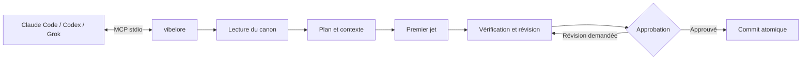
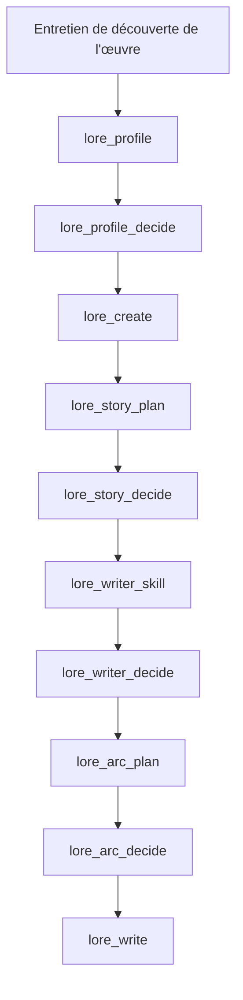
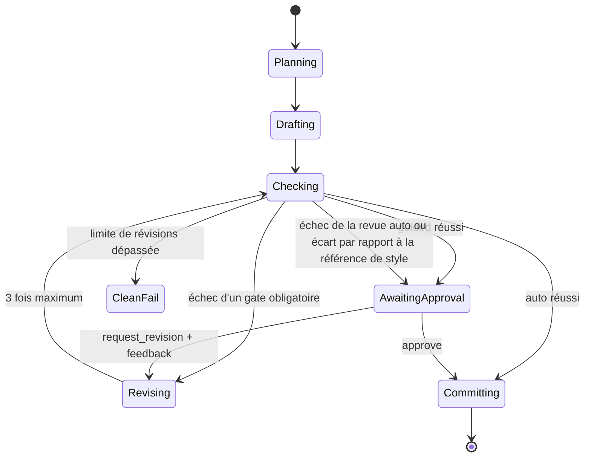
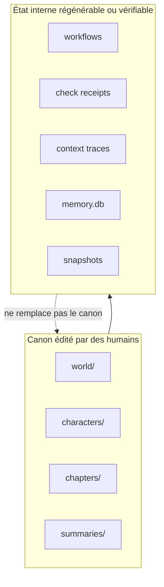

# vibelore

[한국어](README.md) | [English](README.en.md) | [日本語](README.ja.md) | [Español](README.es.md) | Français | [繁體中文](README.zh-Hant.md) | [ไทย](README.th.md) | [العربية](README.ar.md)

Un serveur MCP local qui préserve l'univers, l'état des personnages, les arcs et l'ordre des vérifications d'un roman long.

- Le texte est écrit par l'hôte IA connecté.
- `world/`, `characters/` et `chapters/` constituent le canon, modifié par des humains.
- Aucune clé API ni aucune étape de build supplémentaire n'est nécessaire.
- L'écriture de base commence avec un seul outil : `lore_write`.
- La langue de l'œuvre se définit avec le seul argument `language`, et le même flux fonctionne dans d'autres langues que le coréen.



## Installation

Prérequis : Node.js 22.13 ou supérieur (22.x) ou 24.x. Aucune compilation ni installation de dépendances.

Le plus simple est de donner l'adresse du dépôt à votre outil de programmation IA (Claude Code, Codex,
Grok CLI) et de le lui demander.

> Récupère https://github.com/fbwndrud/vibelore et enregistre-le comme serveur MCP.

Une fois l'enregistrement terminé, redémarrez l'outil IA.

Pour lancer le serveur MCP depuis le paquet npm [`vibelore`](https://www.npmjs.com/package/vibelore) sans récupérer le dépôt :

```bash
claude mcp add-json vibelore '{"command":"npx","args":["-y","vibelore"]}' --scope project
```

Pour Codex, utilisez `command = "npx"` et `args = ["-y", "vibelore"]` ; pour Grok CLI, `grok mcp add vibelore -- npx -y vibelore`.
Pour figer une version, écrivez `vibelore@0.4.0`. La voie npm n'enregistre que le serveur MCP : installez les
skills d'entretien avec la méthode du dépôt ci-dessous ou comme plugin Codex.

Pour récupérer le dépôt et l'enregistrer directement :

```bash
git clone https://github.com/fbwndrud/vibelore.git
claude mcp add-json vibelore '{"command":"node","args":["/absolute/path/to/vibelore/src/server.js"]}' --scope project
```

Le dépôt est aussi un plugin Codex (`.codex-plugin/plugin.json`). Installé comme plugin, il charge à la fois le
skill d'entretien de découverte de l'œuvre et le serveur MCP. Les skills pour Claude Code se trouvent dans `hosts/claude/skills/`.

Le serveur utilise stdio. Ce n'est pas un programme à lancer directement depuis le terminal.
Enregistrez-le d'abord comme serveur MCP dans Claude Code, Codex ou Grok, puis demandez à cet
hôte, en langage naturel, d'écrire. Pour l'enregistrement et le premier appel, suivez le
[Guide de démarrage](docs/GETTING_STARTED.md).

## Environnements et fournisseurs pris en charge

Dans le chemin par défaut, vibelore n'appelle pas directement les API des fournisseurs de modèles.
C'est le modèle courant de l'hôte qui exécute le MCP qui répond aux demandes de premier jet, de
plan et de critique. Aucune clé API supplémentaire n'est donc nécessaire, et le modèle ainsi que
le niveau de réflexion se choisissent dans la session de l'hôte, pas dans vibelore.

| Chemin d'exécution | Chemin de réponse du modèle | Statut |
|---|---|---|
| App et CLI Codex | Modèle de la session Codex | Aller-retour d'écriture complet vérifié |
| Claude Code | Modèle de la session Claude Code | Aller-retour d'écriture complet vérifié |
| Grok CLI | Modèle de la session Grok | Aller-retour d'écriture complet vérifié |
| Ollama, LM Studio, llama.cpp | `/chat/completions` compatible OpenAI | Fonction optionnelle, chemin de compatibilité |

L'appel direct avec des clés API OpenAI, Anthropic, Google ou xAI placées dans vibelore n'est pas
pris en charge actuellement. Un modèle local n'est utilisé à la place du modèle de l'hôte que si
`VIBELORE_LOCAL_BASE_URL` et `VIBELORE_LOCAL_MODEL` sont tous deux définis. Cet adaptateur ne
prend en charge ni l'authentification ni la transmission du niveau de réflexion ; ne l'utilisez
qu'avec un point de terminaison local de confiance.

```bash
VIBELORE_LOCAL_BASE_URL=http://127.0.0.1:11434/v1 \
VIBELORE_LOCAL_MODEL=qwen3:14b \
node /absolute/path/to/vibelore/src/server.js
```

Les procédures d'enregistrement par hôte et les versions réellement vérifiées sont consignées dans [HOSTS.md](HOSTS.md).

## Modèles recommandés et niveau de réflexion

Voici les valeurs recommandées pour exploiter vibelore au 2026-09-05. Il ne s'agit pas d'un
classement garantissant la qualité littéraire, mais d'un point de départ pour enchaîner plan,
premier jet et vérification dans une même session tout en conservant de longues instructions.
Seuls les modèles affichés dans votre compte et votre hôte sont utilisables.

| Hôte | Priorité à la qualité | Équilibré | Niveau de réflexion par défaut |
|---|---|---|---|
| Codex | `gpt-6-astra` | `gpt-5.6-sol` | `high` |
| Claude Code | `opus` (`Claude Opus 5`) | `sonnet` (`Claude Sonnet 5`) | `high` |
| Grok CLI | `grok-4.6` | `grok-4.6` | `high` |
| Compatible OpenAI local | Un modèle validé pour les textes longs en coréen et les réponses JSON | Sans objet | Non réglable depuis le serveur |

- Entretien de découverte de l'œuvre, histoire complète, conception du premier arc : `high`.
  N'envisagez `xhigh` que lorsque l'univers et la causalité sont particulièrement complexes.
- Planification, écriture et vérification d'un épisode avec `lore_write` : `high` est recommandé par défaut.
- Consultation d'état, approbation, retouches simples : `medium` ou `low` suffisent.
- `max` n'est pas recommandé comme valeur par défaut pour l'écriture courante. Il augmente le coût et
  le temps d'attente et peut compliquer inutilement l'œuvre ; ne l'utilisez que lorsqu'un manque de
  réflexion a été identifié comme cause d'échec.

Pour l'instant, vibelore ne change ni de modèle ni de niveau de réflexion selon l'étape. Pour la
cohérence, il vaut mieux terminer le profil, l'arc et le texte commencés dans une même tâche avec
le même modèle puissant au niveau `high`.
Vérifiez les noms actuels et la couverture des fournisseurs dans le [guide des modèles OpenAI](https://developers.openai.com/api/docs/guides/latest-model),
l'[état des modèles Claude](https://docs.anthropic.com/en/docs/about-claude/model-deprecations)
et le [guide du raisonnement Grok](https://docs.x.ai/developers/model-capabilities/text/reasoning).

## Prise en main en 1 minute

### Nouvelle œuvre



Il suffit de demander à l'hôte quelque chose comme ceci.

> Je veux créer une œuvre nommée `night_bus` dans `/absolute/path/to/my-novel`. C'est l'histoire d'un chauffeur de bus de nuit qui écoute les regrets des inconnus. Commence par l'entretien de découverte de l'œuvre.

Le skill `story-discovery-interview` pose 4 à 5 questions par tour sur les préférences qui changent
le résultat et accumule les réponses dans `lore_profile`. Pour sauter la revue, précisez
« automatiquement » ou « sans me demander ». Sinon, le profil, l'histoire complète, le skill
d'auteur et l'arc ne sont activés qu'après approbation.
La profondeur du thème et la difficulté de lecture sont deux axes distincts. La difficulté des
phrases en surface, le rythme d'introduction des nouveaux concepts, la charge d'inférence et la
façon dont la complexité monte au début sont vérifiés séparément lors de l'entretien de découverte.

### Épisode suivant

> Écris l'épisode suivant de `night_bus` en mode guided.

`lore_write` exécute le plan, le premier jet, les vérifications déterministes, l'ensemble des revues du critic et la délivrance du reçu de vérification. `guided` affiche les advisories et le manuscrit final, puis attend l'approbation via `lore_decide`. `auto` ne committe automatiquement que si les invariants sont respectés et que le critic s'est terminé normalement. Si la revue échoue ou que la réponse est incomplète, le manuscrit est conservé et le flux passe en attente d'approbation avec `CRITIC_INCOMPLETE`. Un manuscrit n'est jamais réécrit automatiquement sur la seule base d'advisories de style, de variation ou de densité.

Si vous désignez 1 à 3 épisodes canoniques qui vous plaisent avec `lore_style_anchor(action="approve")`,
les premiers jets et révisions suivants utiliseront la même référence de style pour l'œuvre. Un
nouveau premier jet qui s'écarte fortement de la référence n'est pas réécrit automatiquement mais
renvoyé en revue, et les révisions s'appliquent sous forme de patchs limités qui préservent les
paragraphes d'origine. Si vous indiquez dans `reason` pourquoi la référence vous plaît lors de
l'approbation, cette raison sera transmise à l'écriture ultérieure avec les exemples canoniques.



### Prise en compte des préférences et journal des revues

Les promesses aux lecteurs, le ton, la manière de narrer les personnages et l'orientation d'écriture
approuvés sont transmis à la demande réelle de premier jet. Au plus deux exemples de style sont
sélectionnés comme référence pour l'épisode, et les raisons de sélection ou d'exclusion sont consignées.
Si une entrée essentielle dépasse le budget, elle n'est pas supprimée en silence : une erreur est signalée.

Même lorsque le score global de la revue est élevé, les remarques concrètes et leurs justifications
sont conservées. Une revue terminée ne garantit pas que le texte est captivant, et un résultat écrit
et revu par le même hôte est une auto-revue. Si l'indépendance du contexte ne peut pas être confirmée,
cet état est également consigné.

Vous pouvez demander à l'hôte : « Montre-moi les justifications de la revue et la demande d'écriture réelle de cet épisode. »
Consultez l'historique avec `lore_workflow_history` ; en indiquant `includeModelExchanges=true`,
vous voyez aussi les demandes réelles de premier jet et de revue, ainsi que leurs réponses, liées
aux événements consultés. Les hachages du manuscrit et du contrat de l'œuvre, l'identifiant de la
source d'exécution, l'origine de la revue et son statut de réussite ou d'échec peuvent être suivis ensemble.
Le journal est stocké localement et n'est jamais publié automatiquement vers l'extérieur.

Pour la marche à suivre détaillée, consultez [Réponses de revue et audit](docs/OPERATIONS.md#검토-응답과-감사).

### Adaptation en webtoon

> Adapte le chapitre 1 de `night_bus` en webtoon. Demande-moi d'abord la direction.

Un chapitre déjà écrit est adapté en reprenant de l'original les personnages, le monde et l'état jusqu'à ce
chapitre : rien n'est à réexpliquer. `lore_webtoon_scene` demande d'abord le style graphique, le lettrage, le
défilement vertical et le nombre de cases, puis fait valider les images de référence des personnages et des
lieux. Chaque scène entière est ensuite dessinée, dialogues compris, en une seule image verticale, et l'image
réelle est relue. Le lettrage suit la langue de l'œuvre. L'ancien flux d'approbation d'un crayonné par case
est obsolète et ne sert qu'à poursuivre les travaux déjà en cours. Les images viennent de l'outil d'image de
l'hôte ou d'une API d'images ; une API payante n'est utilisée qu'après confirmation, et l'approbation du webtoon
est distincte de celle du roman. Voir le [guide webtoon](docs/WEBTOON.md).

## Langue de l'œuvre

La langue d'écriture de l'œuvre se définit via l'argument optionnel `language` accepté par
`lore_profile`, `lore_init`, `lore_create` et `lore_write`. Lorsque l'utilisateur indique la langue
d'écriture en langage naturel, l'hôte la normalise en tag BCP 47 (`ja`, `pt-BR`, `zh-Hant`, etc.) et
la transmet ; si aucune langue n'est choisie, l'argument est omis. Les œuvres existantes sans clé de
langue sont implicitement en `ko`. La langue de conversation et la langue de l'œuvre sont
indépendantes : vous pouvez converser en coréen tout en écrivant une œuvre en japonais.

> Je veux créer une œuvre nommée `harbor_summer` dans `/absolute/path/to/my-novel`. Écris le texte en espagnol.

- Les prompts se répartissent en deux familles. `ko` utilise des instructions spécialisées pour le
  coréen ; les autres langues (anglais compris) utilisent la famille d'instructions communes en anglais
  combinées à la langue cible. Le texte, les titres, les résumés, les descriptions d'univers et de
  personnages, ainsi que les valeurs descriptives des plans et des revues suivent la langue cible,
  tandis que les valeurs lues par la machine, comme les clés JSON, les enums et les ID, ne sont pas traduites.
- La longueur se mesure dans l'unité adaptée à la langue. Le coréen conserve le comptage de caractères
  existant ; les autres langues utilisent le nombre de graphèmes ou de mots, et les systèmes d'écriture
  riches en caractères combinants comme l'arabe ou l'hébreu, ainsi que le thaï sans espaces entre les
  mots, sont traités dans le même contrat.
- La langue ne peut plus être changée une fois la foundation créée. Si vous transmettez une valeur
  différente de la langue enregistrée, elle n'est pas écrasée en silence : la demande est rejetée avec
  `LANGUAGE_CONTRACT_CONFLICT`.
- À chaque épisode, on vérifie que le texte, le résumé et le plan sont écrits dans la langue de l'œuvre,
  et les invariants sémantiques comme le point de vue, l'enregistrement des personnages et l'univers
  sont examinés par le même vérificateur, indépendamment de la langue.

Les langues pour lesquelles le flux complet, du profil à l'approbation de l'épisode 2 et à l'audit
linguistique final, a été vérifié avec Claude Sonnet 5 sont l'anglais, l'espagnol, le japonais, le
français, le coréen, l'arabe, le chinois traditionnel et le thaï. Pour le détail du contrat des
arguments, consultez [Langue de l'œuvre et unités de longueur](docs/TOOLS.md#작품-언어와-분량-단위).

## Canon et état machine

```text
my-novel/
├── world/                 canon de l'univers
├── characters/            canon des personnages
├── chapters/              canon du texte
├── summaries/             résumés par épisode
└── .vibelore/             données de flux, de contrôle, de projection de recherche et de récupération
```

Vous pouvez modifier directement `world/`, `characters/` et `chapters/`. Ne modifiez pas `.vibelore/` à la main.



## Garde-fous

- Aucun texte n'est écrit sans arc actif.
- Si le hash du texte vérifié diffère de celui du texte à committer, le commit est refusé.
- Si un épisode précédent est réécrit, `lore_refold` recalcule l'état qui suit.
- Un snapshot est créé à chaque commit et peut être restauré avec `lore_rollback`.
- Sans clé API distante, c'est l'IA de l'hôte qui est utilisée.
- La mémoire de recherche et l'état machine ne font qu'assister le canon ; ils ne l'écrasent jamais.

## Documentation

- [Carte de la documentation](docs/README.md) : trouver le document adapté à chaque situation
- [Orientation et philosophie](docs/PHILOSOPHY.md) : ce dont vibelore est responsable et ce qui est confié au modèle et à l'auteur
- [Guide de démarrage](docs/GETTING_STARTED.md) : installation, enregistrement, première œuvre, épisode suivant
- [Contrat MCP](docs/MCP.md) : protocole, réponses, reprise du modèle, workflows
- [Référence des outils](docs/TOOLS.md) : le contrat réel des 26 outils de base et des outils de maintenance avancés
- [Architecture](docs/ARCHITECTURE.md) : canon, machine à états, compiler d'entrées, commit
- [Exploitation et récupération](docs/OPERATIONS.md) : vérification d'état, gestion des échecs, rewrite/refold/rollback
- [Installation par hôte](HOSTS.md) : journal de vérification pour Claude Code, Codex CLI et Grok CLI

## Tests

```bash
npm test
npm run test:engine
npm run test:all
```

Aucune installation de dépendances ni aucun build n'est nécessaire.
