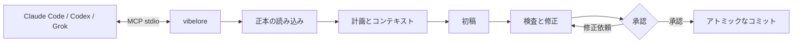
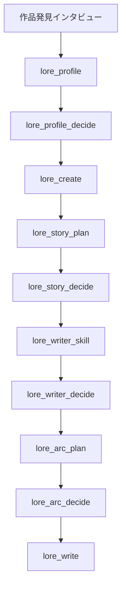
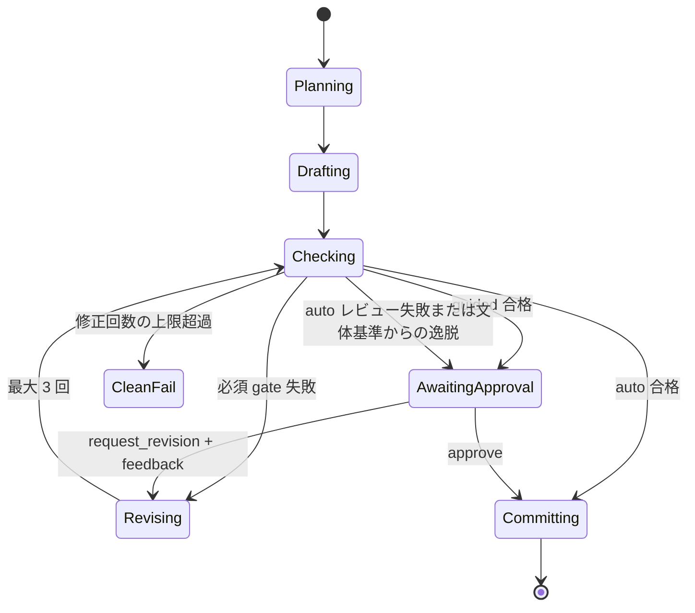
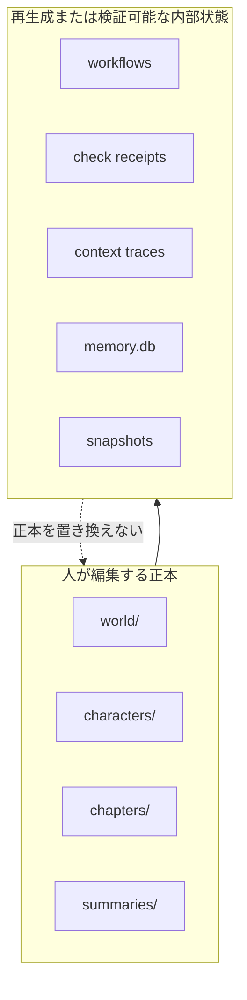

# vibelore

[한국어](README.md) | [English](README.en.md) | 日本語 | [Español](README.es.md) | [Français](README.fr.md) | [繁體中文](README.zh-Hant.md) | [ไทย](README.th.md) | [العربية](README.ar.md)

長編小説の設定、人物の状態、アーク、検査の順序を守るローカル MCP サーバーです。

- 本文は接続された AI ホストが書きます。
- `world/`、`characters/`、`chapters/` が人が編集する正本です。
- 別途 API キーやビルドは必要ありません。
- 基本の執筆は `lore_write` ひとつから始めます。
- 作品の言語は `language` 引数ひとつで決め、韓国語以外の言語でも同じ流れを使います。



## インストール

要件: Node.js 22.13 以上（22.x）または 24.x。ビルドも依存関係のインストールも不要です。

いちばん簡単なのは、使っている AI コーディングツール（Claude Code、Codex、Grok CLI）にリポジトリの
アドレスを渡して頼むことです。

> https://github.com/fbwndrud/vibelore を取得して MCP サーバーとして登録して。

登録が終わったら AI ツールを一度再起動してください。

リポジトリを取得せずに npm パッケージ [`vibelore`](https://www.npmjs.com/package/vibelore) で MCP サーバーを実行する場合:

```bash
claude mcp add-json vibelore '{"command":"npx","args":["-y","vibelore"]}' --scope project
```

Codex は `command = "npx"`、`args = ["-y", "vibelore"]`、Grok CLI は `grok mcp add vibelore -- npx -y vibelore` です。
バージョンを固定するには `vibelore@0.4.0` のように書きます。npm 経路は MCP サーバーだけを登録するため、
インタビュースキルは下のリポジトリ方式か Codex プラグインでインストールします。

リポジトリを取得して直接登録する場合:

```bash
git clone https://github.com/fbwndrud/vibelore.git
claude mcp add-json vibelore '{"command":"node","args":["/absolute/path/to/vibelore/src/server.js"]}' --scope project
```

このリポジトリは Codex プラグイン（`.codex-plugin/plugin.json`）でもあります。プラグインとしてインストールすると、
作品発見インタビューのスキルと MCP サーバーが一緒に読み込まれます。Claude Code 用スキルは `hosts/claude/skills/` にあります。

サーバーは stdio を使用します。ターミナルから直接実行するプログラムではありません。まず Claude
Code、Codex、または Grok に MCP サーバーとして登録してから、そのホストに自然言語で執筆を依頼します。
登録と最初の呼び出しは[はじめに](docs/GETTING_STARTED.md)に従ってください。

## 対応環境とプロバイダー

デフォルトの経路では、vibelore がモデル提供各社の API を直接呼び出すことはありません。MCP を実行する
ホストの現在のモデルが初稿、計画、批評の要求に応答します。そのため別途 API キーは不要で、
モデルと思考レベルも vibelore ではなくホストのセッションで選択します。

| 実行経路 | モデル応答経路 | 状態 |
|---|---|---|
| Codex アプリ・CLI | Codex セッションのモデル | 執筆の往復全体を確認済み |
| Claude Code | Claude Code セッションのモデル | 執筆の往復全体を確認済み |
| Grok CLI | Grok セッションのモデル | 執筆の往復全体を確認済み |
| Ollama・LM Studio・llama.cpp | OpenAI 互換 `/chat/completions` | オプション機能、互換性経路 |

OpenAI、Anthropic、Google、xAI の API キーを vibelore に渡して直接呼び出す方式は現在
サポートしていません。ローカルモデルは `VIBELORE_LOCAL_BASE_URL` と `VIBELORE_LOCAL_MODEL` を
両方指定した場合にのみ、ホストのモデルの代わりに使用します。このアダプターは認証と思考レベルの受け渡しを
サポートしていないため、信頼できるローカルエンドポイントでのみ使用してください。

```bash
VIBELORE_LOCAL_BASE_URL=http://127.0.0.1:11434/v1 \
VIBELORE_LOCAL_MODEL=qwen3:14b \
node /absolute/path/to/vibelore/src/server.js
```

ホストごとの登録方法と実際に確認したバージョンは [HOSTS.md](HOSTS.md) に記録しています。

## 推奨モデルと思考レベル

以下は 2026-09-05 時点の vibelore 運用推奨値です。文学的な品質を保証する順位では
なく、長い指示を維持しながら計画・初稿・検査を一つのセッションで実行するための出発点です。
アカウントとホストに表示されるモデルのみ使用できます。

| ホスト | 品質優先 | バランス型 | 既定の思考レベル |
|---|---|---|---|
| Codex | `gpt-6-astra` | `gpt-5.6-sol` | `high` |
| Claude Code | `opus` (`Claude Opus 5`) | `sonnet` (`Claude Sonnet 5`) | `high` |
| Grok CLI | `grok-4.6` | `grok-4.6` | `high` |
| ローカル OpenAI 互換 | 韓国語の長文・JSON 応答を検証済みのモデル | 該当なし | サーバー側で調整不可 |

- 作品発見インタビュー、全体ストーリー、最初のアーク設計: `high`。設定と因果が特に複雑な場合にのみ
  `xhigh` を検討します。
- `lore_write` で話を計画・執筆・検査する場合: `high` を既定値として推奨します。
- 状態の照会、承認、簡単な手直し: `medium` または `low` でも十分です。
- `max` は通常の執筆の既定値としては推奨しません。コストと待ち時間が増え、作品を
  不必要に複雑にする可能性があるため、失敗の原因が思考量の不足だと確認された場合にのみ使います。

vibelore は現在、段階ごとにモデルや思考レベルを切り替えません。一つの作業で始めた
プロフィール・アーク・本文は、同じ強力なモデルと `high` レベルで仕上げるほうが一貫性の面で有利です。
モデル提供各社の現在の名称とサポート範囲は [OpenAI モデル案内](https://developers.openai.com/api/docs/guides/latest-model)、
[Claude モデルの状態](https://docs.anthropic.com/en/docs/about-claude/model-deprecations)、
[Grok reasoning 案内](https://docs.x.ai/developers/model-capabilities/text/reasoning)で確認してください。

## 1分で分かる使い方

### 新しい作品



ホストに次のように依頼します。

> `/absolute/path/to/my-novel` に `night_bus` という作品を作りたいです。深夜バスで他人の後悔を聞く運転手の物語です。作品発見インタビューから進めてください。

`story-discovery-interview` スキルは、結果を左右する好みを 1 ラウンドに 4〜5 個ずつ尋ね、回答を
`lore_profile` に蓄積します。確認を省略したい場合は「自動で」または「聞かずに」と明示します。
そうでなければ、プロフィール、全体ストーリー、作家スキル、アークは承認後に有効化されます。
テーマの深さと読みにくさは別の軸です。表面的な文の難度、新しい概念の導入速度、推論の負担、
序盤の複雑さの上げ方は、作品発見インタビューで個別に確認します。

### 次の話

> `night_bus` の次の話を guided モードで書いてください。

`lore_write` が計画、初稿、決定論的検査、critic レビュー一式、検査レシートの発行まで実行します。`guided` は advisory と最終原稿を提示したうえで `lore_decide` の承認を待ちます。`auto` は不変条件の検査に合格し、critic が正常に完了した場合にのみ自動コミットします。レビューが失敗したり応答が不完全な場合は原稿を保存し、`CRITIC_INCOMPLETE` とともに承認待ちに切り替えます。文体・変化・密度のような advisory だけで原稿を自動的に書き直すことはありません。

気に入った正本の 1〜3 話を `lore_style_anchor(action="approve")` で指定すると、以降の初稿と修正が
同じ作品文体の基準を使用します。基準から大きく外れた新しい初稿は自動的に書き直さず
レビュー対象に回し、修正は元の段落を保持する限定的なパッチとして適用されます。
基準を承認する際に `reason` に気に入った理由を書いておくと、正本の例とともに以降の執筆に伝えられます。



### 好みの反映とレビュー記録

承認した読者との約束、トーン、人物の描写方法、執筆方針を実際の初稿要求に伝えます。
その話で参照する文体の例は最大 2 つを選択し、選択・除外の理由を記録します。
重要な入力が予算を超えた場合、黙って削除せずエラーとして知らせます。

レビューの総合点が高くても、具体的な指摘と根拠は保持します。レビュー完了は面白さを保証するものではなく、
同じホストが書いてレビューした結果は自己レビューです。文脈の独立性が確認できない場合は、その状態も記録します。

ホストに「今回の話のレビュー根拠と実際の執筆要求を見せてください」と依頼できます。
`lore_workflow_history` で履歴を照会し、`includeModelExchanges=true` を指定すると、
照会したイベントに紐づく実際の初稿・レビュー要求と応答も確認できます。原稿と作品契約のハッシュ、
実行ソースの識別値、レビューの出所、完了・失敗の状態を併せて追跡できます。
記録はローカルに保存され、自動的に外部へ公開されることはありません。

詳しい方法は[レビュー応答と監査](docs/OPERATIONS.md#검토-응답과-감사)を参照してください。

### ウェブトゥーン化

> `night_bus` の1話をウェブトゥーンにして。制作の方向から聞いて。

書き上げた話を、人物・世界観・その話までの状況を原作から引き継いで脚色するので、改めて説明する必要は
ありません。`lore_webtoon_scene` はまず画風、文字表現、縦スクロール、コマ数を尋ね、人物と場所の基準画を
確認します。その後、場面全体を台詞まで含めて1枚の縦長画像として描き、実際の画像を検討します。文字は作品の
言語に従います。コマごとにラフを承認する以前の方式は deprecated で、進行中の作業だけを続けます。画像は
ホストの画像ツールまたは画像 API で描きます。有料 API は確認後にだけ使い、小説の承認とウェブトゥーンの承認は
別々に行います。詳しくは[ウェブトゥーン制作ガイド](docs/WEBTOON.md)を参照してください。

## 作品の言語

作品をどの言語で書くかは、`lore_profile`、`lore_init`、`lore_create`、`lore_write` が受け取る
`language` オプション引数で決めます。ユーザーが執筆言語を自然言語で伝えると、ホストが BCP 47
タグ(`ja`、`pt-BR`、`zh-Hant` など)に正規化して渡し、言語を選ばない場合は引数を省略します。
言語キーのない既存の作品は暗黙的に `ko` です。会話の言語と作品の言語は別なので、韓国語で
会話しながら日本語の作品を書くことができます。

> `/absolute/path/to/my-novel` に `harbor_summer` という作品を作りたいです。本文はスペイン語で書いてください。

- プロンプトは 2 系統です。`ko` は韓国語特化の指示文を、それ以外の言語(英語を含む)は英語の共通
  指示文に目標言語を組み合わせた系統を使います。本文、タイトル、要約、世界・人物の説明、計画とレビューの
  説明値は目標言語に従い、JSON キー・enum・ID のような機械が読む値は翻訳しません。
- 分量は言語に合った単位で測ります。韓国語は従来の文字数、それ以外の言語は書記素(grapheme)
  または単語数で、アラビア語・ヘブライ語のように結合文字の多い文字体系や、分かち書きのないタイ語も
  同じ契約の中で扱います。
- 言語は foundation を作成した後に変更できません。保存された言語と異なる値を渡すと、黙って
  上書きせず `LANGUAGE_CONTRACT_CONFLICT` で拒否します。
- 話ごとに本文・要約・計画が作品の言語で書かれているかを検査し、視点・人物登録・世界設定のような
  意味の不変条件は言語に関係なく同じ検査者が確認します。

実際に Claude Sonnet 5 でプロフィールから 2 話の承認と最終的な言語監査までの全体の流れを確認した言語は、
英語、スペイン語、日本語、フランス語、韓国語、アラビア語、繁体字中国語、タイ語です。引数契約の
詳細は[作品の言語と分量の単位](docs/TOOLS.md#작품-언어와-분량-단위)を参照してください。

## 正本と機械状態

```text
my-novel/
├── world/                 世界設定の正本
├── characters/            人物の正本
├── chapters/              本文の正本
├── summaries/             話ごとの要約
└── .vibelore/             ワークフロー・検査・検索投影・復旧データ
```

`world/`、`characters/`、`chapters/` は直接編集しても構いません。`.vibelore/` は直接編集しないでください。



## 安全装置

- アクティブなアークなしに本文から書き始めることはありません。
- 検査した本文の hash とコミットする本文の hash が異なる場合は拒否します。
- 前の話を書き直した場合は `lore_refold` で以降の状態を再計算します。
- コミットごとに snapshot を作成し、`lore_rollback` で復元できます。
- リモート API キーがない場合はホストの AI を使用します。
- 検索メモリと機械状態は正本を補助するだけで、正本を上書きしません。

## ドキュメント

- [ドキュメント地図](docs/README.md): 必要なドキュメントを状況別に探す
- [方向性と哲学](docs/PHILOSOPHY.md): 何を担い、何をモデルと作家に委ねるか
- [はじめに](docs/GETTING_STARTED.md): インストール、登録、最初の作品、次の話
- [MCP 契約](docs/MCP.md): プロトコル、応答、モデルの再開、ワークフロー
- [ツールリファレンス](docs/TOOLS.md): 基本 26 個のツールと高度なメンテナンスツールの実際の契約
- [アーキテクチャ](docs/ARCHITECTURE.md): 正本、状態機械、入力 compiler、コミット
- [運用と復旧](docs/OPERATIONS.md): 状態確認、失敗時の対応、rewrite/refold/rollback
- [ホスト別インストール](HOSTS.md): Claude Code、Codex CLI、Grok CLI の検証記録

## テスト

```bash
npm test
npm run test:engine
npm run test:all
```

依存関係のインストールやビルドは必要ありません。
