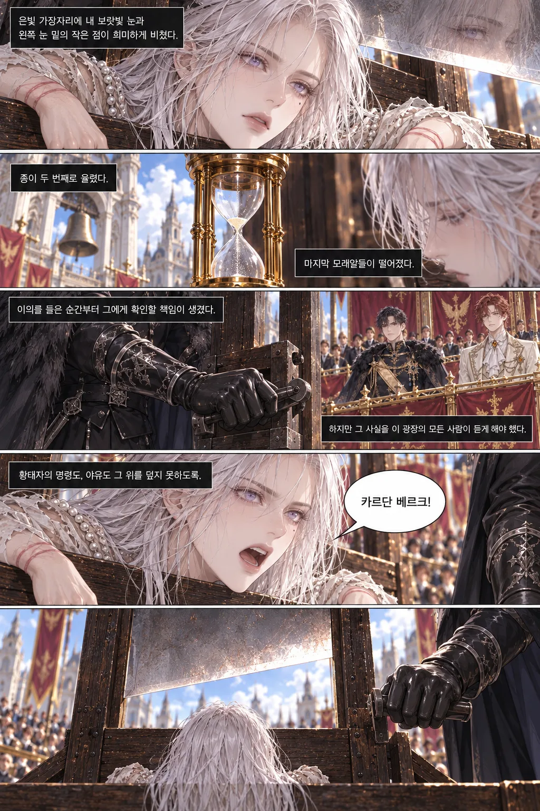
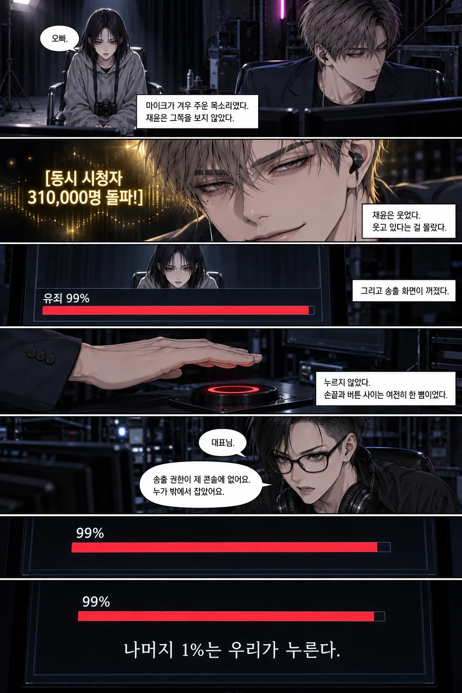
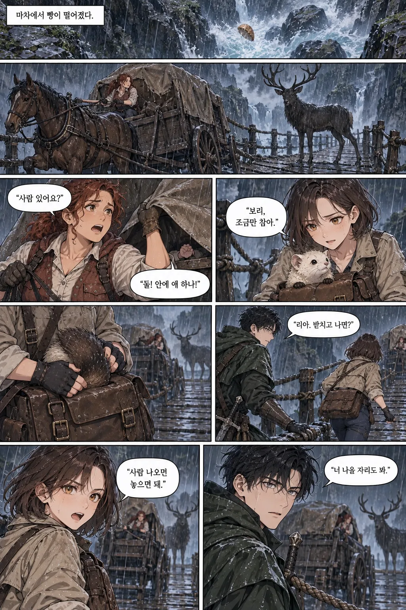
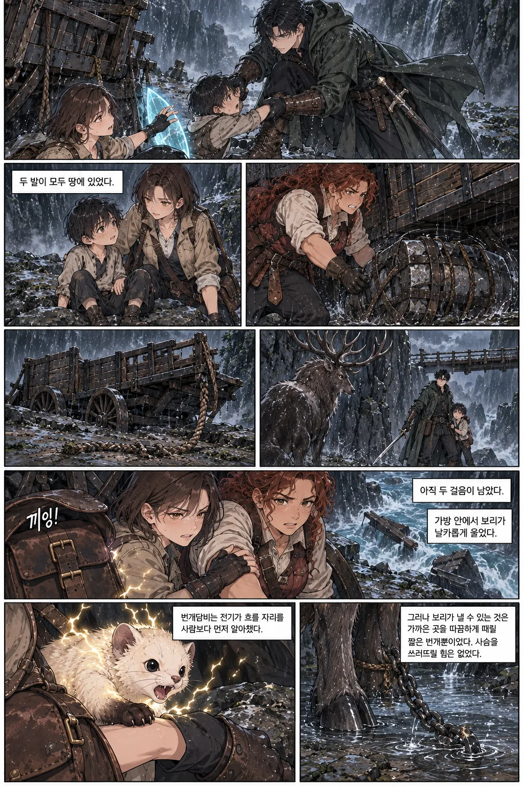
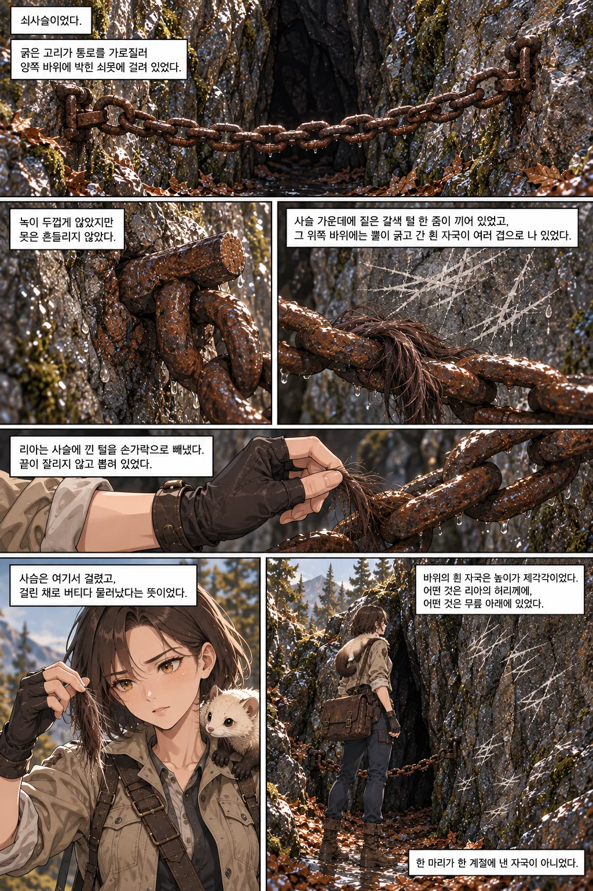

# vibelore

**AI로 웹소설을 쓰고, 그 소설을 웹툰으로 만드는 로컬 도구. 수백 화가 지나도 설정은 무너지지 않게.**

*Write serial fiction with your AI coding agent, keep the lore consistent for hundreds of chapters, then adapt it into a vertical webtoon. Local, Markdown, no extra API keys for writing.*

[](docs/GETTING_STARTED.md)
[](LICENSE)
[](HOSTS.md)
[](https://fbwndrud.github.io/vibelore/showcase/)

Claude Code, Codex, Grok CLI 같은 AI 코딩 도구에 MCP 서버로 붙여서 씁니다. 본문과 그림은 그 AI가 만들고,
vibelore는 세계관·인물·복선·시간선을 기억하고, 매 화 검사하고, 승인 전에는 아무것도 확정하지 않습니다.

<table>
<tr>
<td align="center"><a href="https://fbwndrud.github.io/vibelore/showcase/executionprincess/"></a><br><sub>『처형 1분 전의 황녀』 · 로판 회귀 복수극</sub></td>
<td align="center"><a href="https://fbwndrud.github.io/vibelore/showcase/verdict-live/"></a><br><sub>『판결 LIVE』 · 사이버렉카 스릴러</sub></td>
<td align="center"><a href="https://fbwndrud.github.io/vibelore/showcase/thundertrail/"></a><br><sub>『길 위의 번개』 · 판타지 로드 액션</sub></td>
</tr>
</table>

모두 vibelore로 쓴 소설을 웹툰으로 옮긴 실제 결과입니다. 작품마다 다른 AI가 만들었습니다.

- **[처형 1분 전의 황녀](https://fbwndrud.github.io/vibelore/showcase/executionprincess/)**: 설계부터 소설, 웹툰 각색까지 GPT-6 Sol이 맡았습니다.
- **[판결 LIVE](https://fbwndrud.github.io/vibelore/showcase/verdict-live/)**: 소설과 웹툰 각색은 Claude Opus 5.5가, 그림은 Codex가 맡았습니다.
- **[길 위의 번개](https://fbwndrud.github.io/vibelore/showcase/thundertrail/)**: Codex·Claude·Grok이 같은 소설을 각각 각색했습니다. [모델 비교](https://fbwndrud.github.io/vibelore/showcase/thundertrail/compare.html)도 있습니다.

잘된 장면만 고르지 않았습니다. 검토에서 떨어진 장면, 프롬프트, 비용까지 [작품 목록](https://fbwndrud.github.io/vibelore/showcase/)에서 그대로 볼 수 있습니다.

---

## AI에게 장편을 그냥 맡기면

**❌ vibelore 없이**

- 10화쯤부터 호칭이 바뀌고, 죽은 인물이 다시 말하고, 능력 규칙이 슬쩍 달라집니다.
- 3화에 심은 복선을 AI도 나도 잊습니다.
- 세션이 끊기면 "지금까지 줄거리"를 다시 붙여 넣는 데서 시작합니다.
- 웹툰으로 옮기려면 컷 구성·캐릭터 외형·대사 배치를 매번 처음부터 설명합니다.

**✅ vibelore와 함께**

- 세계·인물·본문은 Markdown 정본으로 남고, 매 화 초고를 그 정본과 대조해 **hard 위반은 고치고 soft 위반은 물어봅니다.**
- 작품 전체 → 아크 → 화 순서로 계획하고, 승인한 것만 다음 화의 제약이 됩니다.
- 끊긴 작업은 같은 자리에서 재개되고, 검사를 통과한 원고만 커밋되며, 화 단위로 되돌릴 수 있습니다.
- 원작의 인물·상태를 그대로 가져와 각색하고, 러프 승인 뒤에만 본 작화로 넘어가는 웹툰 제작 흐름이 따라옵니다.

## 30초 데모

호스트 채팅창에 이렇게 말하면 됩니다.

> 다음 화를 써 줘. 쓰고 나면 보여 주고, 내가 승인하면 확정해.

```text
작품 인터뷰 ─▶ 아크 계획 ─▶ 화 계획 ─▶ 초고 ─▶ 설정·시간선 검사 ─▶ 검토 ─▶ 승인 ─▶ 커밋
   (1회)       (승인)      (자동)             hard 위반은 수정     advisory    사용자     Markdown
```

원고와 검토 근거가 오면 "승인" 또는 "이 부분 고쳐서 다시"라고 답합니다. `auto` 모드는 검사와
검토를 통과하면 자동으로 커밋합니다. 웹툰도 한 문장이면 됩니다.

> 1화를 웹툰으로 만들어 줘. 제작 방향부터 물어봐 줘.

```text
각색 대본 ─▶ 기준 이미지 ─▶ 구도 러프 ─▶ 작화 ─▶ 대사·효과음 조판 ─▶ 세로형 SVG/HTML
  (승인)       (승인)        (승인)     호스트가 생성     별도 레이어         완성본
```

## 설치

쓰고 있는 AI 코딩 도구(Claude Code, Codex, Grok CLI)에게 저장소 주소를 주고 부탁하면 됩니다.

> https://github.com/fbwndrud/vibelore 를 받아서 MCP 서버로 등록해 줘.

필요한 것은 Node.js 22.13 이상(22.x), 24.x 또는 26.x뿐입니다. 빌드도 의존성 설치도 없습니다.
등록이 끝나면 AI 도구를 한 번 다시 시작하세요.

<details>
<summary>npm으로 등록하려면</summary>

저장소를 받지 않고 npm 패키지 [`vibelore`](https://www.npmjs.com/package/vibelore)로 MCP 서버를 실행합니다.

```bash
claude mcp add-json vibelore '{"command":"npx","args":["-y","vibelore"]}' --scope project
```

Codex는 `command = "npx"`, `args = ["-y", "vibelore"]`, Grok CLI는 `grok mcp add vibelore -- npx -y vibelore`입니다.
Windows에서는 `npx` 앞에 `cmd /c`를 붙입니다(`"command":"cmd","args":["/c","npx","-y","vibelore"]`).
특정 버전에 고정하려면 `vibelore@<버전>`처럼 적습니다. npm 경로는 MCP 서버만 등록하므로 인터뷰 스킬은
아래 저장소 방식이나 Codex 플러그인으로 설치합니다.
</details>

<details>
<summary>저장소를 받아 직접 등록하려면</summary>

```bash
git clone https://github.com/fbwndrud/vibelore.git
```

Claude Code:

```bash
claude mcp add-json vibelore '{"command":"node","args":["/absolute/path/to/vibelore/src/server.js"]}' --scope project
```

Codex(`~/.codex/config.toml`):

```toml
[mcp_servers.vibelore]
command = "node"
args = ["/absolute/path/to/vibelore/src/server.js"]
startup_timeout_sec = 30
tool_timeout_sec = 6000
```

Grok CLI:

```bash
grok mcp add vibelore -- node /absolute/path/to/vibelore/src/server.js
```

Claude Code용 스킬은 `hosts/claude/skills/`에 있고, 이 저장소는 Codex 플러그인(`.codex-plugin/plugin.json`)으로도 설치할 수 있습니다.
</details>

설치했으면 첫 작품을 시작해 봅니다. 쓰고 싶은 이야기를 한두 문장으로 말하면 됩니다.

> 새 소설을 시작하고 싶어. 심야버스에서 승객의 후회를 듣는 기사 이야기야. 작품 인터뷰부터 해 줘.

인터뷰는 결과를 바꾸는 취향만 한 번에 4~5개씩 묻습니다. 건너뛰려면 "묻지 말고 자동으로"라고
하면 됩니다. 막히면 [시작 안내](docs/GETTING_STARTED.md)를 보세요.

## 무엇을 해 주나

- **작품 인터뷰.** 장르명 대신 속도·난도·정서·보상·금기를 물어 독서 계약(StoryProfile)을 만들고, 세계관과 인물을 자동 생성합니다.
- **아크 설계.** 3~20화 단위 약속과 얇은 사건·압력·전환을 먼저 승인받고, 화별 계획은 집필 때 자동으로 채웁니다.
- **매 화 검사와 수정.** 초고를 인물·호칭·시점·시간선·복선과 대조하고, 확정 사실과 충돌하면 최대 3회 자동 수정합니다. 문체·운율 같은 취향 지적은 advisory로만 남깁니다.
- **문체 기준.** 마음에 든 화를 문체 앵커로 지정하면 이후 화가 그 결을 따라갑니다.
- **다시 쓰기와 되돌리기.** 앞 화를 설정은 그대로 두고 다시 쓰거나, 특정 화 시점으로 작품 전체를 롤백합니다.
- **웹툰 각색.** 원작 상태를 가져와 핵심 경험에 필요한 컷만 고르고, 작화 스타일·문자 표현·판면을 확인한 뒤 러프 → 작화 → 조판 → 세로형 SVG/HTML로 완성합니다.

**하지 않는 것.** 웹 GUI(호스트 채팅창이 인터페이스), MCP 서버 자체의 유료 API 호출(이미지 API는
호스트가 실행), 후속 화 자동 재검사(2화를 고치면 3화 재검사는 직접 요청), 문학적 품질 보증,
동시 편집·멀티테넌트, 플랫폼용 PNG/JPEG 자동 분할.

## 자주 하는 일

| 하고 싶은 것 | 호스트에게 이렇게 |
|---|---|
| 1화가 마음에 안 들어, 설정은 그대로 두고 다시 | "1화를 [이런 방향]으로 다시 써 줘" → 검사 → 승인 |
| 3화까지 썼는데 2화를 고치고 싶어 | 2화 다시 쓰기 → 승인 → "이후 상태 재계산해 줘" → 필요하면 3화 재검사 요청 |
| 5화 시점으로 전부 되돌리고 싶어 | "5화 시점으로 롤백해 줘" |
| 이 화 문체가 딱 좋아, 앞으로 이렇게 | "3화를 문체 기준으로 승인해 줘. 이유: 대사가 짧고 건조해서" |
| 설정 파일을 손으로 고쳤어 | "변경 사항 확인해 줘" → 영향 범위와 다음 할 일을 알려 줌 |
| 왜 이렇게 썼는지 근거를 보고 싶어 | "이번 화 검토 근거와 실제 집필 요청을 보여 줘" |
| 기존 소설을 웹툰으로 만들고 싶어 | "1화를 웹툰으로 각색해 줘. 제작 방향부터 물어봐 줘" |
| 웹툰 한 컷만 다시 그리고 싶어 | "1화 웹툰 3번 컷을 [이렇게] 다시 그려 줘" |

수정·재개·백업은 [문제 해결과 백업](docs/TROUBLESHOOTING.md)을 보세요.

## 웹툰은 어떻게 만드나

<table>
<tr>
<td></td>
<td></td>
<td valign="top">

이미 쓴 소설을 그대로 웹툰으로 옮깁니다. 인물 외모, 세계관, 그 화까지의 상황을 원작에서 가져오니 다시 설명할 필요가 없습니다.

1. **방향 정하기.** 그림체, 말풍선·글자 표현, 세로 스크롤 여부, 제작 방식을 묻습니다.
2. **각색.** 원작에서 살릴 장면과 줄일 장면을 고르고, 컷 순서와 대사를 정합니다.
3. **기준 그림.** 인물과 장소의 기준 그림을 먼저 그려 확인받습니다. 이후 모든 컷이 이 그림을 따릅니다.
4. **러프 확인.** 구도와 대사 자리를 잡은 밑그림을 보여 줍니다. **승인해야 본 그림으로 넘어갑니다.**
5. **완성.** 그림을 그리고 대사·효과음을 얹어 세로형 웹툰으로 묶습니다.

러프 없이 장면 하나를 대사까지 한 장에 그리는 빠른 방식도 고를 수 있습니다. 위 제작 예시들이 이 방식입니다.
</td>
</tr>
</table>

그림은 AI 도구의 이미지 기능이나 이미지 API로 그립니다. 유료 API를 쓸 때는 먼저 확인을 받고, 소설 승인과 웹툰 승인은 따로 합니다.
자세한 절차는 [웹툰 제작 안내](docs/WEBTOON.md)를 보세요.

## 왜 vibelore인가

규칙 모음으로 소설을 대신 쓰는 도구가 아닙니다. 독서 경험을 먼저 합의하고, AI의 창작 능력은
살리면서, 장편에서 쉽게 무너지는 기억·인과·일관성·승인·복구만 책임집니다.

- **독서 계약이 먼저.** 장르명이 아니라 속도·난도·정서·보상·금기를 정하고 그 약속을 매 화 지킵니다.
- **인과가 장식을 이깁니다.** 설정을 늘리기보다 행동·반응·결과가 이어지게 하고, 인물은 설명이 아니라 선택의 누적으로 만듭니다.
- **사람이 마지막 권한을 가집니다.** Markdown 원고가 정본이고, advisory는 자동 수정 명령이 아닙니다.

| 주체 | 맡는 일 |
|---|---|
| 사용자 | 원하는 독서 경험, 중요한 취향, 최종 승인 |
| 호스트 AI | 아이디어 판단, 장면 구성, 산문·대사·그림 생성, 의미 비평 |
| vibelore | 정본·계획 전달, 순서 보장, 충돌 검사, 검토 근거 기록, 커밋과 복구 |
| Markdown 정본 | 세계·인물·본문·요약의 최종 사실 |

전체 방향은 [철학](docs/PHILOSOPHY.md), 구조는 [아키텍처](docs/ARCHITECTURE.md)를 보세요.

## 지원 장르

25개 장르 프리셋이 있고, 프리셋마다 추적하는 설정 항목(시간선, 회귀 지식, 관계 상태, 능력
체계 등)이 다릅니다.

`회귀 헌터` `악역영애 이세계` `아카데미 판타지` `가문 회귀` `추방 복수` `추리 스릴러` `액션`
`코미디` `역사` `LitRPG` `스트리밍 LitRPG` `성장물` `시스템 아포칼립스` `탑 등반` `이세계`
`수련` `선협` `현환` `던전 코어` `로맨스 판타지` `SF` `호러` `일상 힐링` `현대 도시` `기타`

목록에 없는 장르나 복합 장르도 됩니다. 인터뷰가 장르를 톤·서브장르·이야기 동력으로 분해해
작품 프로필로 만들고, 설정 검사는 가장 가까운 프리셋을 씁니다.

## 파일은 어디에

```text
my-novel/
├── world/         세계 설정 — 직접 고쳐도 됩니다
├── characters/    인물 설정 — 직접 고쳐도 됩니다
├── chapters/      본문 — 직접 고쳐도 됩니다
├── summaries/     화별 요약
├── webtoon/       승인된 웹툰 설정·각색·SVG/HTML 마스터
└── .vibelore/     검사 기록·복구 스냅샷 — 건드리지 마세요
```

원고와 제작 기록은 내 컴퓨터에 남습니다. 연결한 호스트·모델 서비스에는 요청에 필요한 원고와
참조 이미지가 전달될 수 있습니다. 경계는 [보안 안내](SECURITY.md)에 있습니다.
원고의 저작권은 작성자에게 있으며 이 저장소의 라이선스가 적용되지 않습니다.

## 모델과 비용

- **소설**은 호스트 세션에서 고른 모델이 그대로 씁니다. 별도 API 키가 없습니다. 검토 단계만 가벼운 모델에 맡기는 단계별 힌트를 쓸 수 있고, 확정 사실을 추출하는 단계는 기준 모델이 유지됩니다.
- **웹툰 이미지**는 생성 가능한 호스트 도구 또는 이미지 API가 필요하며, API 경로는 별도 키와 과금이 붙습니다. 확인한 선택을 작품별로 저장하고 임의로 바꾸지 않습니다.
- **로컬 텍스트 모델**은 OpenAI 호환 엔드포인트를 환경 변수로 연결할 수 있습니다.

자세한 설정은 [모델 설정](docs/MODELS.md)을 보세요.

## 자주 묻는 질문

<details>
<summary>GUI가 있나요?</summary>

없습니다. Claude Code, Codex, Grok CLI의 채팅창이 인터페이스이고, 결과는 Markdown 파일과 세로형 SVG/HTML로 나옵니다.
</details>

<details>
<summary>돈이 따로 드나요?</summary>

소설 집필은 호스트 구독·크레딧 안에서 돕니다. vibelore가 모델을 직접 호출하지 않습니다. 웹툰 이미지는 호스트의 이미지 도구 또는 이미지 API가 필요하고, API 경로는 그 계정의 과금을 따릅니다.
</details>

<details>
<summary>중간에 멈추면 처음부터 다시 하나요?</summary>

아닙니다. 워크플로가 저장되므로 "이어서 해 줘"로 같은 자리에서 재개합니다. 검사를 통과한 원고만 커밋되고, 화 단위 스냅샷으로 되돌릴 수 있습니다. [문제 해결](docs/TROUBLESHOOTING.md#작업이-중간에-멈췄어요)을 보세요.
</details>

<details>
<summary>설정이나 본문을 손으로 고쳐도 되나요?</summary>

됩니다. `world/`, `characters/`, `chapters/`는 사람이 고치라고 있는 파일입니다. 고친 뒤 "변경 사항 확인해 줘"라고 하면 영향 범위와 다음 할 일을 알려 줍니다.
</details>

<details>
<summary>검사기가 잡은 게 사실은 제가 의도한 반전이면요?</summary>

hard 위반은 확정 사실과의 충돌이라 고치지만, 반전이 맞다면 설정 파일을 먼저 바꾸면 됩니다. soft 위반은 작가의 의도일 수 있어 AI가 자동으로 고치지 않고 사용자에게 묻습니다.
</details>

<details>
<summary>한국어 외 언어로도 쓸 수 있나요?</summary>

집필 언어는 작품 프로필에서 정합니다. 안내 문서와 인터뷰 기본값은 한국어입니다.
</details>

## 더 읽기

- [시작 안내](docs/GETTING_STARTED.md) — 등록, 첫 작품, 다음 화, 막혔을 때
- [웹툰 제작](docs/WEBTOON.md) — 각색, 필수 선택, 구도 러프, 작화·조판과 승인
- [문제 해결과 백업](docs/TROUBLESHOOTING.md) — 작업 재개, 손수정, 되돌리기, 파일 보관
- [모델 설정](docs/MODELS.md) — 텍스트·이미지 모델 선택, 비용 경로, 로컬 모델
- [도구 레퍼런스](docs/TOOLS.md) — 호스트가 호출하는 도구 전체 계약
- [아키텍처](docs/ARCHITECTURE.md) — 소설·웹툰 제작 구조, AI와 서버의 역할, 저장 경계
- [전체 문서](docs/README.md) · [호스트별 검증 기록](HOSTS.md) · [기여](CONTRIBUTING.md) · [보안](SECURITY.md)

Apache-2.0. 원고와 그림의 권리는 만든 사람에게 있습니다.
