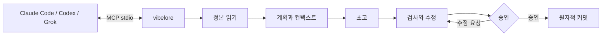
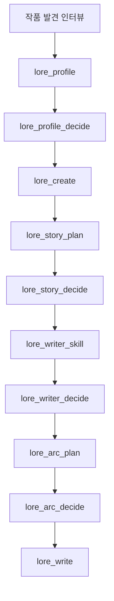
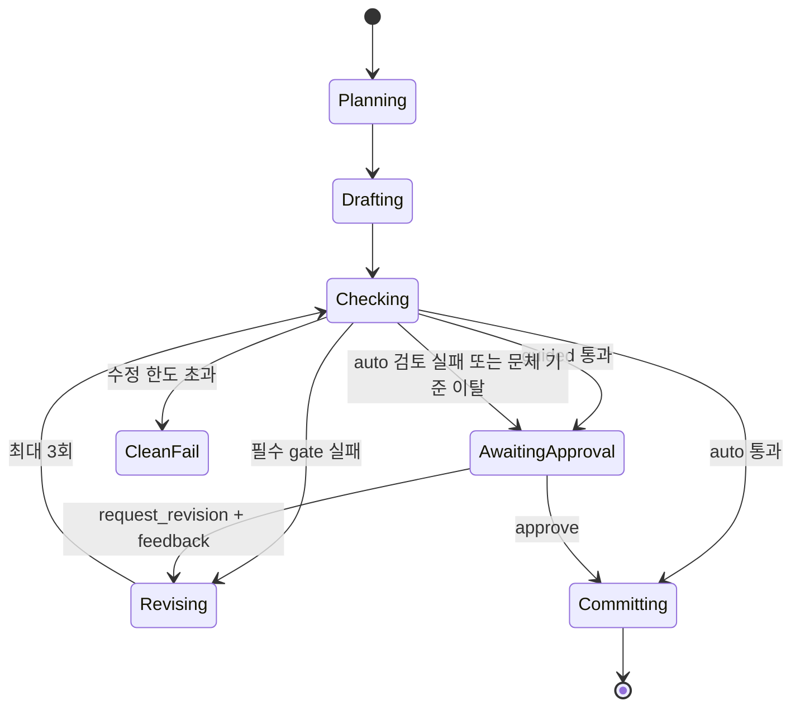
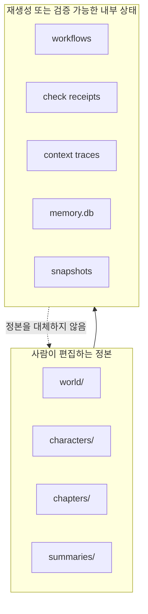

# vibelore

장편소설의 설정, 인물 상태, 아크와 검사 순서를 지키는 로컬 MCP 서버입니다.

- 본문은 연결된 AI 호스트가 씁니다.
- `world/`, `characters/`, `chapters/`가 사람이 수정하는 정본입니다.
- 별도 API 키와 빌드가 필요 없습니다.
- 기본 집필은 `lore_write` 하나로 시작합니다.



## 설치

요구 사항: Node.js 22.13.0 이상인 22.x 또는 24.x LTS.

이 저장소는 `.codex-plugin/plugin.json`을 포함한 Codex 플러그인입니다. 플러그인으로
설치하면 작품 발견 인터뷰 스킬과 MCP 서버가 함께 로드되며, 저장소 위치를 설정에
직접 적을 필요가 없습니다.

다른 MCP 호스트에서 저장소를 직접 연결할 때는 다음처럼 실행합니다.

```bash
git clone https://github.com/fbwndrud/vibelore.git
node /absolute/path/to/vibelore/src/server.js
```

서버는 stdio를 사용합니다. 터미널에서 직접 실행하는 프로그램이 아닙니다. 먼저 Claude
Code, Codex 또는 Grok에 MCP 서버로 등록한 뒤, 그 호스트에게 자연어로 집필을 요청합니다.
등록과 첫 호출은 [시작 안내](docs/GETTING_STARTED.md)를 따라 하면 됩니다.

## 지원 환경과 프로바이더

기본 경로에서는 vibelore가 모델 회사 API를 직접 호출하지 않습니다. MCP를 실행하는
호스트의 현재 모델이 초고, 계획, 비평 요청에 답합니다. 따라서 별도 API 키가 필요 없고,
모델과 생각 수준도 vibelore가 아니라 호스트 세션에서 선택합니다.

| 실행 경로 | 모델 응답 경로 | 상태 |
|---|---|---|
| Codex 앱·CLI | Codex 세션 모델 | 전체 집필 왕복 확인 |
| Claude Code | Claude Code 세션 모델 | 전체 집필 왕복 확인 |
| Grok CLI | Grok 세션 모델 | 전체 집필 왕복 확인 |
| Ollama·LM Studio·llama.cpp | OpenAI 호환 `/chat/completions` | 선택 기능, 호환성 경로 |

OpenAI, Anthropic, Google, xAI의 API 키를 vibelore에 넣어 직접 호출하는 방식은 현재
지원하지 않습니다. 로컬 모델은 `VIBELORE_LOCAL_BASE_URL`과 `VIBELORE_LOCAL_MODEL`을
모두 지정했을 때만 호스트 모델 대신 사용합니다. 이 어댑터는 인증과 생각 수준 전달을
지원하지 않으므로 신뢰할 수 있는 로컬 엔드포인트에서만 사용해야 합니다.

```bash
VIBELORE_LOCAL_BASE_URL=http://127.0.0.1:11434/v1 \
VIBELORE_LOCAL_MODEL=qwen3:14b \
node /absolute/path/to/vibelore/src/server.js
```

호스트별 등록 방법과 실제 확인 버전은 [HOSTS.md](HOSTS.md)에 기록합니다.

## 권장 모델과 생각 수준

다음은 2026-09-05 기준의 vibelore 운영 권장값입니다. 문학적 품질을 보증하는 순위가
아니라, 긴 지시를 유지하면서 계획·초고·검사를 한 세션에서 수행하기 위한 출발점입니다.
계정과 호스트에 표시되는 모델만 사용할 수 있습니다.

| 호스트 | 품질 우선 | 균형형 | 기본 생각 수준 |
|---|---|---|---|
| Codex | `gpt-6-astra` | `gpt-5.6-sol` | `high` |
| Claude Code | `opus` (`Claude Opus 5`) | `sonnet` (`Claude Sonnet 5`) | `high` |
| Grok CLI | `grok-4.6` | `grok-4.6` | `high` |
| 로컬 OpenAI 호환 | 한국어 장문·JSON 응답을 검증한 모델 | 해당 없음 | 서버에서 조절 불가 |

- 작품 발견 인터뷰, 전체 스토리, 첫 아크 설계: `high`. 설정과 인과가 특히 복잡할 때만
  `xhigh`를 검토합니다.
- `lore_write`로 회차를 계획·집필·검사할 때: `high`를 기본값으로 권장합니다.
- 상태 조회, 승인, 단순 손질: `medium` 또는 `low`로도 충분합니다.
- `max`는 일반 집필 기본값으로 권장하지 않습니다. 비용과 대기 시간이 늘고 작품을
  불필요하게 복잡하게 만들 수 있으므로, 실패 원인이 사고량 부족으로 확인된 경우에만 씁니다.

기본값은 한 작업을 같은 강한 모델과 `high` 수준으로 끝내는 것입니다. 단계별로 나누고
싶을 때만 `lore_write`에 `modelProfile`을 넘깁니다. `default`는 기준 모델, `light`는
계획·초고·검사 단계에 쓸 가벼운 모델이고, `identity`·`planning`·`draft`·`quality`·`final`로
단계를 직접 지정할 수 있습니다. 각 값은 모델 ID 문자열이거나 `{ provider, modelId,
reasoningEffort }`입니다. vibelore는 이 값을 `needs_model` 요청마다 `stage`·`model`·
`reasoningEffort` 힌트로 돌려주고, 실제로 어느 모델을 쓸지는 호스트가 정합니다.
로컬 OpenAI 호환 모델은 `provider: "local"`일 때만 요청별로 모델을 바꿉니다.

```json
"modelProfile": {
  "default": { "modelId": "gpt-6-astra", "reasoningEffort": "high" },
  "light": "gpt-5.6-sol",
  "quality": { "reasoningEffort": "medium" }
}
```

정체성과 마무리 단계는 `default`를 그대로 쓰므로, 비용을 줄이더라도 작품 정합성의
기준점은 유지됩니다. 프로필은 workflow에 저장되어 `lore_resume`과 `lore_decide`에도
같은 라우팅이 적용됩니다.
모델 제공사의 현재 명칭과 지원 범위는 [OpenAI 모델 안내](https://developers.openai.com/api/docs/guides/latest-model),
[Claude 모델 상태](https://docs.anthropic.com/en/docs/about-claude/model-deprecations),
[Grok reasoning 안내](https://docs.x.ai/developers/model-capabilities/text/reasoning)에서 확인하세요.

## 1분 사용법

### 새 작품



호스트에게 다음처럼 요청하면 됩니다.

> `/absolute/path/to/my-novel`에 `night_bus`라는 작품을 만들고 싶어. 심야버스에서 타인의 후회를 듣는 기사 이야기야. 작품 발견 인터뷰부터 진행해.

`story-discovery-interview` 스킬은 결과를 바꾸는 취향을 한 라운드에 4~5개씩 묻고 답을
`lore_profile`에 누적합니다. 검토를 생략하려면 “자동으로” 또는 “묻지 말고”를 명시합니다.
그렇지 않으면 프로필, 전체 스토리, 작가 스킬과 아크는 승인 후 활성화됩니다.
주제의 깊이와 읽기 어려움은 별도 축입니다. 표면 문장 난도, 새 개념 속도, 추론 부담,
초반 복잡성 상승 방식은 작품 발견 인터뷰에서 따로 확인합니다.

### 다음 화

> `night_bus` 다음 화를 guided 모드로 써 줘.

`lore_write`가 계획, 초고, 결정론 검사, critic 검토 묶음과 검사 영수증 발급까지 실행합니다. `guided`는 advisory와 최종 원고를 보여 준 뒤 `lore_decide` 승인을 기다립니다. `auto`는 불변식 검사를 통과하고 critic이 정상 완료된 경우에만 자동 커밋합니다. 검토가 실패하거나 응답이 불완전하면 원고를 보존하고 `CRITIC_INCOMPLETE`와 함께 승인 대기로 전환합니다. 문체·변주·밀도 같은 advisory만으로 원고를 자동 재작성하지 않습니다.

마음에 든 정본 1~3화를 `lore_style_anchor(action="approve")`로 지정하면 이후 초고와 수정이
같은 작품 문체 기준을 사용합니다. 기준에서 크게 벗어난 새 초고는 자동으로 다시 쓰지 않고
검토 대상으로 돌리며, 수정은 원문 문단을 보존하는 제한된 패치로 적용됩니다.
기준을 승인할 때 `reason`에 마음에 든 이유를 적으면 정본 예시와 함께 이후 집필에 전달됩니다.



### 취향 반영과 검토 기록

승인한 독자 약속, 톤, 인물의 서술 방식과 집필 방향을 실제 초고 요청에 전달합니다.
해당 회차에 참고할 문체 예시는 최대 두 개를 선택하며, 선택·제외 이유를 기록합니다.
핵심 입력이 예산을 넘으면 말없이 삭제하지 않고 오류로 알립니다.

검토 총점이 높아도 구체적인 지적과 근거는 보존합니다. 검토 완료는 재미를 보증하지 않으며,
같은 호스트가 쓰고 검토한 결과는 자기검토입니다. 문맥의 독립성이 확인되지 않으면 그 상태도 기록합니다.

호스트에게 “이번 화의 검토 근거와 실제 집필 요청을 보여 줘”라고 요청할 수 있습니다.
`lore_workflow_history`로 이력을 조회하고, `includeModelExchanges=true`를 지정하면
조회한 이벤트에 연결된 실제 초고·검토 요청과 응답도 확인합니다. 원고와 작품 계약의 해시,
실행 소스 식별값, 검토 출처와 완료·실패 상태를 함께 추적할 수 있습니다.
기록은 로컬에 저장되며 자동으로 외부에 공개되지 않습니다.

자세한 방법은 [검토 응답과 감사](docs/OPERATIONS.md#검토-응답과-감사)를 참고하세요.

## 정본과 기계 상태

```text
my-novel/
├── world/                 세계 설정 정본
├── characters/            인물 정본
├── chapters/              본문 정본
├── summaries/             화별 요약
└── .vibelore/             워크플로·검사·검색 투영·복구 데이터
```

`world/`, `characters/`, `chapters/`는 직접 고쳐도 됩니다. `.vibelore/`는 직접 수정하지 마세요.



## 안전장치

- 활성 아크 없이 본문부터 쓰지 않습니다.
- 검사한 본문 hash와 커밋할 본문 hash가 다르면 거부합니다.
- 앞 화를 다시 쓰면 `lore_refold`로 이후 상태를 재계산합니다.
- 커밋마다 snapshot을 만들며 `lore_rollback`으로 복구할 수 있습니다.
- 원격 API 키가 없으면 호스트 AI를 사용합니다.
- 검색 기억과 기계 상태는 정본을 보조할 뿐, 정본을 덮어쓰지 않습니다.

## 문서

- [문서 지도](docs/README.md): 필요한 문서를 상황별로 찾기
- [방향과 철학](docs/PHILOSOPHY.md): 무엇을 책임지고 무엇을 모델과 작가에게 맡기는지
- [시작 안내](docs/GETTING_STARTED.md): 설치, 등록, 첫 작품, 다음 화
- [MCP 계약](docs/MCP.md): 프로토콜, 응답, 모델 재개, 워크플로
- [도구 레퍼런스](docs/TOOLS.md): 기본 26개 도구와 고급 유지보수 도구의 실제 계약
- [아키텍처](docs/ARCHITECTURE.md): 정본, 상태기계, 입력 compiler, 커밋
- [운영과 복구](docs/OPERATIONS.md): 상태 확인, 실패 대응, rewrite/refold/rollback
- [호스트별 설치](HOSTS.md): Claude Code, Codex CLI, Grok CLI 검증 기록

## 테스트

```bash
npm test
npm run test:engine
npm run test:all
```

의존성 설치나 빌드는 필요하지 않습니다.

## 공개 범위와 기여

라이선스는 [Apache-2.0](LICENSE)입니다. 0.1.0 공개 뒤 자료 유래를 재검토해 외부
참고에서 온 어휘와 스키마를 vibelore 자체 정의로 교체했고, 그 기록은
[PROVENANCE](docs/PROVENANCE.md)에 있습니다.
사용자가 작성한 원고에는 이 저장소의 라이선스가 자동 적용되지 않습니다.
외부 참고와 어휘 자료의 출처는 [PROVENANCE](docs/PROVENANCE.md),
개발 참여는 [CONTRIBUTING](CONTRIBUTING.md), 데이터 경계와 취약점 제보는
[SECURITY](SECURITY.md)를 참고하세요.

플러그인 설치 메뉴에 사용자 저장소 추가 기능이 있다면 이 저장소 주소를 사용합니다.
해당 기능이 없는 호스트는 위의 clone 후 MCP 등록 방법을 사용하면 됩니다.
실제 모델 응답과 계정 권한은 호스트마다 다릅니다. 최신 지원 LTS 패치 버전을 권장합니다.
