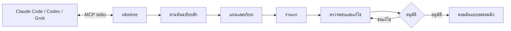
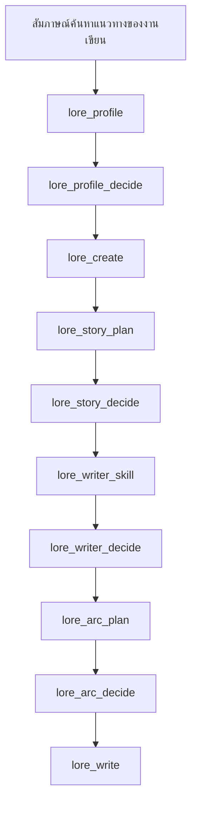
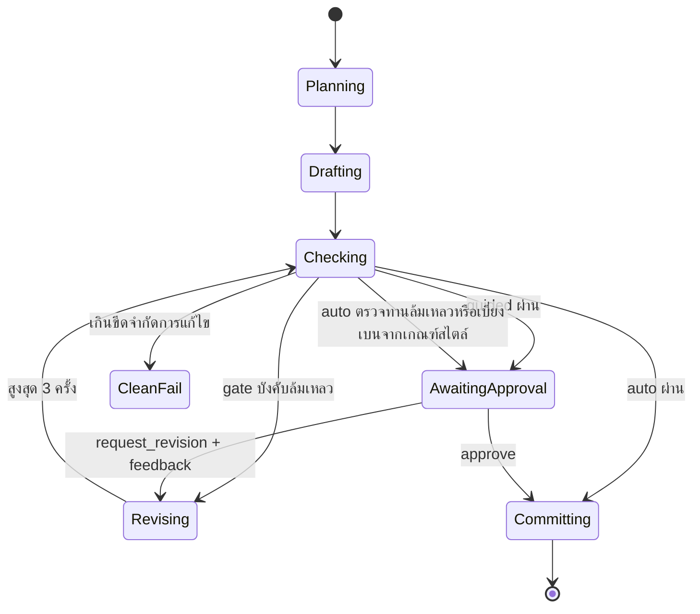
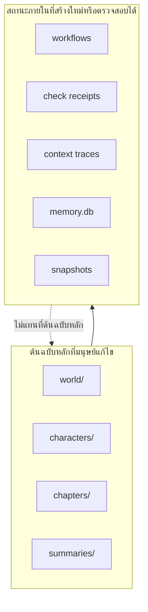

# vibelore

[한국어](README.md) | [English](README.en.md) | [日本語](README.ja.md) | [Español](README.es.md) | [Français](README.fr.md) | [繁體中文](README.zh-Hant.md) | ไทย | [العربية](README.ar.md)

เซิร์ฟเวอร์ MCP แบบโลคัลที่รักษาความสอดคล้องของโลก สถานะตัวละคร อาร์ก และลำดับการตรวจสอบของนิยายขนาดยาว

- เนื้อหาตัวบทเขียนโดยโฮสต์ AI ที่เชื่อมต่ออยู่
- `world/`, `characters/`, `chapters/` คือต้นฉบับหลัก (canon) ที่มนุษย์แก้ไขได้
- ไม่ต้องใช้ API key แยกต่างหากและไม่ต้องบิลด์
- การเขียนพื้นฐานเริ่มต้นได้ด้วย `lore_write` เพียงตัวเดียว
- ภาษาของงานเขียนกำหนดด้วยอาร์กิวเมนต์ `language` เพียงตัวเดียว และใช้โฟลว์เดียวกันกับภาษาอื่นนอกเหนือจากภาษาเกาหลีได้



## การติดตั้ง

ข้อกำหนด: Node.js 22.13 ขึ้นไป (22.x) หรือ 24.x ไม่ต้องบิลด์และไม่ต้องติดตั้ง dependency

วิธีที่ง่ายที่สุดคือส่งที่อยู่รีโพซิทอรีให้เครื่องมือเขียนโค้ด AI ที่ใช้อยู่ (Claude Code, Codex, Grok CLI) แล้วขอให้ทำ

> ช่วยดึง https://github.com/fbwndrud/vibelore แล้วลงทะเบียนเป็นเซิร์ฟเวอร์ MCP ให้หน่อย

เมื่อลงทะเบียนเสร็จ ให้รีสตาร์ตเครื่องมือ AI หนึ่งครั้ง

หากต้องการรันเซิร์ฟเวอร์ MCP ด้วยแพ็กเกจ npm [`vibelore`](https://www.npmjs.com/package/vibelore) โดยไม่ต้องดึงรีโพซิทอรี:

```bash
claude mcp add-json vibelore '{"command":"npx","args":["-y","vibelore"]}' --scope project
```

สำหรับ Codex ใช้ `command = "npx"` และ `args = ["-y", "vibelore"]` ส่วน Grok CLI ใช้ `grok mcp add vibelore -- npx -y vibelore`
หากต้องการตรึงเวอร์ชัน ให้เขียนเป็น `vibelore@0.4.0` เส้นทาง npm ลงทะเบียนเฉพาะเซิร์ฟเวอร์ MCP
จึงต้องติดตั้งสกิลสัมภาษณ์ด้วยวิธีรีโพซิทอรีด้านล่างหรือเป็นปลั๊กอิน Codex

หากต้องการดึงรีโพซิทอรีและลงทะเบียนโดยตรง:

```bash
git clone https://github.com/fbwndrud/vibelore.git
claude mcp add-json vibelore '{"command":"node","args":["/absolute/path/to/vibelore/src/server.js"]}' --scope project
```

รีโพซิทอรีนี้เป็นปลั๊กอิน Codex (`.codex-plugin/plugin.json`) ด้วย เมื่อติดตั้งเป็นปลั๊กอิน สกิลสัมภาษณ์ค้นหาแนวทางของงานเขียน
และเซิร์ฟเวอร์ MCP จะถูกโหลดพร้อมกัน สกิลสำหรับ Claude Code อยู่ที่ `hosts/claude/skills/`

เซิร์ฟเวอร์ใช้ stdio ไม่ใช่โปรแกรมที่รันโดยตรงจากเทอร์มินัล ให้ลงทะเบียนเป็นเซิร์ฟเวอร์ MCP ใน Claude
Code, Codex หรือ Grok ก่อน แล้วจึงขอให้โฮสต์นั้นเขียนด้วยภาษาธรรมชาติ
สำหรับการลงทะเบียนและการเรียกใช้ครั้งแรก ให้ทำตาม[คู่มือเริ่มต้นใช้งาน](docs/GETTING_STARTED.md)

## สภาพแวดล้อมและผู้ให้บริการที่รองรับ

ในเส้นทางพื้นฐาน vibelore จะไม่เรียก API ของบริษัทโมเดลโดยตรง โมเดลปัจจุบันของโฮสต์ที่รัน MCP
จะเป็นผู้ตอบคำขอร่างแรก แผน และการวิจารณ์ ดังนั้นจึงไม่ต้องใช้ API key แยกต่างหาก
และการเลือกโมเดลกับระดับการคิดก็ทำในเซสชันของโฮสต์ ไม่ใช่ใน vibelore

| เส้นทางการรัน | เส้นทางการตอบของโมเดล | สถานะ |
|---|---|---|
| แอป Codex และ CLI | โมเดลของเซสชัน Codex | ยืนยันการเขียนครบรอบแล้ว |
| Claude Code | โมเดลของเซสชัน Claude Code | ยืนยันการเขียนครบรอบแล้ว |
| Grok CLI | โมเดลของเซสชัน Grok | ยืนยันการเขียนครบรอบแล้ว |
| Ollama, LM Studio, llama.cpp | `/chat/completions` ที่เข้ากันได้กับ OpenAI | ฟีเจอร์เสริม เส้นทางเพื่อความเข้ากันได้ |

ปัจจุบันยังไม่รองรับการใส่ API key ของ OpenAI, Anthropic, Google, xAI ลงใน vibelore เพื่อเรียกใช้โดยตรง
โมเดลโลคัลจะถูกใช้แทนโมเดลของโฮสต์ก็ต่อเมื่อระบุทั้ง `VIBELORE_LOCAL_BASE_URL` และ `VIBELORE_LOCAL_MODEL`
อะแดปเตอร์นี้ไม่รองรับการยืนยันตัวตนและการส่งต่อระดับการคิด จึงควรใช้กับเอนด์พอยต์โลคัล
ที่เชื่อถือได้เท่านั้น

```bash
VIBELORE_LOCAL_BASE_URL=http://127.0.0.1:11434/v1 \
VIBELORE_LOCAL_MODEL=qwen3:14b \
node /absolute/path/to/vibelore/src/server.js
```

วิธีลงทะเบียนของแต่ละโฮสต์และเวอร์ชันที่ยืนยันจริงบันทึกไว้ใน [HOSTS.md](HOSTS.md)

## โมเดลและระดับการคิดที่แนะนำ

ต่อไปนี้คือค่าที่แนะนำสำหรับการใช้งาน vibelore ณ วันที่ 2026-09-05 ไม่ใช่การจัดอันดับที่รับประกัน
คุณภาพทางวรรณกรรม แต่เป็นจุดเริ่มต้นสำหรับการวางแผน ร่างแรก และตรวจสอบในเซสชันเดียว
โดยยังรักษาคำสั่งที่ยาวไว้ได้ ใช้ได้เฉพาะโมเดลที่แสดงในบัญชีและโฮสต์ของคุณเท่านั้น

| โฮสต์ | เน้นคุณภาพ | แบบสมดุล | ระดับการคิดพื้นฐาน |
|---|---|---|---|
| Codex | `gpt-6-astra` | `gpt-5.6-sol` | `high` |
| Claude Code | `opus` (`Claude Opus 5`) | `sonnet` (`Claude Sonnet 5`) | `high` |
| Grok CLI | `grok-4.6` | `grok-4.6` | `high` |
| โลคัลที่เข้ากันได้กับ OpenAI | โมเดลที่ผ่านการตรวจสอบการตอบข้อความยาวและ JSON ภาษาเกาหลีแล้ว | ไม่มี | ปรับจากเซิร์ฟเวอร์ไม่ได้ |

- สัมภาษณ์ค้นหาแนวทางของงานเขียน เรื่องราวทั้งหมด และการออกแบบอาร์กแรก: `high` พิจารณา
  `xhigh` เฉพาะเมื่อโลกและความเป็นเหตุเป็นผลซับซ้อนเป็นพิเศษ
- เมื่อวางแผน เขียน และตรวจสอบตอนด้วย `lore_write`: แนะนำ `high` เป็นค่าพื้นฐาน
- การดูสถานะ การอนุมัติ และการปรับแต่งเล็กน้อย: `medium` หรือ `low` ก็เพียงพอ
- ไม่แนะนำ `max` เป็นค่าพื้นฐานสำหรับการเขียนทั่วไป เพราะเพิ่มค่าใช้จ่ายและเวลารอ และอาจทำให้
  งานเขียนซับซ้อนโดยไม่จำเป็น ใช้เฉพาะเมื่อยืนยันแล้วว่าความล้มเหลวเกิดจากปริมาณการคิดไม่พอ

ปัจจุบัน vibelore ไม่เปลี่ยนโมเดลหรือระดับการคิดตามขั้นตอน โปรไฟล์ อาร์ก และตัวบทที่เริ่มในงานเดียวกัน
ควรทำให้เสร็จด้วยโมเดลที่แข็งแกร่งตัวเดิมและระดับ `high` เพื่อความสอดคล้อง
ตรวจสอบชื่อปัจจุบันและขอบเขตการรองรับของผู้ให้บริการโมเดลได้ที่ [คู่มือโมเดล OpenAI](https://developers.openai.com/api/docs/guides/latest-model),
[สถานะโมเดล Claude](https://docs.anthropic.com/en/docs/about-claude/model-deprecations),
[คู่มือ reasoning ของ Grok](https://docs.x.ai/developers/model-capabilities/text/reasoning)

## วิธีใช้ใน 1 นาที

### งานเขียนใหม่



ขอให้โฮสต์ทำดังนี้ได้เลย

> อยากสร้างงานเขียนชื่อ `night_bus` ที่ `/absolute/path/to/my-novel` เป็นเรื่องของคนขับรถเมล์กลางคืนที่คอยฟังความเสียใจของผู้โดยสาร ช่วยเริ่มจากสัมภาษณ์ค้นหาแนวทางของงานเขียนก่อนนะ

สกิล `story-discovery-interview` จะถามความชอบที่ส่งผลต่อผลลัพธ์รอบละ 4–5 ข้อ แล้วสะสมคำตอบไว้ใน
`lore_profile` หากต้องการข้ามการตรวจทาน ให้ระบุว่า "ทำอัตโนมัติ" หรือ "ไม่ต้องถาม"
มิฉะนั้น โปรไฟล์ เรื่องราวทั้งหมด สกิลนักเขียน และอาร์กจะถูกเปิดใช้งานหลังจากอนุมัติแล้ว
ความลึกของธีมและความยากในการอ่านเป็นคนละแกนกัน ระดับความยากของประโยคผิวเผิน ความเร็วในการเสนอแนวคิดใหม่
ภาระในการอนุมาน และวิธีเพิ่มความซับซ้อนในช่วงต้น จะถูกยืนยันแยกกันในสัมภาษณ์ค้นหาแนวทางของงานเขียน

### ตอนถัดไป

> ช่วยเขียนตอนถัดไปของ `night_bus` ในโหมด guided ให้หน่อย

`lore_write` จะรันทั้งการวางแผน ร่างแรก การตรวจสอบแบบดีเทอร์มินิสติก ชุดการตรวจทานโดย critic และการออกใบรับรองการตรวจสอบ `guided` จะแสดง advisory และต้นฉบับสุดท้าย แล้วรอการอนุมัติผ่าน `lore_decide` ส่วน `auto` จะคอมมิตอัตโนมัติเฉพาะเมื่อผ่านการตรวจสอบ invariant และ critic ทำงานเสร็จสมบูรณ์ตามปกติ หากการตรวจทานล้มเหลวหรือคำตอบไม่สมบูรณ์ จะเก็บต้นฉบับไว้และเปลี่ยนเป็นสถานะรออนุมัติพร้อมกับ `CRITIC_INCOMPLETE` จะไม่เขียนต้นฉบับใหม่อัตโนมัติจาก advisory อย่างเดียว เช่น สไตล์ ความหลากหลาย หรือความหนาแน่น

เมื่อกำหนดตอนในต้นฉบับหลักที่ชอบ 1–3 ตอนด้วย `lore_style_anchor(action="approve")` ร่างแรกและการแก้ไขหลังจากนั้น
จะใช้เกณฑ์สไตล์เดียวกันของงานเขียน ร่างแรกใหม่ที่เบี่ยงเบนจากเกณฑ์อย่างมากจะไม่ถูกเขียนใหม่อัตโนมัติ
แต่จะถูกส่งไปตรวจทาน และการแก้ไขจะใช้แพตช์แบบจำกัดที่รักษาย่อหน้าต้นฉบับไว้
หากระบุเหตุผลที่ชอบใน `reason` ตอนอนุมัติเกณฑ์ เหตุผลนั้นจะถูกส่งต่อไปยังการเขียนครั้งถัดไปพร้อมกับตัวอย่างจากต้นฉบับหลัก



### การสะท้อนความชอบและบันทึกการตรวจทาน

คำสัญญาต่อผู้อ่าน โทน วิธีบรรยายตัวละคร และทิศทางการเขียนที่อนุมัติแล้ว จะถูกส่งต่อไปยังคำขอร่างแรกจริง
ตัวอย่างสไตล์สำหรับอ้างอิงในตอนนั้นจะเลือกได้สูงสุดสองตัวอย่าง และบันทึกเหตุผลในการเลือกและตัดออก
หากอินพุตหลักเกินงบประมาณ จะแจ้งเป็นข้อผิดพลาดแทนการลบทิ้งเงียบ ๆ

แม้คะแนนรวมของการตรวจทานจะสูง ข้อชี้แนะที่เจาะจงและหลักฐานก็ยังถูกเก็บรักษาไว้ การตรวจทานเสร็จสิ้นไม่ได้รับประกันความสนุก
และผลที่โฮสต์เดียวกันทั้งเขียนและตรวจทานถือเป็นการตรวจทานตนเอง หากยืนยันความเป็นอิสระของบริบทไม่ได้ ก็จะบันทึกสถานะนั้นไว้ด้วย

คุณขอให้โฮสต์ "แสดงหลักฐานการตรวจทานและคำขอเขียนจริงของตอนนี้" ได้
ใช้ `lore_workflow_history` เพื่อดูประวัติ และหากระบุ `includeModelExchanges=true`
จะเห็นคำขอร่างแรกและการตรวจทานจริงพร้อมคำตอบที่เชื่อมโยงกับเหตุการณ์ที่ค้นหาด้วย สามารถติดตามแฮชของต้นฉบับและสัญญาของงานเขียน
ค่าระบุแหล่งที่มาของการรัน แหล่งที่มาของการตรวจทาน และสถานะเสร็จสมบูรณ์หรือล้มเหลวไปพร้อมกันได้
บันทึกจะถูกเก็บไว้ในเครื่องและไม่ถูกเผยแพร่สู่ภายนอกโดยอัตโนมัติ

ดูรายละเอียดวิธีการได้ที่ [คำตอบการตรวจทานและการตรวจสอบย้อนหลัง](docs/OPERATIONS.md#검토-응답과-감사)

### การดัดแปลงเป็นเว็บตูน

> ช่วยดัดแปลงตอนที่ 1 ของ `night_bus` เป็นเว็บตูน ถามทิศทางการผลิตก่อน

ตอนที่เขียนเสร็จแล้วจะถูกดัดแปลงโดยดึงตัวละคร โลก และสถานะจนถึงตอนนั้นมาจากต้นฉบับ จึงไม่ต้องอธิบายใหม่
`lore_webtoon_scene` จะถามลายเส้น การใส่ตัวอักษร การเลื่อนแนวตั้ง และจำนวนช่องก่อน แล้วยืนยันภาพอ้างอิงของตัวละคร
และสถานที่ จากนั้นจึงวาดทั้งฉากรวมบทพูดเป็นภาพแนวตั้งภาพเดียว และตรวจภาพจริง ตัวอักษรในภาพเป็นไปตามภาษาของงานเขียน
วิธีเดิมที่อนุมัติภาพร่างทีละช่องเป็น deprecated และใช้เพียงต่องานที่กำลังดำเนินอยู่ ภาพวาดด้วยเครื่องมือภาพของโฮสต์หรือ
API ภาพ จะใช้ API แบบเสียเงินหลังได้รับการยืนยันเท่านั้น และการอนุมัติเว็บตูนแยกจากการอนุมัตินิยาย
ดูรายละเอียดที่[คู่มือการสร้างเว็บตูน](docs/WEBTOON.md)

## ภาษาของงานเขียน

ภาษาที่ใช้เขียนงานกำหนดด้วยอาร์กิวเมนต์เสริม `language` ที่ `lore_profile`, `lore_init`, `lore_create`, `lore_write`
รับเข้ามา เมื่อผู้ใช้ระบุภาษาที่จะเขียนด้วยภาษาธรรมชาติ โฮสต์จะแปลงให้เป็นแท็ก BCP 47
(`ja`, `pt-BR`, `zh-Hant` เป็นต้น) แล้วส่งต่อ และหากไม่ได้เลือกภาษา ก็จะละอาร์กิวเมนต์นี้ไว้
งานเขียนเดิมที่ไม่มีคีย์ภาษาถือเป็น `ko` โดยปริยาย ภาษาที่ใช้สนทนากับภาษาของงานเขียนเป็นคนละเรื่องกัน
จึงสามารถสนทนาเป็นภาษาเกาหลีขณะเขียนงานเป็นภาษาญี่ปุ่นได้

> อยากสร้างงานเขียนชื่อ `harbor_summer` ที่ `/absolute/path/to/my-novel` ช่วยเขียนตัวบทเป็นภาษาสเปนนะ

- พรอมป์ตมีสองสาย `ko` ใช้ชุดคำสั่งเฉพาะสำหรับภาษาเกาหลี ส่วนภาษาอื่น (รวมถึงภาษาอังกฤษ) ใช้สายที่รวม
  ชุดคำสั่งกลางภาษาอังกฤษเข้ากับภาษาเป้าหมาย ตัวบท ชื่อเรื่อง สรุป คำอธิบายโลกและตัวละคร รวมถึงค่าคำอธิบาย
  ของแผนและการตรวจทานจะเป็นไปตามภาษาเป้าหมาย ส่วนค่าที่เครื่องอ่าน เช่น คีย์ JSON, enum, ID จะไม่ถูกแปล
- ความยาววัดด้วยหน่วยที่เหมาะกับแต่ละภาษา ภาษาเกาหลีใช้จำนวนตัวอักษรแบบเดิม ส่วนภาษาอื่นใช้จำนวนกราฟีม (grapheme)
  หรือจำนวนคำ และระบบการเขียนที่มีอักขระประกอบจำนวนมากอย่างภาษาอาหรับและฮีบรู รวมถึงภาษาไทยที่ไม่มีการเว้นวรรคระหว่างคำ
  ก็จัดการภายใต้สัญญาเดียวกัน
- ภาษาเปลี่ยนไม่ได้หลังจากสร้าง foundation แล้ว หากส่งค่าที่ต่างจากภาษาที่บันทึกไว้ จะไม่เขียนทับเงียบ ๆ
  แต่จะปฏิเสธด้วย `LANGUAGE_CONTRACT_CONFLICT`
- ทุกตอนจะตรวจว่าตัวบท สรุป และแผนเขียนด้วยภาษาของงานเขียนหรือไม่ ส่วน invariant เชิงความหมาย เช่น มุมมองการเล่า
  การลงทะเบียนตัวละคร และการตั้งค่าโลก จะถูกตรวจโดยผู้ตรวจคนเดียวกันโดยไม่ขึ้นกับภาษา

ภาษาที่ยืนยันโฟลว์ทั้งหมดด้วย Claude Sonnet 5 จริง ตั้งแต่โปรไฟล์ไปจนถึงการอนุมัติตอนที่ 2 และการตรวจสอบภาษาขั้นสุดท้าย ได้แก่
ภาษาอังกฤษ สเปน ญี่ปุ่น ฝรั่งเศส เกาหลี อาหรับ จีนตัวเต็ม และไทย รายละเอียดของสัญญาอาร์กิวเมนต์
ดูได้ที่ [ภาษาของงานเขียนและหน่วยวัดความยาว](docs/TOOLS.md#작품-언어와-분량-단위) และบันทึกการตรวจสอบดูได้ที่
[บันทึกการพัฒนาระบบหลายภาษา](https://github.com/fbwndrud/vibelore/blob/main/docs/research/MULTILINGUAL_IMPLEMENTATION.md)

## ต้นฉบับหลักและสถานะของเครื่อง

```text
my-novel/
├── world/                 ต้นฉบับหลักของโลก
├── characters/            ต้นฉบับหลักของตัวละคร
├── chapters/              ต้นฉบับหลักของเนื้อเรื่อง
├── summaries/             สรุปรายตอน
└── .vibelore/             ข้อมูลเวิร์กโฟลว์ การตรวจสอบ การฉายค้นหา และการกู้คืน
```

`world/`, `characters/`, `chapters/` แก้ไขโดยตรงได้ แต่อย่าแก้ไข `.vibelore/` โดยตรง



## กลไกความปลอดภัย

- ไม่เขียนตัวบทก่อนโดยไม่มีอาร์กที่ใช้งานอยู่
- หากแฮชของตัวบทที่ตรวจสอบแล้วต่างจากแฮชของตัวบทที่จะคอมมิต จะปฏิเสธ
- เมื่อเขียนตอนก่อนหน้าใหม่ จะคำนวณสถานะหลังจากนั้นใหม่ด้วย `lore_refold`
- สร้าง snapshot ทุกครั้งที่คอมมิต และกู้คืนได้ด้วย `lore_rollback`
- หากไม่มี API key ระยะไกล จะใช้ AI ของโฮสต์
- หน่วยความจำสำหรับค้นหาและสถานะของเครื่องเป็นเพียงตัวช่วยของต้นฉบับหลัก ไม่เขียนทับต้นฉบับหลัก

## เอกสาร

- [แผนที่เอกสาร](docs/README.md): ค้นหาเอกสารที่ต้องการตามสถานการณ์
- [ทิศทางและปรัชญา](docs/PHILOSOPHY.md): รับผิดชอบอะไร และมอบอะไรให้โมเดลกับนักเขียน
- [คู่มือเริ่มต้นใช้งาน](docs/GETTING_STARTED.md): การติดตั้ง การลงทะเบียน งานเขียนแรก ตอนถัดไป
- [สัญญา MCP](docs/MCP.md): โปรโตคอล คำตอบ การกลับมาทำงานต่อของโมเดล เวิร์กโฟลว์
- [อ้างอิงเครื่องมือ](docs/TOOLS.md): สัญญาจริงของเครื่องมือพื้นฐาน 26 ตัวและเครื่องมือบำรุงรักษาขั้นสูง
- [สถาปัตยกรรม](docs/ARCHITECTURE.md): ต้นฉบับหลัก state machine, input compiler, การคอมมิต
- [การใช้งานและการกู้คืน](docs/OPERATIONS.md): การตรวจสอบสถานะ การรับมือความล้มเหลว rewrite/refold/rollback
- [การติดตั้งตามโฮสต์](HOSTS.md): บันทึกการตรวจสอบ Claude Code, Codex CLI, Grok CLI

## การทดสอบ

```bash
npm test
npm run test:engine
npm run test:all
```

ไม่จำเป็นต้องติดตั้งไดเพนเดนซีหรือบิลด์
