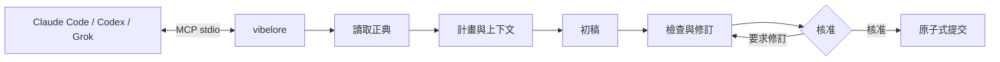
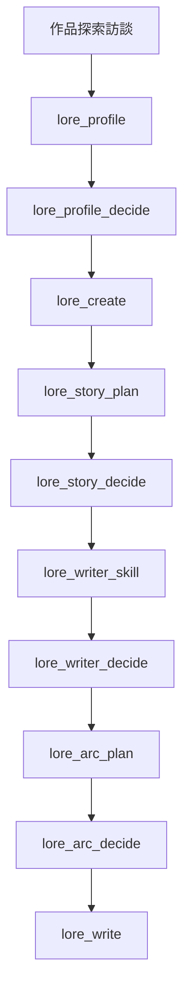
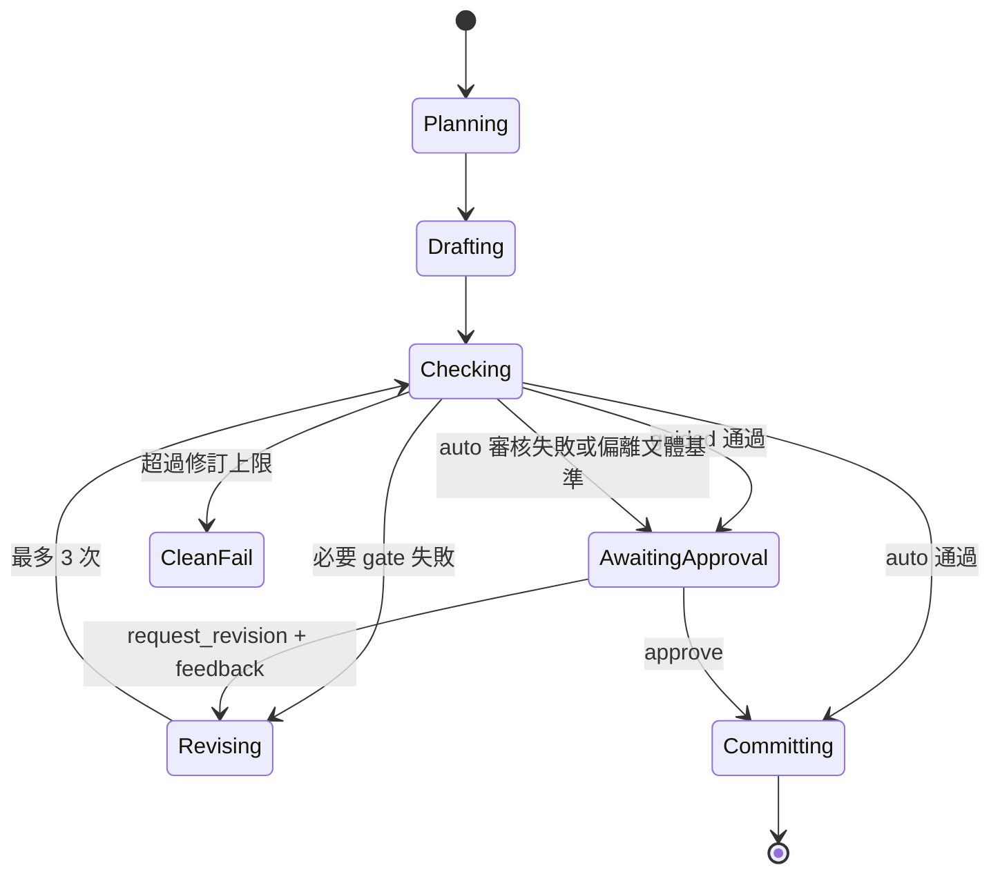
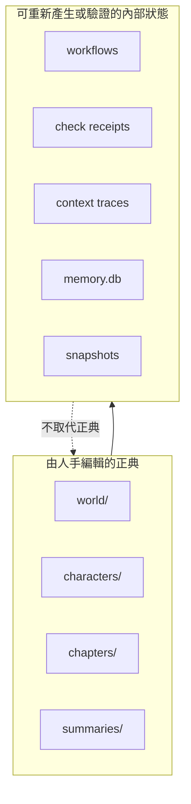

# vibelore

[한국어](README.md) | [English](README.en.md) | [日本語](README.ja.md) | [Español](README.es.md) | [Français](README.fr.md) | 繁體中文 | [ไทย](README.th.md) | [العربية](README.ar.md)

這是一個本機 MCP 伺服器，負責維護長篇小說的設定、人物狀態、故事弧與檢查順序。

- 正文由連接的 AI 主機撰寫。
- `world/`、`characters/`、`chapters/` 是由人手修改的正典。
- 不需要額外的 API 金鑰或建置步驟。
- 基本寫作只需從 `lore_write` 一個工具開始。
- 作品語言由單一 `language` 參數決定，韓語以外的語言也走同一套流程。



## 安裝

需求：Node.js 22.13 以上（22.x）或 24.x。不需要建置，也不需要安裝相依套件。

最簡單的方法是把儲存庫網址交給你使用的 AI 程式工具（Claude Code、Codex、Grok CLI）並提出請求。

> 請取得 https://github.com/fbwndrud/vibelore 並註冊為 MCP 伺服器。

註冊完成後，請重新啟動一次 AI 工具。

若不取得儲存庫，而是用 npm 套件 [`vibelore`](https://www.npmjs.com/package/vibelore) 執行 MCP 伺服器：

```bash
claude mcp add-json vibelore '{"command":"npx","args":["-y","vibelore"]}' --scope project
```

Codex 使用 `command = "npx"`、`args = ["-y", "vibelore"]`，Grok CLI 使用 `grok mcp add vibelore -- npx -y vibelore`。
要固定版本時，請寫成 `vibelore@0.4.0`。npm 途徑只註冊 MCP 伺服器，訪談技能請以下方的儲存庫方式或 Codex 外掛安裝。

取得儲存庫並直接註冊：

```bash
git clone https://github.com/fbwndrud/vibelore.git
claude mcp add-json vibelore '{"command":"node","args":["/absolute/path/to/vibelore/src/server.js"]}' --scope project
```

此儲存庫也是 Codex 外掛（`.codex-plugin/plugin.json`）。以外掛方式安裝時，作品探索訪談技能與 MCP 伺服器會一起載入。
Claude Code 用的技能位於 `hosts/claude/skills/`。

伺服器使用 stdio，並不是直接在終端機中執行的程式。請先將它註冊為 Claude
Code、Codex 或 Grok 的 MCP 伺服器，再以自然語言向該主機提出寫作請求。
註冊與第一次呼叫請依照[入門指南](docs/GETTING_STARTED.md)操作。

## 支援環境與供應商

在預設路徑下，vibelore 不會直接呼叫模型公司的 API。執行 MCP 的主機目前使用的模型
會回應初稿、計畫與評論請求。因此不需要額外的 API 金鑰，模型與思考等級也是在主機
工作階段中選擇，而非由 vibelore 決定。

| 執行路徑 | 模型回應路徑 | 狀態 |
|---|---|---|
| Codex 應用程式・CLI | Codex 工作階段模型 | 已確認完整寫作往返 |
| Claude Code | Claude Code 工作階段模型 | 已確認完整寫作往返 |
| Grok CLI | Grok 工作階段模型 | 已確認完整寫作往返 |
| Ollama・LM Studio・llama.cpp | OpenAI 相容 `/chat/completions` | 選用功能，相容性路徑 |

目前不支援將 OpenAI、Anthropic、Google、xAI 的 API 金鑰放進 vibelore 直接呼叫的方式。
只有同時指定 `VIBELORE_LOCAL_BASE_URL` 與 `VIBELORE_LOCAL_MODEL` 時，才會以本機模型
取代主機模型。此配接器不支援驗證與思考等級傳遞，因此只應在可信任的本機端點上使用。

```bash
VIBELORE_LOCAL_BASE_URL=http://127.0.0.1:11434/v1 \
VIBELORE_LOCAL_MODEL=qwen3:14b \
node /absolute/path/to/vibelore/src/server.js
```

各主機的註冊方式與實際驗證版本記錄於 [HOSTS.md](HOSTS.md)。

## 建議模型與思考等級

以下是截至 2026-09-05 的 vibelore 運作建議值。這不是保證文學品質的排名，而是為了
在維持長指令的同時，於單一工作階段內完成計畫、初稿與檢查的起點。
只能使用帳戶與主機中顯示的模型。

| 主機 | 品質優先 | 平衡型 | 預設思考等級 |
|---|---|---|---|
| Codex | `gpt-6-astra` | `gpt-5.6-sol` | `high` |
| Claude Code | `opus`（`Claude Opus 5`） | `sonnet`（`Claude Sonnet 5`） | `high` |
| Grok CLI | `grok-4.6` | `grok-4.6` | `high` |
| 本機 OpenAI 相容 | 已驗證韓語長文・JSON 回應的模型 | 不適用 | 無法在伺服器端調整 |

- 作品探索訪談、整體故事、第一個故事弧設計：`high`。只有在設定與因果特別複雜時
  才考慮 `xhigh`。
- 以 `lore_write` 計畫、撰寫與檢查章節時：建議以 `high` 為預設值。
- 狀態查詢、核准、簡單潤飾：`medium` 或 `low` 已經足夠。
- 不建議把 `max` 當作一般寫作的預設值。它會增加成本與等待時間，還可能讓作品變得
  不必要地複雜，因此只在確認失敗原因是思考量不足時才使用。

vibelore 目前不會按階段切換模型或思考等級。同一個作業中開始的設定檔、故事弧與正文，
以相同的強力模型和 `high` 等級完成，對一致性更有利。
模型供應商的最新名稱與支援範圍請參考 [OpenAI 模型指南](https://developers.openai.com/api/docs/guides/latest-model)、
[Claude 模型狀態](https://docs.anthropic.com/en/docs/about-claude/model-deprecations)、
[Grok reasoning 指南](https://docs.x.ai/developers/model-capabilities/text/reasoning)。

## 一分鐘上手

### 新作品



向主機這樣提出請求即可。

> 我想在 `/absolute/path/to/my-novel` 建立一部叫 `night_bus` 的作品。故事講的是一位在深夜公車上聆聽陌生人悔恨的司機。請從作品探索訪談開始進行。

`story-discovery-interview` 技能每一輪會詢問 4～5 個會改變結果的偏好，並將答案
累積到 `lore_profile`。若要略過審核，請明確說出「自動進行」或「不要問我」。
否則設定檔、整體故事、作者技能與故事弧都會在核准後才啟用。
主題的深度與閱讀難度是兩個獨立的軸。表層句子的難度、新概念出現的速度、推理負擔、
以及前期複雜度上升的方式，會在作品探索訪談中分別確認。

### 下一章

> 請用 guided 模式寫 `night_bus` 的下一章。

`lore_write` 會執行計畫、初稿、確定性檢查、critic 審核組合，直到核發檢查收據為止。`guided` 會先呈現 advisory 與最終稿，再等待 `lore_decide` 核准。`auto` 只有在通過不變式檢查且 critic 正常完成時才會自動提交。若審核失敗或回應不完整，會保留稿件並以 `CRITIC_INCOMPLETE` 轉為等待核准。不會僅憑文體・變化・密度等 advisory 就自動重寫稿件。

以 `lore_style_anchor(action="approve")` 指定 1～3 章你喜歡的正典章節後，之後的初稿與修訂
都會使用同一套作品文體基準。明顯偏離基準的新初稿不會被自動重寫，而是轉為審核對象；
修訂則以保留原文段落的受限補丁方式套用。
核准基準時，若在 `reason` 寫下喜歡的理由，會連同正典範例一起傳遞給之後的寫作。



### 反映偏好與審核記錄

已核准的讀者承諾、語調、人物的敘述方式與寫作方向，都會傳遞到實際的初稿請求中。
該章要參考的文體範例最多選擇兩個，並記錄選入・排除的理由。
核心輸入若超出預算，不會默默刪除，而是以錯誤通知。

即使審核總分很高，具體的指摘與依據也會保留。審核完成並不保證有趣，
由同一主機撰寫並審核的結果屬於自我審核。若無法確認上下文的獨立性，也會記錄該狀態。

你可以向主機請求「讓我看看這一章的審核依據與實際寫作請求」。
以 `lore_workflow_history` 查詢歷程，並指定 `includeModelExchanges=true`，
就能一併查看與查詢到的事件相連的實際初稿・審核請求與回應。稿件與作品契約的雜湊、
執行來源識別值、審核出處以及完成・失敗狀態都可以一起追蹤。
記錄儲存在本機，不會自動對外公開。

詳細方法請參考[審核回應與稽核](docs/OPERATIONS.md#검토-응답과-감사)。

### 改編為網漫

> 把 `night_bus` 第 1 話改編成網漫。先問我製作方向。

已寫好的章節會從原作承接人物、世界觀與到該話為止的狀態進行改編，不必重新說明。`lore_webtoon_scene`
會先詢問畫風、文字表現、直向捲動與分格數，並確認人物與場景的基準圖。接著將整個場景連同台詞畫成一張
直向圖片，並檢視實際畫面。文字依照作品語言。先逐格核准草稿的舊流程已 deprecated，只用於延續進行中的
作業。圖片由主機的圖片工具或圖片 API 繪製；付費 API 只在確認後使用，小說核准與網漫核准分開進行。
詳情請見[網漫製作指南](docs/WEBTOON.md)。

## 作品語言

作品要以哪種語言撰寫，由 `lore_profile`、`lore_init`、`lore_create`、`lore_write` 接受的
`language` 選用參數決定。使用者以自然語言說明寫作語言後，主機會正規化為 BCP 47
標籤（`ja`、`pt-BR`、`zh-Hant` 等）傳入；未選擇語言時則省略該參數。
沒有語言鍵的既有作品隱含為 `ko`。對話語言與作品語言彼此獨立，因此可以一邊用韓語
對話，一邊撰寫日語作品。

> 我想在 `/absolute/path/to/my-novel` 建立一部叫 `harbor_summer` 的作品。正文請用西班牙語寫。

- 提示詞分為兩個系列。`ko` 使用韓語專用指令，其他語言（含英語）則使用英語共通
  指令結合目標語言的系列。正文、標題、摘要、世界・人物描述、計畫與審核的
  說明值都遵循目標語言，而 JSON 鍵・enum・ID 這類機器讀取的值不會翻譯。
- 篇幅以符合該語言的單位計算。韓語沿用既有的字數，其他語言則以字位（grapheme）
  或單字數計算；阿拉伯語・希伯來語這類結合字元較多的文字系統，以及沒有空格分詞的泰語，
  也在同一契約內處理。
- 語言在建立 foundation 之後不可更改。傳入與已儲存語言不同的值時，不會靜默覆寫，
  而是以 `LANGUAGE_CONTRACT_CONFLICT` 拒絕。
- 每一章都會檢查正文・摘要・計畫是否以作品語言撰寫；視角・人物登錄・世界設定這類
  語意不變式則不分語言，由同一個檢查者負責。

已以實際的 Claude Sonnet 5 從設定檔到第 2 章核准與最終語言稽核驗證完整流程的語言有
英語、西班牙語、日語、法語、韓語、阿拉伯語、繁體中文與泰語。參數契約的
細節請參考[作品語言與篇幅單位](docs/TOOLS.md#작품-언어와-분량-단위)。

## 正典與機器狀態

```text
my-novel/
├── world/                 世界設定正典
├── characters/            人物正典
├── chapters/              本文正典
├── summaries/             各章摘要
└── .vibelore/             工作流程、檢查、搜尋投影與復原資料
```

`world/`、`characters/`、`chapters/` 可以直接修改。請不要直接修改 `.vibelore/`。



## 安全機制

- 沒有啟用中的故事弧時，不會先寫正文。
- 檢查過的正文 hash 與要提交的正文 hash 不一致時會拒絕。
- 重寫前面的章節後，會以 `lore_refold` 重新計算之後的狀態。
- 每次提交都會建立 snapshot，可用 `lore_rollback` 復原。
- 沒有遠端 API 金鑰時，使用主機 AI。
- 檢索記憶與機器狀態只是輔助正典，不會覆寫正典。

## 文件

- [文件地圖](docs/README.md)：依情境找到需要的文件
- [方向與理念](docs/PHILOSOPHY.md)：哪些由本工具負責，哪些交給模型與作者
- [入門指南](docs/GETTING_STARTED.md)：安裝、註冊、第一部作品、下一章
- [MCP 契約](docs/MCP.md)：協定、回應、模型續接、工作流程
- [工具參考](docs/TOOLS.md)：基本 26 個工具與進階維護工具的實際契約
- [架構](docs/ARCHITECTURE.md)：正典、狀態機、輸入 compiler、提交
- [運作與復原](docs/OPERATIONS.md)：狀態確認、失敗處理、rewrite/refold/rollback
- [各主機安裝](HOSTS.md)：Claude Code、Codex CLI、Grok CLI 驗證記錄

## 測試

```bash
npm test
npm run test:engine
npm run test:all
```

不需要安裝相依套件或建置。
