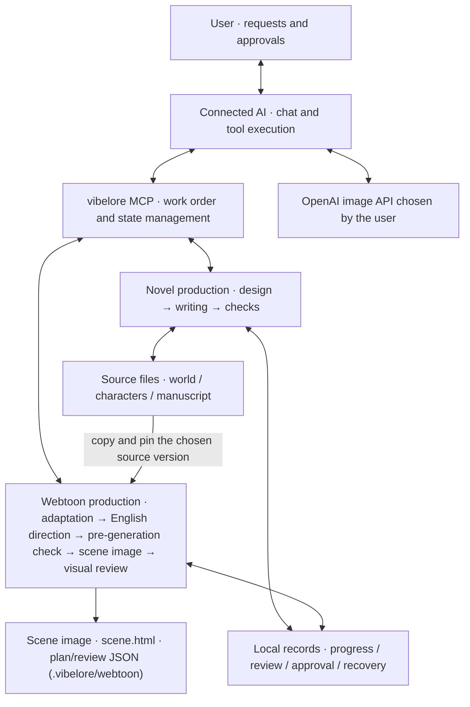
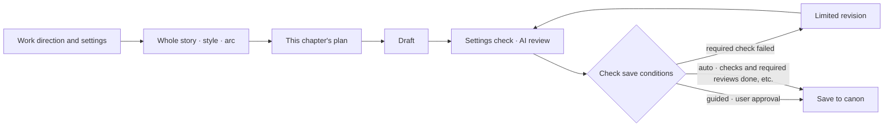
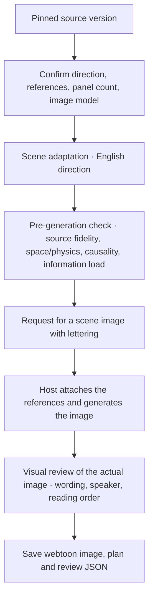
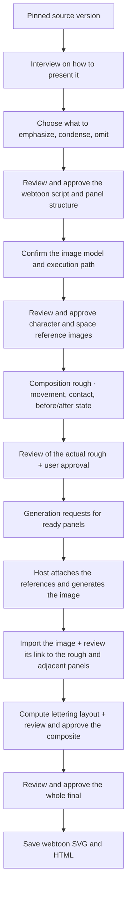
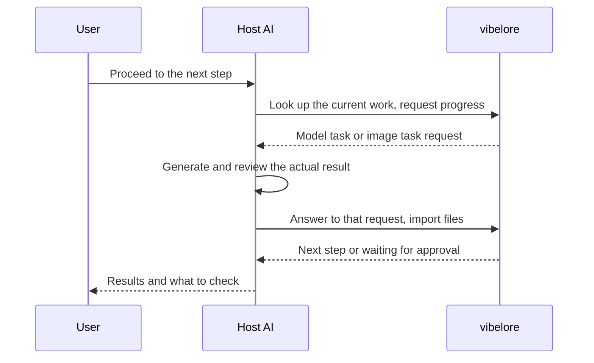

# Architecture — from request to storage

[한국어](ARCHITECTURE.md) | English

vibelore is a local MCP server that manages **production order, checks, approval and storage** between the AI and the work files.
You make requests and check results in the chat of the connected AI. The AI makes the text and images, and
vibelore records which source, settings and user choices the work was done with.

This document describes the structure of the novel writing and webtoon production currently provided.
For how to start see [Getting started](GETTING_STARTED.en.md); for webtoon usage see [Making a webtoon](WEBTOON.en.md).

## Overall structure



The one that calls the image generation tool is **the connected AI (the host)**. The vibelore server does not
run an image API itself. So even with MCP connected, if the host has no image capability,
the drawing steps cannot proceed.

| Component | Responsible for | Not responsible for |
|---|---|---|
| User | Choosing preferences, adaptation range and cost path; checking and approving results | Managing the tool call order or internal IDs |
| Host AI | Understanding requests, writing plan, manuscript and review answers, running image tools and viewing the actual results | Changing the model or billing path without user consent |
| vibelore | Passing on the source and choices, per-stage requests, format, reference and file checks, lettering, storing approval state and results | Generating text or images itself, or judging every semantic error |
| Work folder | Keeping the user-owned manuscript, settings, finished results and production records | Publishing automatically to external serial platforms |

Local storage is not the same as running the model locally. The manuscript and reference images needed for generation and review
can be sent to the model service the host is connected to. See [Security](../SECURITY.md).

## Novel writing structure

A new work first settles the experience to give readers, the world and characters, the whole story, the style, and the plan for the next few chapters.
Even if there seem to be many names, you only need to check what the AI presents and say the direction you want.



**Canon** is the manuscript and settings established for the work. Approved preferences and related material are passed
to the next writing request, and each newly written chapter is compared against the established facts.

- A failed required check is fixed, or saving stops.
- Review comments such as style or emotional pacing are left to the user's judgment.
- In `guided`, the default review mode, the manuscript and review results are shown before approval.
- Even in `auto`, if a required review fails the chapter is not treated as done; the manuscript is kept and goes back to waiting for approval.

Right before saving, it checks that the manuscript that was checked is the same as the one being saved. If the manuscript changed after the check,
or the settings changed during the work, the earlier check result is not reused.
Passing the checks does not guarantee the novel is enjoyable or that every settings contradiction is resolved.

## Webtoon production structure

A webtoon is a **separate work, approval and storage path** from novel writing. The chosen source manuscript,
world and character material, and the state at that chapter are pinned and used for the adaptation.
Because the current settings documents and the state of a past scene can differ, the AI judges together with that point's manuscript.

### Default path: whole scene (`lore_webtoon_scene`)

New webtoon work generates each whole scene as one image, dialogue included, without roughs or per-panel drawing.



If the pre-generation check or the visual review fails, the server uses the cause as feedback and designs, checks and generates again,
within the automatic redesign budget you set. A continuing scene inherits the previous
scene's actual image and review results through `previousWorkflowId`.

### Per-panel path (deprecated)

The rough-approval method that started with `lore_webtoon_plan`/`render`/`decide` is deprecated, and starting new work
on it is refused. The following applies only to per-panel work already started.



This is the flow of the default review mode. An existing work's valid model choice and reference images can be
reused. User approval of a new episode's roughs is required even when automatic progress is requested.

### Why adaptation and review are split (per-panel path · deprecated)

The interview skill asks for scene-by-scene production. It first builds the direction and scene assignment for the whole episode,
then passes the relevant source text and surrounding context in small batches of up to 6 panels. After the partial reviews, the overall flow
is reviewed separately. It is not a method that turns every source paragraph into a picture or fills 40 panels.

This split is a device to limit the size of the task given to the model. Whether a scene's causality and dialogue
actually feel natural is left to review and user checks.

### Continuity and parallel work (per-panel path · deprecated)

| Panel link | Image input | Execution order |
|---|---|---|
| New time or place | That scene's approved rough and character/space references | Runs when ready |
| A panel continuing the same action, seat or prop | Approved rough and references + the reviewed preceding image | Runs after the needed preceding image is reviewed |
| A panel showing the same event from another angle | Approved rough and references and the before/after state | Can run in parallel if there is no explicit preceding-image dependency |

The server separates runnable jobs from jobs waiting on a preceding job. It tells the host that up to 3 independent jobs
can be processed in parallel, but it does not run its own workers.
When one panel is finished, it can be imported and reviewed right away to open the next dependent panel.

Even when drawn with a new composition, a review of the link to the actual images before and after is needed. When an earlier image changes, the panels that
refer to it and their link reviews are checked again. Not every panel is redrawn unconditionally.

### Compositing art and lettering (per-panel path · deprecated)

The default path includes the dialogue and text in the image generation itself and checks wording, speaker and reading order in the visual review.
The separate lettering composite below exists only on the per-panel path.

Dialogue, inner thoughts, narration and sound effects are managed apart from the art. The host AI reads from the actual image the speaker position,
the point where a sound originates, and the areas that must not cover faces and action. From that, vibelore
computes the geometric conditions of font metrics, line breaks, overlap and balloon tails, and builds the SVG and HTML.

Text on objects such as signs and monitors is generated inside the image, and the wording actually read is compared with the planned
wording. This check uses what the AI read; it is not a separate OCR system.

**Checking coordinates is not the same as understanding the meaning of a scene.**
A wrongly assigned speaker or an unconvincing action cannot be corrected by code checks alone, so the actual composite
is looked at again. A self-review by the same AI is not treated as an independent reader evaluation.

## How work stops and resumes



Work steps and pending requests are stored locally. `needs_model`, which needs a model answer, is handled by the host;
user questions and approvals are handled by the user. Novel writing bundles requests that don't depend on each other (state extraction,
profile check, reviews) into one `needs_model`, so the host can answer them in parallel,
and the semantic continuity check that needs the extraction result comes in the next round trip. Work does not continue by itself while the app or server
is off. After reconnecting, look up the current work and continue it.

The generation service may have finished but been interrupted before the file was imported. On resume, check the result files and
the current request first, to avoid needlessly paying to generate the same image again.

## Files and storage boundaries

```text
work folder/
├── world/          source world settings
├── characters/     source character settings
├── chapters/       approved novel manuscript
├── summaries/      per-chapter summaries
├── webtoon/        approved direction, script, reference images, finished results of the per-panel path (deprecated)
└── .vibelore/      progress, candidates, checks, approval records, recovery data, scene webtoon results (webtoon/candidates/)
```

Approving a webtoon does not overwrite the novel's manuscript or established state. Rolling the novel back to an earlier point
is not a rollback of the webtoon episodes either. Webtoons already made stay separately together with their source
version.

If you edited the manuscript or settings by hand, ask the AI to check the changes and sync.
Don't edit `.vibelore/` directly. It holds review and approval records that cannot be recovered from the manuscript alone,
so back up **the whole work folder**, not just some manuscript files.

## Checking the structure in code

These are entry points for people checking the implementation or integrating a host.
You don't need to read them for normal use.

| Role | Implementation |
|---|---|
| MCP tools and the input/response boundary | [Server](../src/server.js) |
| Novel writing stages, review and approval | [Writing workflow](../src/tools/workflow.js) |
| Reading and saving the novel canon | [Canon reading](../src/core/canon-repository.js), [Publication unit](../src/core/publication-unit.js), [File store](../src/store/markdown-store.js) |
| Webtoon default path (whole scene) | [Webtoon scene tool](../src/tools/webtoon-scene.js), [Scene core](../src/core/webtoon-scene.js), [Webtoon store](../src/store/webtoon-store.js) |
| Webtoon per-panel path (deprecated) stages, approval and separate records | [Webtoon tool](../src/tools/webtoon.js), [Webtoon store](../src/store/webtoon-store.js) |
| Per-panel path scene split, composition, preceding-image dependencies | [Scene split](../src/core/webtoon-segments.js), [Rough approval](../src/core/webtoon-storyboard.js), [Continuity](../src/core/webtoon-continuity.js) |
| Per-panel path generation requests and lettering composite | [Image requests](../src/core/webtoon-images.js), [Text roles](../src/core/webtoon-text.js), [Lettering](../src/core/webtoon-lettering.js), [Final screen](../src/core/webtoon-board.js) |

Tool arguments are in the [MCP tool reference](TOOLS.en.md), the webtoon import and approval contract in the
[host execution contract](reference/WEBTOON_WORKFLOW.en.md), and failure handling in
[Troubleshooting and backups](TROUBLESHOOTING.en.md).
