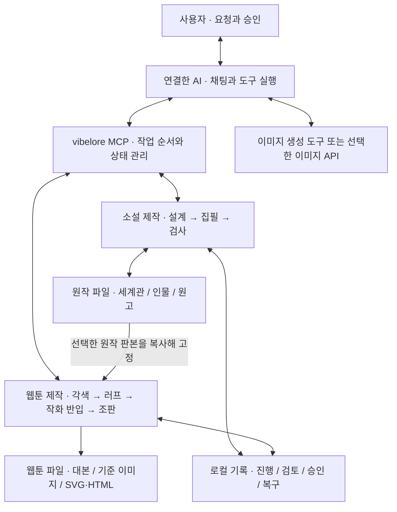
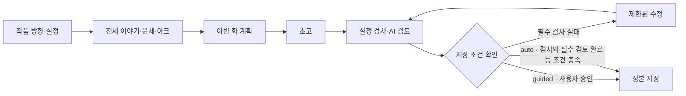
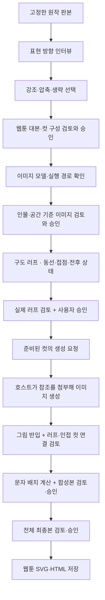
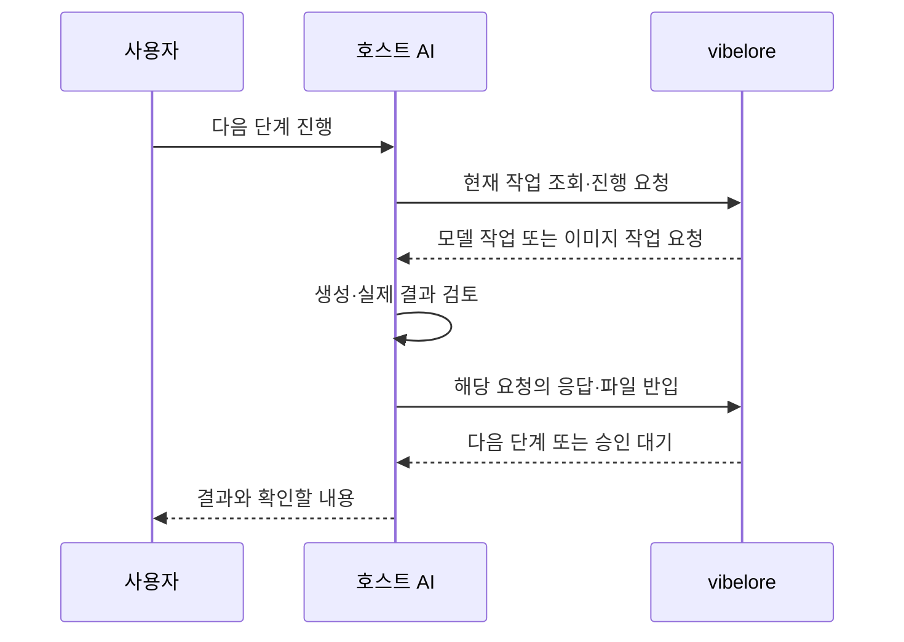

# 아키텍처 — 요청부터 저장까지

vibelore는 AI와 작품 파일 사이에서 **제작 순서, 검사, 승인과 저장**을 관리하는 로컬 MCP 서버입니다.
사용자는 연결한 AI의 채팅창에서 요청하고 결과를 확인합니다. AI가 글과 그림을 만들며,
vibelore는 어떤 원작·설정·사용자 선택으로 작업했는지를 기록합니다.

이 문서는 현재 제공하는 소설 집필과 웹툰 제작의 구조를 설명합니다.
시작 방법은 [시작 안내](GETTING_STARTED.md), 웹툰 사용법은 [웹툰 만들기](WEBTOON.md)를 보세요.

## 전체 구성



그림 생성 도구를 호출하는 주체는 **연결한 AI(호스트)**입니다. vibelore 서버가 이미지 API를
직접 실행하는 구조가 아닙니다. 따라서 MCP가 연결되어도 호스트에 이미지 기능이 없으면
작화 단계는 진행할 수 없습니다.

| 구성 요소 | 맡는 일 | 맡지 않는 일 |
|---|---|---|
| 사용자 | 취향·각색 범위·비용 경로 선택, 결과 확인과 승인 | 도구 호출 순서와 내부 ID를 직접 관리할 필요 없음 |
| 호스트 AI | 요청 이해, 계획·원고·검토 응답 작성, 이미지 도구 실행과 실제 결과 열람 | 사용자 동의 없이 모델·과금 경로 변경 |
| vibelore | 원작과 선택 전달, 단계별 요청, 형식·참조·파일 검사, 조판, 승인 상태와 결과 저장 | 스스로 글·그림을 생성하거나 모든 의미 오류를 판정 |
| 작품 폴더 | 사용자가 소유하는 원고·설정·완성본과 제작 기록 보관 | 외부 연재 플랫폼에 자동 게시 |

로컬 저장과 모델의 로컬 실행은 다릅니다. 생성·검토에 필요한 원고와 참조 이미지는
호스트가 연결한 모델 서비스에 전달할 수 있습니다. [보안 안내](../SECURITY.md)를 참고하세요.

## 소설 집필 구조

새 작품은 먼저 독자에게 줄 경험, 세계와 인물, 전체 이야기, 문체, 다음 몇 화의 계획을 정합니다.
이름이 많아 보여도 사용자는 AI가 제시하는 내용을 확인하고 원하는 방향을 말하면 됩니다.



**정본**은 작품에서 확정한 원고와 설정입니다. 승인한 취향과 관련 자료를 다음 집필 요청에
전달하며, 새로 쓰는 화를 확정된 사실과 대조합니다.

- 필수 검사 실패는 수정하거나 저장을 멈춥니다.
- 문체·감정 속도 같은 검토 의견은 사용자 판단에 남깁니다.
- 기본 검토 방식인 `guided`에서는 원고와 검토 결과를 보여준 뒤 승인받습니다.
- `auto`에서도 필수 검토가 실패하면 완료로 간주하지 않고 원고를 보존한 채 승인 대기로 돌립니다.

저장 직전에 검사한 원고와 지금 저장할 원고가 같은지 확인합니다. 검사 후 원고가 바뀌었거나
작업 중 설정이 변경됐다면 이전 검사 결과를 그대로 사용하지 않습니다.
검사 통과는 소설의 재미나 모든 설정 모순이 해결됐다는 보증은 아닙니다.

## 웹툰 제작 구조

웹툰은 소설 집필과 **별도의 작업·승인·저장 경로**입니다. 선택한 원작의 원고,
세계·인물 자료와 해당 화의 상태를 고정해 각색에 사용합니다.
현재 설정 문서와 과거 장면의 상태가 다를 수 있으므로 AI가 해당 시점의 원고와 함께 판단합니다.



기본 검토 모드의 흐름입니다. 기존 작품의 유효한 모델 선택과 기준 이미지는 재사용할 수
있습니다. 새 회차의 사용자 러프 승인은 자동 진행을 요청해도 필요합니다.

### 각색과 검토를 나누는 이유

인터뷰 스킬은 장면별 제작을 요청합니다. 먼저 회차 전체의 방향과 장면 배정을 만들고,
최대 6컷의 작은 묶음에 관련 원문과 앞뒤 문맥을 전달합니다. 부분 검토 후에는 전체 흐름을
별도로 검토합니다. 원작의 모든 문단을 그림으로 옮기거나 40컷을 채우는 방식이 아닙니다.

이 분할은 모델에게 전달하는 작업 크기를 제한하는 장치입니다. 장면의 인과와 대사가
실제로 자연스러운지는 검토와 사용자 확인에 남습니다.

### 연속성과 병렬 작업

| 컷 연결 | 이미지 입력 | 실행 순서 |
|---|---|---|
| 새 시간·장소 | 해당 장면의 승인 러프와 인물·공간 기준 | 준비되면 실행 |
| 같은 동작·좌석·소품을 이어가는 컷 | 승인 러프·기준 + 검토된 선행 그림 | 필요한 선행 그림 검토 후 실행 |
| 같은 사건을 다른 구도로 보여주는 컷 | 승인 러프·기준과 전후 상태 | 명시적 선행 이미지 의존성이 없으면 병렬 가능 |

서버는 실행 가능한 작업과 선행 작업을 기다리는 작업을 구분합니다. 호스트에 독립 작업을
최대 3개씩 병렬로 처리할 수 있다고 안내하지만, 자체 작업자를 실행하지는 않습니다.
한 컷이 완성되면 바로 반입·검토해 다음 의존 컷을 열 수 있습니다.

새 구도로 그려도 실제 앞뒤 이미지의 연결 검토는 필요합니다. 앞 그림이 바뀌면 그 그림을
참조하는 컷과 연결 검토를 다시 확인합니다. 모든 컷을 무조건 다시 그리지는 않습니다.

### 그림과 문자 합성

대사·속생각·설명·효과음은 그림과 분리해 관리합니다. 호스트 AI가 실제 그림에서 화자 위치,
소리 발생점, 얼굴과 동작을 가리지 않을 영역을 읽습니다. vibelore는 그 정보를 바탕으로
폰트 치수·줄바꿈·겹침·말풍선 꼬리의 기하 조건을 계산하고 SVG·HTML을 만듭니다.

간판·모니터 같은 사물의 글자는 그림 안에 생성하고, 실제로 읽힌 문구와 계획의 문구를
대조합니다. 이는 AI의 열람 결과를 사용하는 검사이며 별도 OCR 시스템은 아닙니다.

**좌표를 검사하는 것과 장면의 의미를 이해하는 것은 다릅니다.**
잘못 지정된 화자나 설득력 없는 동작을 코드 검사만으로 바로잡을 수 없어 실제 합성본을
다시 봅니다. 같은 AI의 자기검토를 독립 독자 평가로 간주하지 않습니다.

## 작업을 멈췄다가 이어가는 방식



작업 단계와 대기 요청은 로컬에 저장됩니다. 모델 응답이 필요한 `needs_model`은 호스트가,
사용자 질문과 승인은 사용자가 처리합니다. 앱이나 서버가 꺼진 동안 작업이 저절로 계속되는
것은 아닙니다. 다시 연결한 후 현재 작업을 조회해 이어갑니다.

생성 서비스에서는 완료됐지만 파일 반입 전에 중단됐을 수도 있습니다. 재개 시 결과 파일과
현재 요청을 먼저 확인해야 같은 그림을 불필요하게 다시 유료 생성하는 일을 줄일 수 있습니다.

## 파일과 저장 경계

```text
작품 폴더/
├── world/          원작 세계 설정
├── characters/     원작 인물 설정
├── chapters/       승인된 소설 원고
├── summaries/      화별 요약
├── webtoon/        승인한 웹툰 방향·대본·기준 이미지·완성본
└── .vibelore/      진행 상태·후보·검사·승인 기록·복구 자료
```

웹툰을 승인해도 소설의 원고와 확정 상태를 덮어쓰지 않습니다. 소설을 과거 시점으로
되돌리는 기능 역시 웹툰 회차를 되돌리는 기능이 아닙니다. 이미 만든 웹툰은 원작 판본과
함께 별도로 남습니다.

원고·설정을 손으로 수정했다면 AI에게 변경 사항 확인과 동기화를 요청하세요.
`.vibelore/`는 직접 수정하지 않습니다. 여기에는 원고만으로 복구할 수 없는 검토·승인
기록도 있으므로, 백업은 일부 원고 파일이 아닌 **작품 폴더 전체**를 대상으로 합니다.

## 코드에서 구조를 확인하려면

아래는 구현을 확인하거나 호스트를 연동하는 사람을 위한 진입점입니다.
일반 사용에는 읽지 않아도 됩니다.

| 역할 | 구현 |
|---|---|
| MCP 도구와 입력·응답 경계 | [서버](../src/server.js) |
| 소설 집필 단계·검토·승인 | [집필 워크플로](../src/tools/workflow.js) |
| 소설 정본 조회와 저장 | [정본 읽기](../src/core/canon-repository.js), [출판 단위](../src/core/publication-unit.js), [파일 저장소](../src/store/markdown-store.js) |
| 웹툰 단계·승인과 별도 기록 | [웹툰 도구](../src/tools/webtoon.js), [웹툰 저장소](../src/store/webtoon-store.js) |
| 장면 분할·구도·선행 이미지 의존성 | [장면 분할](../src/core/webtoon-segments.js), [러프 승인](../src/core/webtoon-storyboard.js), [연속성](../src/core/webtoon-continuity.js) |
| 생성 요청과 문자 합성 | [이미지 요청](../src/core/webtoon-images.js), [문자 역할](../src/core/webtoon-text.js), [조판](../src/core/webtoon-lettering.js), [최종 화면](../src/core/webtoon-board.js) |

도구 인자는 [MCP 도구 레퍼런스](TOOLS.md), 웹툰 반입·승인 계약은
[호스트 실행 규약](reference/WEBTOON_WORKFLOW.md), 장애 대응은
[문제 해결과 백업](TROUBLESHOOTING.md)에 있습니다.
