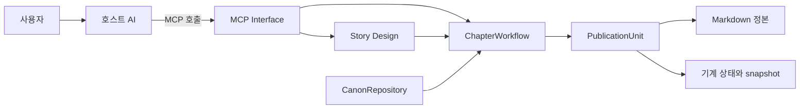
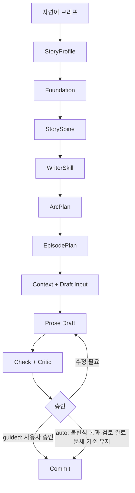
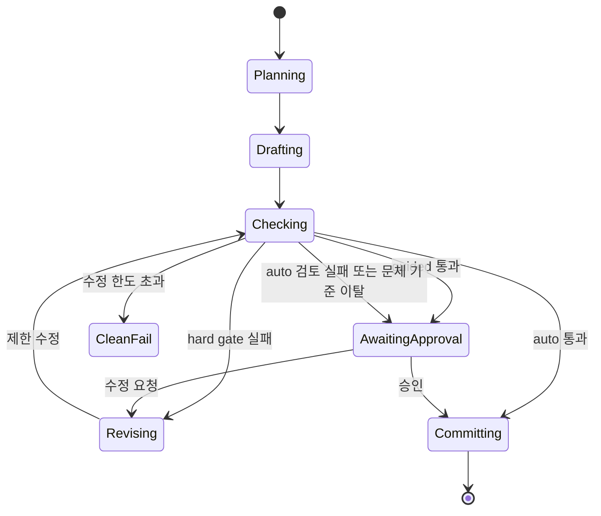
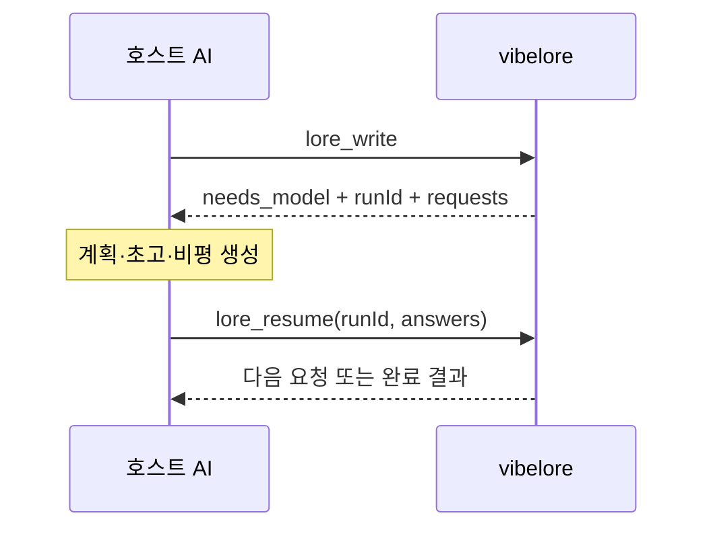
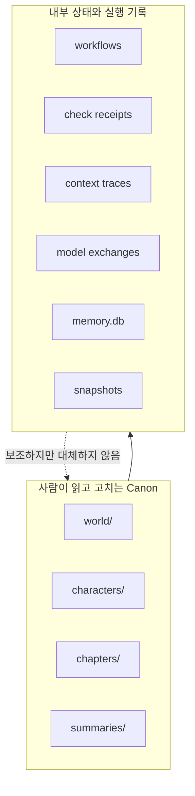
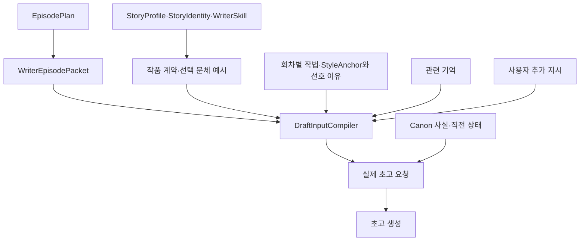
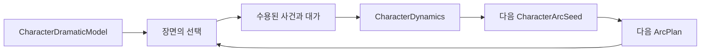
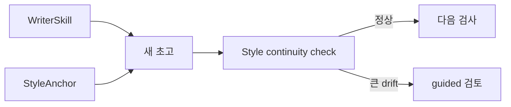
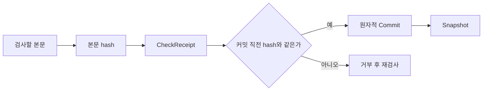
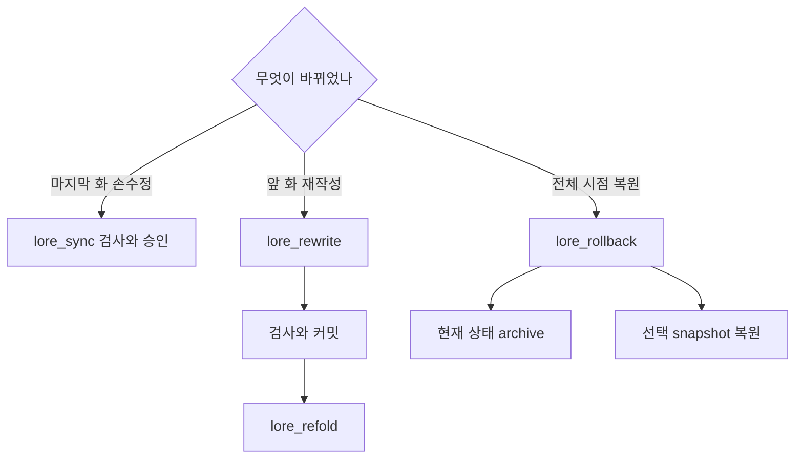

# vibelore 아키텍처

이 문서는 내부 클래스 전부를 나열하지 않습니다. 사용자의 요청이 어떻게 계획, 원고,
검사를 거쳐 안전한 정본이 되는지만 쉽게 설명합니다. 기술 용어는 실제 코드 이름을
그대로 쓰고, 처음 등장할 때 쉬운 뜻을 붙입니다.

## 10초 설명

vibelore를 잠금장치가 있는 집필 책상이라고 생각하면 됩니다.

- **Story Design**은 쓰기 전에 작품의 약속을 정하는 설계 노트입니다.
- **ChapterWorkflow**는 한 화를 순서대로 처리하는 작업 관리자입니다.
- **CanonRepository**는 지금 믿어야 할 원고와 설정만 읽어 주는 서고입니다.
- **PublicationUnit**은 검사된 결과만 한 번에 출판하는 잠금장치입니다.
- **MarkdownStateStore**는 사람이 읽는 파일과 내부 상태를 실제 디스크에 저장합니다.



사용자는 작은 **Interface**를 봅니다. 내부의 큰 **Module**이 순서와 상태를 처리합니다.
이것이 vibelore가 지향하는 “작은 Interface, 깊은 Module” 구조입니다.

## 전체 흐름

새 작품은 큰 약속부터 작은 장면으로 내려갑니다.



| 단계 | 쉬운 말 | 정확한 역할 |
|---|---|---|
| `StoryProfile` | 어떤 재미를 원하는가 | 장르, 톤, 속도, 난도, 보상과 경계를 담은 독서 계약 |
| `Foundation` | 무엇이 존재하는가 | 세계 사실, 초기 인물과 고정 속성 |
| `StorySpine` | 전체 이야기가 어디로 가는가 | 장기 인과, 핵심 결핍, 주요 전환과 종착점 |
| `WriterSkill` | 어떻게 읽히게 쓸 것인가 | 작품별 산문 원칙과 긍정 예시 |
| `ArcPlan` | 다음 묶음에서 무엇이 변하는가 | 3~20화 범위의 약속, 압력, 전환과 다음 상태 |
| `EpisodePlan` | 이번 화가 무엇을 해야 하는가 | 장면 2~4개의 입력 상태, 결정, 결과와 독자 기대 |
| `ChapterWorkflow` | 순서대로 한 화 만들기 | 계획부터 검사, 승인, 커밋까지 지속되는 상태기계 |

## 계획은 확대 단계다

계획 계층은 같은 내용을 다섯 번 반복하지 않습니다. 지도 앱에서 나라, 도시, 거리 순으로
확대하는 것과 같습니다.


- 상위 계층은 오래 유지되는 **약속**만 정합니다.
- 하위 계층은 바로 위 약속을 구체화하지만 새 장르나 새 결말을 발명하지 않습니다.
- `EpisodePlan`은 대사와 문장을 미리 쓰지 않습니다.
- 실제 장면 해결, 비유와 티키타카는 호스트 AI가 맡습니다.

이 경계가 있어야 계획이 품질을 돕되 모델의 창작 공간을 빼앗지 않습니다.

## 한 화가 만들어지는 과정

일반 사용자는 `lore_write` 하나를 호출합니다. 내부 `ChapterWorkflow`는 다음 상태를
순서대로 지나며, 현재 단계는 디스크에 저장됩니다.



프로세스가 중간에 끝나도 workflow 상태가 남기 때문에 처음부터 다시 추측하지 않습니다.
`lore_workflow_status`로 위치를 읽고 같은 실행을 이어갈 수 있습니다.

## 호스트 AI와 일을 나누는 방법

vibelore 자체에는 원격 생성 모델이 필수가 아닙니다. 판단이나 산문이 필요하면
`needs_model` 요청을 만들고, 이미 연결된 호스트 AI가 답합니다.



`runId`는 작업표 번호입니다. 답변이 여러 번 필요해도 같은 번호로 이어가므로 재시작과
모델 호출 경계가 분명합니다.

## 정본과 내부 상태

**Canon(정본)**은 “무엇이 사실인가”에 대한 최종 답입니다. 사람이 수정하는 Markdown이
정본이고, `.vibelore/`는 작업을 빠르고 안전하게 만드는 내부 상태입니다.

```text
my-novel/
├── world/          세계 정본
├── characters/     인물 정본
├── chapters/       본문 정본
├── summaries/      화별 요약
└── .vibelore/      workflow, receipt, trace, model-exchanges, index, snapshot
```



`CanonRepository`는 현재 출판된 `HEAD`를 기준으로 일관된 읽기 화면을 제공합니다.
생성 도중 파일이 바뀌면 예전 입력으로 만든 결과를 커밋하지 않습니다.

검색용 파생 상태와 달리 실제 모델 요청·응답은 정본만으로 재생성할 수 없는 실행 기록입니다.
`.vibelore/` 전체를 버려도 모든 감사 근거가 복구되는 것은 아닙니다.

## 초고가 받는 입력

`DraftInputCompiler`는 여러 자료를 한 번에 던지는 대신 권한과 토큰 예산에 따라 정리합니다.



필수 계획과 정본은 빠질 수 없습니다. 예산이 부족하면 선택 기억과 직전 장면 조각처럼
권한이 낮은 입력부터 제외합니다. 어떤 자료가 들어가고 빠졌는지는 `context trace`에 남습니다.

`compileDraftContract`는 승인된 독자 약속·톤·인물 표현·집필 방향을 실제 초고 입력으로
만듭니다. 문체 예시는 회차 관련도와 예산에 따라 최대 두 개를 선택하며, 핵심 계약을
말없이 잘라 내지 않습니다. 입력 예산을 초과하면 `CONTEXT_BUDGET_EXCEEDED`로 알립니다.
선택 근거와 계약 식별값은 `draft_context_supplied.draftContract`에 남깁니다.

현재 production Context는 정본에서 재구축한 `memory.db`를 사용합니다. 검색 기억은 빠른
회상을 돕는 파생 자료이며, 충돌이 생기면 언제나 정본 Markdown과 확정 상태를 우선합니다.

## 인물은 미래 각본이 아니라 누적 상태다

초기 인물은 가치 우선순위, 행동 편향, 인식의 사각지대, 압박 시 방어, 관계별 말투 같은
`CharacterDramaticModel`을 가집니다. 이것은 인물을 한 문장 성격표로 고정하기 위한 것이
아니라, 장면에서 선택이 일관되게 출발하도록 하는 기준점입니다.



본문에 실제로 쓰이고 승인된 변화만 `CharacterDynamics`에 접힙니다. 다음 아크는 이 누적
결과에서 압력을 가져오므로, 과거 사건이 현재 행동에 남습니다. 아직 일어나지 않은 미래를
인물 전기로 미리 확정하지는 않습니다.

## 문체 일관성

`WriterSkill`은 작품의 기본 작법이고, `StyleAnchor`는 사용자가 마음에 든 정본 1~3화에서
승인한 실제 문체 기준입니다.
승인 시 지정한 `reason`도 정본 예시와 함께 전달하며, 선호 이유를 새로운 정본 불변식으로
승격하지 않습니다.



갑작스러운 시점, 문단 리듬 또는 서술 밀도 변화가 감지되면 `auto` 원고를 억지로 다시
쓰지 않고 `guided` 검토로 내립니다. 수정은 원문 전체를 갈아엎는 대신 제한된 문단 패치로
처리해 이미 좋은 부분을 보존합니다.

## 검사와 커밋 잠금

원고에 대한 지적은 다음처럼 구분합니다. 검토 실행 자체의 완료·실패는 별도로 기록합니다.

| 종류 | 예 | 처리 |
|---|---|---|
| 결정론적 `hard invariant` | 정본 충돌, 분량 하한, 본문 hash 불일치 | 반드시 통과해야 커밋 |
| 모델 기반 `soft advisory` | 문체, 밀도, 감정 속도, 대사 자연스러움 | 근거를 보여주고 작가 판단 보존 |



`CheckReceipt`는 “이 본문을 이 정본 상태에서 검사했다”는 영수증입니다. 검사 뒤 한 글자라도
바뀌면 영수증을 재사용할 수 없습니다. `PublicationUnit`은 정본 파일, 기계 상태와 snapshot을
하나의 출판 단위로 처리합니다.

## 검토 기록과 실행 출처

critic 검토 묶음은 논리·편집·인물·독자 경험·패턴 및 필요한 아크 검토를 기존 workflow 안에서
수행합니다. 편집 요청에는 현재 계획 대신 직전 요약을 제공하고, 독자 경험 요청에는 승인된
작품 계약을 제공합니다. 요청을 나눈 사실만으로 평가 문맥이 독립되는 것은 아닙니다.

`createReviewAudit`는 실제 검토 요청을 원고·계약 해시에 연결하고 원본 findings, 응답,
출처와 완료·실패를 보존합니다. 높은 총점에도 지적은 남고, 빈 응답·잘못된 형식·실행 실패는
정상 통과로 대체하지 않습니다. 필수 검토가 완료되지 않은 `auto`는 같은 원고를 승인 대기로
전환하며, 이후 명시적 승인도 실패 이력을 지우지 않습니다.

실제 초고·검토 요청과 응답은 `.vibelore/model-exchanges/`에 저장합니다.
`lore_workflow_history(includeModelExchanges=true)`로 조회한 이벤트에 연결된 전문을 읽습니다.
`runtime_identified`는 패키지 버전과 가능한 Git 커밋, 서버 프로세스 첫 사용 시 설치 소스의
해시를 기록합니다. 실행 중 소스를 바꾸면 서버를 재시작해야 새 식별값이 적용됩니다.

호스트 relay의 문맥 격리는 `unverified`입니다. 로컬 모델 어댑터는 요청 메시지만 전달한
사실을 기록하지만, 별도 모델이나 독립 독자의 평가를 보장하지 않습니다.

## 손수정과 복구



앞 화가 바뀌면 뒤 화 파일만 남겨 두어서는 내부 인과 상태가 맞지 않습니다. `lore_refold`가
변경 지점부터 요약, 인물 상태와 복선을 다시 접습니다. 전체를 과거로 돌릴 때는 rollback이
현재 상태를 archive한 뒤 snapshot을 복원합니다.

## 공개 도구와 고급 도구

기본 MCP 표면은 작품 설계, 통합 집필, 승인과 복구에 필요한 26개 도구입니다.
`VIBELORE_MCP_SURFACE=advanced`를 설정한 개발 환경에서만 단계별 원시 도구를 포함한
39개가 보입니다.

이 **Seam(경계)** 덕분에 일반 사용자는 올바른 순서를 외우지 않아도 되고, 개발자는
문제가 생긴 단계만 검사할 수 있습니다. 상세 목록은 [TOOLS.md](TOOLS.md), 장애 대응은
[OPERATIONS.md](OPERATIONS.md), 이 구조의 판단 기준은 [PHILOSOPHY.md](PHILOSOPHY.md)에 있습니다.
