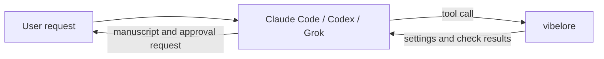

# Getting started

[한국어](GETTING_STARTED.md) | English

vibelore is not an app you open on its own. You attach it to the AI coding tool you already use
(Claude Code, Codex, Grok CLI). When you say "write the next chapter" in the chat, the AI calls
vibelore to check the settings and runs the checks while it writes the novel.



## 1. Installation

You need Node.js 22.13 or later (22.x), 24.x or 26.x, and one AI coding tool.
There is no `npm install` and no build step.

Give the AI tool the repository address and ask it to register the server.

> Clone https://github.com/fbwndrud/vibelore and register it as an MCP server.

When registration is done, restart the AI tool once. Then check the connection.

> Check that the vibelore tools are connected. Don't create a work yet.

If the tools are visible, you are ready. If not, see [Connection problems](TROUBLESHOOTING.en.md#i-cant-see-the-tools).

<details>
<summary>To register with npm</summary>

This runs the server from the npm package `vibelore` without the repository. Only the command changes; the rest of the setup is the same as below.

```bash
claude mcp add-json vibelore '{"command":"npx","args":["-y","vibelore"]}' --scope project
```

For Codex use `command = "npx"`, `args = ["-y", "vibelore"]`; for Grok CLI use `grok mcp add vibelore -- npx -y vibelore`.
On Windows, put `cmd /c` in front of `npx` (`"command":"cmd","args":["/c","npx","-y","vibelore"]`).
This method registers only the MCP server, so install the interview skills with the repository method or the Codex plugin.
</details>

<details>
<summary>To clone the repository and register it yourself</summary>

```bash
git clone https://github.com/fbwndrud/vibelore.git /absolute/path/to/vibelore
node --version
```

**Claude Code**

```bash
claude mcp add-json vibelore \
  '{"command":"node","args":["/absolute/path/to/vibelore/src/server.js"]}' \
  --scope project
```

**Codex** (`~/.codex/config.toml` or the project's `.codex/config.toml`)

```toml
[mcp_servers.vibelore]
command = "node"
args = ["/absolute/path/to/vibelore/src/server.js"]
startup_timeout_sec = 30
tool_timeout_sec = 6000
required = true
```

For the meaning of the Codex settings keys, see the [OpenAI configuration reference](https://learn.chatgpt.com/docs/config-file/config-reference).

**Grok CLI**

```bash
grok mcp add vibelore -- node /absolute/path/to/vibelore/src/server.js
```

Per-host check commands and verified versions are in [HOSTS.en.md](../HOSTS.en.md).
</details>

If you register only the MCP server, the interview skills may not load automatically. In that case, add
this line to your request.

> Read AGENTS.md in the vibelore install folder and the interview skill that fits this task, then proceed.

## 2. Create a new work

Describe the story you want to write in a sentence or two.

> I want to start a new novel. It's a modern fantasy about a late-night bus driver who listens to passengers' regrets. Start with the story interview, and finalize the plan only after I check it.

The AI may ask for a folder to store the work and a short work name. The work name is an English
identifier used later to tell several works apart.

The AI asks about the preferences you haven't settled yet and prepares the following.

| What it prepares | What you decide |
|---|---|
| Direction of the work | Which readers, and what kind of fun, mood and pace to offer them |
| World and characters | The rules of the story, the personalities and relationships of the main characters |
| The whole story | The core conflict, the big turns, the ending |
| Style | Narrative distance, sentence rhythm, the feel of dialogue and exposition |
| The first arc | What happens and changes over the next few chapters |

The interview can run for several rounds. Look at the result and answer "approve" or say what to change.
If you want to leave everything to the AI, say "decide automatically without asking and proceed".

## 3. Write the next chapter

> Write the next chapter. Show me the manuscript and the review notes, and save it when I approve.

The AI goes through this chapter's plan → draft → settings check and review → any needed fixes, then shows you the manuscript.
If you edited files by hand, it checks those first.

- **Save after checking:** read the manuscript and the review notes, then say "approve" or describe what to change.
- **Save automatically:** if you say "proceed automatically", a manuscript that passes the checks and review is saved right away.
  If the review fails, nothing is saved; the manuscript is kept and you are asked to check it.

Comments about style or emotional pacing are advisory. A comment does not mean an intended expression is
always changed. Passing the checks does not mean there are no problems at all, either.

When you have a chapter you like, you can make it the style reference.

> Use chapters 1-3 as the style reference from now on. I like how it observes the characters up close and explains even hard settings briefly.

Manuscripts are saved in the work folder's `chapters/`, settings in `world/` and `characters/`. If you
edited files directly, say "check the changes" before writing the next chapter.

## 4. When work stops midway, or you want the reasoning

Work is saved, so you don't have to start over.

> Check the work that just stopped and continue it.

To see why it was written this way:

> Show me which style reference was passed for this chapter and what the review found.

A result written and reviewed by the same AI is a self-review, not an independent reader evaluation. For failures, hand edits and backups,
see [Troubleshooting](TROUBLESHOOTING.en.md).

## 5. Continue a novel you already wrote

Back up the originals first, and ask the AI to read the work instead of creating a new one.

> I want to continue the novel in `/absolute/path/to/existing-novel`. Don't overwrite the existing files; check the settings and manuscript structure and tell me only the preparation that's needed. Don't write any prose yet.

A work organized as `world/`, `characters/`, `chapters/` continues as it is. Documents in other formats are
not converted to this structure automatically, so decide first how much to reorganize.

## 6. Make it a webtoon

> Make chapter 1 into a webtoon. Ask me about the art style and lettering first, and draw each scene as one image, dialogue included.

You need an AI tool that can make and view images. The image model and cost are confirmed with you first,
and the novel and the webtoon are saved separately. The finished result is a tall vertical SVG and HTML.

For the detailed steps, see [Making a webtoon](WEBTOON.en.md).

## Next documents

- [Architecture](ARCHITECTURE.en.md): how the AI, vibelore and the work files connect
- [Model settings](MODELS.en.md): the model that writes and the model that draws
- [Troubleshooting and backups](TROUBLESHOOTING.en.md): stops, hand edits, rollbacks
- [Documentation map](README.en.md): user guides and detailed technical references
