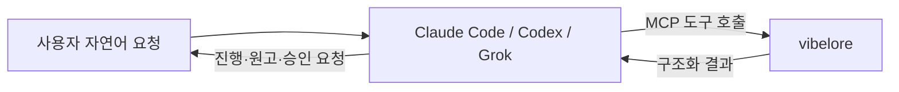

# 시작 안내

## 실제 사용 방식

vibelore는 채팅 앱이 아니라 로컬 MCP 서버입니다.



사용자는 보통 `tools/call` JSON을 직접 작성하지 않습니다. 호스트에 서버를 한 번 등록하고
“이 작품 다음 화를 써 줘”라고 요청합니다. JSON-RPC 예시는 서버 개발과 진단용입니다.

## 1. 요구 사항

- Node.js 22.13.0 이상인 22.x 또는 24.x LTS
- Claude Code, Codex CLI/앱 또는 Grok CLI 중 하나
- 작품 하나당 별도 디렉터리 권장

```bash
git clone https://github.com/fbwndrud/vibelore.git /absolute/path/to/vibelore
node --version
```

`npm install`은 필요하지 않습니다. 기본 소설 집필은 별도 API 키 없이 호스트 모델을 쓰며,
웹툰 이미지의 API 실행을 선택하면 호스트 환경에 별도 키와 과금 설정이 필요합니다.

## 2. MCP 등록

### Codex

`~/.codex/config.toml` 또는 프로젝트의 `.codex/config.toml`:

```toml
[mcp_servers.vibelore]
command = "node"
args = ["/absolute/path/to/vibelore/src/server.js"]
startup_timeout_sec = 30
tool_timeout_sec = 6000
required = true
```

`command`는 stdio 서버 실행 명령, `cwd`는 선택적인 서버 작업 디렉터리입니다. 작품 경로는
각 도구의 `project`에 절대 경로로 전달하므로 `cwd`에 의존하지 않는 편이 안전합니다.
Codex 설정 키의 현재 의미는 [공식 OpenAI 설정 레퍼런스](https://learn.chatgpt.com/docs/config-file/config-reference)에서 확인할 수 있습니다.

### Claude Code

```bash
claude mcp add-json vibelore \
  '{"command":"node","args":["/absolute/path/to/vibelore/src/server.js"]}' \
  --scope project
```

### Grok CLI

```bash
grok mcp add vibelore -- node /absolute/path/to/vibelore/src/server.js
```

호스트별 확인 명령과 검증 버전은 [HOSTS.md](../HOSTS.md)에 있습니다.

## 3. 연결 확인

새 호스트 세션을 연 뒤 다음처럼 요청합니다.

> vibelore 도구가 연결됐는지 확인해 줘. 아직 작품은 만들지 마.

도구가 보이면 사용할 준비가 된 것입니다. 보이지 않으면
[연결 문제 해결](TROUBLESHOOTING.md#도구가-보이지-않아요)을 확인하세요.

MCP 서버만 등록한 경우 인터뷰 스킬이 자동으로 로드되지 않을 수 있습니다.
작품 폴더와 **vibelore 설치 폴더**를 구분하고, 필요하면 다음 요청을 덧붙이세요.

> vibelore 설치 폴더의 AGENTS.md와 이번 작업에 해당하는 인터뷰 스킬을 읽고 진행해.

## 4. 새 작품 만들기

작품을 저장할 폴더와 작품 ID를 정해 요청합니다. 작품 ID는 다음 화를 요청할 때도 사용하는
짧은 이름입니다. 아래 경로와 `night_bus`를 원하는 값으로 바꾸세요.

> `/absolute/path/to/my-novel`에 작품 ID `night_bus`로 새 장편을 만들고 싶어. 심야버스 기사가 승객의 후회를 듣는 현대 판타지야. 작품 발견 인터뷰부터 진행하고, 계획은 내가 확인한 뒤 확정해 줘.

AI는 아이디어에서 아직 정하지 않은 취향을 묻고 다음 자료를 준비합니다.

| 확인할 자료 | 사용자가 정할 것 |
|---|---|
| 작품 방향 | 어떤 독자에게 어떤 재미·톤·속도로 보여줄지 |
| 세계와 인물 | 이야기의 규칙, 주요 인물의 성격과 관계 |
| 전체 이야기 | 핵심 갈등, 큰 전환, 이야기의 도착점 |
| 문체 방향 | 서술 거리, 문장 리듬, 대사와 설명의 느낌 |
| 첫 아크 | 다음 몇 화에서 무엇이 일어나고 변할지 |

인터뷰가 여러 라운드 이어질 수 있습니다. 이미 정한 내용은 알려주고, 제시된 결과에
“승인” 또는 구체적인 수정 방향으로 답하세요. 소설 설계를 맡기려면 “자동으로 정해서 진행해”라고
명시할 수 있습니다. 웹툰의 필수 선택과 러프 승인 규칙은 [별도 안내](WEBTOON.md)를 따릅니다.

## 5. 다음 화 쓰기

> `/absolute/path/to/my-novel`의 `night_bus` 다음 화를 써 줘. 원고와 검토 의견을 보여주고 내 승인 후 저장해 줘.

AI가 필요한 계획과 정본 상태를 확인한 뒤, 화별 계획 → 초고 → 검사·검토 → 필요한 수정 →
승인 대기까지 진행합니다. 설계가 덜 됐거나 직접 고친 파일이 있다면 그 부분을 먼저 확인합니다.

- **확인 후 저장 (`guided`):** 원고와 검토 의견을 읽고 승인하거나 수정 방향을 말합니다.
- **자동 저장 (`auto`):** 자동 진행을 요청하면 검사·필수 검토 등 저장 조건을 충족한 원고를 확정합니다.
  검토가 실패하면 완료로 처리하지 않고 원고를 보존한 채 확인을 요청합니다.

문체나 감정 속도에 대한 지적은 참고 의견입니다. 지적이 있다는 이유만으로 의도한 표현을
무조건 고치지는 않습니다. 반대로 검사를 통과했다고 모든 설정·대사 문제가 해결됐다는 뜻도 아닙니다.

마음에 든 회차가 생기면:

> 승인된 1~3화를 앞으로의 문체 기준으로 삼아 줘. 인물 가까이에서 관찰하고 어려운 설정도 짧게 설명하는 방식이 좋아.

원고는 작품 폴더의 `chapters/`, 설정은 `world/`와 `characters/`에 저장합니다.
파일을 직접 수정했다면 다음 집필 전에 변경 사항 확인과 동기화를 요청하세요.

## 6. 중간에 멈췄거나 근거가 궁금할 때

`needs_model`은 보통 AI가 처리할 중간 요청입니다. 사용자가 JSON 응답을 작성할 필요는 없습니다.

> 방금 멈춘 작업 상태를 확인하고, 아직 답하지 않은 모델 요청부터 같은 작업에서 이어가 줘.

검토 이유를 확인하려면:

> 이번 화에 어떤 취향과 문체 기준이 전달됐고, 검토에서 무엇을 발견했는지 보여 줘.

실제 생성·검토 요청 기록을 조회할 수 있습니다. 같은 AI가 작성하고 검토한 결과는 자기검토이며
별도의 독립 독자 평가가 아닙니다. 실패·손수정·백업은 [문제 해결](TROUBLESHOOTING.md)을 보세요.

## 7. 이미 있는 작품 이어받기

기존 자료를 먼저 백업하고, 새 작품 생성 대신 현재 파일을 읽어 달라고 요청하세요.

> `/absolute/path/to/existing-novel`의 소설을 작품 ID `old_work`로 이어받고 싶어. 기존 파일을 덮어쓰지 말고, 설정과 원고 구조를 확인해서 필요한 초기화와 빠진 설계 단계만 안내해 줘. 아직 본문은 쓰지 마.

`world/`, `characters/`, `chapters/` 형식의 기존 작품은 상태를 확인해 이어갑니다.
임의의 문서나 텍스트 파일이 이 구조로 자동 변환되는 것은 아닙니다. 원본을 보존한 채
vibelore 작품으로 정리할 범위를 먼저 확인하세요.

## 8. 기존 작품 웹툰화

> `/absolute/path/to/my-novel`의 `night_bus` 원작 1화를 웹툰 1화로 만들어 줘. 작화·문자 표현을 먼저 물어보고, 구도 러프를 보여준 뒤 본 작화로 진행해.

이미지 생성·열람 기능을 갖춘 호스트가 필요합니다. 모델과 실행 경로·비용은 먼저 확인하며,
원작과 웹툰은 별도로 저장합니다. 완성 출력은 세로형 SVG·HTML입니다.

[웹툰 만들기](WEBTOON.md)에서 준비물, 단계별 확인 사항, 수정 방법과 완성본 위치를 확인하세요.

## 9. 다음 문서

- [아키텍처](ARCHITECTURE.md): AI·vibelore·작품 파일이 연결되는 방식
- [모델 설정](MODELS.md): 텍스트 모델과 이미지 모델의 차이
- [문제 해결과 백업](TROUBLESHOOTING.md): 중단·손수정·복구
- [문서 목차](README.md): 사용 안내와 상세 기술 참조
