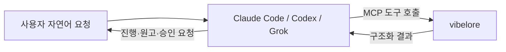
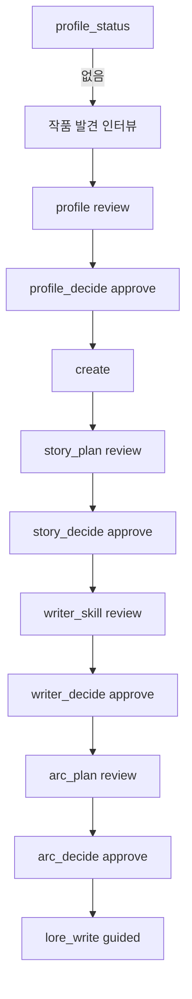
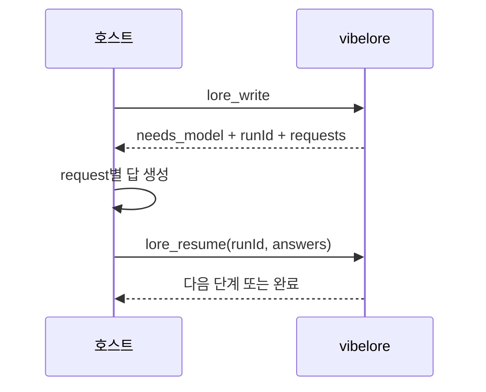

# 시작 안내

## 실제 사용 방식

vibelore는 채팅 앱이 아니라 로컬 MCP 서버입니다.



사용자는 보통 `tools/call` JSON을 직접 작성하지 않습니다. 호스트에 서버를 한 번 등록하고
“이 작품 다음 화를 써 줘”라고 요청합니다. JSON-RPC 예시는 서버 개발과 진단용입니다.

## 1. 요구 사항

- Node.js 22.13.0 이상인 22.x 또는 24.x LTS
- Claude Code, Codex CLI/앱 또는 Grok CLI 중 하나
- 작품 하나당 별도 디렉터리 권장

```bash
git clone <repository-url> /absolute/path/to/vibelore
node --version
```

`npm install`과 별도 API 키는 필요하지 않습니다.

## 2. MCP 등록

### Codex

`~/.codex/config.toml` 또는 프로젝트의 `.codex/config.toml`:

```toml
[mcp_servers.vibelore]
command = "node"
args = ["/absolute/path/to/vibelore/src/server.js"]
startup_timeout_sec = 30
tool_timeout_sec = 6000
required = true
```

`command`는 stdio 서버 실행 명령, `cwd`는 선택적인 서버 작업 디렉터리입니다. 작품 경로는
각 도구의 `project`에 절대 경로로 전달하므로 `cwd`에 의존하지 않는 편이 안전합니다.
Codex 설정 키의 현재 의미는 [공식 OpenAI 설정 레퍼런스](https://learn.chatgpt.com/docs/config-file/config-reference)에서 확인할 수 있습니다.

### Claude Code

```bash
claude mcp add-json vibelore \
  '{"command":"node","args":["/absolute/path/to/vibelore/src/server.js"]}' \
  --scope project
```

### Grok CLI

```bash
grok mcp add vibelore -- node /absolute/path/to/vibelore/src/server.js
```

호스트별 확인 명령과 검증 버전은 [HOSTS.md](../HOSTS.md)에 있습니다.

## 3. 연결 확인

새 호스트 세션을 연 뒤 다음처럼 요청합니다.

> vibelore의 `lore_profile_status`로 `/absolute/path/to/my-novel`의 `night_bus` 상태를 확인해.

프로젝트가 아직 없다면 “프로필이 없음” 또는 초기화 전 상태가 나오는 것이 정상입니다.
도구 자체가 보이지 않으면 [운영과 복구](OPERATIONS.md#연결-문제)를 확인합니다.

## 4. 새 작품 만들기

자유 장르의 권장 순서입니다.



호스트에 보낼 요청 예시:

> `/absolute/path/to/my-novel`에 workId `night_bus`로 새 장편을 만들고 싶어. 심야버스 기사가 승객의 후회를 듣는 현대 판타지야. 작품 발견 인터뷰부터 진행하고, StoryProfile, StorySpine, WriterSkill, 첫 아크를 각각 review로 보여 줘.

인터뷰는 보통 한 번에 4~5개의 관련 질문을 묻습니다. 짧은 아이디어라면 여러 라운드가
이어질 수 있으며, 이미 충분히 정한 내용은 반복해 묻지 않습니다. 각 승인 단계에서 내용을
읽고 “승인” 또는 수정 방향을 말합니다. 모든 판단을 맡기려면 처음부터
“전부 auto로, 묻지 말고”라고 명시합니다.

## 5. 다음 화 쓰기

호스트 요청:

> `/absolute/path/to/my-novel`, workId `night_bus`의 다음 화를 `autonomy=guided`로 써 줘.

호스트는 먼저 `lore_arc_status`로 활성 아크를 확인합니다. 아크가 없으면 계획과 승인을
먼저 진행합니다. `lore_status`가 정본 손수정을 감지했다면 `lore_sync`를 먼저 처리합니다.
준비가 끝나면 `lore_write`에 다음 인자를 전달합니다.

```json
{
  "project": "/absolute/path/to/my-novel",
  "workId": "night_bus",
  "autonomy": "guided"
}
```

`guided`는 검사 완료 원고를 보여 준 뒤 승인받습니다. 승인하면 호스트가
`lore_decide(action="approve")`를 호출합니다. 수정이 필요하면
`lore_decide(action="request_revision", feedback="...")`로 같은 workflow를 이어갑니다.
`auto`는 불변식 검사를 통과하고 critic 검토 묶음이 정상 완료된 경우에만 자동 커밋합니다.
검토가 실패하거나 응답이 불완전하면 원고를 보존하고 `CRITIC_INCOMPLETE`와 함께 승인 대기로
전환합니다. 문체·밀도 같은 advisory만으로 자동 재작성하지 않습니다.

승인된 작품의 취향과 문체 방향은 이후 초고 요청에 전달됩니다. 마음에 든 정본이 생기면
다음처럼 문체 기준과 선호 이유를 함께 지정할 수 있습니다.

> 정본 1~3화를 문체 기준으로 승인해. 인물 가까이에서 관찰하고, 어려운 설정도 짧고 쉽게 설명하는 방식이 마음에 들어.

호스트는 `lore_style_anchor(action="approve", chapters=[1,2,3], reason="...")`를 사용합니다.
아직 승인하지 않은 수정 후보를 정본 문체 기준으로 간주하지 않습니다.

## 6. `needs_model`이 나오면

호스트가 정상적으로 처리해야 하는 중간 상태입니다.



사용자는 보통 개입할 필요가 없습니다. 호스트가 멈췄다면 다음처럼 말합니다.

> 방금 받은 `needs_model` 요청들에 답하고 같은 `runId`로 `lore_resume`해.

호스트는 각 요청의 실제 원고와 근거를 읽고 해당 request ID에 답합니다. 미리 준비한 점수를
단계 이름에 맞춰 넣지 않습니다. 같은 호스트의 작성·검토는 자기검토이며 독립 독자 평가가 아닙니다.

### 검토 근거 확인하기

> 이번 화에 어떤 취향과 문체가 전달됐고, 검토에서 무엇을 발견했는지 보여 줘. 필요하면 실제 요청·응답도 확인해.

호스트는 `lore_workflow_history`를 조회하고, 전문이 필요할 때
`includeModelExchanges=true`를 사용합니다. 기록은 로컬에 보관하며 자동 외부 공개하지 않습니다.
상세 조회 방법은 [검토 응답과 감사](OPERATIONS.md#검토-응답과-감사)에 있습니다.

## 7. 이미 있는 작품 이어받기

기존 `world/`, `characters/`, `chapters/`가 있는 디렉터리는 덮어쓰지 않습니다.

> `/absolute/path/to/existing-novel`을 workId `old_work`로 이어받아. 먼저 `lore_status`와 각 설계 status를 읽어. 초기화되지 않았다면 작품에 맞는 지원 genre로 `lore_init`하고, 누락된 설계 단계만 확인해. 본문은 쓰지 마.

상태 확인 후 Profile → Spine → WriterSkill → Arc 중 없는 단계만 만듭니다.

## 8. 다음 문서

- 모든 도구 인자: [TOOLS.md](TOOLS.md)
- 실패와 복구: [OPERATIONS.md](OPERATIONS.md)
- 왜 이 순서가 필요한지: [ARCHITECTURE.md](ARCHITECTURE.md)
