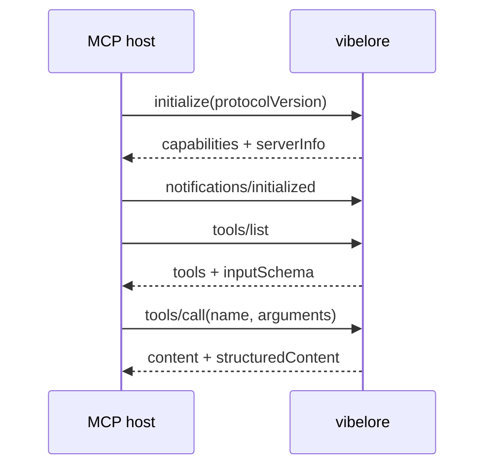
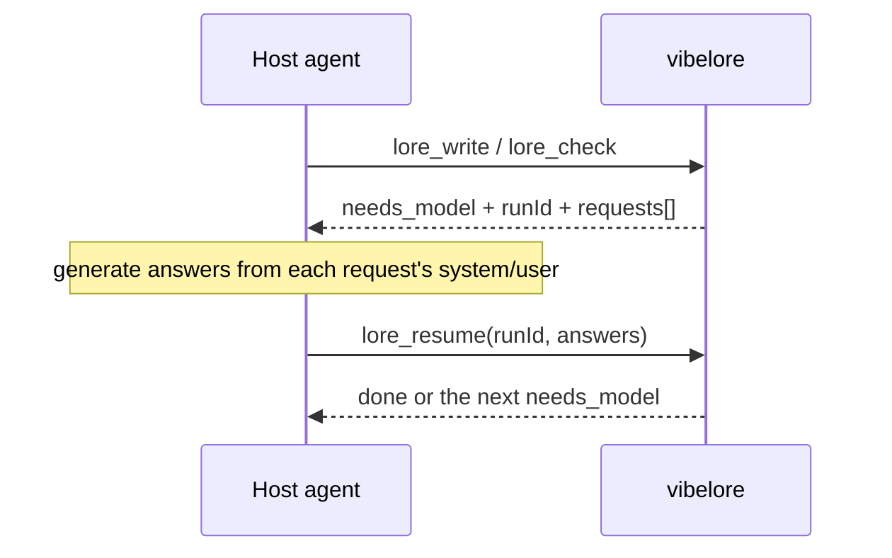
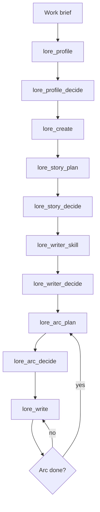
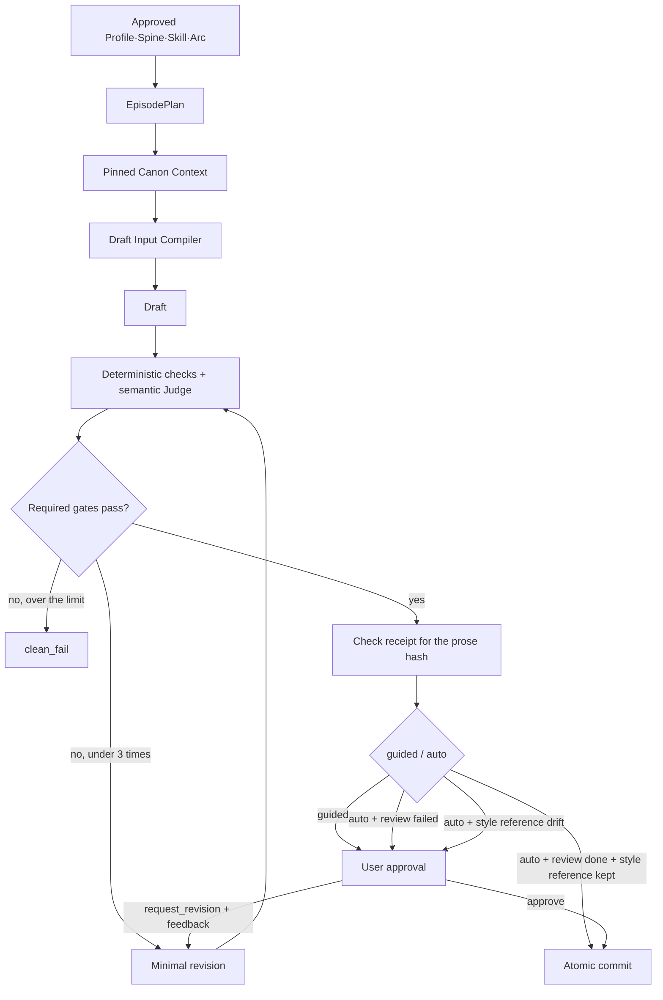
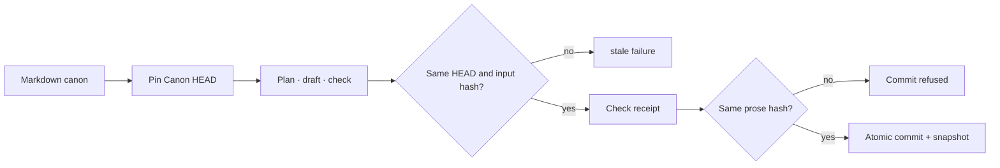
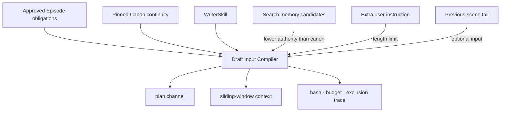
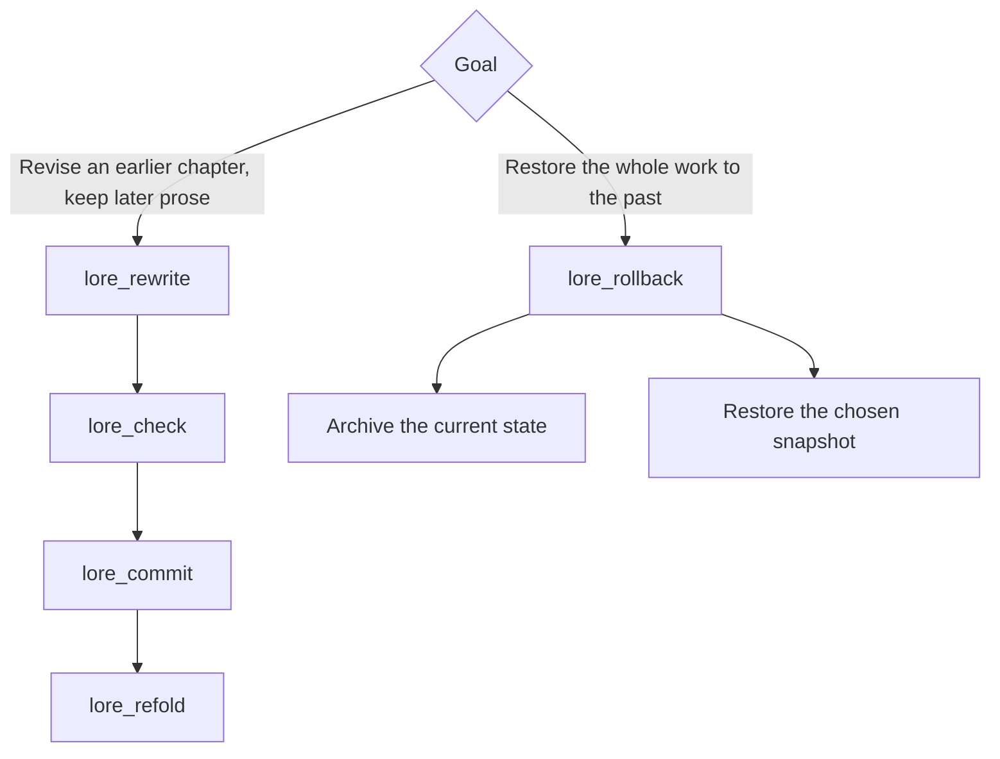

# Using and designing the vibelore MCP

[한국어](MCP.md) | English

This is a protocol reference for hosts and integration developers. For the whole structure from user request to stored result see
[Architecture](ARCHITECTURE.en.md); for how to actually start see [Getting started](GETTING_STARTED.en.md).

It is the contract an MCP host needs to connect vibelore and call it safely.

## Server boundary

vibelore handles newline-delimited JSON-RPC over stdio.

| MCP method | Role |
|---|---|
| `initialize` | Protocol negotiation and server info |
| `notifications/initialized` | Initialization complete notice |
| `ping` | Liveness check |
| `tools/list` | Tools and input schemas |
| `tools/call` | Tool execution |



Changing operations run serially. This prevents state from diverging through concurrent commits to the same work.

## Connection

When installed as a Codex plugin, `.codex-plugin/plugin.json` reads this repository's `.mcp.json`
and uses the plugin root as the working directory, so no separate absolute path setting is needed.
The settings below are for other hosts that connect the repository directly as a plain MCP server.

Common settings:

```text
command: node
args: [/absolute/path/to/vibelore/src/server.js]
transport: stdio
```

Claude Code:

```bash
claude mcp add-json vibelore '{"command":"node","args":["/absolute/path/to/vibelore/src/server.js"]}' --scope project
```

Codex CLI:

```toml
[mcp_servers.vibelore]
command = "node"
args = ["/absolute/path/to/vibelore/src/server.js"]
```

Grok CLI:

```bash
grok mcp add vibelore -- node /absolute/path/to/vibelore/src/server.js
```

For verified versions and caveats, see [HOSTS.en.md](../HOSTS.en.md).

## Tool surface

The default server exposes 30 complete user flows such as design, integrated writing, webtoon production, approval and recovery.
Per-stage primitive tools such as `lore_context`, `lore_draft`, `lore_check` and `lore_commit` can bypass the normal
writing order, so they are left out of the default list.

Only in development environments that need engine debugging or compatibility checks, setting
`VIBELORE_MCP_SURFACE=advanced` on the server process exposes all 43 tools. Don't put this value in a
configuration used for writing works.

## Common inputs and responses

Webtoons are generated with `lore_webtoon_scene`, one whole scene per image with dialogue, without roughs.
`lore_webtoon_plan` (interview and adaptation), `lore_webtoon_render` (image jobs, roughs, lettering) and
`lore_webtoon_decide` (approval bound to the current ID) are [deprecated] and are used only to continue per-panel work
already started. `needs_interview` means a user answer and `needs_model` a host model answer;
the latter shares the existing `lore_resume`.

For lookups, use `lore_workflow_status/history(lane="webtoon", workflowId="wt-...")`.
Omitting lane looks up the novel. The resume contract follows the [webtoon state table](reference/WEBTOON_WORKFLOW.en.md#continue-by-state).
`needs_images` is a request, not a finished generation; the host is responsible for running images.
Webtoons also run after the common input validation, the per-work lock and recovery of an interrupted novel run.
Independent image jobs can run in parallel, but stored changes are serialized.

| Argument | Format | Meaning |
|---|---|---|
| `project` | absolute path string | The work directory. When omitted, the server's working directory |
| `workId` | `[A-Za-z0-9_-]` string | Work identifier |

On success, the same object is returned as text and as a structured result.

```json
{
  "content": [{ "type": "text", "text": "{ ... }" }],
  "structuredContent": { "status": "ok" }
}
```

A tool failure does not close the connection. It returns `isError: true` and an error description. The current `inputSchema` in `tools/list` is the reference for exact input fields.

## Resuming model work

When semantic judgment or generation is needed, the run is saved and `needs_model` is returned.



```json
{
  "runId": "저장된 실행 ID",
  "answers": { "request-id": "모델이 만든 답변" }
}
```

Each request holds `id`, `step`, `jsonMode`, `system` and `user`. The end of `system` carries an execution condition
to produce a single answer from the given content only, without reading files or running tools. The `requests` in one answer
are independent of each other, so answer them in parallel and pass all answers in one `lore_resume`.
A bundle of requests sharing the same text carries `promptCache` (`sharedPrefixId`, `sharedPrefixEndMarker`,
`warmFirst`, etc.); `system` holds only the execution condition, and the start of `user` becomes a common material
block that is byte-for-byte identical. A host that calls anew for each request sends the `warmFirst` request first and sends the rest in parallel
after its first output starts. For details see
[Prompt cache and warm-first](OPERATIONS.en.md#prompt-cache-and-warm-first).
`lore_write` bundles requests by dependency to reduce round trips per chapter. When `modelProfile` is passed to
`lore_write`, `stage` (identity, planning, draft, review, quality, final), `model`
(`{ provider, modelId }`) and `reasoningEffort` are added. These values are hints for the host on which
model and thinking level to process the request with; vibelore does not call a model directly.

Empty `answers` means giving up the model judgment. It ends with the deterministic result and is marked `degraded: true`.

## Work lifecycle



| Mode | Behavior |
|---|---|
| `review` | Saves the design candidate and waits for approval |
| `auto` | Design is generated, checked and activated. Writing commits after the invariants pass and the critic completes normally; a failed review or a style-reference drift waits for approval |
| `guided` | Shows the finished manuscript and waits for commit approval |

Unless automatic progress is stated explicitly, `review` for design and `guided` for writing are the safe defaults.

## Integrated writing

Normal writing starts with `lore_write` rather than combining low-level tools.



`lore_workflow_status` shows the current stage and the `pendingRunId` waiting for a model answer, `lore_workflow_history` the audit events, and `lore_workflow_inspect` the receipts and detailed state. An interrupted model task continues the same run by passing this ID to `lore_resume`.

## Tool map

### Work design

| Tool | Main result |
|---|---|
| `lore_init` | Initialize an empty project or take over an existing one |
| `lore_profile` / `lore_profile_decide` / `lore_profile_status` | Generate the genre, tone, story-engine and craft profile, review open design questions repeatedly through feedback, approve, look up |
| `lore_create` | Generate the world, a cast of 3-5, and tracked entities |
| `lore_story_plan` / `lore_story_decide` / `lore_story_status` | Generate, approve and look up the whole-work StorySpine |
| `lore_writer_skill` / `lore_writer_decide` / `lore_writer_status` | Per-work writer skill candidates and prose auditions, approve, look up |

### Arcs and chapters

| Tool | Main result |
|---|---|
| `lore_next_arc` | Proposes the next arc from the accumulated state and the character pressure still remaining |
| `lore_arc_plan` / `lore_arc_decide` / `lore_arc_status` / `lore_arc_review` | Generate a 3-20 chapter arc, approve, look up progress, re-evaluate a written arc. Builds bounded arc candidates from accepted character changes and carries the closing results into the next arc. Empty chapters in emotional beats are not filled automatically, and conditional relationship-causality findings are passed on as advisory, separate from the average |
| `lore_episode_plan` / `lore_episode_decide` / `lore_episode_status` | Expand an arc beat into a 2-4 scene flow, approve, look up |

### Writing and checks

| Tool | Main input | Result |
|---|---|---|
| `lore_write` | `autonomy` | Integrated run from planning through checks, revision and approval |
| `lore_decide` | `approvalId`, `action` | Approve a guided manuscript, request a revision in the same workflow, hold or reject |
| `lore_configure` | `workId` | Looks up legacy design objects merged into the v2 NarrativeContract/Intent |
| `lore_style_anchor` | `workId`, `action?`, `chapters?`, `reason?` | Pin or look up the work's style reference from 1-3 approved canon chapters |
| `lore_sync` | `workId`, `action?`, `approvalId?` | Markdown drift check and re-issuing validation and approval for the last chapter |
| `lore_context` | `chapter`, `scene?` | Canon context for the next chapter |
| `lore_draft` | `chapter`, `plan?` | An unsaved draft |
| `lore_check` | `chapter`, `prose` | Deterministic and semantic checks |
| `lore_revise` | `prose`, `violations` | The full prose minimally revised with paragraph-numbered patches |
| `lore_commit` | `chapter`, `prose`, `checkId?` | Commit the checked prose and state |
| `lore_rewrite` | `chapter`, `intent` | A full-revision draft of a saved chapter |
| `lore_refold` | `fromChapter` | Recompute later state and entity lifecycles |
| `lore_era_research` | period-research request | Research on a period and region |
| `lore_resume` | `runId`, `answers` | Resume an interrupted model task |

### Operations and recovery

| Tool | Role |
|---|---|
| `lore_status` | Current chapter count, next chapter, characters, facts, foreshadowing, arc cursor |
| `lore_workflow_status` | Active workflow stage and next action |
| `lore_workflow_history` | Audit log of stages, checks, approvals and commits |
| `lore_workflow_inspect` | Check receipts and safe detailed state |
| `lore_snapshot_status` | Look up per-chapter snapshots |
| `lore_rollback` | Restore a snapshot. The existing state is kept in an archive |

Publishing an episode plan changes the canon HEAD, but the ExperienceLedger that was valid at the previous HEAD is
rebased onto the new HEAD. A ledger that was already stale is not revived; this is a preservation step so the accumulated patterns
keep being used in evaluating the next chapter.

## Canon and commit



- The Markdown canon takes precedence over the search DB.
- If the prose changes by even one character after the check, it has to be checked again.
- An active workflow cannot be bypassed with the low-level `lore_commit`.
- A failed draft does not advance the official StoryState.

## Draft input and search memory



Authority goes in the order `system > Episode > Canon > extra user instruction > WriterSkill > search memory > previous scene`. When the budget runs short, the previous scene and optional memory are dropped first. If the Episode or the required canon doesn't fit, generation stops. The input hash, budget and exclusions are left in the trace.

## Revision and recovery



## Failure recovery table

| State | Meaning | Next action |
|---|---|---|
| `needs_model` | A host model answer is needed | Make an answer for each request and call `lore_resume` |
| `clean_fail` | A required gate failed after the maximum revisions | Change the check results and direction |
| stale identity/HEAD | Canon or plan changed during generation | Read the state again and start a new run |
| `CONTEXT_BUDGET_EXCEEDED` | Required inputs are larger than the budget | Shrink the required inputs or adjust the policy |
| `CANON_MEMORY_CONFLICT` | Memory conflicts with canon | Regenerate the memory projection, check the canon |
| `UNSAFE_MEMORY_CLAIM` | A memory schema or safety check failed | Quarantine the claim, check the source |
| Receipt hash mismatch | The prose changed after the check | Check the changed prose again |
| No active arc | The chapter direction isn't approved | Start with `lore_arc_plan` |

## Local model

An OpenAI-compatible local server is optional.

```bash
VIBELORE_LOCAL_BASE_URL=http://127.0.0.1:11434/v1 \
VIBELORE_LOCAL_MODEL=qwen3:14b \
node /absolute/path/to/vibelore/src/server.js
```

If it isn't set, the MCP host does the generation and semantic judgment.

## Checks

```bash
npm run test:all
```

```bash
printf '%s\n' \
  '{"jsonrpc":"2.0","id":1,"method":"initialize","params":{"protocolVersion":"2025-06-18"}}' \
  '{"jsonrpc":"2.0","id":2,"method":"tools/list","params":{}}' \
  | node src/server.js
```

The final reference for the protocol and dispatch is [src/server.js](../src/server.js).

## Passing draft preferences and auditing reviews

`lore_write` includes the approved work contract, style direction and up to two examples in the actual draft request. Example selection and budget exclusions are recorded in `draft_context_supplied.draftContract`. When core input exceeds the budget it reports `CONTEXT_BUDGET_EXCEEDED` rather than silently dropping it. If you pass `lore_style_anchor(reason="why you like it")` when approving a style reference, the reference text and the reason are passed to writing.

`reviews_completed` keeps the original findings together with the request ID, manuscript hash, contract hash, review provenance and execution state, regardless of the total score. The same result is visible in `quality.review` and in the check receipt's `review`. A completed review is not a guarantee of enjoyment, and every soft opinion stays advisory. If a required review fails, returns an invalid answer, or a provider call hits the 45-second timeout, `auto` shows `CRITIC_INCOMPLETE` and keeps the same manuscript waiting for `lore_decide` approval. This time limit is not a limit on how long the host takes to prepare an answer after `needs_model`. Even after explicit approval, the review failure history is kept.

`lore_workflow_history(includeModelExchanges=true)` returns the actual draft and review requests and answers linked to the events looked up. The default lookup leaves the full text out. Files are kept locally in `.vibelore/model-exchanges/` by content hash and are never published externally automatically. `runtime_identified` records the package version, the Git commit when available, and the install source hash at the server process's first use. If you change files while it runs, restart the server for the new source identity to apply.

A host relay is marked `contextIsolation=unverified`. A local model records only that the request messages were sent, and does not claim to be a separate reader or a different model. The actual independence of the reviewer depends on how the host runs it.
