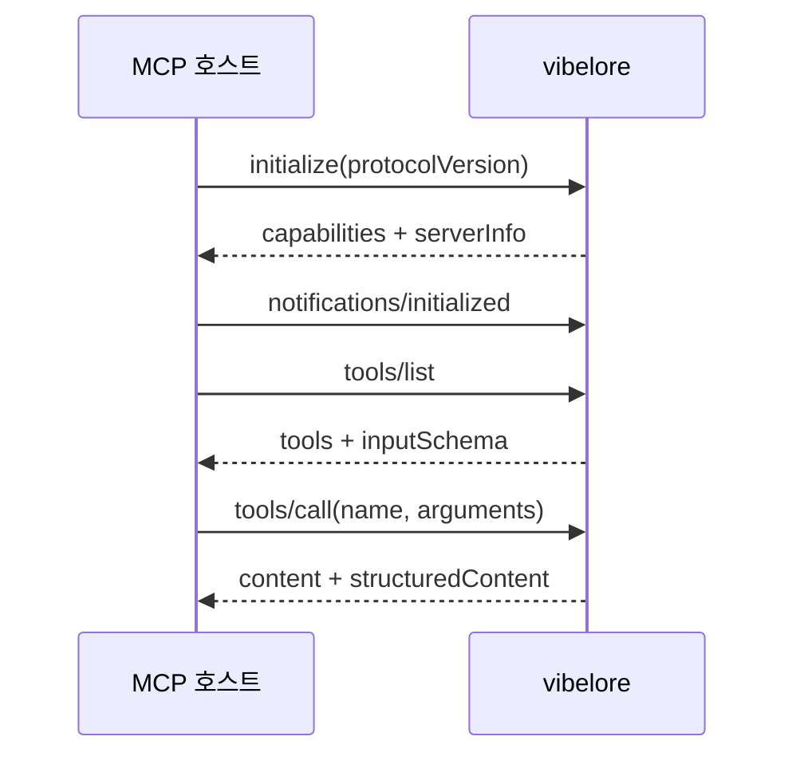
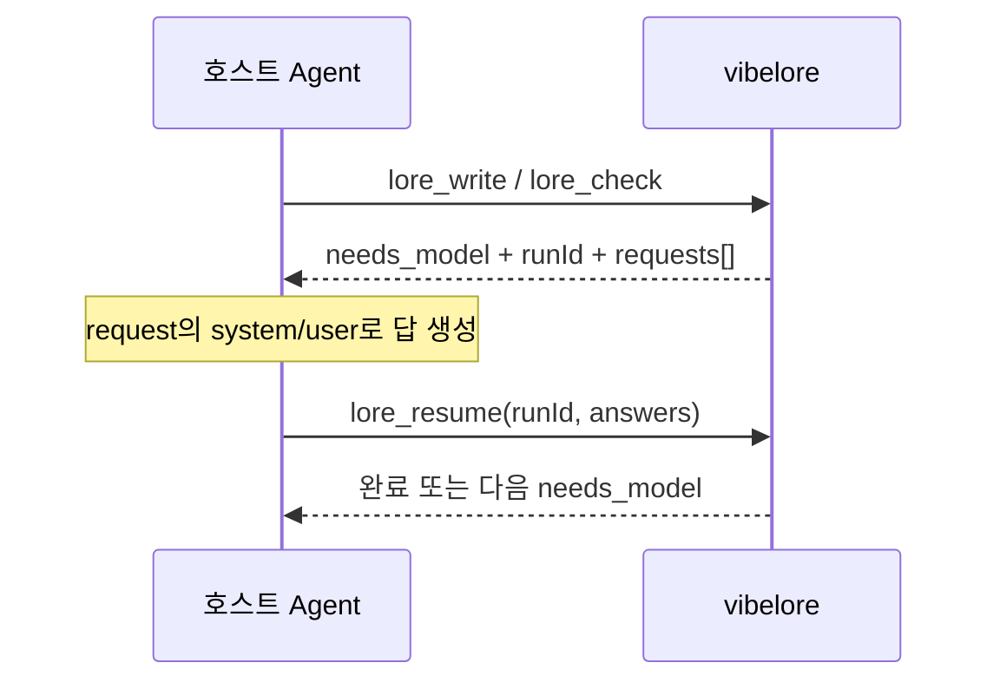
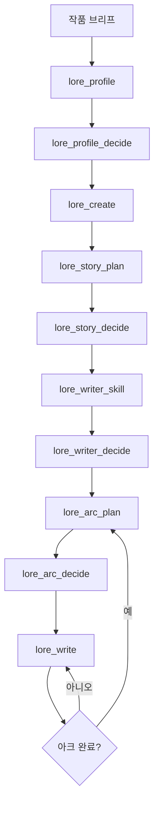
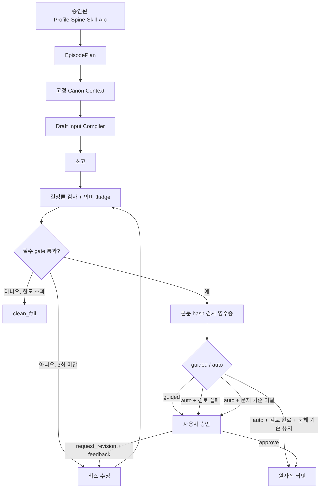
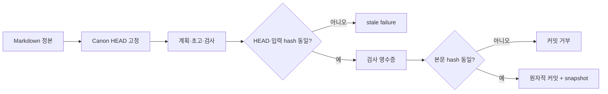
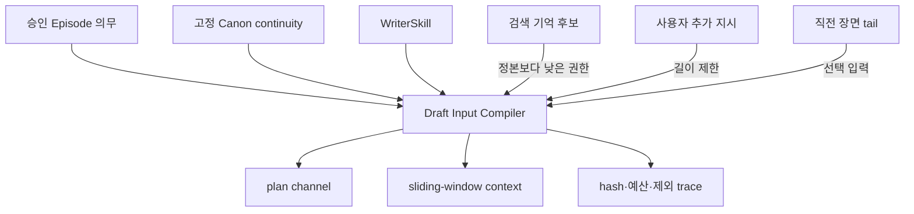
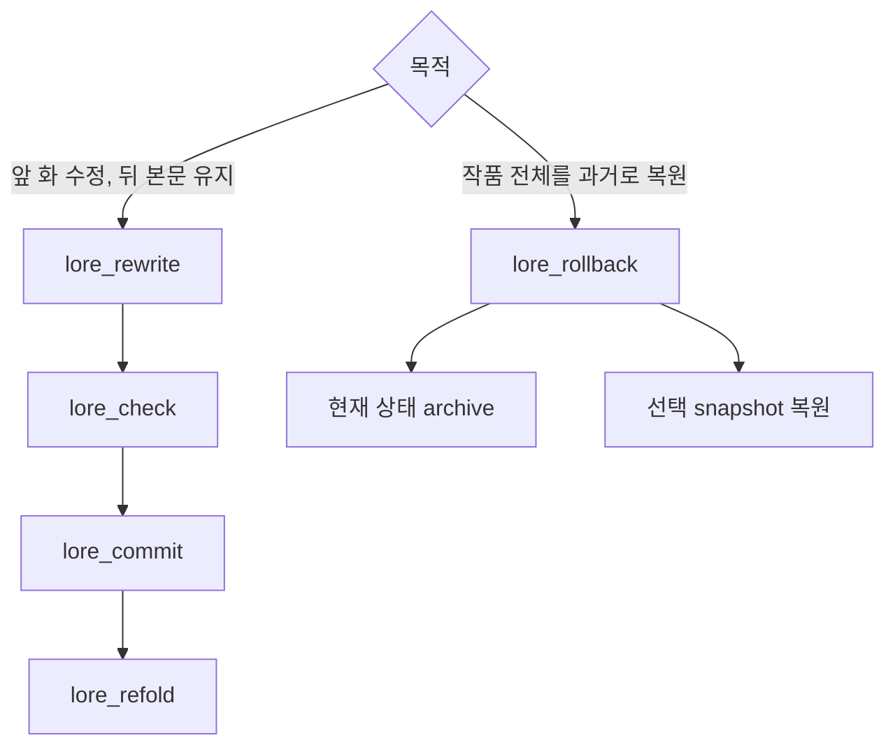

# vibelore MCP 사용 및 설계

호스트·연동 개발자를 위한 프로토콜 참조입니다. 사용자 요청부터 결과 저장까지의 전체 구조는
[아키텍처](ARCHITECTURE.md), 실제 시작 방법은 [시작 안내](GETTING_STARTED.md)를 보세요.

MCP 호스트가 vibelore를 연결하고 안전하게 호출하는 데 필요한 계약입니다.

## 서버 경계

vibelore는 newline-delimited JSON-RPC를 stdio로 처리합니다.

| MCP 메서드 | 역할 |
|---|---|
| `initialize` | 프로토콜 협상과 서버 정보 |
| `notifications/initialized` | 초기화 완료 알림 |
| `ping` | 생존 확인 |
| `tools/list` | 도구와 입력 schema |
| `tools/call` | 도구 실행 |



변경 작업은 직렬 실행됩니다. 같은 작품의 동시 커밋으로 상태가 갈라지는 것을 막기 위해서입니다.

## 연결

Codex 플러그인으로 설치한 경우 `.codex-plugin/plugin.json`이 이 저장소의 `.mcp.json`을
읽고 플러그인 루트를 작업 디렉터리로 사용하므로 별도 절대 경로 설정이 필요 없습니다.
아래 설정은 저장소를 일반 MCP 서버로 직접 연결하는 다른 호스트용입니다.

공통 설정:

```text
command: node
args: [/absolute/path/to/vibelore/src/server.js]
transport: stdio
```

Claude Code:

```bash
claude mcp add-json vibelore '{"command":"node","args":["/absolute/path/to/vibelore/src/server.js"]}' --scope project
```

Codex CLI:

```toml
[mcp_servers.vibelore]
command = "node"
args = ["/absolute/path/to/vibelore/src/server.js"]
```

Grok CLI:

```bash
grok mcp add vibelore -- node /absolute/path/to/vibelore/src/server.js
```

검증된 버전과 주의사항은 [HOSTS.md](../HOSTS.md)를 봅니다.

## 도구 표면

기본 서버는 설계, 통합 집필, 웹툰 제작, 승인, 복구처럼 완결된 사용자 흐름 29개를 노출합니다.
`lore_context`, `lore_draft`, `lore_check`, `lore_commit` 같은 단계별 원시 도구는 정상
집필 순서를 우회할 수 있어 기본 목록에서 제외됩니다.

엔진 디버깅이나 호환성 검증이 필요한 개발 환경에서만 서버 프로세스에
`VIBELORE_MCP_SURFACE=advanced`를 설정하면 전체 42개 도구를 노출합니다. 작품 집필용
설정에는 이 값을 넣지 않습니다.

## 공통 입력과 응답

웹툰은 `lore_webtoon_scene`으로 러프 없이 장면 전체를 대사까지 한 장으로 생성합니다.
`lore_webtoon_plan`(인터뷰·각색), `lore_webtoon_render`(이미지 job·러프·조판),
`lore_webtoon_decide`(현재 ID에 결합된 승인)는 [deprecated]이며 이미 시작된 컷별 작업을
이어갈 때만 씁니다. `needs_interview`는 사용자 답, `needs_model`은 호스트 모델 답을 뜻하며
후자는 기존 `lore_resume`을 공유합니다.

조회에는 `lore_workflow_status/history(lane="webtoon", workflowId="wt-...")`를 사용합니다.
lane 생략은 소설 조회입니다. 재개 계약은 [웹툰 상태표](reference/WEBTOON_WORKFLOW.md#상태에-따라-이어가기)를
따릅니다. `needs_images`는 생성 완료가 아닌 요청서이며 이미지 실행은 호스트가 담당합니다.
웹툰도 공통 입력 검증·작품 단위 잠금·중단된 소설 복구 처리를 거친 뒤 실행합니다.
독립 이미지 작업은 병렬 실행할 수 있으나 저장 변경은 직렬화됩니다.

| 인자 | 형식 | 의미 |
|---|---|---|
| `project` | 절대 경로 string | 작품 디렉터리. 생략하면 서버 실행 디렉터리 |
| `workId` | `[A-Za-z0-9_-]` string | 작품 식별자 |

성공은 같은 객체를 텍스트와 구조화 결과로 반환합니다.

```json
{
  "content": [{ "type": "text", "text": "{ ... }" }],
  "structuredContent": { "status": "ok" }
}
```

도구 실패는 연결을 끊지 않습니다. `isError: true`와 오류 설명을 반환합니다. 정확한 입력 필드는 `tools/list`의 현재 `inputSchema`가 기준입니다.

## 모델 작업 재개

의미 판단이나 생성이 필요하면 실행을 저장하고 `needs_model`을 반환합니다.



```json
{
  "runId": "저장된 실행 ID",
  "answers": { "request-id": "모델이 만든 답변" }
}
```

각 request는 `id`, `step`, `jsonMode`, `system`, `user`를 담습니다. `system` 끝에는 파일
읽기·도구 실행 없이 제공된 내용만으로 단일 응답을 만들라는 실행 조건이 붙습니다. 한 응답의
`requests`는 서로 독립이므로 병렬로 답하고 모든 답을 한 번의 `lore_resume`에 넘깁니다.
같은 본문을 공유하는 요청 묶음에는 `promptCache`(`sharedPrefixId`, `sharedPrefixEndMarker`,
`warmFirst` 등)가 붙고, `system`은 실행 조건만, `user` 앞부분은 바이트 단위로 같은 공통 자료
블록이 됩니다. 요청마다 새로 호출하는 호스트는 `warmFirst` 요청을 먼저 보내 첫 출력이 시작된
뒤 나머지를 병렬로 보냅니다. 자세한 내용은
[프롬프트 캐시와 warm-first](OPERATIONS.md#프롬프트-캐시와-warm-first)를 보세요.
`lore_write`는 의존 관계별로 요청을 묶어 화당 왕복 수를 줄입니다. `lore_write`에
`modelProfile`을 넘긴 경우 `stage`(identity·planning·draft·review·quality·final), `model`
(`{ provider, modelId }`), `reasoningEffort`가 추가됩니다. 이 값은 호스트가 요청을 어느
모델과 생각 수준으로 처리할지 정하는 힌트이며, vibelore가 직접 모델을 호출하지는 않습니다.

빈 `answers`는 모델 판단을 포기한다는 뜻입니다. 결정론 결과로 끝나며 `degraded: true`가 표시됩니다.

## 작품 수명주기



| 모드 | 동작 |
|---|---|
| `review` | 설계 후보를 저장하고 승인 대기 |
| `auto` | 설계는 생성·검사 후 활성화. 집필은 불변식 통과와 critic 정상 완료 후 커밋하며, 검토 실패·문체 기준 이탈은 승인 대기 |
| `guided` | 완성 원고를 보여 주고 커밋 승인 대기 |

자동 진행이 명시되지 않았다면 설계는 `review`, 집필은 `guided`가 안전한 기본값입니다.

## 통합 집필

일반 집필은 저수준 도구를 조합하지 않고 `lore_write`로 시작합니다.



`lore_workflow_status`는 현재 단계와 모델 응답 대기 중인 `pendingRunId`, `lore_workflow_history`는 감사 이벤트, `lore_workflow_inspect`는 영수증과 상세 상태를 보여 줍니다. 중단된 모델 작업은 이 ID를 `lore_resume`에 넘겨 같은 실행을 이어갑니다.

## 도구 지도

### 작품 설계

| 도구 | 핵심 결과 |
|---|---|
| `lore_init` | 빈 프로젝트 초기화 또는 기존 프로젝트 인계 |
| `lore_profile` / `lore_profile_decide` / `lore_profile_status` | 장르·톤·이야기 동력·작법 프로필 생성, 열린 설계 질문을 feedback으로 반복 검토, 승인, 조회 |
| `lore_create` | 세계, 3~5인 캐스트, 추적 엔티티 생성 |
| `lore_story_plan` / `lore_story_decide` / `lore_story_status` | 작품 전체 StorySpine 생성, 승인, 조회 |
| `lore_writer_skill` / `lore_writer_decide` / `lore_writer_status` | 작품별 작가 스킬 후보와 산문 오디션, 승인, 조회 |

### 아크와 회차

| 도구 | 핵심 결과 |
|---|---|
| `lore_next_arc` | 누적 상태와 아직 남은 인물 압력에서 다음 아크 제안 |
| `lore_arc_plan` / `lore_arc_decide` / `lore_arc_status` / `lore_arc_review` | 3~20화 아크 생성, 승인, 진행 조회, 작성된 아크 재평가. 수용된 인물 변화에서 bounded 아크 후보를 만들고 종결 결과를 다음 아크에 계승. 감정 비트의 빈 회차는 자동 보충하지 않으며, 조건부 관계 인과 finding은 평균과 분리된 advisory로 전달 |
| `lore_episode_plan` / `lore_episode_decide` / `lore_episode_status` | 아크 비트를 2~4개 장면 흐름으로 확장, 승인, 조회 |

### 집필과 검사

| 도구 | 핵심 입력 | 결과 |
|---|---|---|
| `lore_write` | `autonomy` | 계획부터 검사·수정·승인까지 통합 실행 |
| `lore_decide` | `approvalId`, `action` | guided 원고 승인, 같은 workflow 수정 요청, 보류 또는 거절 |
| `lore_configure` | `workId` | 구형 설계 객체를 v2 NarrativeContract/Intent로 통합 조회 |
| `lore_style_anchor` | `workId`, `action?`, `chapters?`, `reason?` | 승인한 정본 1~3화로 작품 문체 기준 고정·조회 |
| `lore_sync` | `workId`, `action?`, `approvalId?` | Markdown drift 검사와 마지막 화 검증·승인 재발행 |
| `lore_context` | `chapter`, `scene?` | 다음 화 정본 컨텍스트 |
| `lore_draft` | `chapter`, `plan?` | 저장하지 않은 초고 |
| `lore_check` | `chapter`, `prose` | 결정론·의미 검사 |
| `lore_revise` | `prose`, `violations` | 문단 번호 패치로 최소 수정한 전체 본문 |
| `lore_commit` | `chapter`, `prose`, `checkId?` | 검사된 본문과 상태 커밋 |
| `lore_rewrite` | `chapter`, `intent` | 저장된 화의 전면 수정 초안 |
| `lore_refold` | `fromChapter` | 이후 상태와 엔티티 생명주기 재계산 |
| `lore_era_research` | 고증 요청 | 시대·지역 고증 조사 |
| `lore_resume` | `runId`, `answers` | 중단된 모델 작업 재개 |

### 운영과 복구

| 도구 | 역할 |
|---|---|
| `lore_status` | 현재 화수, 다음 화, 인물, 사실, 복선, 아크 커서 |
| `lore_workflow_status` | 활성 워크플로 단계와 다음 행동 |
| `lore_workflow_history` | 단계·검사·승인·커밋 감사 로그 |
| `lore_workflow_inspect` | 검사 영수증과 안전한 상세 상태 |
| `lore_snapshot_status` | 장별 snapshot 조회 |
| `lore_rollback` | snapshot 복원. 기존 상태는 archive 보존 |

에피소드 계획을 발행하면 정본 HEAD가 바뀌지만, 직전 HEAD에서 유효했던 ExperienceLedger는
새 HEAD로 재기준화됩니다. 이미 stale인 원장은 되살리지 않으며, 누적 패턴을 다음 화 평가에
계속 사용하기 위한 보존 동작입니다.

## 정본과 커밋



- Markdown 정본이 검색 DB보다 우선합니다.
- 검사 후 본문이 한 글자라도 바뀌면 다시 검사해야 합니다.
- 활성 워크플로를 저수준 `lore_commit`으로 우회할 수 없습니다.
- 실패한 초고는 정식 StoryState를 진전시키지 않습니다.

## 초고 입력과 검색 기억



권한은 `system > Episode > Canon > 사용자 추가 지시 > WriterSkill > 검색 기억 > 직전 장면` 순입니다. 예산이 부족하면 직전 장면과 선택 기억부터 제외합니다. Episode나 필수 정본이 들어가지 않으면 생성을 중단합니다. 입력 hash, 예산과 제외 내역은 trace에 남습니다.

## 수정과 복구



## 실패 복구표

| 상태 | 의미 | 다음 행동 |
|---|---|---|
| `needs_model` | 호스트 모델 답변 필요 | 요청별 답을 만들어 `lore_resume` |
| `clean_fail` | 최대 수정 후 필수 gate 실패 | 검사 결과와 방향을 수정 |
| stale identity/HEAD | 생성 중 정본 또는 계획 변경 | 상태를 다시 읽고 새 실행 |
| `CONTEXT_BUDGET_EXCEEDED` | 필수 입력이 예산보다 큼 | 필수 입력 축소 또는 정책 조정 |
| `CANON_MEMORY_CONFLICT` | 기억과 정본 충돌 | 기억 투영 재생성, 정본 확인 |
| `UNSAFE_MEMORY_CLAIM` | 기억 schema·안전 검사 실패 | claim 격리, 원천 확인 |
| 영수증 hash 불일치 | 검사 뒤 본문 변경 | 변경된 본문 재검사 |
| 활성 아크 없음 | 회차 방향 미승인 | `lore_arc_plan`부터 진행 |

## 로컬 모델

OpenAI 호환 로컬 서버는 선택 사항입니다.

```bash
VIBELORE_LOCAL_BASE_URL=http://127.0.0.1:11434/v1 \
VIBELORE_LOCAL_MODEL=qwen3:14b \
node /absolute/path/to/vibelore/src/server.js
```

설정하지 않으면 MCP 호스트가 생성과 의미 판단을 수행합니다.

## 확인

```bash
npm run test:all
```

```bash
printf '%s\n' \
  '{"jsonrpc":"2.0","id":1,"method":"initialize","params":{"protocolVersion":"2025-06-18"}}' \
  '{"jsonrpc":"2.0","id":2,"method":"tools/list","params":{}}' \
  | node src/server.js
```

프로토콜과 dispatch의 최종 기준은 [src/server.js](../src/server.js)입니다.

## 초고 취향 전달과 검토 감사

`lore_write`는 승인된 작품 계약·문체 방향과 최대 두 개의 예시를 실제 초고 요청에 포함합니다. 예시 선택·예산 제외는 `draft_context_supplied.draftContract`에 기록합니다. 핵심 입력이 예산을 초과하면 `CONTEXT_BUDGET_EXCEEDED`로 알리며 말없이 삭제하지 않습니다. 문체 기준을 승인할 때 `lore_style_anchor(reason="선호 이유")`를 함께 지정하면 기준 원문과 이유가 집필에 전달됩니다.

`reviews_completed`는 총점과 무관하게 원본 findings와 요청 ID·원고 해시·계약 해시·검토 출처·실행 상태를 보존합니다. `quality.review`와 검사 영수증의 `review`에서 같은 결과를 확인할 수 있습니다. 검토 완료는 재미의 보증이 아니며, 모든 soft 의견은 계속 advisory입니다. 필수 검토의 실패·잘못된 응답·provider 호출의 45초 시간 초과가 있으면 `auto`는 `CRITIC_INCOMPLETE`를 표시하고 같은 원고를 `lore_decide` 승인 대기로 보존합니다. 이 시간 제한은 `needs_model` 이후 호스트가 답을 준비하는 대기 시간의 제한이 아닙니다. 명시적으로 승인해도 검토 실패 이력은 유지합니다.

`lore_workflow_history(includeModelExchanges=true)`는 조회한 이벤트에 연결된 실제 초고·검토 요청과 응답을 함께 반환합니다. 기본 조회에는 전문을 넣지 않습니다. 파일은 로컬 `.vibelore/model-exchanges/`에 내용 해시로 보존되며 자동 외부 공개하지 않습니다. `runtime_identified`에는 패키지 버전, 사용 가능한 Git 커밋, 서버 프로세스 첫 사용 시의 설치 소스 해시가 남습니다. 실행 중 파일을 바꿨다면 서버를 재시작해야 새 소스 식별값이 적용됩니다.

호스트 relay는 `contextIsolation=unverified`로 표시합니다. 로컬 모델은 요청 메시지만 전송한 사실을 기록하지만 별도 독자나 다른 모델이라고 주장하지 않습니다. 검토자의 실제 독립성은 호스트 실행 방식에 달려 있습니다.
