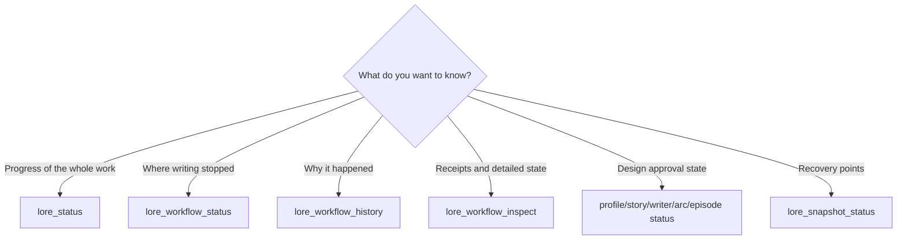
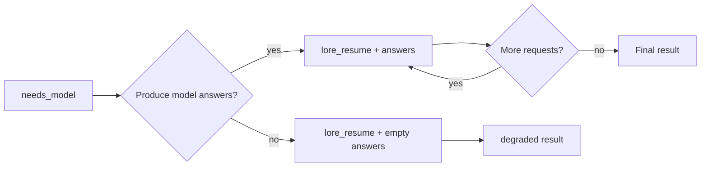
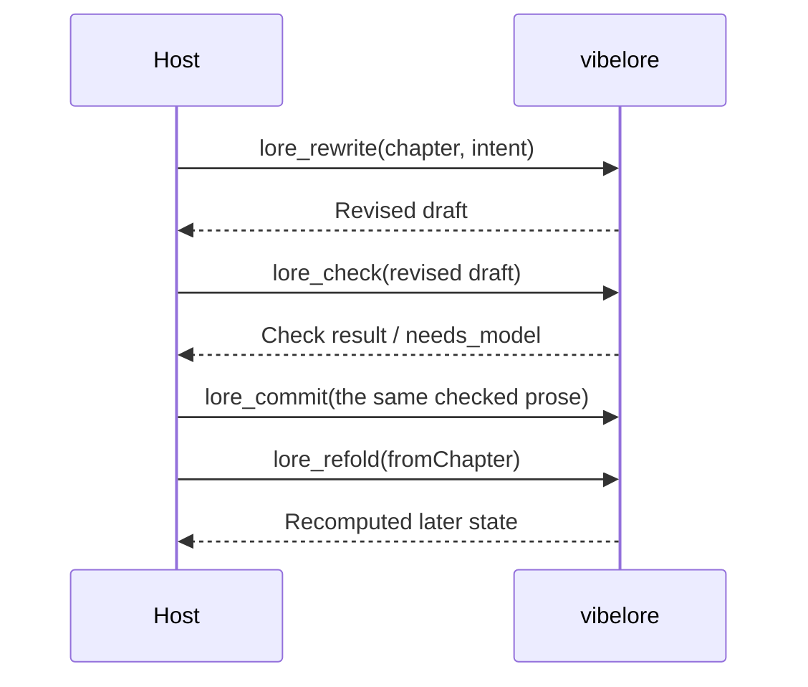

# Operations and recovery

[한국어](OPERATIONS.md) | English

Detailed procedures for host AIs and integration developers. Regular users should first use the request examples in
[Troubleshooting and backups](TROUBLESHOOTING.en.md).

## Resuming and revising webtoon work

For webtoons, read the current stage with `lore_workflow_status(lane="webtoon",workflowId="wt-...")`.
On the default path (`lore_webtoon_scene`), resume an unfinished model request with `lore_resume` using the actual request ID,
and a failed check or review with `action="revise"`, putting the observed defects in `feedback`.

The per-panel path (`lore_webtoon_plan`/`render`/`decide`, deprecated) continues only work already started, as follows.
User questions are answered with `lore_webtoon_plan(responses=...)` in the same workflow, and approvals with the current
`lore_webtoon_decide(approvalId=...)`. A lettering failure resumes with render's `retry=true`.
Separate the revision scope as `lettering` to fix only lettering, `storyboard` for composition roughs, and
`adaptation` for events, dialogue and panel structure.

Detailed states and the import contract follow the [webtoon guide](reference/WEBTOON_WORKFLOW.en.md#continue-by-state).
If the actual image could not be opened, leave the evidence of incompleteness; don't edit `.vibelore/` to bypass approval.
Hand edits to `webtoon/` are re-reviewed with `adoptEdits=true` after checking the diff and the intent.
A novel rollback is not a rollback tool for webtoon episodes. The source version and the candidate and approval history are kept separately.
Rolling the novel back keeps the webtoon state and publication, and the model audits and pending requests linked to that work.
Resuming an interrupted rollback keeps the same boundary and does not restore the earlier novel's approvals or pending requests.

The `lore_workflow_inspect`, `lore_rewrite` and `lore_refold` procedures in this document are manual recovery that needs the developer
advanced MCP surface. For normal writing and approval, use the default surface's `lore_write`,
`lore_decide`, `lore_workflow_status` and `lore_workflow_history`.

## Read the state first



When an error occurs, call a status tool first before calling the same generation tool again.

## Normal writing operation

1. Check the active arc and the next beat in `lore_arc_status`.
2. Call `lore_write(autonomy="guided")`.
3. If `needs_model`, call `lore_resume` with the same `runId`.
4. Read the manuscript and check results.
5. To approve, call `lore_decide(action="approve")`.
6. Check the next chapter and the arc cursor in `lore_status`.

`auto` doesn't skip the check stages either. When the required reviews complete normally, only the final user approval is skipped. When a review fails, the same manuscript is kept waiting for approval with `CRITIC_INCOMPLETE`.

## Failure recovery table

| Result or symptom | Cause | Recovery |
|---|---|---|
| `needs_model` | Waiting for host model work | Make an answer per request and call `lore_resume` |
| `CRITIC_INCOMPLETE` | A required review failed, answered incompletely or timed out | Show the kept manuscript and review record, then approve, request a revision or hold with `lore_decide` |
| `clean_fail` | A required gate failed after at most 3 revisions or a 3-attempt check budget | Check the violations with inspect (`detail="full"` includes `draftProse`); to re-check the same manuscript use `retryValidation=true`; after a plan or contract change or `lore_sync`, `lore_write` re-checks the same manuscript; for a new draft, call `lore_write` with a narrowed `instruction` |
| No active ArcPlan | An arc is needed before prose | `lore_arc_plan(review)`, then approve |
| No profile/spine/skill | A work design stage is missing | Check the status and create the missing stage |
| stale HEAD or identity | Canon or plan changed during the run | Void the old receipt and approval, re-check the kept manuscript under the latest contract (`lore_write`) |
| `CONTEXT_BUDGET_EXCEEDED` | Required plans and canon exceed the input budget | Clean up duplicate canon or adjust the policy budget |
| `CANON_MEMORY_CONFLICT` | Search memory doesn't match canon | Regenerate the search projection, check the canon |
| `UNSAFE_MEMORY_CLAIM` | Invalid schema, control characters or instructions | Quarantine the claim, fix the source data |
| Check receipt mismatch | The prose changed after the check | Check the changed prose again |
| runId missing or expired | The saved run finished or was deleted | Check the workflow status, then start a new run or resume the workflow |

## Recovering from `needs_model`



`lore_write` returns requests without dependencies bundled in one round trip. After the draft, each attempt is usually
four round trips: ① the extraction, profile check and independent review bundle → ② the semantic continuity check (needs the extraction result) and arc review →
③ title, summary and boundary judgment (they read the same final prose) → ④ the language-compliance proof (it checks the title and summary, so it comes after them).
With the draft, a chapter without revisions takes 5 round trips. If the plan already has a title, the title request is left out of ③
but the number of round trips is the same. The `requests` in one answer are independent of each other, so answer them in parallel and
pass all answers in one `lore_resume`. These bundles put this chapter's prose first as a common material block
([prompt cache](#prompt-cache-and-warm-first)), so a host that answers each request with a new process or API call
sends the request with `promptCache.warmFirst=true` first and sends the rest in parallel after its first output starts.
The optional modules of the chapter plan (agenda, reveal) must pass the same validator as the commit at the planning stage;
when one is missing, an `episode-plan-repair` request is issued once. When the plan exceeds the draft stage's Writer Packet cap (4000 tokens, the longest plan summary regardless of prose length),
the same request is used once to get a plan with shortened sentences, and if it still exceeds the cap it stops at the planning stage with
`EPISODE_PACKET_OVERFLOW`.

The degraded path with empty answers is the behavior of some novel tools. Webtoon model requests do not complete
with empty answers and stay waiting. In normal resumption, answer the actual requests; don't use it as a way to skip review.

The host must generate answers without changing a request's `system` and `user`. Don't invent new answer IDs.

## Handling `clean_fail`

`clean_fail` is not a save failure; it is the state where a quality gate blocked the official commit.

A `clean_fail` manuscript is kept in the workflow. Calling `lore_write` again without arguments returns the same `clean_fail`
without calling a model.

1. Check the hard violations and scores with `lore_workflow_inspect`. The kept manuscript comes along as
   `draftProse` when `detail="full"`.
2. Separate the cause: length, canon conflict or a missing arc obligation.
3. To have only the check run again with the manuscript and contract unchanged, use `lore_write(retryValidation=true)`.
   It checks the same manuscript in a new check epoch with a budget of 3. If the plan or contract changed, it behaves as in 4.
4. If you fixed the arc or chapter plan, published a hand edit with `lore_sync` (after `WORKING_TREE_DRIFT`),
   or got `STALE_WORK_CONTRACT`, call `lore_write` again (with or without
   `retryValidation`). It re-checks the same manuscript under the current canon and contract without a new draft.
   - This applies to a `clean_fail` manuscript, a guided manuscript waiting for approval, and a `ready_to_commit`
     manuscript whose auto-commit failed.
   - The old receipt and approval are void. It checks with a new receipt and a new budget of 3 (a `clean_fail` that
     had spent its budget also gets a new one), and hard violations get minimal revisions within that budget.
   - When it passes, `guided` asks for approval again and `auto` commits. But a manuscript that was waiting for user approval
     stays `guided` even if the call is `auto`, and goes through `lore_decide`.
   - If a revision requested with `lore_decide(action="request_revision")` was pending, the new workflow
     takes over that feedback, applies it to the kept manuscript and then checks it.
5. If the user's intent changed, call `lore_write` with a new, narrowed `instruction`. The same chapter is rewritten from scratch in a new workflow
   only when there is a new `instruction` or no kept manuscript.
6. If the arc itself is the problem, don't force the manuscript; review the arc plan again and then follow 4.

If nothing changed, `lore_write` without arguments returns the kept manuscript as it is without calling a model.

Re-checking, inheriting a revision and a new draft all proceed in a new workflow, and the earlier workflow is not deleted.
The earlier workflow stays as `clean_fail`, and the event record gets `workflow_superseded` (`mode`: `revalidate`,
`revise` or `redraft`). The new workflow's `supersedes` points to the earlier ID, and if it inherited the manuscript,
`inheritedDraft.proseHash` points to that manuscript, so
`lore_workflow_history(workflowId=...)` can audit both attempts.

## Revising an earlier chapter



If `lore_refold` is skipped, the later chapters' prose remains, but the StoryState may still be based on the old canon.

## Full rollback

1. Check the chapter to restore with `lore_snapshot_status`.
2. Show the user that restoring moves later writing and pending approvals to the archive area.
3. Call `lore_rollback` with a positive integer `chapter` and the work's `workId`.
4. Check the archive path in the result, the restored chapter count, and the next chapter number in `lore_status`.

A version 2 snapshot is restored after its work, chapter, file list and hashes are all checked. Missing files,
tampered data, symbolic links and invalid chapter arguments are refused without changing the current manuscript.
The restored result is published as a new Published HEAD, aligning the canon, design, state and change-detection baseline.
Earlier approvals, model requests, check receipts and the search cache are not restored. The originals are
kept in `.vibelore/rollback-archives/<archiveId>/before/`.

If the process is interrupted during restoration, `.vibelore/rollback-pending.json` and the verified recovery data
remain. The next MCP tool call on the same project finishes the restoration first.
If it can't complete, that call fails and no further work proceeds. Fix the disk error
and call again. Don't delete the journal, archive or publication by hand.
Automatic resumption handles process interruption; it does not replace independent file backups.

Snapshots from older versions have no Published HEAD and cannot be restored automatically and safely.
If one is refused with `INVALID_SNAPSHOT`, first back up the original work directory separately,
then copy the old snapshot's `canonical/` into a **new, empty work directory** and take it over manually.
Don't mix it with the existing `.vibelore/` or just change the manifest number. Re-check and republish the settings and chapters
in the new work to create a snapshot in the new format.

A project lock prevents several MCP servers from writing to one work at the same time.
If another live server is working, `PROJECT_BUSY` is returned; the lock of a server that has exited is
reclaimed on the next call. Network shared file systems are not supported.

When only the sentences of an earlier chapter change, use the rewrite/refold flow rather than a full rollback.

## After editing the canon by hand

- `world/`, `characters/` and `chapters/` can be edited directly.
- Don't edit `.vibelore/` directly.
- If you changed a saved earlier chapter, the check and commit path and refold are needed.
- A workflow in progress becomes stale. Check the state and start a new run.

## Connection problems

### The tools are not visible

- Check that the `command` in the settings finds the actual `node` executable.
- Check that `args` is the absolute path of `src/server.js`.
- Restart the host so it reads the MCP list again.
- Check that Node.js is 22.x at 22.13.0 or later, 24.x or 26.x.

### Startup timeout

Codex example:

```toml
[mcp_servers.vibelore]
command = "node"
args = ["/absolute/path/to/vibelore/src/server.js"]
startup_timeout_sec = 30
tool_timeout_sec = 6000
```

Long-form generation can take longer than 60 seconds, so leave enough tool timeout.

### Direct handshake

Use this only to separate host problems from server problems.

```bash
printf '%s\n' \
  '{"jsonrpc":"2.0","id":1,"method":"initialize","params":{"protocolVersion":"2025-06-18"}}' \
  '{"jsonrpc":"2.0","id":2,"method":"tools/list","params":{}}' \
  | node /absolute/path/to/vibelore/src/server.js
```

If `serverInfo.name` is `vibelore` and `tools` includes `lore_write`, the server surface is fine.

## Local model problems

```bash
VIBELORE_LOCAL_BASE_URL=http://127.0.0.1:11434/v1
VIBELORE_LOCAL_MODEL=qwen3:14b
```

- Pass both environment variables together to the MCP server process.
- The endpoint must provide the OpenAI-compatible `/v1/chat/completions`.
- If they aren't set, the host relay is used.
- The deterministic check path works even without a model.

## What to back up

Stop the work, then keep the whole work directory, hidden files and images included, in a separate location.
If you use Git, check that ignore rules don't leave out candidates, images or run records.

| Path | Importance | Reason |
|---|---:|---|
| `world/`, `characters/`, `chapters/`, `summaries/` | Required | Human-edited canon |
| `webtoon/`, original image folders | Required for webtoon work | Approved scripts, reference images, finished results and originals |
| `.vibelore/webtoon/`, `.vibelore/webtoon-publication/` | Required for webtoon work | Candidates, progress and webtoon approval history |
| `.vibelore/model-exchanges/`, `.vibelore/runs/` | Required to keep progress and audits | Actual requests and answers, and pending runs |
| `.vibelore/workflows/` | Required while work is in progress | Resuming workflows after a restart |
| `.vibelore/check-receipts/` | Recommended | Commit audits |
| `.vibelore/snapshots/` | Recommended | rollback |
| `.vibelore/memory.db` | Low | A projection that can be rebuilt from canon |

## Before a release

```bash
npm run test:all
git diff --check
```

When you change the MCP surface, update these together.

1. The tool schema and dispatch in `src/server.js`
2. [TOOLS.md](TOOLS.md) (and [TOOLS.en.md](TOOLS.en.md))
3. The call examples in [GETTING_STARTED.md](GETTING_STARTED.md) (and [GETTING_STARTED.en.md](GETTING_STARTED.en.md))
4. The MCP surface tests

## Prompt cache and warm-first

The prompt cache matches on prefixes, and a cache entry can be read only after the previous request's answer has started
streaming. So if requests with the same prefix are sent at the same time, they all pay only the cache write cost and nothing is
reused. vibelore changes the layout of requests only when material the workflow declared as shared (currently this chapter's prose)
appears unchanged in two or more requests of one `needs_model` answer.

| Position | Content |
|---|---|
| `system` | One line of execution conditions. Identical for all requests in the bundle |
| Start of `user` | From `[공통 자료 시작 · chapter-prose · sha256:…]` to `[공통 자료 끝 · chapter-prose]`. Byte-for-byte identical |
| Rest of `user` | `[이번 요청 역할]` (the original `system`), `[이번 요청 자료]` (the original `user`, with the prose replaced by a reference to the common material), JSON conditions |

The execution conditions and markers follow the work's prompt family. `ko` works use the Korean markers above as they are; works in other languages
use English markers such as `[Shared material start · …]`, `[Role for this request]` and `[Material for this request]`.
The family is fixed per work, so within one work the common prefix is byte-for-byte identical.

`promptCache` hints added to the request:

| Field | Meaning |
|---|---|
| `layout` | `shared-prefix-v1` |
| `sharedPrefixId` | A hash of `system` and the common block. The same value means the same prefix |
| `sharedPrefixEndMarker` | The end marker of the common block. Splitting `user` after this marker gives the common part and the stage part |
| `sharedPrefixChars` | The length of the common block (JavaScript UTF-16 units). In other languages, splitting on the marker is safer |
| `estimatedSharedTokens` | A lower-bound estimate made without a tokenizer |
| `groupSize` | The number of requests using the same prefix |
| `warmFirst` | The one request to send first. If the estimate is under 1024 tokens, all are `false` and are sent in parallel as they are |

The minimum cache length is 512 tokens for Claude Opus 5 and Opus 5.5, 1024 tokens for Sonnet 5 and Opus 4.8,
and 4096 tokens for Opus 4.6 and Haiku 4.5. The default TTL is 5 minutes and is refreshed on every read, so a workflow that processes a bundle
within a few minutes doesn't need the 1-hour TTL.

Per host:

- Claude Code CLI (`claude -p`): cache points are placed only on the system prompt and the last user block.
  If you send the common block inside user, reads are 0 even with the same prefix (measured 0 both for one stdin block and
  for two stream-json blocks). Put `system` + an empty line + the common block in `--system-prompt` and
  send the rest through stdin. With `--output-format stream-json --include-partial-messages`, start the rest after receiving
  the warm-first request's first `stream_event`.
- Direct Claude API calls: split the common block into its own text block and put `cache_control` on that block.
- Hosts with automatic prefix caching (Codex, etc.): send the layout as it is. The host's minimum
  length and routing conditions apply, and vibelore does not guarantee hits.
- Hosts that answer directly within one conversation or through subagents: the host's own context comes first, so
  this layout gives little or no benefit. The parallel answer rule still applies.

The layout change only changes presentation. Request IDs remain the fingerprints of the engine's original requests, the audit
record (`modelExchanges`) stores the original requests, and direct providers never see this layout.

## Review answers and audit

1. For each request in `needs_model`, read the actual `system` and `user` and the current manuscript. Even at the same stage, a different manuscript or contract means a different request. Don't supply prepared scores in bulk by stage name.
2. Distinguish the experience observed in the text from the implementation of approved promises. Don't add a plan on your own to an editorial request that wasn't given the current plan. Don't conclude that a promise to be paid later or an intentional delay is a current omission.
3. If there is a weakness despite a high score, leave evidence in the findings. Don't turn preference opinions into automatic revision instructions. When you can't answer or the review failed, don't make up a passing score.
4. Call `lore_resume` with the given request ID. The server links the actual request and answer to the manuscript and contract hashes. This link is a device for resuming the same evaluation, not proof that the evaluator read carefully or was independent.
5. Check the full findings and provenance in `lore_workflow_history` and `quality.review`. If it was written and reviewed in the same host context, report it as a self-review. Look up the full text with `includeModelExchanges=true` only when investigating evidence and execution paths.

Example `lore_workflow_history` call arguments:

```json
{
  "project": "/absolute/path/to/my-novel",
  "workId": "my-novel",
  "limit": 100,
  "includeModelExchanges": true
}
```

If `workflowId` is omitted, the current run is looked up. To investigate a past run, give its ID
too. Full text is returned only for the events looked up, so if a needed event is out of range,
increase `limit`. Requests and answers not stored by earlier versions are not restored retroactively.

| What to check | Where it is recorded |
|---|---|
| Which preferences and examples went into the draft | `draft_context_supplied.draftContract` |
| What weaknesses were found despite a high score | `reviews_completed.review.records[].findings` |
| Which manuscript and contract were reviewed, and by whom | The review record's `proseHash`, `contractDigest`, `requestId`, `evaluator` |
| Whether the review completed normally | `quality.review.status`, each record's `status` and `failure` |
| The full text of the actual requests and answers | `modelExchanges`, the `exchangeId` of events and review records |
| Which install source it ran from | `runtime_identified` |

`CRITIC_INCOMPLETE` means the review run did not complete. Distinguish it from hard violations in the manuscript itself;
check the kept manuscript and the failure evidence, then choose approve, request a revision or hold. Even if approved,
the failure history remains. The provider call time limit (default 45 seconds, `VIBELORE_REVIEW_TIMEOUT_MS`) applies when the server
calls the local adapter directly; it does not limit how long the host takes to prepare an answer after `needs_model`.

When publishing a manuscript or review, the user chooses the material to publish and writes the before/after comparison and the reasons for the change. Storing the full model requests and answers does not mean approval to publish the whole conversation. A conditional automatic style rewriting policy has not been introduced yet.
