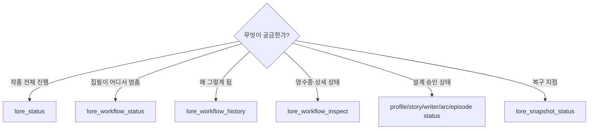
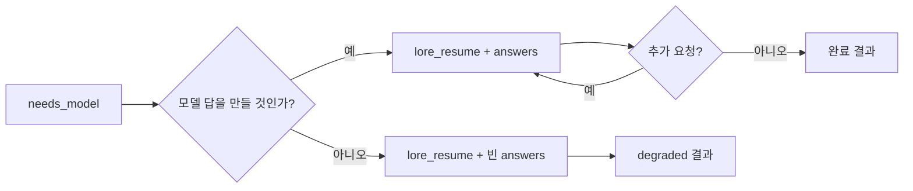
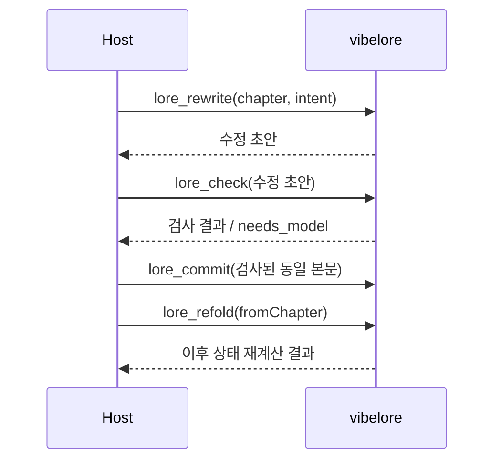

# 운영과 복구

호스트 AI·연동 개발자를 위한 상세 절차입니다. 일반 사용자는 먼저
[문제 해결과 백업](TROUBLESHOOTING.md)의 요청 예시를 이용하세요.

## 웹툰 작업 재개·수정

웹툰은 `lore_workflow_status(lane="webtoon",workflowId="wt-...")`로 현재 단계를 읽습니다.
기본 경로(`lore_webtoon_scene`)에서 미완료 모델 요청은 실제 요청 ID로 `lore_resume`,
검증·검토 불합격은 관측 결함을 `feedback`으로 담아 `action="revise"`로 재개합니다.

컷별 경로(`lore_webtoon_plan`/`render`/`decide`, deprecated)는 이미 시작된 작업만 다음처럼
이어갑니다. 사용자 질문은 같은 workflow의 `lore_webtoon_plan(responses=...)`, 승인은 현재
`lore_webtoon_decide(approvalId=...)`로 답합니다. 조판 실패는 render의 `retry=true`로
재개합니다. 조판만 고치려면 `lettering`, 구도 러프는 `storyboard`, 사건·대사·컷 구성은
`adaptation`으로 수정 범위를 구분합니다.

세부 상태와 반입 계약은 [웹툰 안내](reference/WEBTOON_WORKFLOW.md#상태에-따라-이어가기)를 따릅니다.
실제 이미지를 못 열었다면 미완료 근거를 남기며, `.vibelore/`를 고쳐 승인을 우회하지 않습니다.
`webtoon/` 손수정은 diff와 의도를 확인한 뒤 `adoptEdits=true`로 재검토합니다.
소설 rollback은 웹툰 회차의 되돌리기 도구가 아닙니다. 원작 판본과 후보·승인 이력은 별개로 보존합니다.
소설을 되돌려도 웹툰 상태·publication과 그 작업에 연결된 모델 감사·대기 요청은 유지합니다.
중단된 rollback 재개에서도 같은 경계를 지키며 이전 소설의 승인·대기 요청은 복원하지 않습니다.

이 문서의 `lore_workflow_inspect`, `lore_rewrite`, `lore_refold` 절차는 개발자용 고급
MCP 표면이 필요한 수동 복구입니다. 일반 집필과 승인에는 기본 표면의 `lore_write`,
`lore_decide`, `lore_workflow_status`, `lore_workflow_history`를 사용합니다.

## 상태를 먼저 읽기



오류가 났을 때 같은 생성 도구를 반복 호출하기 전에 상태 도구를 먼저 호출합니다.

## 정상 집필 운영

1. `lore_arc_status`에서 활성 아크와 다음 비트를 확인합니다.
2. `lore_write(autonomy="guided")`를 호출합니다.
3. `needs_model`이면 같은 `runId`로 `lore_resume`합니다.
4. 원고와 검사 결과를 읽습니다.
5. 승인하면 `lore_decide(action="approve")`합니다.
6. `lore_status`에서 다음 화와 아크 커서를 확인합니다.

`auto`도 검사 단계를 생략하지 않습니다. 필수 검토가 정상 완료된 경우 최종 사용자 승인만 생략합니다. 검토 실패 시 `CRITIC_INCOMPLETE`와 함께 같은 원고를 승인 대기로 보존합니다.

## 실패 복구표

| 결과·증상 | 원인 | 복구 |
|---|---|---|
| `needs_model` | 호스트 모델 작업 대기 | request별 답을 만들어 `lore_resume` |
| `CRITIC_INCOMPLETE` | 필수 검토 실패·불완전 응답·시간 초과 | 보존된 원고와 검토 기록을 보여주고 `lore_decide`로 승인·수정 요청·보류 |
| `clean_fail` | 최대 3회 수정 또는 검사 예산 3회 후 필수 gate 실패 | inspect로 위반 확인(`detail="full"`이면 `draftProse` 포함), 같은 원고 재검사는 `retryValidation=true`, 계획·계약 수정이나 `lore_sync` 뒤에는 `lore_write`가 같은 원고를 재검사, 새 초고는 좁힌 `instruction`으로 `lore_write` |
| 활성 ArcPlan 없음 | 본문보다 아크가 먼저 필요 | `lore_arc_plan(review)` 후 승인 |
| profile/spine/skill 없음 | 작품 설계 단계 누락 | 해당 status 확인 후 누락 단계 생성 |
| stale HEAD 또는 identity | 실행 중 정본·계획 변경 | 기존 영수증·승인 폐기, 보존 원고를 최신 계약으로 재검사(`lore_write`) |
| `CONTEXT_BUDGET_EXCEEDED` | 필수 계획·정본이 입력 예산 초과 | 중복 정본 정리 또는 정책 예산 조정 |
| `CANON_MEMORY_CONFLICT` | 검색 기억과 정본 불일치 | 검색 투영 재생성, 정본 확인 |
| `UNSAFE_MEMORY_CLAIM` | 잘못된 schema·제어 문자·지시문 | claim 격리, 원천 데이터 수정 |
| 검사 영수증 불일치 | 검사 후 본문 변경 | 변경된 본문을 다시 검사 |
| runId 없음·만료 | 저장 실행이 완료·삭제됨 | workflow status 확인 후 새 실행 또는 워크플로 재개 |

## `needs_model` 복구



`lore_write`는 의존 관계가 없는 요청을 한 왕복에 묶어 반환합니다. 초고 뒤 시도마다 대체로
①추출·프로필 검사·독립 검토 묶음 → ②의미 연속성 검사(추출 결과 필요)와 아크 검토 →
③제목·요약·경계 판정(같은 최종 본문을 읽음) → ④언어 준수 증명(제목·요약을 검사하므로 그다음)의
네 왕복이며, 초고를 더하면 수정이 없는 화는 5왕복입니다. 계획에 제목이 있으면 ③에서 제목 요청이
빠질 뿐 왕복 수는 같습니다. 한 응답의 `requests`는 서로 독립이므로 병렬로 답하고
모든 답을 한 번의 `lore_resume`에 넘깁니다. 이 묶음들은 이번 화 본문을 공통 자료 블록으로
앞에 두므로([프롬프트 캐시](#프롬프트-캐시와-warm-first)), 요청마다 새 프로세스나 API 호출로
답하는 호스트는 `promptCache.warmFirst=true`인 요청을 먼저 보내고 첫 출력이 시작된 뒤
나머지를 병렬로 보냅니다. 회차 계획의 선택 모듈(agenda·reveal)은
커밋과 같은 검증기를 계획 단계에서 통과해야 하며, 누락 시 `episode-plan-repair` 요청이
한 번 발급됩니다. 계획이 초고 단계의 Writer Packet 상한(4000 토큰, 본문 길이와 무관한 계획 요약의 최장)을 넘을 때도 같은
요청으로 문장을 줄인 계획을 한 번 받고, 그래도 초과하면 계획 단계에서
`EPISODE_PACKET_OVERFLOW`로 멈춥니다.

빈 답변의 degraded 경로는 일부 소설 도구의 동작입니다. 웹툰 모델 요청은 빈 답변으로
완료되지 않고 대기를 유지합니다. 일반 재개에서는 실제 요청에 답하며 검토 생략 수단으로
사용하지 않습니다.

호스트가 request의 `system`과 `user`를 바꾸지 않고 답을 생성해야 합니다. 답 ID를 임의로
새로 만들지 않습니다.

## `clean_fail` 대응

`clean_fail`은 저장 실패가 아니라 품질 gate가 정식 커밋을 막은 상태입니다.

`clean_fail` 원고는 workflow에 보존됩니다. 인자 없이 `lore_write`를 다시 부르면 모델을
호출하지 않고 같은 `clean_fail`을 돌려줍니다.

1. `lore_workflow_inspect`로 hard violation과 점수를 확인합니다. 보존 원고는
   `detail="full"`일 때 `draftProse`로 함께 옵니다.
2. 분량, 정본 충돌, 아크 의무 누락 중 원인을 분리합니다.
3. 원고와 계약을 그대로 두고 검사만 다시 받으려면 `lore_write(retryValidation=true)`를 씁니다.
   새 검사 epoch와 3회 예산으로 같은 원고를 검사합니다. 계획·계약이 바뀌었다면 4와 같이 동작합니다.
4. 아크나 회차 계획을 고쳤거나, 손수정을 `lore_sync`로 발행했거나(`WORKING_TREE_DRIFT` 뒤),
   `STALE_WORK_CONTRACT`를 받았다면 `lore_write`를 다시 부릅니다(`retryValidation`은 있어도
   없어도 됩니다). 새 초고 없이 같은 원고를 현재 정본·계약으로 다시 검사합니다.
   - `clean_fail` 원고, 승인 대기 중인 guided 원고, 자동 커밋이 실패한 `ready_to_commit`
     원고에 모두 적용됩니다.
   - 이전 영수증과 승인은 무효입니다. 새 영수증과 새 3회 예산으로 검사하며(예산을 소진한
     `clean_fail`도 새 예산을 받습니다), hard 위반은 예산 안에서 최소 수정합니다.
   - 통과하면 `guided`는 다시 승인을 묻고 `auto`는 커밋합니다. 단, 사용자 승인을 기다리던
     원고는 호출이 `auto`여도 `guided`로 유지되어 `lore_decide`를 거칩니다.
   - `lore_decide(action="request_revision")`로 요청한 수정이 남아 있었다면 그 피드백을
     새 workflow가 이어받아 보존 원고에 적용한 뒤 검사합니다.
5. 사용자 의도가 바뀌었다면 좁힌 새 `instruction`으로 `lore_write`를 부릅니다. 새
   `instruction`이 있거나 보존 원고가 없을 때만 같은 화를 새 workflow에서 처음부터 다시 씁니다.
6. 아크 자체가 문제라면 원고를 억지로 고치지 말고 아크 계획을 다시 검토한 뒤 4를 따릅니다.

아무것도 바뀌지 않았다면 인자 없는 `lore_write`는 모델을 부르지 않고 보존 원고를 그대로
돌려줍니다.

재검사·수정 이어받기·새 초고는 모두 새 workflow에서 진행하며 이전 workflow를 지우지 않습니다.
이전 workflow는 `clean_fail`로 남고 이벤트 기록에 `workflow_superseded`(`mode`: `revalidate`,
`revise` 또는 `redraft`)가 붙습니다. 새 workflow의 `supersedes`가 이전 ID를 가리키고, 원고를
물려받았다면 `inheritedDraft.proseHash`가 그 원고를 가리키므로
`lore_workflow_history(workflowId=...)`로 두 시도를 모두 감사할 수 있습니다.

## 앞 화 수정



`lore_refold`를 생략하면 뒤 화 본문은 남아 있어도 StoryState가 옛 정사 기준일 수 있습니다.

## 전체 rollback

1. `lore_snapshot_status`로 복구할 회차를 확인합니다.
2. 복구하면 이후 집필과 승인 대기가 보관 영역으로 이동한다는 점을 사용자에게 보여 줍니다.
3. 양의 정수 `chapter`와 작품의 `workId`로 `lore_rollback`을 호출합니다.
4. 결과의 archive 경로, 복구된 화수와 `lore_status`의 다음 화 번호를 확인합니다.

버전 2 snapshot의 작품·회차·파일 목록·해시를 모두 검사한 뒤 복구합니다. 누락된 파일,
변조된 자료, 심볼릭 링크, 잘못된 회차 인자는 현재 원고를 변경하지 않고 거부합니다.
복구 결과는 새 Published HEAD로 발행하며, 정본·설계·상태·변경 감지 기준을 맞춥니다.
이전 승인, 모델 요청, 검사 영수증과 검색 캐시는 복원하지 않습니다. 원본은
`.vibelore/rollback-archives/<archiveId>/before/`에 보존합니다.

복구 도중 프로세스가 중단되면 `.vibelore/rollback-pending.json`과 검증된 복구 자료가
남습니다. 같은 프로젝트로 다음 MCP 도구를 호출하면 복구를 먼저 마무리합니다.
완료할 수 없으면 해당 호출이 실패하며, 이후 작업을 이어가지 않습니다. 디스크 오류를
해결한 뒤 다시 호출하세요. journal·archive·publication을 수동으로 삭제하지 마세요.
자동 재개는 프로세스 중단 대응이며 독립적인 파일 백업을 대신하지 않습니다.

과거 버전의 snapshot은 Published HEAD가 없어 안전하게 자동 복구할 수 없습니다.
`INVALID_SNAPSHOT`으로 거부되면 원본 작품 디렉터리를 먼저 별도 백업하고,
옛 snapshot의 `canonical/`을 **새로운 빈 작품 디렉터리**에 복사하여 수동으로 이어받습니다.
기존 `.vibelore/`와 섞거나 manifest 번호만 바꾸지 마세요. 새로운 작품에서 설정과 회차를
재검사하고 재발행해야 새 형식의 snapshot이 만들어집니다.

한 작품에는 여러 MCP 서버가 동시에 쓰지 못하도록 프로젝트 잠금을 사용합니다.
살아 있는 다른 서버가 작업 중이면 `PROJECT_BUSY`를 반환하며, 종료된 서버의 잠금은
다음 호출에서 회수합니다. 네트워크 공유 파일시스템은 지원하지 않습니다.

앞 화의 문장만 수정할 때는 전체 rollback보다 rewrite/refold 흐름을 사용하세요.

## 정본을 손으로 고친 뒤

- `world/`, `characters/`, `chapters/`는 직접 수정할 수 있습니다.
- `.vibelore/`는 직접 수정하지 않습니다.
- 저장된 앞 화를 바꿨다면 검사·커밋 경로와 refold가 필요합니다.
- 진행 중 워크플로가 있으면 stale이 됩니다. 상태를 확인하고 새 실행을 시작합니다.

## 연결 문제

### 도구가 보이지 않음

- 설정의 `command`가 실제 `node` 실행 파일을 찾는지 확인합니다.
- `args`가 `src/server.js`의 절대 경로인지 확인합니다.
- 호스트를 재시작해 MCP 목록을 다시 읽습니다.
- Node.js 22.13.0 이상인 22.x, 24.x 또는 26.x인지 확인합니다.

### 시작 timeout

Codex 예시:

```toml
[mcp_servers.vibelore]
command = "node"
args = ["/absolute/path/to/vibelore/src/server.js"]
startup_timeout_sec = 30
tool_timeout_sec = 6000
```

장편 생성은 60초보다 길 수 있으므로 tool timeout을 충분히 둡니다.

### 직접 handshake

호스트 문제와 서버 문제를 분리할 때만 사용합니다.

```bash
printf '%s\n' \
  '{"jsonrpc":"2.0","id":1,"method":"initialize","params":{"protocolVersion":"2025-06-18"}}' \
  '{"jsonrpc":"2.0","id":2,"method":"tools/list","params":{}}' \
  | node /absolute/path/to/vibelore/src/server.js
```

`serverInfo.name`이 `vibelore`이고 `tools`에 `lore_write`가 있으면 서버 표면은 정상입니다.

## 로컬 모델 문제

```bash
VIBELORE_LOCAL_BASE_URL=http://127.0.0.1:11434/v1
VIBELORE_LOCAL_MODEL=qwen3:14b
```

- 두 환경 변수를 MCP 서버 프로세스에 함께 전달합니다.
- endpoint는 OpenAI 호환 `/v1/chat/completions`를 제공해야 합니다.
- 설정하지 않으면 호스트 릴레이를 사용합니다.
- 모델이 없어도 결정론 검사 경로는 사용할 수 있습니다.

## 백업 대상

작업을 멈춘 뒤 작품 디렉터리 전체를 숨김 파일·이미지까지 포함해 별도 위치에 보관합니다.
Git을 사용한다면 ignore 규칙으로 후보·이미지·실행 기록이 빠지지 않았는지 확인합니다.

| 경로 | 중요도 | 이유 |
|---|---:|---|
| `world/`, `characters/`, `chapters/`, `summaries/` | 필수 | 사람이 편집하는 정본 |
| `webtoon/`, 원본 그림 폴더 | 웹툰 작업 시 필수 | 승인 대본·기준 이미지·완성본과 원본 |
| `.vibelore/webtoon/`, `.vibelore/webtoon-publication/` | 웹툰 작업 시 필수 | 후보·진행 상태·웹툰 승인 이력 |
| `.vibelore/model-exchanges/`, `.vibelore/runs/` | 진행·감사 보존 시 필수 | 실제 요청·응답과 대기 실행 |
| `.vibelore/workflows/` | 진행 중이면 필수 | 재시작 후 워크플로 재개 |
| `.vibelore/check-receipts/` | 권장 | 커밋 감사 |
| `.vibelore/snapshots/` | 권장 | rollback |
| `.vibelore/memory.db` | 낮음 | 정본에서 재구축 가능한 투영 |

## 릴리스 전 확인

```bash
npm run test:all
git diff --check
```

MCP 표면을 바꾸면 다음을 함께 갱신합니다.

1. `src/server.js`의 tool schema와 dispatch
2. [TOOLS.md](TOOLS.md)
3. [GETTING_STARTED.md](GETTING_STARTED.md)의 호출 예제
4. MCP surface 테스트

## 프롬프트 캐시와 warm-first

프롬프트 캐시는 접두부 일치이며, 캐시 항목은 앞 요청의 응답 스트리밍이 시작된 뒤에야 읽을 수
있습니다. 그래서 같은 접두부의 요청을 동시에 보내면 모두 캐시 쓰기 비용만 내고 재사용은
없습니다. vibelore는 워크플로가 공유를 선언한 자료(현재는 이번 화 본문)가 한 `needs_model`
응답의 요청 둘 이상에 그대로 들어 있을 때만 그 요청들의 배치를 바꿉니다.

| 위치 | 내용 |
|---|---|
| `system` | 실행 조건 한 줄. 묶음 안의 모든 요청이 같습니다 |
| `user` 앞부분 | `[공통 자료 시작 · chapter-prose · sha256:…]`부터 `[공통 자료 끝 · chapter-prose]`까지. 바이트 단위로 같습니다 |
| `user` 뒷부분 | `[이번 요청 역할]`(원래 `system`), `[이번 요청 자료]`(원래 `user`, 본문 자리는 공통 자료 참조 표기), JSON 조건 |

요청에 추가되는 `promptCache` 힌트:

| 필드 | 의미 |
|---|---|
| `layout` | `shared-prefix-v1` |
| `sharedPrefixId` | `system`과 공통 블록의 해시. 같은 값이면 접두부가 같습니다 |
| `sharedPrefixEndMarker` | 공통 블록 끝 표식. `user`를 이 표식 뒤에서 나누면 공통 부분과 단계 부분이 됩니다 |
| `sharedPrefixChars` | 공통 블록 길이(JavaScript UTF-16 단위). 다른 언어에서는 표식으로 나누는 편이 안전합니다 |
| `estimatedSharedTokens` | 토크나이저 없이 낸 하한 추정치 |
| `groupSize` | 같은 접두부를 쓰는 요청 수 |
| `warmFirst` | 먼저 보낼 요청 하나. 추정치가 1024토큰 미만이면 모두 `false`이며 그대로 병렬로 보냅니다 |

최소 캐시 길이는 Claude Opus 5·Opus 5.5가 512토큰, Sonnet 5·Opus 4.8이 1024토큰이며
Opus 4.6·Haiku 4.5는 4096토큰입니다. 기본 TTL은 5분이고 읽기마다 갱신되므로, 한 묶음을
몇 분 안에 처리하는 워크플로에는 1시간 TTL이 필요하지 않습니다.

호스트별 적용:

- Claude Code CLI(`claude -p`): 캐시 지점이 system 프롬프트와 마지막 user 블록에만 놓입니다.
  공통 블록을 user 안에 둔 채 보내면 접두부가 같아도 읽기가 0입니다(stdin 한 블록,
  stream-json 두 블록 모두 실측 0). `--system-prompt`에 `system` + 빈 줄 + 공통 블록을 넣고
  나머지를 stdin으로 보냅니다. `--output-format stream-json --include-partial-messages`로
  warm-first 요청의 첫 `stream_event`를 받은 뒤 나머지를 시작합니다.
- Claude API 직접 호출: 공통 블록을 별도 text 블록으로 나누고 그 블록에 `cache_control`을 둡니다.
- 자동 접두부 캐시를 쓰는 호스트(Codex 등): 배치 그대로 보내면 됩니다. 해당 호스트의 최소
  길이와 라우팅 조건을 따르며 vibelore는 적중을 보장하지 않습니다.
- 한 대화 안에서 직접 답하거나 서브에이전트로 답하는 호스트: 호스트 자체 문맥이 앞에 붙으므로
  이 배치로 얻는 이득이 없거나 작습니다. 병렬 답변 규칙은 그대로입니다.

배치 변경은 표시 방식만 바꿉니다. 요청 ID는 엔진 원 요청의 fingerprint 그대로이고, 감사
기록(`modelExchanges`)은 원 요청을 저장하며, 직접 provider는 이 배치를 보지 않습니다.

## 검토 응답과 감사

1. `needs_model`의 각 요청에서 실제 `system`·`user`와 현재 원고를 읽습니다. 같은 단계라도 원고나 계약이 달라지면 다른 요청입니다. 준비된 점수를 단계 이름에 맞춰 일괄 공급하지 않습니다.
2. 원문에서 관찰한 경험과 승인된 약속의 구현을 구분합니다. 현재 계획을 주지 않은 편집 요청에 별도로 계획을 덧붙이지 않습니다. 미래에 지급할 약속이나 의도적인 지연을 현재 누락으로 단정하지 않습니다.
3. 높은 점수에도 약점이 있으면 findings에 근거를 남깁니다. 취향 의견은 자동 수정 지시로 바꾸지 않습니다. 응답할 수 없거나 검토가 실패했을 때 임의의 통과 점수를 만들지 않습니다.
4. 주어진 요청 ID로 `lore_resume`합니다. 서버는 실제 요청·응답과 원고·계약 해시를 연결합니다. 이 연결은 같은 평가를 재개하는 장치이며 평가자가 성실히 읽었거나 독립적이라는 증명은 아닙니다.
5. `lore_workflow_history`와 `quality.review`에서 전체 발견 및 출처를 확인합니다. 같은 호스트 문맥으로 작성·검토했다면 자기검토로 보고합니다. 근거와 실행 경로를 조사할 때만 `includeModelExchanges=true`로 전문을 조회합니다.

`lore_workflow_history` 호출 인자 예시:

```json
{
  "project": "/absolute/path/to/my-novel",
  "workId": "my-novel",
  "limit": 100,
  "includeModelExchanges": true
}
```

`workflowId`를 생략하면 현재 실행을 조회합니다. 과거 실행을 조사하려면 해당 ID를 함께
지정합니다. 전문은 조회한 이벤트에 연결된 것만 반환하므로 필요한 이벤트가 범위 밖에 있으면
`limit`을 늘립니다. 이전 버전에서 저장하지 않은 요청·응답은 소급 복원하지 않습니다.

| 확인할 내용 | 기록 위치 |
|---|---|
| 어떤 취향과 예시가 초고에 들어갔는가 | `draft_context_supplied.draftContract` |
| 높은 점수에도 어떤 약점이 발견됐는가 | `reviews_completed.review.records[].findings` |
| 어떤 원고·계약을 누가 검토했는가 | 검토 record의 `proseHash`, `contractDigest`, `requestId`, `evaluator` |
| 검토가 정상 완료됐는가 | `quality.review.status`, 각 record의 `status`와 `failure` |
| 실제 요청·응답 전문은 무엇인가 | `modelExchanges`, 이벤트·검토 record의 `exchangeId` |
| 어떤 설치 소스로 실행했는가 | `runtime_identified` |

`CRITIC_INCOMPLETE`는 검토 실행이 완료되지 않았다는 뜻입니다. 원고 자체의 hard 위반과
구분하고, 보존된 원고와 실패 근거를 확인한 뒤 승인·수정 요청·보류를 선택합니다. 승인하더라도
실패 이력은 남습니다. provider 호출의 시간 제한(기본 45초, `VIBELORE_REVIEW_TIMEOUT_MS`)은 서버가
로컬 어댑터를 직접 호출할 때 적용되며, `needs_model` 이후 호스트가 답변을 준비하는
시간을 제한하는 것이 아닙니다.

원고·검토를 공개할 때는 사용자가 공개하려는 자료를 선택해 전후 비교와 수정 이유를 작성합니다. 전체 모델 요청·응답 저장이 대화 전체의 외부 공개 승인을 뜻하지 않습니다. 조건부 자동 문체 재작성 정책은 아직 도입하지 않았습니다.
