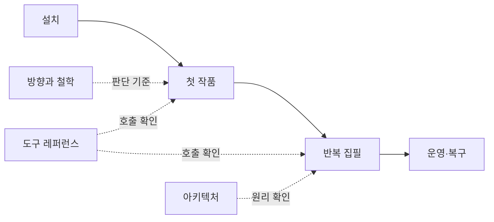

# vibelore 문서

| 하고 싶은 일 | 읽을 문서 |
|---|---|
| vibelore가 지키는 원칙 이해하기 | [PHILOSOPHY.md](PHILOSOPHY.md) |
| 설치하고 첫 작품 만들기 | [GETTING_STARTED.md](GETTING_STARTED.md) |
| 모델·생각 수준·로컬 모델 설정하기 | [MODELS.md](MODELS.md) |
| 도구 인자 확인하기 | [TOOLS.md](TOOLS.md) |
| MCP 응답과 `needs_model` 이해하기 | [MCP.md](MCP.md) |
| 정본·상태·커밋 구조 이해하기 | [ARCHITECTURE.md](ARCHITECTURE.md) |
| 실패한 실행 복구하기 | [OPERATIONS.md](OPERATIONS.md) |
| 집필 요청·검토 근거·실행 출처 확인하기 | [검토 응답과 감사](OPERATIONS.md#검토-응답과-감사) |
| 호스트별 검증 기록 확인하기 | [HOSTS.md](../HOSTS.md) |

구현의 최종 기준은 [src/server.js](../src/server.js)의 `tools/list` schema입니다.

## 공개 프로젝트 참여

- [라이선스와 출처](PROVENANCE.md)
- [보안과 데이터 경계](../SECURITY.md)
- [기여 안내](../CONTRIBUTING.md)
- [변경 사항](../CHANGELOG.md)
