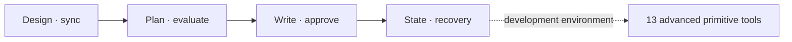

# MCP tool reference

[한국어](TOOLS.md) | English

A call reference for users who integrate directly with a host AI. Regular users don't need to write arguments
themselves; follow [Getting started](GETTING_STARTED.en.md) and [Making a webtoon](WEBTOON.en.md) and just ask.

This is the usage contract for the 30 user tools the default server exposes and the 13 low-level tools on the advanced surface.
A new work prepares an approved profile, whole story, writer skill and arc. After that, writing
checks the active arc with `lore_arc_status` and starts with `lore_write`, using `lore_decide` when approval is pending.
The low-level tools are kept for compatibility and engine debugging but don't appear in the default `tools/list`.
Developers who need every tool set `VIBELORE_MCP_SURFACE=advanced` on the server process.

The tools that exist only on the advanced surface are `lore_context`, `lore_check`, `lore_commit`, `lore_draft`,
`lore_revise`, `lore_rewrite`, `lore_next_arc`, `lore_episode_plan`, `lore_episode_decide`,
`lore_episode_status`, `lore_refold`, `lore_era_research` and `lore_workflow_inspect`. Normal
writing does not combine these tools directly.

## How to read this

- Every work tool uses `workId`.
- `project` is optional, but passing an absolute path is recommended.
- "Required" matches the MCP `inputSchema.required`.
- For detailed nested schemas, the `tools/list` result the host received is the final reference.



## Common inputs

| Field | Required | Description |
|---|---:|---|
| `project` | No | Absolute path of the work directory. When omitted, the server's current directory |
| `workId` | Mostly | `[A-Za-z0-9_-]` work identifier |

## Work language and length units

The language a work is written in is set by a single optional `language` argument. This section is the single reference for the language and length
contract; the arguments actually exposed follow the `tools/list` schema the server returns.

### The `language` argument

An optional argument accepted by `lore_profile`, `lore_init`, `lore_create` and `lore_write`. When the user
states the writing language in natural language, the host normalizes it into a BCP 47 tag and passes it on — Japanese → `ja`,
Brazilian Portuguese → `pt-BR`, Traditional Chinese → `zh-Hant`. Any identifiable tag works, not a short allow
list, and script and region subtags are kept as they are.

If the user didn't choose a language, **omit** the argument. Omitting it means using the language already set,
and neither the host nor the schema fills in `ko` as a default. Existing profiles and works without a language key
are not "unset" but an implicit `ko` that was already chosen.

The conversation language and the work language are independent. You can write a `ja` work while talking in Korean. If
two or more different languages come in one call, it doesn't silently pick one but asks for a choice with
`LANGUAGE_SELECTION_REQUIRED`.

### When it is set and when it locks

| Point | Rule |
|---|---|
| Before the foundation (`lore_profile`, `lore_init`, `lore_create`) | If there is a profile, the currently approved revision is the reference. init/create without a profile use the requested language, or an implicit `ko` if none was requested |
| Changing the language | Create a new profile revision and approve it again (`lore_profile` → `lore_profile_decide`) |
| Creating the foundation | `lore_create` only in the language of the currently approved revision |
| After the foundation (`lore_write`, etc.) | In v1 the work language is immutable |

Passing a value that differs from the stored language to a creation path is not a silent override but
`LANGUAGE_CONTRACT_CONFLICT`. Passing a different language to a work that already exists is a
`WORK_LANGUAGE_IMMUTABLE` assertion failure; the prose language is not overwritten, and a new work is suggested.
Passing the same value as the stored one is allowed as a confirmation.

### Prompt families

If the base language is `ko`, the Korean-specific family is used; every other language (including English) uses the shared English
instructions combined with the target language. The target language applies to the prose, titles, summaries, world and character descriptions,
and descriptive values in plans and reviews. Stable machine-read values such as JSON keys, existing enum values, IDs, paths and sentinel tags
are not translated.

### Length units

Length states its unit: `legacyCodeUnits` (JS string length), `graphemes` (Unicode grapheme clusters),
`words` (word units of the target language). The existing `chapterChars`, `chapterWordCount` and `targetChars`
are all interpreted as `legacyCodeUnits` regardless of their names and are not reinterpreted. The default is `legacyCodeUnits` for the
Korean family and `graphemes` for other languages; word units are never assumed.
If the target language doesn't actually support word segmentation, it reports `UNSUPPORTED_LENGTH_MEASUREMENT`
and offers `graphemes`. If a unit or target is specified twice inconsistently in one call, it is
`LENGTH_CONTRACT_CONFLICT`.

### Validation and approval gates

Works created with the new language contract, Korean works included, have their output language validated. Old canon that was already approved and published
is not audited retroactively just by being read.

Language and continuity are required gates. A manuscript that fails a required gate is neither approved nor published, whether by `auto` or by the user's explicit
approval. Only when the required gates pass and just the critic fails or is incomplete
is the path used that keeps the same manuscript waiting for approval with `CRITIC_INCOMPLETE`.

Checks are limited to 3, with at most 2 minimal revisions between them. When the third check still fails (`clean_fail`), it doesn't restart automatically; it ends with the manuscript kept, and to run validation again on the same
manuscript, state `retryValidation=true`. If the plan or contract changed after a kept or approval-pending manuscript
was checked, or a hand edit was published with `lore_sync`, `lore_write` (with or without `retryValidation`)
re-checks the same manuscript under the current contract (no new draft). A manuscript that was waiting for approval
stays `guided`, and pending revision feedback is applied next. A new draft is written only when a new `instruction` is given or there is no kept
manuscript.

Language validation judges whether the output language matches the contract; it does not judge whether the expression in each language
is at native level.

## Work creation and design

### `lore_configure`

Compiles the existing StoryProfile, StoryIdentity and WriterSkill into a non-duplicated v2 NarrativeContract and
shows the StorySpine, ArcIntent, the next EpisodeIntent and the current quality pipeline mode at once.
It is a read-compatibility tool that does not change old stored data.

| Required | Optional |
|---|---|
| `workId` | `project` |

### `lore_style_anchor`

Builds a work-level style reference from 1-3 canon chapters the user approved directly. The reference does not
automatically follow the latest chapter; it changes to a new revision only when `approve` is called again. The draft and
revision stages use the same reference, and a large drift turns into user review instead of automatic rewriting.

| Required | Optional |
|---|---|
| `workId` | `project`, `action: status\|approve`, `chapters[]`, `reason` |

`reason` is the preference reason, up to 2,000 characters. It is passed to writing together with the approved canon examples,
and is not treated as a new obligation for the whole work. The existing style reference feature works without it.

### `lore_sync`

Detects `world/`, `characters/` and `chapters/` Markdown edited by people after the Published HEAD.
`inspect` classifies the changes; the last chapter is republished only when `apply` is called with the `approvalId`
that `validate` issued after checking it. Changes to earlier chapters and design are not applied automatically without an impact analysis.

| Required | Optional |
|---|---|
| `workId` | `project`, `action: inspect\|validate\|apply`, `approvalId` |

### `lore_init`

Takes over an existing Markdown work or initializes a low-level empty project. For a new free-genre work,
the `lore_profile → lore_create` path comes first.

| Required | Optional |
|---|---|
| `workId`, `genre` | `project`, `povMode`, `targetChapters`, `worldFacts[]`, `language` |

### `lore_profile`

Compiles the natural-language brief gathered in the story discovery interview into a StoryProfile. For a new work request,
the repo skill `story-discovery-interview` runs the conversation, and this tool normalizes the answers into the per-work
canon.
With `mode=review` it can return up to 5 `designReview.openQuestions` for only the open decisions that actually change the result,
such as the main genre pleasure, the current goal, the first concrete reward and the relationship mode. Passing the answers back as
`feedback` creates the next round, keeping the existing `settledDecisions` and `askedQuestionIds`.
A short idea can lead to 20-30 decisions over several rounds, but the number of questions is not a quota, and the interview ends when the important open decisions are gone.
The questions are advisory, and the user can deliberately approve the current design.

When `dialogueBreakMode` isn't stated, `ko` works default to `strict`, which normalizes dialogue into separate paragraphs, and other
languages default to `natural`, the language's usual dialogue-plus-speaker-narration convention. `strict`, `relaxed` and `natural` can be chosen explicitly in the profile format.
The StoryProfile's `readerLegibility` is a work-level principle that lets readers follow a scene's goal, the surface meaning of dialogue and the result
without special knowledge, and `registerPolicy` is the standard for using precise times, figures and jargon where they are actually
needed and choosing natural expressions in everyday scenes. Neither is a per-genre
list of banned words; both are higher-level contracts for the writing model to judge by.

`readabilityContract` sets, separately from thematic depth, the surface readability, the pace of introducing new concepts, the amount of inference
left to the reader, and how complexity rises early on. The usual web novel default is
`easy / slow / explicit / onboarding-first`, and `review` includes a question confirming this choice
at least once. When the user approves the profile, the current values are fixed as the work contract.

| Required | Optional |
|---|---|
| `workId`, `brief` | `project`, `mode: review\|auto`, `feedback`, `language`, `length` |

```json
{
  "project": "/novels/night-bus",
  "workId": "my-novel",
  "brief": "심야버스 기사가 승객의 후회를 듣는 현대 판타지",
  "mode": "review"
}
```

### `lore_profile_decide`

Approves or rejects a pending StoryProfile.

| Required | Optional |
|---|---|
| `workId`, `action: approve\|reject` | `project` |

### `lore_profile_status`

Reads the active and pending StoryProfile.

| Required | Optional |
|---|---|
| `workId` | `project` |

### `lore_create`

Builds the world, cast and tracked entities from the approved profile and brief. It doesn't write canon before the model pre-flight
finishes.

| Required | Optional |
|---|---|
| `workId`, `title`, `brief` | `project`, `genre`, `povMode`, `targetChapters`, `chapterWordCount`, `language`, `length` |

### `lore_story_plan`

Builds the whole work's causality, the protagonist's error, the midpoint reinterpretation and the cost of the final choice as a StorySpine.

| Required | Optional |
|---|---|
| `workId` | `project`, `mode: review\|auto`, `direction`, `feedback` |

### `lore_story_decide`

Approves or rejects a pending StorySpine.

| Required | Optional |
|---|---|
| `workId`, `action: approve\|reject` | `project` |

### `lore_story_status`

Reads the StorySpine and its approval state.

| Required | Optional |
|---|---|
| `workId` | `project` |

### `lore_writer_skill`

Builds 3 WriterSkills that fit the work and picks a candidate through short prose auditions.

| Required | Optional |
|---|---|
| `workId` | `project`, `mode: review\|auto`, `feedback` |

### `lore_writer_decide`

Approves or rejects a pending WriterSkill.

| Required | Optional |
|---|---|
| `workId`, `action: approve\|reject` | `project` |

### `lore_writer_status`

Reads the selected WriterSkill and the audition results.

| Required | Optional |
|---|---|
| `workId` | `project` |

## Arcs and EpisodePlan

An EpisodePlan passes the chapter's immediate situation and its human and everyday consequences to the writer in one `readerBridge` sentence.
It is not a field that forces an exposition of settings; the draft input doesn't repeat the whole canon
but compiles the EpisodePlan, the work contract and the previous scene into one `DraftBrief`.

### `lore_next_arc`

Proposes the next arc candidate from the accumulated state. The proposal is not yet the active arc. It takes the evidence of characters' choices,
interpretations and relationships accepted in earlier chapters and the remaining pressure of the closing arc as optional candidates, but does not put every
character into the next arc.

| Required | Optional |
|---|---|
| `workId` | `project`, `currentArc` |

### `lore_arc_plan`

Generates a 3-20 chapter arc promise and thin chapter beats.
Character emotion beats are not a progress table to fill every chapter. Only chapters with planned actual pressure, choice and
reaction from the other side are recorded, and empty chapters are not filled automatically as intermediate steps. Staying at the same
step is allowed, and moving to the next step needs observable evidence of action.
When a character with accumulated evidence is activated, that evidence is pinned into the ArcPlan too. If the earlier personal
arc hasn't ended, it continues from the last emotion beat, and a question resolved in the closing review is not reopened in the same
form.

| Required | Optional |
|---|---|
| `workId` | `project`, `mode: review\|auto`, `episodes`, `direction`, `feedback` |

```json
{
  "project": "/novels/night-bus",
  "workId": "my-novel",
  "mode": "review",
  "episodes": 5,
  "direction": "첫 승객의 후회를 해결하되 기사의 능력에는 더 큰 대가가 생긴다"
}
```

### `lore_arc_decide`

Approves or rejects a pending ArcPlan.

| Required | Optional |
|---|---|
| `workId`, `action: approve\|reject` | `project` |

### `lore_arc_status`

Reads the current arc, its approval state and the next chapter beat. It is the check tool before writing.

| Required | Optional |
|---|---|
| `workId` | `project` |

### `lore_arc_review`

Re-reads an already written arc at 5-chapter checkpoints or up to its closing chapter. It updates the semantic
PatternLedger of all chapters and evaluates reward spacing, repetition of choices, evidence, emotion and endings, and commercial drive at the
arc level. The review of a finished last arc is passed to the next `lore_arc_plan` as advisory evidence,
but is not promoted into a rule that forces particular scenes or expressions.
Relationship causality is checked separately only when the sample has an explicit relationship change or an event that badly damaged safety, status or trust.
This result is not mixed into the average score; it is shown as advisory with evidence and confidence,
and is never a reason for automatic rewriting or blocking a commit.

| Required | Optional |
|---|---|
| `workId` | `project`, `throughChapter` |

When model work is needed it returns `status=needs_model`, and you continue with `lore_resume`.

### `lore_episode_plan`

Expands the approved current arc beat into a 2-4 scene flow and tension. When there is an active arc,
`lore_write` can perform this step automatically.

| Required | Optional |
|---|---|
| `workId`, `chapter` | `project`, `mode: review\|auto`, `direction`, `feedback` |

### `lore_episode_decide`

Approves or rejects the pending EpisodePlan of a given chapter.

| Required | Optional |
|---|---|
| `workId`, `chapter`, `action: approve\|reject` | `project` |

### `lore_episode_status`

Reads the plan, approval and completion state of a given chapter.

| Required | Optional |
|---|---|
| `workId`, `chapter` | `project` |

## Default writing workflow

### `lore_write`

Runs everything from the next chapter's plan through the draft, checks (up to 3, with at most 2 revisions between them), the receipt, and approval and commit.

| Required | Optional |
|---|---|
| `workId` | `project`, `instruction`, `autonomy: guided\|auto`, `modelProfile`, `language`, `retryValidation` |

```json
{
  "project": "/novels/night-bus",
  "workId": "my-novel",
  "instruction": "첫 장면은 직전 화의 문 닫히는 소리에서 바로 이어 간다",
  "autonomy": "guided",
  "modelProfile": {
    "default": { "modelId": "gpt-6-astra", "reasoningEffort": "high" },
    "light": "gpt-5.6-sol",
    "quality": { "reasoningEffort": "medium" }
  }
}
```

`modelProfile` is optional. The keys are `default`, `light`, `identity`, `planning`, `draft`,
`review`, `quality` and `final`, and a value is a model ID string or `{ provider, modelId, reasoningEffort }`.
`review` is the advisory reviews (coherence, editorial, character, reader, arc, profile drift), and `quality` is the
state-writing extraction, continuity check and pattern ledger.
It is resolved in the order explicit stage value > `light` (planning, draft and review only) > `default`, and an entry with only
`reasoningEffort` changes only the thinking level of the inherited model. The result shows up as the `stage`,
`model` and `reasoningEffort` hints of the `needs_model` requests, and the profile is stored in the workflow and kept through `lore_resume` and
`lore_decide`. If left empty, it proceeds with the single host model as before.

The prerequisites are an approved StoryProfile, StorySpine, WriterSkill and an active ArcPlan. `guided`
waits for approval; `auto` commits automatically after the invariants pass and the critic completes normally. It does not rewrite automatically
on semantic advisories alone.

Model requests are bundled by dependency. In the order chapter plan (one `episode-plan-repair` if an optional module is incomplete or it exceeds the Writer Packet budget) → draft → [state extraction, profile check, 5 reviews] → [semantic continuity check, arc review] →
[boundary judgment, summary] → [language-compliance proof], the `requests` in one `needs_model` answer are independent of each other and can be answered
in parallel. A chapter without revisions takes 6 round trips including the plan and the draft; when the work has no story identity yet (usually chapter 1)
its round trip, and chapter 1's pilot contract round trip, can be added. When the language-compliance proof fails (`OUTPUT_LANGUAGE_MISMATCH`), the next attempt
first adds a mandatory prose revise or a `chapter-language-repair` round for the title or summary, and each failure uses one of the 3 checks. The chapter design in the draft prompt comes from the approved EpisodePlan, and there is no separate engine chapter-plan
request.

The approved work promise, tone and narration direction and up to two style examples go into the actual draft request.
A review failure or incomplete answer after the required gates (language, continuity) pass keeps the
same manuscript waiting for approval with `CRITIC_INCOMPLETE`. A manuscript that fails a required gate itself is not eligible for approval
([Work language and length units](#validation-and-approval-gates)).
In `quality.review` you can check review completion, failure and provenance, and in `quality.advisories` you can read review opinions
with evidence. A high total score does not delete individual findings.

### `lore_decide`

Approves a `guided` manuscript, requests a revision in the same workflow, or holds or rejects it.

| Required | Optional |
|---|---|
| `workId`, `approvalId`, `action: approve\|request_revision\|hold\|reject` | `project`, `feedback` |

`request_revision` requires `feedback`. The approval ID comes from the `lore_write` result.
The same tool is used for an `auto` manuscript that entered approval waiting because of a review failure. Even with explicit approval,
the existing review failure record does not turn into a normal completion.

### `lore_workflow_status`

Reads the active workflow's stage, attempt count, next action and quality results. While waiting for a model answer it
also returns the `pendingRunId` to pass to `lore_resume`, so the same run can continue even if the host answer is cut off.

| Required | Optional |
|---|---|
| `workId` | `project`, `lane: prose\|webtoon`, `workflowId`, `detail: summary\|full` |

### `lore_workflow_history`

Reads stage transitions, checks, approvals and commit events in time order.

| Required | Optional |
|---|---|
| `workId` | `project`, `lane: prose\|webtoon`, `workflowId`, `limit`, `includeModelExchanges` |

If `workflowId` is omitted it looks up the current workflow, and `limit` defaults to the last 100 events.
`includeModelExchanges` is off by default. When `true`, it returns the actual draft and review requests and answers linked to the
events looked up as `modelExchanges`. It is not an option that exports every model
call of every chapter at once.

`draft_context_supplied` records the draft input and the reasons for example selection, `reviews_completed` the original findings,
review provenance and status regardless of the total score, and `runtime_identified` the run source identifiers.
Full text not stored by earlier versions is not generated retroactively.

For an actual lookup example, see [Review answers and audit](OPERATIONS.en.md#review-answers-and-audit).

### `lore_workflow_inspect`

For novels, reads the details and check receipts of the current or a given workflow. With `detail="full"` it
also includes the kept or approval-pending manuscript (`draftProse`); the default `summary` leaves it out. Model
answers are not exposed. For webtoons, choose the detail with `lane="webtoon"` and `detail`; full can include the source and plan.

| Required | Optional |
|---|---|
| `workId` | `project`, `lane: prose\|webtoon`, `workflowId`, `detail: summary\|full` |

## Webtoon production

A separate workflow that uses an existing source. Continue based on the actual question, image job and approval IDs in the responses;
for the detailed flow see [WEBTOON_WORKFLOW.en.md](reference/WEBTOON_WORKFLOW.en.md).

### `lore_webtoon_scene`

The default path for new webtoon work. It generates a whole scene together with its dialogue, without roughs. For a new scene the user must choose `panelCount` as an integer (1-12) or `"auto"`; if it is missing, `needs_interview` suggests `[4, 6, 8, 9, "auto"]`. With `auto` the AI picks a suitable number of 3-12 panels anew for each adaptation, and the check, image and review after that are fixed to that number. Integers under 3 are allowed, but a continuity-loss warning is put in the response `warnings`. For a work with no confirmed image API choice, start returns `needs_image_choice`; put the user's own answer in `feedback` and confirm with `confirmImageChoice`. With `previousWorkflowId` it inherits the previous scene's actual image and review results and checks the continuity of characters, background and action. If the actual panel count differs from the choice, it doesn't complete. A new scene sends an image request only after the pre-generation check has settled a short `renderBrief` and a `drawability` judgment. The drawing model is not sent review reports or duplicate direction text. If the pre-generation check or the image review fails, it redesigns automatically `autoRevisions` times (start only, 0-3, default 2), using the observed defects as feedback, and issues a new image request. Failed attempts remain in the response `attempts`; with 0 it stops at `scene_needs_revision` as before.
This separate path goes: pin the source range → unified English direction → pre-generation check → scene image → visual review of the actual image.
It takes `action=start|revise|retry`, `workflowId`, `revision`, `sourceChapters`, `sourceUnitIds`, `panelCount`, `direction`, `references` (required on every start),
`previousWorkflowId`, `autoRevisions`, `imageModel`, `confirmImageChoice`, `feedback` and `asset`.
Without an image API choice, start returns `needs_image_choice`; `needs_model` uses `lore_resume` and lookups use `lane=webtoon`.
`needs_scene_image` appears only after the pre-generation check passes, and only then is the API run.
Imports whose source, reference or plan hash changed, and visual reviews that didn't open the image, are refused.
For the detailed contract, see [Default path](reference/WEBTOON_WORKFLOW.en.md#default-path-whole-scene-production).

### `lore_webtoon_plan` (deprecated)

The per-panel path; not used for new work. `lore_webtoon_scene` is the default. Starting new work is
refused with `WEBTOON_PANEL_PATH_DEPRECATED`; it is used only to continue and look up per-panel work already started.

| Required | Optional |
|---|---|
| `workId` | `project`, `workflowId`, `revision`, `sourceChapters[]`, `episode`, `maxShots`, `mode`, `segmented`, `imageModel`, `direction`, `feedback`, `responses`, `retry`, `newWorkflow`, `adoptEdits` |

It manages source pinning, the interview, direction approval, scene selection, and adaptation, review and plan approval.
If a job in progress still has W04 art, W15 lettering or W16 page format open, they need the user's choice even in auto.
`maxShots` is a cap, not a target panel count. `needs_interview` is a user answer, and
`needs_model` a model answer sent with `lore_resume`. A page-format choice is kept as
`needs_format_support` and stops.

### `lore_webtoon_render` (deprecated)

Image and lettering progress on the per-panel path; not used for new work. It only continues per-panel work already started.

| Required | Optional |
|---|---|
| `workId`, `workflowId` | `project`, `revision`, `detail`, `quality`, `reviewAccess`, `imageModel`, `imageExecution`, `confirmImageChoice`, `preserveReferences`, `continuityPlan`, `continuityRoughs[]`, `continuityReviews[]`, `references[]`, `assets[]`, `regenerateShotIds[]`, `revisionTarget`, `feedback`, `retry` |

`quality` is `references`, `preview` or `final`. After the model, path and cost are confirmed, the host
runs only the returned jobs and imports them with the actual image path and the current `inputHash`. The server does not run a paid
API directly. Jobs with `continuityPlan.version=2` cannot receive final art without the full-panel plan,
a review of the actual roughs and the user's storyboard approval.
`continue`/anchor depends on a reviewed earlier image and `cut` can be generated in parallel from an approved rough, but
both need a link review of the adjacent actual images.

`revisionTarget:{kind:"lettering",shotIds:[...]}` with feedback is a lettering fix that keeps the art.
A lettering failure resumes with this tool's `retry=true`. An impossible review is not reported as a pass.
Nested image, rough and review schemas and examples follow the [per-panel appendix of the webtoon execution contract](reference/WEBTOON_WORKFLOW.en.md#appendix-per-panel-path-deprecated).

### `lore_webtoon_decide` (deprecated)

Gate approval on the per-panel path; not used for new work. It only continues per-panel work already started.

| Required | Optional |
|---|---|
| `workId`, `workflowId`, `approvalId`, `action` | `project`, `revision`, `feedback`, `revisionTarget` |

`action` is `approve`, `request_revision`, `hold` or `reject`. It applies only to the current
profile/plan/references/storyboard/look/final gate. Give feedback with a revision request, and separate the scope as
`revisionTarget.kind="adaptation"` for adaptation, `storyboard` with optional `sceneIds` for composition, and
`lettering` with `shotIds` for lettering. The approved novel is not changed.

Lookups use `lore_workflow_status/history(lane="webtoon",workflowId="wt-...")`.
status defaults to `detail="summary"`; give `full` when needed. The advanced
`lore_workflow_inspect` also takes `lane`, `workflowId` and `detail`, and a webtoon full answer can include
plan and source information. Omitting lane is the existing novel lookup.

## Low-level writing tools

For debugging and manual writing. In normal writing, `lore_write` comes first.

### `lore_context`

Assembles canon facts, characters, relationships, foreshadowing and recent summaries into the next chapter's context.

| Required | Optional |
|---|---|
| `workId`, `chapter` | `project`, `scene.entityIds[]` |

### `lore_draft`

Generates an unsaved draft.

| Required | Optional |
|---|---|
| `workId`, `chapter` | `project`, `plan`, `targetChars`, `tension`, `language`, `length` |

### `lore_check`

Runs the deterministic and semantic checks on the prose.

| Required | Optional |
|---|---|
| `workId`, `chapter`, `prose` | `project`, `title`, `summary`, `castManifestRaw`, `deterministicOnly`, `retryValidation` |

### `lore_revise`

Generates the full prose with minimal fixes for the check violations. The result must be checked again.

| Required | Optional |
|---|---|
| `workId`, `chapter`, `prose`, `violations[]` | `project` |

### `lore_commit`

Applies the checked prose, summary and state to the canon.

| Required | Optional |
|---|---|
| `workId`, `chapter`, `prose` | `project`, `title`, `summary`, `castManifestRaw`, `checkId` |

If there is an active integrated workflow, that workflow's `checkId` and exactly the same prose hash are needed.

### `lore_rewrite`

Returns a draft that rewrites one saved chapter according to `intent`. It is not saved automatically.

| Required | Optional |
|---|---|
| `workId`, `chapter`, `intent` | `project` |

The order to apply it is `lore_rewrite → lore_check → lore_commit → lore_refold`.

### `lore_refold`

Refolds every delta from the revised earlier chapter onward to compute the StoryState and entity lifecycles.

| Required | Optional |
|---|---|
| `workId` | `project`, `fromChapter` |

### `lore_era_research`

Checks claims about a period and region with the host model's search ability.

| Required | Optional |
|---|---|
| `workId`, `chapter`, `claims[]` | `project`, `era`, `maxCalls` |

Only conflicts with sources are reported as soft violations; unclear content is left as `uncertain`.

### `lore_resume`

Resumes a run interrupted with `needs_model`.

| Required | Optional |
|---|---|
| `runId` | `project`, `workId`, `answers` |

`answers` is an object `{ requestId: "model answer" }`. The several `requests` in one answer are
independent of each other, so make them in parallel and pass them at once. The end of each request's `system` carries an execution condition
to produce a single answer from the given content only, without reading files or using tools. In a bundle with `promptCache`,
`system` is a single execution condition and the role instructions move after the common material block in `user`;
sending the `warmFirst` request first reuses the cache
([Prompt cache and warm-first](OPERATIONS.en.md#prompt-cache-and-warm-first)). Empty `answers`
never finish a run, for novels or webtoons; the same requests come back as `needs_model`. If you stop answering, for novel and design tools that response's
`deterministicResult` is the only output; for `lore_write` it only identifies the paused workflow (`preview`, `workflowId`, `chapter`),
and the workflow stays in `awaiting_model`. Webtoon responses have no `deterministicResult`; the workflow waits at the same stage, and
the result so far is visible with `lore_workflow_status(lane="webtoon")`.

## State and recovery

### `lore_status`

Reads the current chapter count, next chapter, characters, world facts, unresolved foreshadowing, arc cursor and the running MCP contract
version.

| Required | Optional |
|---|---|
| `workId` | `project` |

### `lore_snapshot_status`

Reads the list of per-chapter snapshots created at commit.

| Required | Optional |
|---|---|
| `workId` | `project` |

### `lore_rollback`

Validates the version 2 snapshot a positive integer chapter points to and restores the canon and state as a new Published HEAD. The current state before restoring
is kept in `.vibelore/rollback-archives/`.

| Required | Optional |
|---|---|
| `workId`, `chapter` | `project` |

## Which call to use

| Situation | Call |
|---|---|
| New free-genre work | `profile → create → story_plan → writer_skill → arc_plan` |
| Write the next chapter | `lore_write` |
| Approve a finished manuscript | `lore_decide` |
| Adapt an existing novel into a webtoon | `lore_webtoon_scene` (the per-panel path `lore_webtoon_plan → lore_webtoon_render`, `lore_webtoon_decide` is deprecated) |
| Webtoon progress and review history | `lore_workflow_status/history(lane="webtoon")` |
| A stopped model task | `lore_resume` |
| Check current progress | `lore_workflow_status` |
| Revise only an earlier chapter | `rewrite → check → commit → refold` |
| Restore the whole work to the past | `snapshot_status → rollback` |
| Just check the settings | State tools or `lore_context` |
