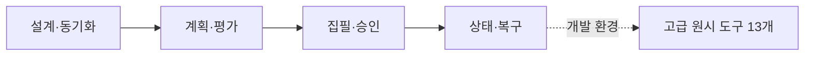

# MCP 도구 레퍼런스

호스트 AI와 직접 연동하는 사용자를 위한 호출 참조입니다. 일반 사용자는 인자를 직접 작성할
필요 없이 [시작 안내](GETTING_STARTED.md)와 [웹툰 만들기](WEBTOON.md)를 따라 요청하세요.

기본 서버가 노출하는 29개 사용자 도구와 고급 표면의 13개 저수준 도구 사용 계약입니다.
새 작품은 승인된 프로필·전체 스토리·작가 스킬·아크를 준비합니다. 이후 집필은
`lore_arc_status`로 활성 아크를 확인하고 `lore_write`로 시작하며, 승인 대기일 때 `lore_decide`를 사용합니다.
저수준 도구는 호환과 엔진 디버깅을 위해 유지하지만 기본 `tools/list`에는 나타나지 않습니다.
전체 도구가 필요한 개발자는 서버 프로세스에 `VIBELORE_MCP_SURFACE=advanced`를 설정합니다.

고급 표면에만 있는 도구는 `lore_context`, `lore_check`, `lore_commit`, `lore_draft`,
`lore_revise`, `lore_rewrite`, `lore_next_arc`, `lore_episode_plan`, `lore_episode_decide`,
`lore_episode_status`, `lore_refold`, `lore_era_research`, `lore_workflow_inspect`입니다. 일반
집필에서는 이 도구들을 직접 조합하지 않습니다.

## 읽는 법

- 모든 작품 도구는 `workId`를 사용합니다.
- `project`는 선택값이지만 절대 경로 전달을 권장합니다.
- `필수`는 MCP `inputSchema.required`와 일치합니다.
- 상세 중첩 schema는 호스트가 받은 `tools/list` 결과를 최종 기준으로 합니다.



## 공통 입력

| 필드 | 필수 | 설명 |
|---|---:|---|
| `project` | 아니오 | 작품 디렉터리 절대 경로. 생략 시 서버의 현재 디렉터리 |
| `workId` | 대부분 | `[A-Za-z0-9_-]` 작품 식별자 |

## 작품 생성과 설계

### `lore_configure`

기존 StoryProfile, StoryIdentity, WriterSkill을 중복 없는 v2 NarrativeContract로 컴파일하고
StorySpine, ArcIntent, 다음 EpisodeIntent 및 현재 품질 파이프라인 모드를 한 번에 보여줍니다.
구형 저장 데이터를 수정하지 않는 읽기 호환 도구입니다.

| 필수 | 선택 |
|---|---|
| `workId` | `project` |

### `lore_style_anchor`

사용자가 직접 승인한 정본 1~3화에서 작품 단위 문체 기준을 만듭니다. 기준은 자동으로
최신 화를 따라가지 않으며, `approve`를 다시 호출할 때만 새 revision으로 바뀝니다. 초고와
수정 단계가 같은 기준을 사용하고, 큰 이탈은 자동 재작성 대신 사용자 검토로 전환됩니다.

| 필수 | 선택 |
|---|---|
| `workId` | `project`, `action: status\|approve`, `chapters[]`, `reason` |

`reason`은 최대 2,000자의 선호 이유입니다. 승인한 정본 예시와 함께 집필에 전달되며,
작품 전체의 새 의무로 취급하지 않습니다. 생략해도 기존 문체 기준 기능을 사용할 수 있습니다.

### `lore_sync`

Published HEAD 이후 사람이 수정한 `world/`, `characters/`, `chapters/` Markdown을 감지합니다.
`inspect`는 변경을 분류하고, 마지막 화는 `validate`가 검사한 뒤 발급한 `approvalId`로
`apply`해야 재발행됩니다. 이전 화와 설계 변경은 영향 분석 없이 자동 적용하지 않습니다.

| 필수 | 선택 |
|---|---|
| `workId` | `project`, `action: inspect\|validate\|apply`, `approvalId` |

### `lore_init`

기존 Markdown 작품을 이어받거나 저수준 빈 프로젝트를 초기화합니다. 자유 장르 신작은
`lore_profile → lore_create` 경로가 우선입니다.

| 필수 | 선택 |
|---|---|
| `workId`, `genre` | `project`, `povMode`, `targetChapters`, `worldFacts[]` |

### `lore_profile`

작품 발견 인터뷰에서 정리한 자연어 브리프를 StoryProfile로 컴파일합니다. 새 작품 요청은
repo skill `story-discovery-interview`가 대화를 진행하고, 이 도구가 답변을 작품별 정본으로
정규화합니다.
`mode=review`에서는 주 장르 쾌감·현재 목표·첫 구체 보상·관계 모드처럼 결과를 실제로
바꾸는 미결정만 최대 5개의 `designReview.openQuestions`로 돌려줄 수 있습니다. 답변을
`feedback`으로 다시 넘기면 기존 `settledDecisions`와 `askedQuestionIds`를 보존한 다음
라운드가 생성됩니다. 짧은 아이디어는 여러 라운드에서 20~30개의 판단이 생길 수 있지만,
질문 수는 할당량이 아니며 중요한 미결정이 사라지면 인터뷰를 끝냅니다.
질문은 advisory이며 사용자가 현재 설계를 의도적으로 승인할 수 있습니다.

웹소설·웹연재 형식은 대사를 독립 문단으로 정규화하는 `dialogueBreakMode=strict`가
기본입니다. 인쇄물에 가까운 형식만 `relaxed`를 사용할 수 있습니다.
StoryProfile의 `readerLegibility`는 전문 지식 없이도 장면의 목표·대사 표면 뜻·결과를
따라가게 하는 작품 단위 원칙이며, `registerPolicy`는 정밀 시각·수치·전문어를 실제로
필요한 상황에 쓰고 일상 장면에는 자연스러운 표현을 고르는 기준입니다. 둘 다 장르별
금지어 목록이 아니라 집필 모델이 판단할 상위 계약입니다.

`readabilityContract`는 주제적 깊이와 별도로 표면 가독성, 새 개념 투입 속도, 독자에게
맡길 추론량, 초반 복잡성 상승 방식을 정합니다. 일반적인 웹소설 기본값은
`easy / slow / explicit / onboarding-first`이며, `review`에서는 이 선택을 확인하는 질문이
최소 한 번 포함됩니다. 사용자가 프로필을 승인하면 현재 값이 작품 계약으로 확정됩니다.

| 필수 | 선택 |
|---|---|
| `workId`, `brief` | `project`, `mode: review\|auto`, `feedback` |

```json
{
  "project": "/novels/night-bus",
  "workId": "my-novel",
  "brief": "심야버스 기사가 승객의 후회를 듣는 현대 판타지",
  "mode": "review"
}
```

### `lore_profile_decide`

pending StoryProfile을 승인하거나 거절합니다.

| 필수 | 선택 |
|---|---|
| `workId`, `action: approve\|reject` | `project` |

### `lore_profile_status`

활성·pending StoryProfile을 읽습니다.

| 필수 | 선택 |
|---|---|
| `workId` | `project` |

### `lore_create`

승인된 프로필과 브리프로 세계, 캐스트, 추적 엔티티를 만듭니다. 모델 pre-flight가 끝나기
전에는 정본을 쓰지 않습니다.

| 필수 | 선택 |
|---|---|
| `workId`, `title`, `brief` | `project`, `genre`, `povMode`, `targetChapters`, `chapterWordCount` |

### `lore_story_plan`

작품 전체의 인과, 주인공 오류, 중간 재해석, 최종 선택 비용을 StorySpine으로 만듭니다.

| 필수 | 선택 |
|---|---|
| `workId` | `project`, `mode: review\|auto`, `direction`, `feedback` |

### `lore_story_decide`

pending StorySpine을 승인하거나 거절합니다.

| 필수 | 선택 |
|---|---|
| `workId`, `action: approve\|reject` | `project` |

### `lore_story_status`

StorySpine과 승인 상태를 읽습니다.

| 필수 | 선택 |
|---|---|
| `workId` | `project` |

### `lore_writer_skill`

작품에 맞는 WriterSkill 3개를 만들고 짧은 산문 오디션으로 후보를 고릅니다.

| 필수 | 선택 |
|---|---|
| `workId` | `project`, `mode: review\|auto`, `feedback` |

### `lore_writer_decide`

pending WriterSkill을 승인하거나 거절합니다.

| 필수 | 선택 |
|---|---|
| `workId`, `action: approve\|reject` | `project` |

### `lore_writer_status`

선택된 WriterSkill과 오디션 결과를 읽습니다.

| 필수 | 선택 |
|---|---|
| `workId` | `project` |

## 아크와 EpisodePlan

EpisodePlan은 `readerBridge` 한 문장으로 해당 화의 즉시 상황과 인간적·생활적 결과를
작가에게 전달합니다. 설정 설명문을 강제하는 필드가 아니며, 초고 입력에서는 정본 전체를
반복하지 않고 EpisodePlan·작품 계약·직전 장면을 하나의 `DraftBrief`로 컴파일합니다.

### `lore_next_arc`

누적 상태에서 다음 아크 후보를 제안합니다. 제안은 아직 활성 아크가 아닙니다. 이전 화에서
수용된 인물의 선택·해석·관계 근거와 종결 아크의 남은 압력을 선택적 후보로 받지만, 모든
인물을 다음 아크에 넣지는 않습니다.

| 필수 | 선택 |
|---|---|
| `workId` | `project`, `currentArc` |

### `lore_arc_plan`

3~20화의 아크 약속과 얇은 회차 비트를 생성합니다.
인물 감정 비트는 매 화 채우는 진행표가 아닙니다. 실제 압력·선택·상대 반응이 계획된
회차만 기록하며, 비어 있는 회차를 중간 단계로 자동 보충하지 않습니다. 같은 단계에
머무르는 것은 허용되고 다음 단계로 이동할 때는 관찰 가능한 행동 근거가 필요합니다.
누적 근거가 있는 인물을 활성화하면 해당 근거가 ArcPlan에 함께 고정됩니다. 이전 개인
아크가 끝나지 않았다면 마지막 감정 비트부터 이어가며, 종결 리뷰에서 해결된 질문은 같은
형태로 다시 열지 않습니다.

| 필수 | 선택 |
|---|---|
| `workId` | `project`, `mode: review\|auto`, `episodes`, `direction`, `feedback` |

```json
{
  "project": "/novels/night-bus",
  "workId": "my-novel",
  "mode": "review",
  "episodes": 5,
  "direction": "첫 승객의 후회를 해결하되 기사의 능력에는 더 큰 대가가 생긴다"
}
```

### `lore_arc_decide`

pending ArcPlan을 승인하거나 거절합니다.

| 필수 | 선택 |
|---|---|
| `workId`, `action: approve\|reject` | `project` |

### `lore_arc_status`

현재 아크, 승인 상태, 다음 회차 비트를 읽습니다. 집필 전 확인 도구입니다.

| 필수 | 선택 |
|---|---|
| `workId` | `project` |

### `lore_arc_review`

이미 작성된 아크를 5화 단위 체크포인트 또는 종결화까지 다시 읽습니다. 전 화의 의미
PatternLedger를 갱신하고 보상 간격, 선택·증거·정서·결말의 반복, 상업적 추진력을 아크
단위로 평가합니다. 완료된 마지막 아크의 리뷰는 다음 `lore_arc_plan`에 advisory evidence로
전달되지만, 특정 장면이나 표현을 강제하는 규칙으로 승격되지는 않습니다.
명시적인 관계 변화나 안전·지위·신뢰를 크게 훼손한 사건이 표본에 있을 때만 관계 인과를
별도로 점검합니다. 이 결과는 평균 점수에 섞이지 않고 근거와 확신도가 있는 advisory로
노출되며 자동 재작성이나 커밋 차단 사유가 되지 않습니다.

| 필수 | 선택 |
|---|---|
| `workId` | `project`, `throughChapter` |

모델 작업이 필요하면 `status=needs_model`을 반환하며 `lore_resume`으로 이어갑니다.

### `lore_episode_plan`

승인된 현재 아크 비트를 2~4개 장면 흐름과 tension으로 확장합니다. `lore_write`는 활성
아크가 있으면 이 단계를 자동으로 수행할 수 있습니다.

| 필수 | 선택 |
|---|---|
| `workId`, `chapter` | `project`, `mode: review\|auto`, `direction`, `feedback` |

### `lore_episode_decide`

특정 화의 pending EpisodePlan을 승인하거나 거절합니다.

| 필수 | 선택 |
|---|---|
| `workId`, `chapter`, `action: approve\|reject` | `project` |

### `lore_episode_status`

특정 화의 계획, 승인, 완료 상태를 읽습니다.

| 필수 | 선택 |
|---|---|
| `workId`, `chapter` | `project` |

## 기본 집필 워크플로

### `lore_write`

다음 화 계획부터 초고, 검사, 최대 3회 수정, 영수증과 승인·커밋까지 실행합니다.

| 필수 | 선택 |
|---|---|
| `workId` | `project`, `instruction`, `autonomy: guided\|auto`, `modelProfile` |

```json
{
  "project": "/novels/night-bus",
  "workId": "my-novel",
  "instruction": "첫 장면은 직전 화의 문 닫히는 소리에서 바로 이어 간다",
  "autonomy": "guided",
  "modelProfile": {
    "default": { "modelId": "gpt-6-astra", "reasoningEffort": "high" },
    "light": "gpt-5.6-sol",
    "quality": { "reasoningEffort": "medium" }
  }
}
```

`modelProfile`은 선택 항목입니다. 키는 `default`, `light`, `identity`, `planning`, `draft`,
`review`, `quality`, `final`이고 값은 모델 ID 문자열 또는 `{ provider, modelId, reasoningEffort }`입니다.
`review`는 advisory 검토(coherence·editorial·character·reader·arc·profile drift), `quality`는
상태를 쓰는 추출·연속성 검사·pattern ledger입니다.
단계별 명시값 > `light`(planning·draft·review만) > `default` 순으로 결정하며, `reasoningEffort`만
있는 항목은 상속한 모델의 생각 수준만 바꿉니다. 결과는 `needs_model` 요청의 `stage`,
`model`, `reasoningEffort` 힌트로 나타나고, 프로필은 workflow에 저장되어 `lore_resume`과
`lore_decide`까지 유지됩니다. 비우면 이전과 동일하게 호스트 모델 하나로 진행합니다.

선행조건은 승인된 StoryProfile, StorySpine, WriterSkill과 활성 ArcPlan입니다. `guided`는
승인 대기, `auto`는 불변식 통과와 critic 정상 완료 뒤 자동 커밋입니다. semantic advisory만으로
자동 재작성하지 않습니다.

모델 요청은 의존 관계별로 묶입니다. 화별 계획(선택 모듈이 불완전하거나 Writer Packet 예산을 넘으면
`episode-plan-repair` 한 번) → 초고 → [상태 추출·프로필 검사·검토 5종] → [의미 연속성 검사·아크 검토] →
[경계 판정·요약] 순서로, 한 `needs_model` 응답의 `requests`는 서로 독립이라 병렬로 답해도
됩니다. 초고 프롬프트의 회차 기획은 승인된 EpisodePlan에서 오며 별도 engine chapter-plan
요청은 없습니다.

승인된 작품 약속·톤·서술 방향과 최대 두 개의 문체 예시가 실제 초고 요청에 들어갑니다.
검토 실패나 불완전 응답은 `CRITIC_INCOMPLETE`와 함께 같은 원고를 승인 대기로 보존합니다.
`quality.review`에서 검토 완료·실패와 출처를 확인하고, `quality.advisories`에서 근거가 있는
검토 의견을 읽을 수 있습니다. 높은 총점이 개별 지적을 삭제하지 않습니다.

### `lore_decide`

`guided` 원고를 승인하거나, 같은 workflow에서 수정 요청하거나, 보류 또는 거절합니다.

| 필수 | 선택 |
|---|---|
| `workId`, `approvalId`, `action: approve\|request_revision\|hold\|reject` | `project`, `feedback` |

`request_revision`에는 `feedback`이 필수입니다. 승인 ID는 `lore_write` 결과에서 받습니다.
검토 실패로 승인 대기에 들어온 `auto` 원고에도 같은 도구를 사용합니다. 명시적으로 승인해도
기존 검토 실패 기록이 정상 완료로 바뀌지는 않습니다.

### `lore_workflow_status`

활성 워크플로의 단계, 시도 횟수, 다음 행동과 품질 결과를 읽습니다. 모델 응답 대기 중이면
`lore_resume`에 넘길 `pendingRunId`도 반환하므로 호스트 응답이 끊겨도 같은 실행을 이어갈 수
있습니다.

| 필수 | 선택 |
|---|---|
| `workId` | `project` |

### `lore_workflow_history`

단계 전환, 검사, 승인, 커밋 이벤트를 시간순으로 읽습니다.

| 필수 | 선택 |
|---|---|
| `workId` | `project`, `workflowId`, `limit`, `includeModelExchanges` |

`workflowId`를 생략하면 현재 workflow를 조회하며, `limit`의 기본값은 최근 이벤트 100개입니다.
`includeModelExchanges`는 기본적으로 꺼져 있습니다. `true`이면 조회한 이벤트에 연결된
실제 초고·검토 요청과 응답을 `modelExchanges`로 함께 반환합니다. 모든 회차의 모든 모델
호출을 한 번에 내보내는 옵션은 아닙니다.

`draft_context_supplied`에는 초고 입력과 예시 선택 근거, `reviews_completed`에는 총점과
무관한 원본 findings 및 검토 출처·상태, `runtime_identified`에는 실행 소스 식별값이 남습니다.
이전 버전에서 저장하지 않은 전문은 소급 생성하지 않습니다.

실제 조회 예시는 [검토 응답과 감사](OPERATIONS.md#검토-응답과-감사)를 참고하세요.

### `lore_workflow_inspect`

소설은 현재 또는 지정 워크플로의 안전한 상세와 검사 영수증을 읽으며 원고 전문과 모델
응답을 노출하지 않습니다. 웹툰은 `lane="webtoon"`과 `detail`로 상세를 선택하며 full에 원작·계획이 포함될 수 있습니다.

| 필수 | 선택 |
|---|---|
| `workId` | `project`, `workflowId` |

## 웹툰 제작

기존 원작을 사용하는 별도 workflow입니다. 실제 질문·이미지 job·승인 ID는 응답을 기준으로
이어가며, 상세 흐름은 [WEBTOON.md](reference/WEBTOON_WORKFLOW.md)를 봅니다.

### `lore_webtoon_scene`

러프 없이 장면 전체와 대사를 함께 생성하도록 사용자가 선택한 경우에는 `lore_webtoon_scene`을 사용합니다. 새 장면은 사용자가 `panelCount`를 정수(1~12) 또는 `"auto"`로 선택해야 하며, 누락 시 `needs_interview`로 `[4, 6, 8, 9, "auto"]`를 제안합니다. `auto`는 각색할 때마다 AI가 3~12칸 중 적정 수를 새로 고르고, 그 뒤 검증·이미지·검토는 그 수로 고정됩니다. 정수 3 미만은 허용하되 응답 `warnings`에 연속성 저하 경고를 실습니다. 확정된 이미지 API 선택이 없는 작품은 start가 `needs_image_choice`를 반환하며, 사용자의 원답을 `feedback`에 넣고 `confirmImageChoice`로 확정합니다. `previousWorkflowId`로 직전 장면의 실제 이미지와 검토 결과를 이어 받아 인물·배경·동작 연속성을 검증합니다. 실제 칸 수가 선택과 다르면 완료되지 않습니다. 새 장면은 생성 전 검증에서 짧은 `renderBrief`와 `drawability` 판정을 확정해야 이미지 요청이 나갑니다. 그림 모델에는 검토 보고서나 중복 연출 설명을 보내지 않습니다. 생성 전 검증이나 이미지 검토가 불합격이면 `autoRevisions`(start 전용, 0~3, 기본 2) 횟수만큼 관측 결함을 feedback으로 자동 재설계하고 새 이미지 요청을 냅니다. 실패한 시도는 응답 `attempts`에 남고, 0이면 예전처럼 `scene_needs_revision`에서 멈춥니다.
이 별도 경로는 원작 범위 고정 → 통합 영어 연출 → 생성 전 검증 → 장면 이미지 → 실제 시각 검토로 진행합니다.
`action=start|revise|retry`, `sourceChapters`, `sourceUnitIds`, `direction`, `references`, `asset`을 받습니다.
기존 승인된 이미지 API 선택이 필요하며 `needs_model`은 `lore_resume`, 조회는 `lane=webtoon`을 사용합니다.
생성 전 검증이 통과해야 `needs_scene_image`가 나오며 이때만 API를 실행합니다.
원작·참조·계획 해시가 바뀐 반입과 미열람 시각 검토는 거절합니다.
세부 계약은 [장면 통합 제작](reference/WEBTOON_WORKFLOW.md#장면-통합-제작--명시적-선택-경로)을 참고하세요.

### `lore_webtoon_plan`

| 필수 | 선택 |
|---|---|
| `workId` | `project`, `workflowId`, `revision`, `sourceChapters[]`, `episode`, `maxShots`, `mode`, `segmented`, `imageModel`, `direction`, `feedback`, `responses`, `retry`, `newWorkflow`, `adoptEdits` |

원작 고정, 인터뷰, 방향 승인, 장면 선별, 각색·검토·계획 승인을 관리합니다.
새 작업의 W04 작화·W15 문자·W16 판면은 auto에서도 사용자 선택이 필요합니다.
`maxShots`는 상한이지 목표 컷 수가 아닙니다. `needs_interview`는 사용자 답변,
`needs_model`은 `lore_resume`으로 보낼 모델 응답입니다. 페이지형 선택은
`needs_format_support`로 보존하고 멈춥니다.

### `lore_webtoon_render`

| 필수 | 선택 |
|---|---|
| `workId`, `workflowId` | `project`, `revision`, `detail`, `quality`, `reviewAccess`, `imageModel`, `imageExecution`, `confirmImageChoice`, `preserveReferences`, `continuityPlan`, `continuityRoughs[]`, `continuityReviews[]`, `references[]`, `assets[]`, `regenerateShotIds[]`, `revisionTarget`, `feedback`, `retry` |

`quality`는 `references`, `preview`, `final`입니다. 모델·경로·비용 확인 뒤 호스트가
반환된 jobs만 실행하고 실제 이미지 경로와 현재 `inputHash`로 반입합니다. 서버는 유료
API를 직접 실행하지 않습니다. 신규 작업은 `continuityPlan.version=2`의 전체 컷 계획,
실제 러프 검토와 사용자 storyboard 승인 없이는 본 작화를 받을 수 없습니다.
`continue`/anchor는 검토된 앞 그림에 의존하고 `cut`은 승인 러프로 병렬 생성할 수 있지만,
인접한 실제 그림의 연결 검토는 둘 다 필요합니다.

`revisionTarget:{kind:"lettering",shotIds:[...]}`와 feedback은 그림을 유지하는 조판 수정입니다.
조판 실패는 이 도구의 `retry=true`로 재개합니다. 검토 불가를 통과로 보고하지 않습니다.
중첩 이미지·러프·검토 스키마와 예제는 [웹툰 안내](WEBTOON.md)를 따릅니다.

### `lore_webtoon_decide`

| 필수 | 선택 |
|---|---|
| `workId`, `workflowId`, `approvalId`, `action` | `project`, `revision`, `feedback`, `revisionTarget` |

`action`은 `approve`, `request_revision`, `hold`, `reject`입니다. 현재
profile/plan/references/storyboard/look/final gate에만 적용됩니다. 수정 요청에는 feedback을
주고, 각색은 `revisionTarget.kind="adaptation"`, 구도는 `storyboard`와 선택 `sceneIds`,
조판은 `lettering`과 `shotIds`로 범위를 구분합니다. 승인된 소설은 변경하지 않습니다.

조회는 `lore_workflow_status/history(lane="webtoon",workflowId="wt-...")`입니다.
status는 기본 `detail="summary"`, 필요하면 `full`을 지정합니다. 고급
`lore_workflow_inspect`도 `lane`, `workflowId`, `detail`을 받으며 웹툰 full 응답에는
계획·원작 정보가 포함될 수 있습니다. lane 생략은 기존 소설 조회입니다.

## 저수준 집필 도구

디버깅과 수동 집필용입니다. 일반 집필에서는 `lore_write`가 우선입니다.

### `lore_context`

정본 사실, 인물, 관계, 복선, 최근 요약을 다음 화 컨텍스트로 조립합니다.

| 필수 | 선택 |
|---|---|
| `workId`, `chapter` | `project`, `scene.entityIds[]` |

### `lore_draft`

저장하지 않은 초고를 생성합니다.

| 필수 | 선택 |
|---|---|
| `workId`, `chapter` | `project`, `plan`, `targetChars`, `tension` |

### `lore_check`

본문의 결정론 검사와 의미 검사를 수행합니다.

| 필수 | 선택 |
|---|---|
| `workId`, `chapter`, `prose` | `project`, `castManifestRaw`, `deterministicOnly` |

### `lore_revise`

검사 위반을 최소 수정한 전체 본문을 생성합니다. 결과는 다시 검사해야 합니다.

| 필수 | 선택 |
|---|---|
| `workId`, `chapter`, `prose`, `violations[]` | `project` |

### `lore_commit`

검사된 본문, 요약과 상태를 정본에 반영합니다.

| 필수 | 선택 |
|---|---|
| `workId`, `chapter`, `prose` | `project`, `title`, `summary`, `castManifestRaw`, `checkId` |

활성 통합 워크플로가 있으면 그 워크플로의 `checkId`와 정확히 같은 본문 hash가 필요합니다.

### `lore_rewrite`

저장된 한 화를 `intent`에 맞춰 다시 쓴 초안을 반환합니다. 자동 저장하지 않습니다.

| 필수 | 선택 |
|---|---|
| `workId`, `chapter`, `intent` | `project` |

반영 순서는 `lore_rewrite → lore_check → lore_commit → lore_refold`입니다.

### `lore_refold`

수정한 앞 화부터 이후 모든 델타를 다시 접어 StoryState와 엔티티 생명주기를 계산합니다.

| 필수 | 선택 |
|---|---|
| `workId` | `project`, `fromChapter` |

### `lore_era_research`

호스트 모델의 검색 능력으로 시대·지역 고증 주장을 확인합니다.

| 필수 | 선택 |
|---|---|
| `workId`, `chapter`, `claims[]` | `project`, `era`, `maxCalls` |

출처가 있는 충돌만 soft 위반으로 보고하며, 불명확한 내용은 `uncertain`으로 남깁니다.

### `lore_resume`

`needs_model`로 중단된 실행을 재개합니다.

| 필수 | 선택 |
|---|---|
| `runId` | `project`, `workId`, `answers` |

`answers`는 `{ requestId: "모델 답변" }` 객체입니다. 한 응답에 담긴 여러 `requests`는 서로
독립이므로 병렬로 만들어 한 번에 넘깁니다. 각 request의 `system` 끝에는 파일 읽기·도구
없이 제공된 내용만으로 단일 응답을 만들라는 실행 조건이 붙어 있습니다. `promptCache`가 있는
묶음은 `system`이 실행 조건 하나이고 역할 지시가 `user`의 공통 자료 블록 뒤로 옮겨지며,
`warmFirst` 요청을 먼저 보내면 캐시를 재사용합니다
([프롬프트 캐시와 warm-first](OPERATIONS.md#프롬프트-캐시와-warm-first)). 저수준 소설 검사는
빈 객체로 결정론 결과만 반환할 수 있지만, 웹툰의 미응답 요청은 빈 답변으로 완료되지 않고 대기합니다.

## 상태와 복구

### `lore_status`

현재 화수, 다음 화, 인물, 세계 사실, 미해결 복선, 아크 커서와 실행 중인 MCP 계약
버전을 읽습니다.

| 필수 | 선택 |
|---|---|
| `workId` | `project` |

### `lore_snapshot_status`

커밋 때 생성된 장별 snapshot 목록을 읽습니다.

| 필수 | 선택 |
|---|---|
| `workId` | `project` |

### `lore_rollback`

양의 정수 chapter가 가리키는 버전 2 snapshot을 검증하고 새 Published HEAD로 정본과 상태를 되돌립니다. 복원 전 현재 상태는
`.vibelore/rollback-archives/`에 보존합니다.

| 필수 | 선택 |
|---|---|
| `workId`, `chapter` | `project` |

## 호출 선택표

| 상황 | 호출 |
|---|---|
| 새 자유 장르 작품 | `profile → create → story_plan → writer_skill → arc_plan` |
| 다음 화 작성 | `lore_write` |
| 완성 원고 승인 | `lore_decide` |
| 기존 소설 웹툰화 | `lore_webtoon_plan → lore_webtoon_render`, 각 gate는 `lore_webtoon_decide` |
| 웹툰 진행·검토 이력 | `lore_workflow_status/history(lane="webtoon")` |
| 멈춘 모델 작업 | `lore_resume` |
| 현재 진행 확인 | `lore_workflow_status` |
| 앞 화만 수정 | `rewrite → check → commit → refold` |
| 작품 전체를 과거로 복원 | `snapshot_status → rollback` |
| 설정만 확인 | 상태 계열 도구 또는 `lore_context` |
