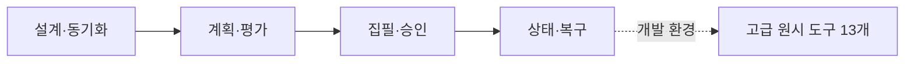

# MCP 도구 레퍼런스

한국어 | [English](TOOLS.en.md)

호스트 AI와 직접 연동하는 사용자를 위한 호출 참조입니다. 일반 사용자는 인자를 직접 작성할
필요 없이 [시작 안내](GETTING_STARTED.md)와 [웹툰 만들기](WEBTOON.md)를 따라 요청하세요.

기본 서버가 노출하는 33개 사용자 도구와 고급 표면의 13개 저수준 도구 사용 계약입니다.
새 작품은 승인된 프로필·전체 스토리·작가 스킬·아크를 준비합니다. 이후 집필은
`lore_arc_status`로 활성 아크를 확인하고 `lore_write`로 시작하며, 승인 대기일 때 `lore_decide`를 사용합니다.
저수준 도구는 호환과 엔진 디버깅을 위해 유지하지만 기본 `tools/list`에는 나타나지 않습니다.
전체 도구가 필요한 개발자는 서버 프로세스에 `VIBELORE_MCP_SURFACE=advanced`를 설정합니다.

고급 표면에만 있는 도구는 `lore_context`, `lore_check`, `lore_commit`, `lore_draft`,
`lore_revise`, `lore_rewrite`, `lore_next_arc`, `lore_episode_plan`, `lore_episode_decide`,
`lore_episode_status`, `lore_refold`, `lore_era_research`, `lore_workflow_inspect`입니다. 일반
집필에서는 이 도구들을 직접 조합하지 않습니다.

기존 컷별 웹툰 마무리에는 `VIBELORE_MCP_SURFACE=compat`로 deprecated 3개 도구를
추가 노출합니다(총 36개). 새 웹툰은 기본 표면의 `lore_webtoon_scene`을 사용합니다.

## 읽는 법

- 모든 작품 도구는 `workId`를 사용합니다.
- `project`는 선택값이지만 절대 경로 전달을 권장합니다.
- `필수`는 MCP `inputSchema.required`와 일치합니다.
- 상세 중첩 schema는 호스트가 받은 `tools/list` 결과를 최종 기준으로 합니다.


```mermaid
flowchart LR
    D[설계·동기화] --> P[계획·평가]
    P --> W[집필·승인]
    W --> O[상태·복구]
    O -. 개발 환경 .-> X[고급 원시 도구 13개]
```

## 공통 입력

| 필드 | 필수 | 설명 |
|---|---:|---|
| `project` | 아니오 | 작품 디렉터리 절대 경로. 생략 시 서버의 현재 디렉터리 |
| `workId` | 대부분 | `[A-Za-z0-9_-]` 작품 식별자 |

## 독립 세계 정의 등록부

### `lore_registry`

소설 없이 SharedLore의 대상 종류·단위·필드·관계 정의를 등록하고 검색합니다.
필수 입력은 `action`, `registryRoot`(공유 세계 절대 경로), `universeId`이며 작품 인자는 받지 않습니다.
`status`에서 HEAD와 지원 capability를 확인하고 `search`로 key·별칭을 재사용합니다.
`register`는 `expectedHead`(최초 null), `reason`, `definitions` 또는 `preset=base|fantasy`로
지원되는 새 정의를 추가합니다. 같은 ID의 의미·타입·소유 변경은 이행 필요 오류입니다.
`resolve`는 `revisionId`, `input`, `query`를 명시해 `resolved`, `unknown`, `conflict`,
`incomplete`를 구별합니다. 등록만으로 기존 집필·웹툰에 설정이 채택되지는 않습니다.
`ensure(needs,reason,operationId,expectedHead?)`는 AI가 집필 중 발견한 새 항목을 검색→재사용→검증→비파괴 추가로
한 번에 처리합니다. 결과 `outcomes`는 `reused|registered|migration_required|unsupported|invalid`이고,
같은 `operationId`의 재시도·재개는 첫 결과를 재생합니다(다른 요청이면 `OPERATION_CONFLICT`). 의미·타입·소유 변경은
migration 후보로만 기록하며, 미지원 capability(`status.unsupportedCapabilities`)는 등록하지 않습니다.
정확한 스키마·호스트 AI 절차·지원 범위는 [SharedLore 등록부 계약](reference/SHARED_LORE_REGISTRY.md)을 따릅니다.

### `lore_universe`

`documents(loreRevisionId,documentIds?)`는 고정 판본의 문서 목록·소유·시점을 반환합니다.
ID를 지정하면 실제 원문도 반환합니다. 호스트 AI가 각 단계에 필요한 근거를 선택할 때 씁니다.

`action,worldRoot,universeId`로 공유 세계를 관리합니다. `propose(expectedHead,registryRevisionId,content,reason)`는
원문·인물·상태·값의 전체 후보와 실제 변경을 검증해 보여 줍니다. 사용자 승인 후
`decide(proposalId,expectedHead,decision=approve|reject)`합니다. `resolve(loreRevisionId,query)`는 고정 판본 조회,
`status`는 HEAD와 원문 drift, `recover`는 발행 뒤 중단된 원문 반영 복구입니다.

### `lore_bind`

`action,workId,project`로 작품의 공유 세계 연결을 관리합니다. `inspect(worldRoot,binding)`에서
cast·화별 시점·필수 필드·투영·활성 계획 영향을 검토한 뒤 `apply(proposalId,expectedHead)`로 승인 적용합니다.
binding은 작품 발행 tree와 work.md에 저장하며 변경하면 기존 영수증을 재사용할 수 없습니다.
`status`는 현재 연결을 반환합니다. [채택·작품 연결 계약](reference/SHARED_LORE_RUNTIME.md)에 전체 스키마와 제한이 있습니다.
`schemaVersion:2` binding은 장면마다 `frame=present|flashback`을 받고 화 안의 장면별 상태를 장면 단위로 기록해 AI 검토에 넘깁니다(낱말 대조 검사는 하지 않음).
기존 작품의 inspect 결과 `migration`은 dry run 보고입니다: 로컬 값과 공유 값의 화별 diff, 작품→공유로 넘어가는 소유 대상,
보존되는 원문, 이름이 같은 비연결 인물 후보(`not_merged`, 자동 병합 없음)를 보여 줍니다. 되돌리기는 `lore_rollback`을 씁니다.

### `lore_assets`

`action,worldRoot,universeId`로 공유 세계의 참조 이미지·표현 프로필 카탈로그를 관리합니다.
`propose(expectedHead,loreRevisionId,assets,profiles,reason)`는 실제 파일 바이트(PNG/JPEG 컨테이너·크기)를 검증하고
내용 해시로 후보를 만들며, 인물·상태 링크를 채택된 세계 판본에 대조합니다. 사용자 승인 후 `decide`가 독립 카탈로그
HEAD를 발행합니다. 같은 `assetId` 재제안은 새 revision이며 이전 바이트와 발급된 제작 잠금은 그대로입니다. 표현 프로필은
화풍·팔레트만 담고 세계 값 키는 `EXPRESSION_PROFILE_OWNERSHIP`으로 거부합니다. `recover`는 승인 발행 중단 복구입니다.

### `lore_scene_script`

`action,workId,project`로 소설 없이 작품 소유의 독립 장면 대본을 제작 원천으로 채택합니다. `inspect(worldRoot,script)`는
대본 원문, 장면 순서, 장면별 세계 시점과 `frame`, cast와 승인 상태, 작품 언어, 표현 프로필, 고정 asset을 해석해
미리보기와 잠금 후보를 보여 주고, 미정·충돌은 `unresolved`의 `blockers`로 돌려줍니다. 사용자 승인 후
`apply(proposalId,expectedHead)`가 대본 판본·잠금·asset 바이트를 작품의 `.vibelore/input-objects/`에 봉인하고
`scenes/<scriptId>.md`를 씁니다. 공유 세계와 소설 정본은 바꾸지 않고 소설 Foundation·화를 만들지 않습니다.

## 작품 언어와 분량 단위

작품을 어떤 언어로 쓸지는 `language` 선택 인자 하나로 정해집니다. 이 절이 언어·분량 계약의
단일 기준이며, 실제로 노출되는 인자 목록은 서버가 반환한 `tools/list` schema를 따릅니다.

### `language` 인자

`lore_profile`, `lore_init`, `lore_create`, `lore_write`가 받는 선택 인자입니다. 사용자가
집필 언어를 자연어로 밝히면 호스트가 BCP 47 태그로 정규화해 넘깁니다 — 일본어 → `ja`,
브라질 포르투갈어 → `pt-BR`, 번체 중국어 → `zh-Hant`. 식별 가능한 태그면 되고 소수의 허용
목록으로 제한하지 않으며, 문자(script)와 지역(region) 하위 태그는 그대로 보존합니다.

사용자가 언어를 고르지 않았으면 인자를 **생략합니다**. 생략은 이미 정해진 언어를 그대로
쓴다는 뜻이며, 호스트나 schema가 기본값으로 `ko`를 채워 넣지 않습니다. 언어 키가 없는 기존
프로필과 작품은 "미설정"이 아니라 이미 선택된 암묵적 `ko`입니다.

대화 언어와 작품 언어는 별개입니다. 한국어로 대화하면서 `ja` 작품을 쓸 수 있습니다. 한
호출에 서로 다른 언어가 둘 이상 들어오면 조용히 하나를 고르지 않고
`LANGUAGE_SELECTION_REQUIRED`로 선택을 요청합니다.

### 언제 정해지고 언제 잠기는가

| 시점 | 규칙 |
|---|---|
| foundation 이전 (`lore_profile`, `lore_init`, `lore_create`) | 프로필이 있으면 현재 승인된 revision이 기준. 프로필이 없는 init/create는 요청 언어를 쓰고, 요청이 없으면 암묵적 `ko` |
| 언어 변경 | 새 프로필 revision을 만들어 다시 승인 (`lore_profile` → `lore_profile_decide`) |
| foundation 생성 | 현재 승인된 revision의 언어로만 `lore_create` |
| foundation 이후 (`lore_write` 등) | v1에서 작품 언어는 불변 |

저장된 언어와 다른 값을 생성 경로에 넘기면 조용한 override가 아니라
`LANGUAGE_CONTRACT_CONFLICT`입니다. 이미 만들어진 작품에 다른 언어를 넘기면
`WORK_LANGUAGE_IMMUTABLE` 단언 실패이며, 본문 언어를 덮어쓰지 않고 새 작품을 안내합니다.
저장된 값과 같은 값을 넘기는 것은 확인용으로 허용됩니다.

### 프롬프트 계열

base language가 `ko`면 한국어 특화 계열, 그 밖의 언어(영어 포함)는 영어 공통 지시문에 목표
언어를 결합한 계열을 사용합니다. 목표 언어는 본문, 제목, 요약, 세계·인물 설명, 계획과 검토의
설명 값에 적용됩니다. JSON 키, 기존 enum 값, ID, 경로, sentinel 태그처럼 기계가 읽는 안정
값은 번역하지 않습니다.

### 분량 단위

분량은 단위를 명시합니다: `legacyCodeUnits`(JS 문자열 길이), `graphemes`(Unicode 문자군),
`words`(목표 언어의 단어 단위). 기존 `chapterChars`, `chapterWordCount`, `targetChars`는
이름과 무관하게 전부 `legacyCodeUnits`로 해석하며 다시 해석하지 않습니다. 기본값은 한국어
계열이 `legacyCodeUnits`, 그 밖의 언어가 `graphemes`이며 단어 단위를 임의로 가정하지
않습니다. 목표 언어가 단어 분할을 실제로 지원하지 않으면 `UNSUPPORTED_LENGTH_MEASUREMENT`로
알리고 `graphemes`를 제시합니다. 한 호출에서 단위나 목표가 어긋나게 중복 지정되면
`LENGTH_CONTRACT_CONFLICT`입니다.

### 검증과 승인 게이트

새 언어 계약으로 만든 작품은 한국어 작품을 포함해 출력 언어를 검증합니다. 이미 승인·발행된
구작 정본은 읽기만으로 소급 감사하지 않습니다.

언어와 연속성은 필수 gate입니다. 필수 gate를 통과하지 못한 원고는 `auto`든 사용자의 명시
승인이든 승인도 발행도 되지 않습니다. 필수 gate를 통과한 뒤 critic만 실패하거나 불완전한
경우에만 `CRITIC_INCOMPLETE`와 함께 같은 원고를 승인 대기로 보존하는 경로를 사용합니다.

검사는 최대 3회이며 그 사이 최소 수정은 최대 2회입니다. 세 번째 검사에서도 실패하면(`clean_fail`) 자동으로 다시 시작하지 않고 원고를 보존한 채 종료하며, 같은
원고로 검증을 다시 돌리려면 `retryValidation=true`를 명시합니다. 보존 원고나 승인 대기 원고의
검사 뒤 계획·계약이 바뀌었거나 손수정을 `lore_sync`로 발행했다면, `lore_write`(`retryValidation`
여부와 무관)가 같은 원고를 현재 계약으로 다시 검사합니다(새 초고 없음). 승인을 기다리던 원고는
`guided`로 유지되고, 남은 수정 요청 피드백은 이어서 적용됩니다. 새 `instruction`을 주거나 보존
원고가 없을 때만 초고를 새로 씁니다.

언어 검증은 출력 언어가 계약과 일치하는지를 판정하며, 언어별 표현이 원어민 수준인지는
판정하지 않습니다.

## 작품 생성과 설계

### `lore_configure`

기존 StoryProfile, StoryIdentity, WriterSkill을 중복 없는 v2 NarrativeContract로 컴파일하고
StorySpine, ArcIntent, 다음 EpisodeIntent 및 현재 품질 파이프라인 모드를 한 번에 보여줍니다.
구형 저장 데이터는 수정하지 않습니다. 선택 인자를 넘기면 작가 지원 설정만 저장합니다.

- `disabledReviews`: 끌 매 화 검토 목록 전체(`story-profile-check`, `coherence-judge`,
  `editorial-quality`, `character-fidelity`, `reader-hook`, `pattern-ledger`, `arc-review`). 꺼진 검토는
  요청하지 않고 `disabled_by_user`로 기록하며 auto 커밋을 막지 않습니다.
- `planningReviews`: `{story?, arc?, episode?}`. false면 해당 단계의 의미·품질 모델 검토를 모두
  생략합니다. true면 켭니다. 지정한 필드만 갱신하며 구조·참조·설정·언어 검사는 유지합니다.
  기존 작품도 명시적으로 true를 지정하면 단계별 의미 검토를 적용합니다.
- `arcReview`: `{everyEpisodes?, atEnd?}`. 기본은 5화 단위와 아크 종료 검토입니다. everyEpisodes는
  0~20의 정수이며 0은 중간 검토 생략입니다. atEnd로 종료 검토를 고릅니다. 지정한 필드만 갱신합니다.
- `disabledDraftSections`: 초고에서 뺄 선택 섹션 목록 전체(`older-memory`, `previous-tail`,
  `author-craft`, `style-anchor`).
- `tracking`: 추적 기능 켜기/끄기(`objects`, `knowledge`, `scheduled`, `hooks`). 기본은 모두 켜짐.
  objects=물건·장소·단서·능력, knowledge=누가 무엇을 아는가, scheduled=일어나기로 된 일(회귀 전생
  사건·예언·예약), hooks=떡밥.
- `customTracking`: 작가 정의 추적 항목 전체 목록(교체). `{name, feature, pinned?, rules?, note?}`.
  pinned=매 화 입력에 항상 포함. rules: `monotonic{field,direction:up|down,unless?}`,
  `frozenAfter{status}`, `speakerOnly{alias,by}`; note=검토 모델에 보여줄 자연어 규칙(advisory).
- `mergeRecords`: 같은 대상으로 확인된 기록 병합 목록. `{from, into}`(from을 into에 흡수). 다음에
  쓸 화부터 반영(`atChapter`로 저장). tracking·customTracking 변경도 다음 화부터 적용되고, 이미 쓴 화의
  이력은 그대로 남습니다.

응답의 `reviewPolicy`와 `draftSections`가 현재 설정과 선택지를 보여주고, `tracking`(`enabled`,
`available`)·`customTracking`·`merges`가 추적 설정을 보여줍니다. 모르는 이름은 거부합니다.

| 필수 | 선택 |
|---|---|
| `workId` | `project`, `disabledReviews`, `planningReviews`, `arcReview`, `disabledDraftSections`, `tracking`, `customTracking`, `mergeRecords` |

### `lore_style_anchor`

사용자가 직접 승인한 정본 1~3화에서 작품 단위 문체 기준을 만듭니다. 기준은 자동으로
최신 화를 따라가지 않으며, `approve`를 다시 호출할 때만 새 revision으로 바뀝니다. 초고와
수정 단계가 같은 기준을 사용하고, 큰 이탈은 자동 재작성 대신 사용자 검토로 전환됩니다.

| 필수 | 선택 |
|---|---|
| `workId` | `project`, `action: status\|approve`, `chapters[]`, `reason` |

`reason`은 최대 2,000자의 선호 이유입니다. 승인한 정본 예시와 함께 집필에 전달되며,
작품 전체의 새 의무로 취급하지 않습니다. 생략해도 기존 문체 기준 기능을 사용할 수 있습니다.

### `lore_sync`

Published HEAD 이후 사람이 수정한 `world/`, `characters/`, `chapters/` Markdown을 감지합니다.
`inspect`는 변경을 분류하고, 마지막 화는 `validate`가 검사한 뒤 발급한 `approvalId`로
`apply`해야 재발행됩니다. 이전 화와 설계 변경은 영향 분석 없이 자동 적용하지 않습니다.

| 필수 | 선택 |
|---|---|
| `workId` | `project`, `action: inspect\|validate\|apply`, `approvalId` |

### `lore_init`

기존 Markdown 작품을 이어받거나 저수준 빈 프로젝트를 초기화합니다. 자유 장르 신작은
`lore_profile → lore_create` 경로가 우선입니다.

| 필수 | 선택 |
|---|---|
| `workId`, `genre` | `project`, `povMode`, `targetChapters`, `worldFacts[]`, `language` |

### `lore_profile`

처음에는 작품 전체를 얼마나 함께 질문·준비할지 `discovery={depth:quick|standard|deep,focus?,userAnswer}`로
확인합니다. 미선택 review는 `discovery-depth` 하나만 보여 주며 답하기 전에는 승인할 수 없습니다.
실제 답변 원문을 brief/feedback에 넣고 기록합니다. `action=preferences`는 활성 프로필의 선호만 갱신하고
작품 내용과 active 상태를 보존합니다. [작품 준비와 단계별 검토](reference/STORY_PREPARATION_WORKFLOW.md)를 따릅니다.

세계관 범위는 협업 깊이·읽기 난도와 별도로 `worldbuilding={scope:starter|story|universe,focus?,userAnswer}`에
기록합니다. userAnswer는 brief/feedback의 실제 답변입니다. 세계 범위가 필요한 미결정일 때 질문하며 확정 선택은 후속 라운드에 유지합니다. [상세 준비와 단계별 참조](reference/WORLD_BUILDING_WORKFLOW.md)를 따릅니다.

`worldbuildingSource={worldRoot,universeId,loreRevisionId,documentIds}`를 넘기면 첫 인터뷰부터 채택한
공개 세계 문서를 읽습니다. 다음 라운드와 `lore_create`는 같은 선택을 계승합니다. 원문 drift·공개 범위·
문맥 예산 검사를 적용하며 `action=preferences`에서는 원천 선택을 바꾸지 않습니다.

작품 발견 인터뷰에서 정리한 자연어 브리프를 StoryProfile로 컴파일합니다. 새 작품 요청은
repo skill `story-discovery-interview`가 대화를 진행하고, 이 도구가 답변을 작품별 정본으로
정규화합니다.
`mode=review`에서는 주 장르 쾌감·현재 목표·첫 구체 보상·관계 모드처럼 결과를 실제로
바꾸는 미결정만 최대 5개의 `designReview.openQuestions`로 돌려줄 수 있습니다. 답변을
`feedback`으로 다시 넘기면 기존 `settledDecisions`와 `askedQuestionIds`를 보존한 다음
라운드가 생성됩니다. 짧은 아이디어는 여러 라운드에서 20~30개의 판단이 생길 수 있지만,
질문 수는 할당량이 아니며 중요한 미결정이 사라지면 인터뷰를 끝냅니다.
질문은 advisory이며 사용자가 현재 설계를 의도적으로 승인할 수 있습니다.

`dialogueBreakMode`를 명시하지 않으면 `ko` 작품은 대사를 독립 문단으로 정규화하는 `strict`,
그 밖의 언어는 그 언어의 일반적인 대사+발화자 서술 관습인 `natural`이 기본입니다. `strict`·`relaxed`·`natural`은
프로필 형식에서 명시해 고를 수 있습니다.
StoryProfile의 `readerLegibility`는 전문 지식 없이도 장면의 목표·대사 표면 뜻·결과를
따라가게 하는 작품 단위 원칙이며, `registerPolicy`는 정밀 시각·수치·전문어를 실제로
필요한 상황에 쓰고 일상 장면에는 자연스러운 표현을 고르는 기준입니다. 둘 다 장르별
금지어 목록이 아니라 집필 모델이 판단할 상위 계약입니다.

`readabilityContract`는 주제적 깊이와 별도로 표면 가독성, 새 개념 투입 속도, 독자에게
맡길 추론량, 초반 복잡성 상승 방식을 정합니다. 일반적인 웹소설 기본값은
`easy / slow / explicit / onboarding-first`이며, `review`에서는 이 선택을 확인하는 질문이
최소 한 번 포함됩니다. 사용자가 프로필을 승인하면 현재 값이 작품 계약으로 확정됩니다.

| 필수 | 선택 |
|---|---|
| `workId`, `brief` | `project`, `action: design\|preferences`, `mode: review\|auto`, `feedback`, `discovery`, `worldbuilding`, `worldbuildingSource`, `language`, `length` |

```json
{
  "project": "/novels/night-bus",
  "workId": "my-novel",
  "brief": "심야버스 기사가 승객의 후회를 듣는 현대 판타지",
  "mode": "review"
}
```

### `lore_profile_decide`

pending StoryProfile을 승인하거나 거절합니다.

| 필수 | 선택 |
|---|---|
| `workId`, `action: approve\|reject` | `project` |

### `lore_profile_status`

활성·pending StoryProfile을 읽습니다.

| 필수 | 선택 |
|---|---|
| `workId` | `project` |

### `lore_create`

`worldbuildingSource={worldRoot,universeId,loreRevisionId,documentIds}`는 승인한 상세 세계와 도입 문서
선택입니다. scope=story/universe이면 먼저 세계를 채택하고 이 원천을 전달해야 합니다. 생성 후
lore_bind로 연결한 뒤 전체 이야기를 계획합니다. 큰 세계를 5~10개 출발 사실로 대체하지 않습니다.
프로필에 원천 선택이 있으면 생성 시 생략해도 계승합니다. 생성된 문구의 언어 오류는 제한된 번역과
의미 비교 후 새 hash로 검사하며, 성공하면 `languageRepair`에 실제 전후 변경과 근거를 반환합니다.

승인된 프로필과 브리프로 세계, 캐스트, 추적 엔티티를 만듭니다. 모델 pre-flight가 끝나기
전에는 정본을 쓰지 않습니다.

| 필수 | 선택 |
|---|---|
| `workId`, `title`, `brief` | `project`, `genre`, `povMode`, `targetChapters`, `chapterWordCount`, `worldbuildingSource`, `language`, `length` |

### `lore_story_plan`

작품 전체의 인과, 주인공 오류, 중간 재해석, 최종 선택 비용을 StorySpine으로 만듭니다.

| 필수 | 선택 |
|---|---|
| `workId` | `project`, `mode: review\|auto`, `direction`, `feedback` |

### `lore_story_decide`

pending StorySpine을 승인하거나 거절합니다.

| 필수 | 선택 |
|---|---|
| `workId`, `action: approve\|reject` | `project` |

### `lore_story_status`

StorySpine과 승인 상태를 읽습니다.

| 필수 | 선택 |
|---|---|
| `workId` | `project` |

### `lore_writer_skill`

작품에 맞는 WriterSkill 3개를 만들고 짧은 산문 오디션으로 후보를 고릅니다.

| 필수 | 선택 |
|---|---|
| `workId` | `project`, `mode: review\|auto`, `feedback` |

### `lore_writer_decide`

pending WriterSkill을 승인하거나 거절합니다.

| 필수 | 선택 |
|---|---|
| `workId`, `action: approve\|reject` | `project` |

### `lore_writer_status`

선택된 WriterSkill과 오디션 결과를 읽습니다.

| 필수 | 선택 |
|---|---|
| `workId` | `project` |

## 아크와 EpisodePlan

EpisodePlan은 `readerBridge` 한 문장으로 해당 화의 즉시 상황과 인간적·생활적 결과를
작가에게 전달합니다. 설정 설명문을 강제하는 필드가 아니며, 초고 입력에서는 정본 전체를
반복하지 않고 EpisodePlan·작품 계약·직전 장면을 하나의 `DraftBrief`로 컴파일합니다.

### `lore_next_arc`

누적 상태에서 다음 아크 후보를 제안합니다. 제안은 아직 활성 아크가 아닙니다. 이전 화에서
수용된 인물의 선택·해석·관계 근거와 종결 아크의 남은 압력을 선택적 후보로 받지만, 모든
인물을 다음 아크에 넣지는 않습니다.

| 필수 | 선택 |
|---|---|
| `workId` | `project`, `currentArc` |

### `lore_arc_plan`

3~20화의 아크 약속과 얇은 회차 비트를 생성합니다.
인물 감정 비트는 매 화 채우는 진행표가 아닙니다. 실제 압력·선택·상대 반응이 계획된
회차만 기록하며, 비어 있는 회차를 중간 단계로 자동 보충하지 않습니다. 같은 단계에
머무르는 것은 허용되고 다음 단계로 이동할 때는 관찰 가능한 행동 근거가 필요합니다.
누적 근거가 있는 인물을 활성화하면 해당 근거가 ArcPlan에 함께 고정됩니다. 이전 개인
아크가 끝나지 않았다면 마지막 감정 비트부터 이어가며, 종결 리뷰에서 해결된 질문은 같은
형태로 다시 열지 않습니다.

`episodes`는 3~20의 정수(기본 8)이며 소수와 범위 밖 값은 거부합니다.
활성 아크는 기본적으로 `ARC_IN_PROGRESS`로 교체를 막습니다. 사용자가 명시적으로 교체를
요청한 경우만 `replaceActive:true`를 넘기며, 새 계획이 검증·저장될 때 다음 아크 번호로 교체됩니다.
pending 계획은 같은 번호로 다시 만들 수 있고 완료된 아크 뒤에는 새 아크를 계획합니다.

| 필수 | 선택 |
|---|---|
| `workId` | `project`, `mode: review\|auto`, `episodes`, `direction`, `feedback`, `replaceActive` |

```json
{
  "project": "/novels/night-bus",
  "workId": "my-novel",
  "mode": "review",
  "episodes": 5,
  "direction": "첫 승객의 후회를 해결하되 기사의 능력에는 더 큰 대가가 생긴다"
}
```

### `lore_arc_decide`

pending ArcPlan을 승인하거나 거절합니다.

| 필수 | 선택 |
|---|---|
| `workId`, `action: approve\|reject` | `project` |

### `lore_arc_status`

현재 아크, 승인 상태, 다음 회차 비트를 읽습니다. 집필 전 확인 도구입니다.

| 필수 | 선택 |
|---|---|
| `workId` | `project` |

### `lore_arc_review`

`scope="arc"`(기본)는 현재 아크를 5화 단위 체크포인트 또는 종결화까지 점검합니다. 요약과 최근 원고를
활용하며 전체 원고를 모두 읽는 검토가 아닙니다. 사용자가 켠 경우에만 전 화의 의미
PatternLedger를 갱신하고 보상 간격, 선택·증거·정서·결말의 반복, 상업적 추진력을 아크
단위로 평가합니다. 완료된 마지막 아크의 리뷰는 다음 `lore_arc_plan`에 advisory evidence로
전달되지만, 특정 장면이나 표현을 강제하는 규칙으로 승격되지는 않습니다.
명시적인 관계 변화나 안전·지위·신뢰를 크게 훼손한 사건이 표본에 있을 때만 관계 인과를
별도로 점검합니다. 이 결과는 평균 점수에 섞이지 않고 근거와 확신도가 있는 advisory로
노출되며 자동 재작성이나 커밋 차단 사유가 되지 않습니다.

`scope="range"`는 fromChapter(기본 1)~throughChapter(기본 정본 마지막 화)의 **전체 정본 원고**를
빠짐없이 조각별로 읽고, 실제 인용을 확인한 뒤 현재 승인된 전체 이야기·관련 아크와 비교합니다.
긴 구간은 읽기 기록을 계층적으로 종합합니다. `focus`로 특히 볼 부분을 전달할 수 있습니다.
각 화의 봉인된 세계 입력이 있으면 그 판본을 사용하며, 비교하는 설계는 현재 승인 설계라고 명시합니다.
정본 HEAD·화별 원고 hash·전달 범위·읽기 기록·인용·종합 의견을 `.vibelore/range-reviews/`에 저장합니다.
`action="status"`로 조회하며 reviewId를 생략하면 최신 검토입니다. 결과는 advisory이고 원고는 바뀌지 않습니다.
정본·설계가 이후 바뀐 과거 검토는 freshness=stale로 표시합니다. 응답에는 결론·인용·범위·전체 보고서 경로가 포함됩니다.
자동 arc-review가 꺼져 있어도 명시적인 수동 요청은 실행합니다. range는 PatternLedger를 재생성하지 않습니다.
선택 구간은 연속된 1~1000화, 최대 2000개 원고 조각입니다. 문맥 예산을 넘으면 조용히 잘라내지 않고
범위를 줄이거나 설계를 정리하도록 오류를 반환합니다. 읽기 조각·종합 묶음마다 모델 응답이 필요합니다.

| 필수 | 선택 |
|---|---|
| `workId` | `project`, `scope: arc\|range`, `action: review\|status`, `reviewId`, `fromChapter`, `throughChapter`, `focus` |

모델 작업이 필요하면 `status=needs_model`을 반환하며 `lore_resume`으로 이어갑니다.

### `lore_episode_plan`

승인된 현재 아크 비트를 2~4개 장면 흐름과 tension으로 확장합니다. `lore_write`는 활성
아크가 있으면 이 단계를 자동으로 수행할 수 있습니다.

| 필수 | 선택 |
|---|---|
| `workId`, `chapter` | `project`, `mode: review\|auto`, `direction`, `feedback` |

### `lore_episode_decide`

특정 화의 pending EpisodePlan을 승인하거나 거절합니다.

| 필수 | 선택 |
|---|---|
| `workId`, `chapter`, `action: approve\|reject` | `project` |

### `lore_episode_status`

특정 화의 계획, 승인, 완료 상태를 읽습니다.

| 필수 | 선택 |
|---|---|
| `workId`, `chapter` | `project` |

## 기본 집필 워크플로

### `lore_write`

다음 화 계획부터 초고, 검사(최대 3회, 그 사이 수정 최대 2회), 영수증과 승인·커밋까지 실행합니다.

| 필수 | 선택 |
|---|---|
| `workId` | `project`, `instruction`, `autonomy: guided\|auto`, `modelProfile`, `language`, `retryValidation` |

```json
{
  "project": "/novels/night-bus",
  "workId": "my-novel",
  "instruction": "첫 장면은 직전 화의 문 닫히는 소리에서 바로 이어 간다",
  "autonomy": "guided",
  "modelProfile": {
    "default": { "modelId": "gpt-6-astra", "reasoningEffort": "high" },
    "light": "gpt-5.6-sol",
    "quality": { "reasoningEffort": "medium" }
  }
}
```

`modelProfile`은 선택 항목입니다. 키는 `default`, `light`, `identity`, `planning`, `draft`,
`review`, `quality`, `final`이고 값은 모델 ID 문자열 또는 `{ provider, modelId, reasoningEffort }`입니다.
`review`는 advisory 검토(coherence·editorial·character·reader·arc·profile drift), `quality`는
상태를 쓰는 추출·연속성 검사·pattern ledger입니다.
단계별 명시값 > `light`(planning·draft·review만) > `default` 순으로 결정하며, `reasoningEffort`만
있는 항목은 상속한 모델의 생각 수준만 바꿉니다. 결과는 `needs_model` 요청의 `stage`,
`model`, `reasoningEffort` 힌트로 나타나고, 프로필은 workflow에 저장되어 `lore_resume`과
`lore_decide`까지 유지됩니다. 비우면 이전과 동일하게 호스트 모델 하나로 진행합니다.

선행조건은 승인된 StoryProfile, StorySpine, WriterSkill과 활성 ArcPlan입니다. `guided`는
승인 대기, `auto`는 불변식 통과와 critic 정상 완료 뒤 자동 커밋입니다. semantic advisory만으로
자동 재작성하지 않습니다.

모델 요청은 의존 관계별로 묶입니다. 화별 계획(선택 모듈이 불완전하거나 Writer Packet 예산을 넘으면
`episode-plan-repair` 한 번) → 초고 → [상태 추출·프로필 검사·검토 5종] → [의미 연속성 검사·아크 검토] →
[경계 판정·요약] → [언어 준수 증명] 순서로, 한 `needs_model` 응답의 `requests`는 서로 독립이라 병렬로 답해도
됩니다. 수정이 없는 화는 계획과 초고를 포함해 6왕복이며, 작품 정체성이 없으면(보통 1화) 그 왕복과 1화의 pilot contract
왕복이 더해질 수 있습니다. 언어 준수 증명이 실패하면(`OUTPUT_LANGUAGE_MISMATCH`) 다음 시도에 본문 필수 수정이나
제목·요약용 `chapter-language-repair` 왕복이 먼저 더해지고, 실패마다 검사 3회 중 1회를 씁니다. 초고 프롬프트의 회차 기획은 승인된 EpisodePlan에서 오며 별도 engine chapter-plan
요청은 없습니다.

승인된 작품 약속·톤·서술 방향과 최대 두 개의 문체 예시가 실제 초고 요청에 들어갑니다.
필수 gate(언어·연속성)를 통과한 뒤의 검토 실패나 불완전 응답은 `CRITIC_INCOMPLETE`와 함께
같은 원고를 승인 대기로 보존합니다. 필수 gate 자체가 실패한 원고는 승인 대상이 아닙니다
([작품 언어와 분량 단위](#검증과-승인-게이트)).
`quality.review`에서 검토 완료·실패와 출처를 확인하고, `quality.advisories`에서 근거가 있는
검토 의견을 읽을 수 있습니다. 높은 총점이 개별 지적을 삭제하지 않습니다.

### `lore_decide`

`guided` 원고를 승인하거나, 같은 workflow에서 수정 요청하거나, 보류 또는 거절합니다.

| 필수 | 선택 |
|---|---|
| `workId`, `approvalId`, `action: approve\|request_revision\|hold\|reject` | `project`, `feedback` |

`request_revision`에는 `feedback`이 필수입니다. 승인 ID는 `lore_write` 결과에서 받습니다.
검토 실패로 승인 대기에 들어온 `auto` 원고에도 같은 도구를 사용합니다. 명시적으로 승인해도
기존 검토 실패 기록이 정상 완료로 바뀌지는 않습니다.

### `lore_workflow_status`

활성 워크플로의 단계, 시도 횟수, 다음 행동과 품질 결과를 읽습니다. 모델 응답 대기 중이면
`lore_resume`에 넘길 `pendingRunId`도 반환하므로 호스트 응답이 끊겨도 같은 실행을 이어갈 수
있습니다.

| 필수 | 선택 |
|---|---|
| `workId` | `project`, `lane: prose\|webtoon`, `workflowId`, `detail: summary\|full` |

### `lore_workflow_history`

단계 전환, 검사, 승인, 커밋 이벤트를 시간순으로 읽습니다.

| 필수 | 선택 |
|---|---|
| `workId` | `project`, `lane: prose\|webtoon`, `workflowId`, `limit`, `includeModelExchanges` |

`workflowId`를 생략하면 현재 workflow를 조회하며, `limit`의 기본값은 최근 이벤트 100개입니다.
`includeModelExchanges`는 기본적으로 꺼져 있습니다. `true`이면 조회한 이벤트에 연결된
실제 초고·검토 요청과 응답을 `modelExchanges`로 함께 반환합니다. 모든 회차의 모든 모델
호출을 한 번에 내보내는 옵션은 아닙니다.

`draft_context_supplied`에는 초고 입력과 예시 선택 근거, `reviews_completed`에는 총점과
무관한 원본 findings 및 검토 출처·상태, `runtime_identified`에는 실행 소스 식별값이 남습니다.
이전 버전에서 저장하지 않은 전문은 소급 생성하지 않습니다.

실제 조회 예시는 [검토 응답과 감사](OPERATIONS.md#검토-응답과-감사)를 참고하세요.

### `lore_workflow_inspect`

소설은 현재 또는 지정 워크플로의 상세와 검사 영수증을 읽습니다. `detail="full"`이면
보존·승인 대기 중인 원고(`draftProse`)도 포함하며 기본값 `summary`는 원고를 뺍니다. 모델
응답은 노출하지 않습니다. 웹툰은 `lane="webtoon"`과 `detail`로 상세를 선택하며 full에 원작·계획이 포함될 수 있습니다.

| 필수 | 선택 |
|---|---|
| `workId` | `project`, `lane: prose\|webtoon`, `workflowId`, `detail: summary\|full` |

## 웹툰 제작

기존 원작을 사용하는 별도 workflow입니다. 실제 질문·이미지 job·승인 ID는 응답을 기준으로
이어가며, 상세 흐름은 [WEBTOON.md](reference/WEBTOON_WORKFLOW.md)를 봅니다.

### `lore_webtoon_style`

사용자 말 → 예시 한 장 → 사용자 채택 → 다음 장면에 재사용하는 화풍 기준 도구입니다. 소설 정본이나 장면 current 포인터를 바꾸지 않습니다.
`action=status|propose|import|approve|reject|set_mode`를 받습니다. `propose`에는 사용자 원답 `brief`와 호스트가 쓴 짧은 영어 `direction`을 전달합니다.
사용자 제공 `imagePath`를 보존하거나 `needs_style_image.jobs`를 호스트가 선택한 내장/API 경로로 실행합니다.
`import`는 `proposalId`, `asset:{path,inputHash,provenance}`를 받고 `awaiting_style_approval`로 실제 그림을 보여 줍니다.
`approve`는 `proposalId`와 사용자 원답 `feedback`으로 이미지·설명·불변 판본을 채택합니다. 새 장면은 자동으로 고정해 전달합니다.
`applyToWorkflows`는 기존 장면 변경 의도만 기록하며 실제 변경은 `lore_webtoon_scene revise(styleRevisionId,feedback)`입니다.
현재/과거 기준은 `status`와 선택적 `styleRevisionId`, 후보·대기 작업은 `proposalId`로 조회합니다. 동시 채택·파일 변경·오래된 영수증을 검사합니다.
화풍 차이는 시각 검토 advisory이며 자동 재생성 이유가 아닙니다. [화풍 계약](reference/WEBTOON_WORKFLOW.md#화풍-예시와-채택).

`delegation`은 이번 요청의 사용자 원답과 `scope=preview|style|production`, 비용·재시도·기존 장면 수정 범위를 기록합니다.
위임 화풍은 `needs_style_decision`에서 호스트가 실제 예시의 `choice:{inspectedImage,imageHash,rationale}`로 채택합니다.
`set_mode`는 새 위임 또는 `delegation=null`과 원답으로 같은 후보의 선택 방식을 바꿉니다. 제작 위임은 미지정 칸 수를 `auto`로 선택하고
최신 비용·재시도 제한을 지킵니다. 장면 `reject`는 사용자 중단을 기록하고 대기 요청을 해제하며 파일은 보존합니다.
[위임 경계 상황](reference/WEBTOON_WORKFLOW.md#선택-위임과-경계-상황).

### `lore_webtoon_scene`

새 웹툰 작업의 기본 경로입니다. 러프 없이 장면 전체와 대사를 함께 생성합니다. 새 장면은 사용자가 `panelCount`를 정수(1~12) 또는 `"auto"`로 선택해야 하며, 누락 시 `needs_interview`로 `[4, 6, 8, 9, "auto"]`를 제안합니다. `auto`는 각색할 때마다 AI가 3~12칸 중 적정 수를 새로 고르고, 그 뒤 검증·이미지·검토는 그 수로 고정됩니다. 정수 3 미만은 허용하되 응답 `warnings`에 연속성 저하 경고를 실습니다. 이미지 선택이 없는 작품은 start가 먼저 `needs_image_runtime`을 반환합니다. 호스트가 실제로 가진 이미지 경로(내장 도구, API)를 `imageRuntime`으로 보고하면 `needs_image_choice`가 선택지 전체와 제안(내장 경로 우선)을 돌려주고, 사용자의 원답을 `feedback`에 넣어 `confirmImageChoice`로 확정합니다. 확정한 선택은 작품별로 유지되며 `changeImageChoice`로만 바꿉니다. `previousWorkflowId`로 직전 장면의 실제 이미지와 검토 결과를 이어 받아 인물·배경·동작 연속성을 검증합니다. 실제 칸 수가 선택과 다르면 완료되지 않습니다. 새 장면은 생성 전 검증에서 짧은 `renderBrief`와 `drawability` 판정을 확정해야 이미지 요청이 나갑니다. 그림 모델에는 검토 보고서나 중복 연출 설명을 보내지 않습니다. 생성 전 검증이나 이미지 검토가 불합격이면 `autoRevisions`(start 전용, 0~3, 기본 2) 횟수만큼 관측 결함을 feedback으로 자동 재설계하고 새 이미지 요청을 냅니다. 실패한 시도는 응답 `attempts`에 남고, 0이면 예전처럼 `scene_needs_revision`에서 멈춥니다.
이 별도 경로는 원작 범위 고정 → 통합 영어 연출 → 생성 전 검증 → 장면 이미지 → 실제 시각 검토로 진행합니다.
`action=start|revise|retry|verify|reject`, `workflowId`, `revision`, `sourceChapters` 또는 `scriptId`, `sourceUnitIds`, `panelCount`, `direction`, `references`(start마다 필수),
`previousWorkflowId`, `styleRevisionId`, `autoRevisions`, `imageRuntime`, `imageOption`, `imageModel`, `changeImageChoice`, `confirmImageChoice`, `feedback`, `asset`을 받습니다.
이미지 선택이 없으면 start가 `needs_image_runtime` → `needs_image_choice`를 반환하며, `needs_model`은 `lore_resume`, 조회는 `lane=webtoon`을 사용합니다.
생성 전 검증이 통과해야 `needs_scene_image`가 나오며 이때만 고른 경로(`hostRequest` 또는 `apiRequest`)로 그림을 그립니다.
원작·참조·계획 해시가 바뀐 반입과 미열람 시각 검토는 거절합니다.
`scriptId`로 시작하면 `lore_scene_script`로 채택한 대본과 봉인 입력만 원천으로 쓰고, 참조는 `{id,assetId,description}`으로
대본이 고정한 카탈로그 이미지를 지정합니다. 새로 시작한 장면은 완료 때 `.vibelore/productions/`에 원천 판본·잠금·참조와
이미지 해시를 기록하며, `action=verify`가 세계 디렉터리 없이 그 기록과 봉인 바이트를 다시 검증합니다. 경로로만 받은 참조는
`unpreserved`로 표시하고 재현을 주장하지 않습니다.
세부 계약은 [기본 경로](reference/WEBTOON_WORKFLOW.md#기본-경로-장면-통합-제작)를 참고하세요.

### `lore_webtoon_plan` (deprecated)

컷별 경로이며 새 작업에는 쓰지 않습니다. `lore_webtoon_scene`이 기본입니다. 새 작업 시작은
`WEBTOON_PANEL_PATH_DEPRECATED`로 거절되며, 이미 시작된 컷별 작업의 이어가기·조회에만 씁니다.

| 필수 | 선택 |
|---|---|
| `workId` | `project`, `workflowId`, `revision`, `sourceChapters[]`, `episode`, `maxShots`, `mode`, `segmented`, `imageModel`, `direction`, `feedback`, `responses`, `retry`, `newWorkflow`, `adoptEdits` |

원작 고정, 인터뷰, 방향 승인, 장면 선별, 각색·검토·계획 승인을 관리합니다.
진행 중인 작업에 W04 작화·W15 문자·W16 판면이 아직 남아 있으면 auto에서도 사용자 선택이 필요합니다.
`maxShots`는 상한이지 목표 컷 수가 아닙니다. `needs_interview`는 사용자 답변,
`needs_model`은 `lore_resume`으로 보낼 모델 응답입니다. 페이지형 선택은
`needs_format_support`로 보존하고 멈춥니다.

### `lore_webtoon_render` (deprecated)

컷별 경로의 이미지·조판 진행이며 새 작업에는 쓰지 않습니다. 이미 시작된 컷별 작업만 이어갑니다.

| 필수 | 선택 |
|---|---|
| `workId`, `workflowId` | `project`, `revision`, `detail`, `quality`, `reviewAccess`, `imageModel`, `imageExecution`, `confirmImageChoice`, `preserveReferences`, `continuityPlan`, `continuityRoughs[]`, `continuityReviews[]`, `references[]`, `assets[]`, `regenerateShotIds[]`, `revisionTarget`, `feedback`, `retry` |

`quality`는 `references`, `preview`, `final`입니다. 모델·경로·비용 확인 뒤 호스트가
반환된 jobs만 실행하고 실제 이미지 경로와 현재 `inputHash`로 반입합니다. 서버는 유료
API를 직접 실행하지 않습니다. `continuityPlan.version=2` 작업은 전체 컷 계획,
실제 러프 검토와 사용자 storyboard 승인 없이는 본 작화를 받을 수 없습니다.
`continue`/anchor는 검토된 앞 그림에 의존하고 `cut`은 승인 러프로 병렬 생성할 수 있지만,
인접한 실제 그림의 연결 검토는 둘 다 필요합니다.

`revisionTarget:{kind:"lettering",shotIds:[...]}`와 feedback은 그림을 유지하는 조판 수정입니다.
조판 실패는 이 도구의 `retry=true`로 재개합니다. 검토 불가를 통과로 보고하지 않습니다.
중첩 이미지·러프·검토 스키마와 예제는 [웹툰 실행 규약의 컷별 경로 부록](reference/WEBTOON_WORKFLOW.md#부록-컷별-경로-deprecated)을 따릅니다.

### `lore_webtoon_decide` (deprecated)

컷별 경로의 gate 승인이며 새 작업에는 쓰지 않습니다. 이미 시작된 컷별 작업만 이어갑니다.

| 필수 | 선택 |
|---|---|
| `workId`, `workflowId`, `approvalId`, `action` | `project`, `revision`, `feedback`, `revisionTarget` |

`action`은 `approve`, `request_revision`, `hold`, `reject`입니다. 현재
profile/plan/references/storyboard/look/final gate에만 적용됩니다. 수정 요청에는 feedback을
주고, 각색은 `revisionTarget.kind="adaptation"`, 구도는 `storyboard`와 선택 `sceneIds`,
조판은 `lettering`과 `shotIds`로 범위를 구분합니다. 승인된 소설은 변경하지 않습니다.

조회는 `lore_workflow_status/history(lane="webtoon",workflowId="wt-...")`입니다.
status는 기본 `detail="summary"`, 필요하면 `full`을 지정합니다. 고급
`lore_workflow_inspect`도 `lane`, `workflowId`, `detail`을 받으며 웹툰 full 응답에는
계획·원작 정보가 포함될 수 있습니다. lane 생략은 기존 소설 조회입니다.

## 저수준 집필 도구

디버깅과 수동 집필용입니다. 일반 집필에서는 `lore_write`가 우선입니다.

### `lore_context`

정본 사실, 인물, 관계, 복선, 최근 요약을 다음 화 컨텍스트로 조립합니다.

| 필수 | 선택 |
|---|---|
| `workId`, `chapter` | `project`, `scene.entityIds[]` |

### `lore_draft`

저장하지 않은 초고를 생성합니다.

| 필수 | 선택 |
|---|---|
| `workId`, `chapter` | `project`, `plan`, `targetChars`, `tension`, `language`, `length` |

### `lore_check`

본문의 결정론 검사와 의미 검사를 수행합니다.

| 필수 | 선택 |
|---|---|
| `workId`, `chapter`, `prose` | `project`, `title`, `summary`, `castManifestRaw`, `deterministicOnly`, `retryValidation` |

### `lore_revise`

검사 위반을 최소 수정한 전체 본문을 생성합니다. 결과는 다시 검사해야 합니다.

| 필수 | 선택 |
|---|---|
| `workId`, `chapter`, `prose`, `violations[]` | `project` |

### `lore_commit`

검사된 본문, 요약과 상태를 정본에 반영합니다.

| 필수 | 선택 |
|---|---|
| `workId`, `chapter`, `prose` | `project`, `title`, `summary`, `castManifestRaw`, `checkId` |

활성 통합 워크플로가 있으면 그 워크플로의 `checkId`와 정확히 같은 본문 hash가 필요합니다.

### `lore_rewrite`

저장된 한 화를 `intent`에 맞춰 다시 쓴 초안을 반환합니다. 자동 저장하지 않습니다.

| 필수 | 선택 |
|---|---|
| `workId`, `chapter`, `intent` | `project` |

반영 순서는 `lore_rewrite → lore_check → lore_commit → lore_refold`입니다.

### `lore_refold`

원장은 seed부터 모든 화의 델타를 다시 접어 StoryState와 엔티티 생명주기를 계산합니다.
각 화에는 그 화 시점의 추적 설정(`trackingHistory`)을 적용합니다. `fromChapter`는
재구성 범위를 보고하는 데만 쓰이며, 재생 시작점을 바꾸지 않습니다.

| 필수 | 선택 |
|---|---|
| `workId` | `project`, `fromChapter` |

### `lore_era_research`

호스트 모델의 검색 능력으로 시대·지역 고증 주장을 확인합니다.

| 필수 | 선택 |
|---|---|
| `workId`, `chapter`, `claims[]` | `project`, `era`, `maxCalls` |

출처가 있는 충돌만 soft 위반으로 보고하며, 불명확한 내용은 `uncertain`으로 남깁니다.

### `lore_resume`

`needs_model`로 중단된 실행을 재개합니다.

| 필수 | 선택 |
|---|---|
| `runId` | `project`, `workId`, `answers` |

`answers`는 `{ requestId: "모델 답변" }` 객체입니다. 한 응답에 담긴 여러 `requests`는 서로
독립이므로 병렬로 만들어 한 번에 넘깁니다. 각 request의 `system` 끝에는 파일 읽기·도구
없이 제공된 내용만으로 단일 응답을 만들라는 실행 조건이 붙어 있습니다. `promptCache`가 있는
묶음은 `system`이 실행 조건 하나이고 역할 지시가 `user`의 공통 자료 블록 뒤로 옮겨지며,
`warmFirst` 요청을 먼저 보내면 캐시를 재사용합니다
([프롬프트 캐시와 warm-first](OPERATIONS.md#프롬프트-캐시와-warm-first)). 빈 `answers`는
소설·웹툰 어느 쪽에서도 작업을 끝내지 않고 같은 요청을 `needs_model`로 다시 돌려줍니다. 답을 멈추면 소설·설계 도구는 그 응답의
`deterministicResult`가 유일한 결과이며, `lore_write`에서는 멈춘 workflow 식별 정보(`preview`, `workflowId`, `chapter`)뿐이고
워크플로는 `awaiting_model`로 남습니다. 웹툰 응답에는 `deterministicResult`가 없고 같은 단계에서 대기하며,
지금까지의 결과는 `lore_workflow_status(lane="webtoon")`로 봅니다.

## 상태와 복구

### `lore_status`

현재 화수, 다음 화, 인물, 세계 사실, 미해결 복선, 아크 커서와 실행 중인 MCP 계약
버전을 읽습니다.

| 필수 | 선택 |
|---|---|
| `workId` | `project` |

### `lore_snapshot_status`

커밋 때 생성된 장별 snapshot 목록을 읽습니다.

| 필수 | 선택 |
|---|---|
| `workId` | `project` |

### `lore_rollback`

양의 정수 chapter가 가리키는 버전 2 snapshot을 검증하고 새 Published HEAD로 정본과 상태를 되돌립니다. 복원 전 현재 상태는
`.vibelore/rollback-archives/`에 보존합니다.

| 필수 | 선택 |
|---|---|
| `workId`, `chapter` | `project` |

## 호출 선택표

| 상황 | 호출 |
|---|---|
| 새 자유 장르 작품 | `profile → create → story_plan → writer_skill → arc_plan` |
| 다음 화 작성 | `lore_write` |
| 완성 원고 승인 | `lore_decide` |
| 기존 소설 웹툰화 | `lore_webtoon_style → lore_webtoon_scene` (컷별 경로 `lore_webtoon_plan → lore_webtoon_render`, `lore_webtoon_decide`는 deprecated) |
| 웹툰 진행·검토 이력 | `lore_workflow_status/history(lane="webtoon")` |
| 멈춘 모델 작업 | `lore_resume` |
| 현재 진행 확인 | `lore_workflow_status` |
| 앞 화만 수정 | `rewrite → check → commit → refold` |
| 작품 전체를 과거로 복원 | `snapshot_status → rollback` |
| 설정만 확인 | 상태 계열 도구 또는 `lore_context` |
