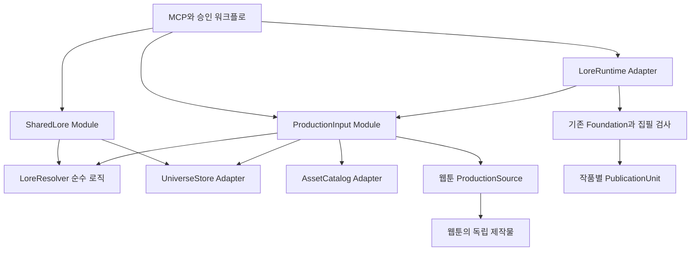

# SharedLore 혼합안 B — 아키텍처와 구현 계획

2026-10-06 계획, 2026-10-07 구현 착수. 사용자가 선택한 혼합안 B를 구현 가능한 계획으로 구체화한다. 현재 **정의 등록부·공유 원문/상태 채택·명시적 작품 연결·집필 입력과 영수증 연결**, 후속으로 **장면 단위 상태·검사(resolver v2), 정의 AI 확장(ensure), 이미지 카탈로그, 소설 없는 장면 대본 원천과 웹툰 제작 기록·검증, 기존 작품 이행 dry run**을 구현했다. 실제 계약은 [SHARED_LORE_RUNTIME](../reference/SHARED_LORE_RUNTIME.md)이 기준이다. 사용자 실제 작품의 이행은 실행하지 않았다. 세부 Interface와 도구 이름은 구현 검증 과정에서 조정할 수 있다.

사용자의 명명 선호를 반영해 상위 Module은 **SharedLore**, 해석은 LoreResolver, 기존 엔진 연결은 LoreRuntime, 채택 판본은 LoreRevision으로 부른다. canon은 정본 채택의 의미를 설명할 때만 쓰며 SharedLore 전체를 뜻하지 않는다. SharedLore에는 편집 원문·후보·승인 설정·인물 상태·자산 연결이 포함된다. 실제 코드에 이미 있는 CanonRepository/canonicalFormatVersion은 현재 계약을 설명하는 이름으로 유지한다.

TS는 이 문서에서 성별·신체 전환 설정을 뜻한다고 가정한다. 이야기 안에서의 전환, 처음부터 다른 설정의 IF, 분기 이후 사건이 다른 IF를 필수 수용 사례에 추가한다. TS가 TypeScript를 뜻했다면 이는 별도 언어/SDK 결정이며 현재 ESM JavaScript 구현 방침이 자동으로 TypeScript 전환을 포함하지 않는다.

근거: [실제 사례와 대안 비교](../research/transmedia-architecture-reference-review-2026-10-06.md), [창작 제품 조사](../research/worldbuilding-product-data-models-2026-10-06.md), [용어](../../CONTEXT.md). 이전 [전면 Assertion 데이터 계약](../research/universe-canon-data-contract-2026-10-06.md)은 후보 C로 남긴다.

**엣지 케이스 검토:** [사례별 지원 범위와 데이터 형태](shared-lore-edge-cases-2026-10-06.md)를 함께 읽는다. 기본 계약이 모든 소재를 이미 해석한다는 뜻은 아니다. 특히 사람/몸의 분리, 관찰자 믿음, 개인 경험 순서, 부분 순서 시간, 꿈의 문맥, crossover는 추가 계약이 필요하다. 단계 0에서 초기 필수 범위를 분류하고 필수 확장은 저장 구현 전에 반영한다.

**2026-10-07 설계 보강:** [AI가 확장하는 정의 등록부](shared-lore-registry-design-2026-10-07.md)를 채택한다. 키·대상 종류·관계 종류는 등록부로 확장하고 장르는 시작 묶음만 제공한다. 엔진의 범위·타입·계산 capability는 명시적으로 구현한다. 새 정의의 비파괴적 추가는 사용자 위임 범위에서 검증 후 자동 등록한다. 아래 고정 predicate/type 목록은 seed로 바꾸며 RegistryRevision을 입력 판본에 포함한다.

## 1. 목표와 초기 운영 조건

현재 구현: 등록부와 `UniverseStore`, `lore_universe(propose/decide/status/resolve/recover)`, `lore_bind(inspect/apply/status)`, LoreRuntime/ProductionInput이다. 공유 원문·인물 profile·범위가 있는 state·추적 값을 독립 HEAD에 채택하고, 기존 작품에 명시적으로 연결해 실제 집필·검사·확정 입력을 봉인한다. [등록부 계약](../reference/SHARED_LORE_REGISTRY.md)과 [실제 채택·집필 연결 계약](../reference/SHARED_LORE_RUNTIME.md)을 따른다. scene/beat 검사, 전체 계획 도구 전환, 자산 catalog, 원고 없는 웹툰 source와 실제 작품 이행은 아직 남아 있다. 이 구현을 아래 전체 종단 완료 조건과 혼동하지 않는다.

**세계·인물·승인 상태·자산을 원고 없이 등록하고, 여러 작품이 정확한 판본을 참조하며, 현재 소설 집필의 검사·검토·승인·복구 계약을 유지한다.**

초기 운영 기준은 현재 제품과 같은 로컬 파일 저장, 한 작품 디렉터리에 작품 하나다. 서로 다른 작품에서 같은 세계를 참조하는 여러 프로세스는 고려한다. 네트워크 공유 파일시스템·분산 작가 협업은 이 Adapter의 보장 범위에 포함하지 않는다. 클라우드 협업이 최초 배포의 필수 요구라면 저장 Adapter 선택은 단계 0에서 재검토한다.

첫 종단 검증 대상은 세계 하나, 동일 인물을 공유하는 소설 두 작품, 유년기/성인기 상태, 기준 이미지, 소설 없는 장면 대본의 웹툰 제작이다. 영상·게임·캐릭터 소개집에는 공통 입력 계약을 제공하되 각 제작 엔진의 완성을 이 변경의 완료 조건으로 삼지 않는다.

초기 핵심 조건:

- 이름 대신 영구 Entity ID로 동일 인물을 참조한다.
- 성장 상태, 세계선, 표현 선택, 설정 개정을 별도로 기록한다.
- 풍부한 설정 원문을 보존하고 필요한 검사 항목만 구조화한다.
- 한 필드의 정본 소유 원천은 하나로 결정한다.
- 생성/추출 결과는 후보이며 승인된 공유 정본과 구분한다.
- 기존 제작물의 입력 판본과 실제 파일을 재현할 수 있다. 같은 AI 출력을 다시 생성한다는 보장은 아니다.
- 모호한 시점·미정 사실을 최신값으로 채우지 않는다.

## 2. 현재 코드와 실제 변경 지점

| 현재 코드 | 현재 계약 | 계획하는 변경 |
| --- | --- | --- |
| [server](../../src/server.js) | workId + project, 한 디렉터리 한 작품, 작품 락 | 세계 도구는 universe root로 라우팅. 작품 디렉터리 계약 유지 |
| [Markdown store](../../src/store/markdown-store.js) | world/characters 원문과 추가 섹션 보존, Foundation 구성 | linked 작품의 공통 설정 덮어쓰기 방지와 명시적인 binding 문서 지원 |
| [CanonRepository](../../src/core/canon-repository.js) | 작품의 published HEAD를 실행 원천으로 조회 | 작품 원고 조회 계약 유지. 공유 정본 조회는 별도 Module |
| [PublicationUnit](../../src/core/publication-unit.js) | 작품 HEAD, 불변 tree/projections, CAS와 fencing, 복구 | 작품 발행은 유지. 파일 확정 패턴을 세계 저장 Adapter에 적용하되 서사 전용 context를 세계 발행에 위조하지 않음 |
| [Foundation](../../engine/src/continuity/foundation.js) | workId, registeredAtChapter, atChapter intrinsic change | linked 작품에서는 실행 DTO로 구성. 세계의 시점을 chapter로 변환해 저장하지 않음 |
| [Continuity check](../../engine/src/continuity/continuity-check.js), [Lexicon scan](../../engine/src/continuity/lexicon-scan.js) | 화 단위 고정 설정·호칭 함의 검사 | TS 전후 beat의 승인 상태·호칭 규칙을 전달. 신체 변화에서 인물의 호칭을 자동 추론하지 않음 |
| [ValidationContext](../../src/core/validation-context.js) | sourceHead·계획·언어·working digest를 영수증에 결속 | linked 모드만 binding/input lock/resolver rules 판본 추가 |
| [Workflow](../../src/tools/workflow.js), [Generate](../../src/tools/generate.js), [Commit](../../src/tools/commit.js) | 집필→검사→critic→결정→확정 | 실행 입력을 공통 resolver로 취득하고 lock을 영수증과 발행 tree에 저장 |
| [Working tree sync](../../src/core/working-tree-sync.js) | world/characters/chapters 최상위 Markdown 지문 | linked 모드의 work.md·장면 대본·상태 문서를 포함하는 versioned inventory |
| [Webtoon source](../../src/store/webtoon-store.js) | 비어 있지 않은 소설 화를 반드시 선택 | 원작 화/독립 장면 대본을 같은 ProductionSource Interface로 제공 |
| [Webtoon scene](../../src/tools/webtoon-scene.js) | 원작·참조의 hash와 preflight subject 확인 | 새 sourceVersion만 lock 기반 검증. 진행 중 기존 sourceVersion 유지 |
| [Webtoon inheritance](../../src/core/webtoon-inheritance.js) | 원작 사실과 시각 취향을 구별 | 공유 인물·승인 상태의 근거를 같은 구별로 전달 |
| [Character dynamics](../../src/core/character-dynamics-adapter.js) | legacy chapter→storyTime 변환 | 작품 관찰은 유지. 공유 시점 매핑은 새 resolver에서 담당 |

현재 entity-profile의 ENTITY_KINDS에는 character가 없다. shared Entity 모델을 추가할 때 기존 종류를 그대로 공통 스키마라고 부르지 않고 character의 기존 풍부한 스키마를 명시적으로 연결한다. 기존 worldGroup 충돌 검사는 완전한 공유 정본 저장·해석 계약으로 간주하지 않는다.

## 3. 배치 구조: 한 서버 안의 독립 Module

새 서비스나 DB를 먼저 추가하지 않고 현재 ESM JavaScript 저장소 안에 구현한다. 아래 경로는 **추가할 후보 경로**다.

```text
engine/src/lore/
  schemas.js                 typed records, version checks
  registry.js                versioned type/field/relation definitions
  compile.js                 supported validators and projections
  ownership.js               field ownership and allowed transitions
  resolve.js                 pure context/state resolution
  changes.js                 validate a proposed lore revision
  impact.js                  diff scopes and dependency queries
src/store/
  universe-store.js          human documents + sealed objects + lore HEAD
  asset-catalog-store.js     immutable asset bytes + approvals + catalog HEAD
src/core/
  shared-lore.js          proposals, adoption, branches, impact orchestration
  lore-runtime.js           legacy/shared input Adapter at existing callers
  production-input.js        resolve + pin exact source, state, style and assets
  work-binding.js            link/upgrade and migration orchestration
src/tools/
  universe.js                thin MCP handlers
  assets.js                  thin import/approval handlers
```

순수 해석 로직은 파일 I/O·MCP·모델 호출을 포함하지 않는다. 호출자는 승인된 레코드를 넘기고 해석 결과와 미해결 이유를 받는다.



외부 Interface를 작게 유지하는 후보:

```ts
SharedLore.propose({ baseRevisionId, source, changes, intent })
// -> proposalId, validation, diff, impact, requiredDecisions
SharedLore.decide({ proposalId, expectedRevisionId, decision })
// -> accepted revision | rejected | stale proposal
SharedLore.resolve({ revisionId, continuityId, sceneContext, selectors })
// -> resolved fields + evidence + unknowns + conflicts + query dependencies

ProductionInput.prepare({ workRevision, source, sceneContexts, selections })
// -> resolved lore view, source snapshot, inputLock | unresolved requirements
ProductionInput.verify({ inputLockId, receiptSubject })
// -> exact input integrity / missing bytes / changed authored subject

LoreRuntime.load({ work, publication, binding, sceneContexts })
// legacy path or shared path -> Foundation DTO, state, scoped constraints, inputLock
```

`SharedLore`는 채택·범위·충돌을, `ProductionInput`은 원작·스타일·자산 선택과 보존을 소유한다. 호출자가 개별 파일을 읽어 profile→state→fact 합성 규칙을 다시 구현하지 않는다. legacy와 shared라는 실제 두 경로가 달라지는 seam만 먼저 둔다. 사용하지 않는 Postgres/graph Adapter는 만들지 않는다.

소설 경로는 LoreRuntime.load가 ProductionInput.prepare의 해석 결과를 기존 실행 DTO로 투영한다. 웹툰 경로는 ProductionInput.prepare를 직접 소비한다. ProductionInput이 LoreRuntime을 다시 호출하는 순환을 만들지 않는다. 필요한 입력 판단이 남으면 prepare는 unresolved를 반환하며 사용 가능한 lock을 발급하지 않는다.

## 4. 정체성·판본·적용 범위의 데이터 계약

아래 타입은 문서용 표현이다. 구현은 현행 JavaScript와 스키마 검사 방식에 맞춘다. `Id`는 stable ID, `RevisionId`는 불변 객체 내용 hash다. hash 입력에서 자기 id를 제외하고 배열 순서·문자열 정규화·undefined 처리·schemaVersion을 명시한다. 도메인 정체성을 hash나 이름에서 유도하지 않는다.

```ts
type Entity = {
  id: Id; universeId: Id;
  typeDefinitionRevisionId: RevisionId;
};
type EntityRevision = {
  schemaVersion: 1; entityId: Id; parentRevisionId: RevisionId | null;
  profile: RegisteredProfile; // registry-owned base fields only
  sourceDocumentIds: RevisionId[]; // complete original documents preserved
};
type WorldRuleRevision = {
  schemaVersion: 1; ruleId: Id; statement: string;
  constraint: 'established' | 'advisory';
  evidenceIds: RevisionId[];
};
type StateDefinitionRevision = {
  schemaVersion: 1; stateId: Id; entityId: Id;
  parentRevisionId: RevisionId | null;
  fields: RegisteredFieldValues;
  applicability: StageApplicability;
  evidenceIds: RevisionId[];
};
type TemporalFact = {
  schemaVersion: 1; subject: RegisteredSubjectRef;
  fieldDefinitionRevisionId: RevisionId;
  value: RegisteredTypedValue;
  storyScope: { timelineId: Id; fromPointId: Id; untilPointId: Id | null };
  evidenceIds: RevisionId[];
};
type TimelineRevision = {
  timelineId: Id; parentRevisionId: RevisionId | null;
  orderedPointIds: Id[]; // stable points; position in this revision determines order
  points: Record<Id, { label: string; evidenceIds: RevisionId[] }>;
};
type ContinuityView = {
  timelineRevisionId: RevisionId;
  worldRuleRevisionIds: RevisionId[];
  entityHeads: Record<Id, RevisionId>;
  stateDefinitionRevisionIds: RevisionId[];
  stateTransitionRevisionIds: RevisionId[];
  temporalFactIds: RevisionId[];
  origin?:
    | { kind: 'fork'; loreRevisionId: RevisionId; continuityId: Id; atPointId: Id }
    | { kind: 'premise-variant'; loreRevisionId: RevisionId; continuityId: Id; evidenceIds: RevisionId[] };
};
type LoreRevision = {
  schemaVersion: 1; universeId: Id; parentRevisionId: RevisionId | null;
  registryRevisionId: RevisionId;
  ownershipRulesRevisionId: RevisionId;
  continuities: Record<Id, ContinuityView>;
  sourceDocumentIds: RevisionId[];
  adoption: { proposalId: Id; evidenceIds: RevisionId[]; decisionId: Id };
};
```

EntityRevision의 적용은 선택한 LoreRevision의 continuity view가 결정한다. TemporalFact도 해당 view의 membership으로 적용하며 별도의 continuity 조건을 중복 저장하지 않는다. 여러 세계선에서 같은 불변 사실을 재사용할 수 있다.

StateDefinition도 view의 membership으로 채택한다. 초기 StageApplicability는 명시 선택 또는 같은 timeline의 반개방 구간을 사용한다. 명시 선택도 알려진 시점 제약과 충돌하면 거부한다. stateId는 성장 단계의 식별이고 state revision은 그 자료의 수정 판본이다. 이름으로 인물을 자동 통합하지 않는다. 별개의 대응 인물은 별도 Entity와 명시적인 대응 관계를 갖는다.

StateDefinition은 나이 단계에 한정하지 않는다. TS·변신·부상·회복 같은 작가가 승인한 상태 정의도 포함한다. 나이와 변신 상태를 동시에 선택하면 서로 다른 필드를 소유하도록 구성하며 같은 필드를 소유하는 경우 명시적으로 조합된 하나의 승인 상태를 선택한다. 이중 소유를 허용하는 임의 overlay는 만들지 않는다.

WorldRuleRevision은 마법 체계처럼 인물 한 명의 속성으로 표현하기 어려운 세계 규칙을 보존한다. 기존 worldFacts의 ID와 확정 여부를 이행해 Foundation.worldFacts로 투영한다. 미분류 원문과 advisory를 established로 자동 채택하지 않는다. 시간에 따라 바뀌는 세계 규칙이 필요하면 단계 0에서 별도 적용 범위를 정의하며 고정 세계 규칙으로 숨기지 않는다.

lifeStatus·location·itemOwner는 최초 seed definitions다. 정의되지 않은 키는 등록 절차를 거치며 고정 enum을 늘리는 코드 변경을 요구하지 않는다. itemOwner의 subject는 물품이며 인물의 inventory는 역조회 결과다. 지식·믿음은 observer와 오해의 구별이 필요하므로 단순 문자열 field를 추가했다고 해석 완료로 보지 않는다. 기존 Ledger의 자유 기록은 작품에 보존한다.

### 필드 소유권

| 값 | 소유 원천 | 규칙 |
| --- | --- | --- |
| 기본 이름·별칭·소개·풍부한 인물 설정 | EntityRevision | 작품별 역할·목표를 섞지 않음 |
| 나이 단계·단계별 외형 | StateDefinitionRevision | 동시에 적용하는 state가 같은 field를 소유하면 충돌 |
| 생사·위치·물품 소유 | TemporalFact | profile/state에 같은 field를 중복 저장하지 않음 |
| 주인공/조연·장면 목표·공개 순서 | WorkRevision/plan | 같은 인물도 작품마다 달라질 수 있음 |
| 선·색감·음성·캐스팅 | ExpressionProfileRevision | 세계 사실을 덮어쓰지 않음 |
| 게임 실행 중 inventory·quest | Work runtime state | 공유 정본 반영은 별도 제안·채택 |

FieldDefinition은 소유 원천·타입·필수 여부를 소유하고 RegistryRevision이 채택 정의를 고정한다. OwnershipRulesRevision은 그 등록부와 상태 조합 정책을 참조하는 검증 입력이며 소유 정보를 독립 편집하지 않는다. appearance 전체를 무조건 덮어쓰지 않는다. 정본 eyeColor와 표현 palette는 별도 필드다. name을 시간별로 관리하려면 소유권 이행을 제안하고 옛 원천의 해당 필드를 동시에 읽기 전용으로 전환한다. 추가 원문은 보존하되 미정의 필드를 hard invariant로 자동 승격하지 않는다.

## 5. 물리 저장과 사람이 편집하는 정본

```text
my-world/
  universe.md                     ID·세계 설명·편집 메타데이터
  world/setting.md                 공유 세계 원문
  world/timelines/<id>.json         읽을 수 있는 구조화 시점 정의
  world/facts/<id>.json             추적 사실의 편집 원천
  characters/<entityId>.md         기본 설정과 작가의 추가 원문
  characters/states/<stateId>.md   승인할 나이/성장 단계
  assets/                         사람이 가져오는 이미지·음성·모델
  .vibelore/                      Module만 쓰는 내부 저장
    lore/HEAD                    설정·상태·fact의 발행 참조
    lore/objects/<hash>           불변 document/record/manifest
    assets/HEAD                   승인 자산 catalog의 독립 발행 참조
    assets/objects/<hash>          profile·variant·revision·manifest
    blobs/<hash>                  실제 파일 bytes
    proposals/<proposalId>        대기 중 제안·검사·결정
    index/                        재생성 가능한 의존 관계/역조회
novel-a/
  work.md                         세계 binding·작품 소유 설정
  world/                          작품 고유 원문·계획
  characters/                     작품 역할·메모·공유 ID 참조
  chapters/                       기존 원고
  scenes/                         독립 장면 대본·scene context
  .vibelore/publication/           기존 작품 HEAD 유지
  .vibelore/input-objects/         사용한 공유 입력의 불변 참조 전체
novel-b/                          같은 세계를 별도 binding으로 참조
webtoon-original/                소설 화 없이 scene script를 보유
```

위는 Module이 생성할 예정인 layout이다. 이 계획 작성에서는 .vibelore/를 변경하지 않는다.

world/characters/chapters는 사람이 읽고 편집하는 원문 정본으로 유지한다. 공유 설정은 세계 디렉터리에서 편집한다. linked 작품의 기존 characters 파일은 이행 시 원문을 보관하고 소유 필드가 명시된 작품 노트로 변환한다. 분류하지 않은 공유 필드의 중복을 남기지 않는다.

채택할 때 원문 bytes와 typed record를 같은 LoreRevision에 고정한다. 원문 변경은 draft이며 inspect→validate/계획 영향 검토→decide로 새 revision을 만든다. 사람이 .vibelore/에 typed fact를 직접 쓰는 운영은 금지한다.

세계 draft가 바뀌면 최신 문서를 사용하는 작업은 needs_sync다. 이미 seal된 과거 revision의 조회·재표시는 가능하며 draft를 섞지 않는다. 새 작업을 시작할 때 draft 차이와 사용 중인 이전 revision을 표시하고 기존 AGENTS의 drift 중단 조건을 유지한다. 세계와 작품의 draft 검사는 각각의 root에서 수행한다.

세계 inventory는 재귀 탐색·참조 파일 집합·symlink 거부·경로 범위 검증을 포함한다. raw bytes digest와 parsed semantic digest를 구별한다. 기존 공백 제거 fingerprint를 JSON/대본의 의미 비교에 재사용하지 않는다. legacy 동작을 유지하고 linked schemaVersion의 inventory에 work.md/scenes 등을 추가한다.

## 6. 작품 binding·장면 시점·실행 입력

```ts
type WorkBindingRevision = {
  workId: Id; universeId: Id; loreRevisionId: RevisionId;
  continuityId: Id;
  cast: Array<{ localCharacterId: Id; entityId: Id }>;
  sceneContextsRevisionId: RevisionId;
};
type SceneContext = {
  sceneId: Id;
  pointId: Id | null;
  stateSelectors: Record<Id, RevisionId[]>;
};
```

세계 위치 path는 이동 가능한 참조 설정이며 lock의 의미 식별은 universeId/revisionId로 한다. 다른 세계의 같은 경로를 혼동하지 않는다. binding은 작품 발행 tree에 저장하고 work.md의 손수정은 승인 전에 runtime으로 반영하지 않는다.

chapter는 공개 순서, point는 세계 내 순서다. 8화 회상은 2화보다 이전 point를 참조할 수 있다. 문단 위치로 sceneId를 재생성하지 않고 작품 내 stable scene ID를 둔다. 초기에는 작가가 승인한 point 순서를 사용한다. 동시·순서 불명·미정을 임의 정렬하지 않는다.

초기 scene anchor는 하나다. 장면 안에서 추적 값이 바뀌면 변경 전후를 별도 point/beat로 나눈다. interval은 [from, until)이며 atPoint의 변화는 그 point부터 유효하다. 여러 변화가 있는 화 전체를 하나의 point로 뭉개지 않는다.

Resolver 순서:

1. 지정 revision·continuity·ownership rules를 읽고 membership과 참조 정합성을 확인한다.
2. EntityRevision의 base-owned fields를 가져온다.
3. 명시한 state 또는 유일하게 적용 가능한 승인 state의 stage-owned fields를 가져온다.
4. point가 있으면 tracked-owned fields를 해석한다. 같은 범위의 scalar 모순·이중 소유는 conflict다.
5. 각 field에 value·원천 revision·evidence·해석 상태를 붙인다.
6. 제작에 필요한 field의 unknown/conflict를 반환한다. 불필요한 field의 미정은 원문을 보존하며 진행할 수 있다.

결과 상태는 resolved / unknown / conflict다. unknown과 확정된 null 값을 구별한다. 근거 문서가 존재한다는 이유로 추출의 정확성을 자동 인정하지 않는다.

세계의 참인 사실, 인물이 아는 사실, 독자에게 공개한 사실은 각각 구별한다. 현재 audienceState와 공개 계약은 작품이 계속 소유한다. 전체 설정 원문은 작가용 근거로 보관하되 장면 prompt에는 해당 상태·시점·관점에서 필요한 투영을 제공한다. 공개용 소개집에는 지정한 공개 범위를 적용한다. 승인된 성인 설정이 있다는 이유로 유년기 장면에 미래 지식이나 외형을 전달하지 않는다.

### Foundation 연결

LoreRuntime이 공유 인물을 작품 localCharacterId에 투영하고 Foundation DTO와 장면별 scopedConstraints를 만든다. genre·genreProfile·StoryProfile·role·dramatic goal은 작품이 소유한다. 필드를 분류하기 전에 기존 Foundation을 기계적으로 분해하지 않는다.

registeredAtChapter는 해당 작품 registry의 도입 시점으로 한정하며 인물의 세계 내 탄생을 의미하지 않는다. 공유 time facts를 atChapter intrinsicChanges로 중복 변환하지 않는다. 기존 Ledger/StoryState는 작품 상태를 fold하고 새 typed checker가 공유 scopedConstraints와 검사한다. 공유 fact를 초기 상태에 넣으면 origin revision을 기록해 같은 변화를 다시 fold하지 않는다. 초기 patch에서 초기 상태·chapter fold·scene constraint의 책임을 fixtures로 검증한다.

작품의 새로운 변화는 작품에서 승인된 관찰이다. 공유 fact를 바꾸려면 다음 절의 채택을 거친다. 공유 hard constraint와 충돌하는 새 원고는 기존 workflow에서 수정·설정 변경·별도 세계선 판단을 요구한다. soft/advisory를 이 변경 때문에 hard로 승격하지 않는다.

## 7. 공유 정본 변경과 작품 확정의 분리

공유 채택 흐름:

```text
편집 원문 또는 seal된 작품 관찰
  → LoreChangeProposal
  → 타입·참조·소유·시점·범위 검증
  → 변경 차이 + 근거 + 영향 작품/제작물 + 계획 영향
  → 작가의 채택 판단
  → expected lore HEAD를 확인하고 새 LoreRevision 발행
  → 원문 projection과 index 반영/복구
```

Proposal은 baseLoreRevision·변경 종류·변경 record 집합·원문 hash·근거 revision·검증 결과·채택 결정을 가진다. stale proposal을 최신판으로 자동 교체하지 않는다. 차이를 재검증해 새 결정 대상으로 보여준다. 승인한 같은 proposal의 재전송은 발행 manifest의 proposalId/decisionId로 멱등 복구한다.

최소한 구분할 변경 종류:

- **설정 정정:** 같은 시점의 새 revision을 만든다. 이전 fact는 이전 revision에서 읽을 수 있다.
- **이야기 속 변화:** 유효 구간을 나누고 새 시점부터 적용되는 fact/state를 만든다.
- **표현 변경:** asset/profile catalog의 새 revision이다. canonical field의 채택 변경으로 취급하지 않는다.
- **별도 세계선:** 명시 branch의 새 view를 만든다. 원래 세계선을 덮어쓰지 않는다.

작품 lore_decide/commit은 해당 원고와 상태를 확정하고 채택 후보를 보관한다. 공유 채택은 별도 작업이므로 초기부터 세계 HEAD와 작품 HEAD의 분산 트랜잭션을 만들지 않는다. 새 revision을 사용할 작품은 별도 binding upgrade를 거친다.

binding 갱신은 inspect→차이/현재 plan 영향/재검사 대상→decide로 진행한다. 기준 revision이 바뀌면 미완료 draft를 보존하고 새 epoch에서 재검사한다. 과거 제작물은 당시 binding을 유지하고 최신 세계선 적합성과 구별해 historical로 표시한다.

초기 fork는 parent lore revision과 fork point를 고정하고 그 시점까지의 사실을 새 view에 materialize한다. 부모의 미래 fact/state는 상속하지 않는다. 부모의 미래 사건에서 끝나는 interval도 branch에서는 해당 미래 변화를 상속하지 않도록 변환한다. 부모의 나중 정정은 자동 전파하지 않는다. 임의 merge/rebase는 후속 독립 proposal로 설계한다.

### TS와 IF의 구체 계약

TS는 장르/소재 label이고 변화 자체는 승인된 character state로 표현한다. 변환 전후의 등장인물이 같은 사람인지 작가가 명시한다. 기존 [Character](../../engine/src/continuity/character.js)는 이미 narrative cause가 있는 신체·성별 전환을 intrinsic change로 다룬다. SharedLore는 이 기존 chapter 기반 변화와 공유 세계의 point/state를 연결할 계획이며 현재 구현 완료를 뜻하지 않는다.

```ts
type StateTransition = {
  entityId: Id; atPointId: Id;
  fromStateRevisionIds: RevisionId[];
  toStateRevisionIds: RevisionId[];
  narrativeCause: string; evidenceIds: RevisionId[];
};
// accepted transition IDs belong to a continuity view
```

StateTransition은 변화의 근거·인물 연속성 기록이다. 전후 상태의 적용 구간과 일치하는지 채택할 때 검증한다. resolver는 승인 state의 구간을 읽으며 transition을 따로 재생해 동일 변화를 두 번 적용하지 않는다. 신체 묘사·인물이 사용하는 성별 표현·호칭은 독립 필드로 정하고 외형 변경에서 자동 추론하지 않는다. 상태 전환을 사용할 인물의 해당 필드는 base-owned가 아닌 state-owned로 이행한다.

단계 2의 checker 연결에는 장면별 상태를 고정 설정 검사에 전달하는 변경도 포함한다. 전환 전 값을 화 전체의 불변값으로 검사하지 않는다. 장면 안에 상태 전환이 있으면 전후 beat별 expected state와 근거를 대조한다. legacy의 합법적 intrinsic change 검사는 유지하며 shared 상태를 같은 이벤트로 두 번 접지 않는다. 필수 검사 자체를 꺼서 TS를 통과시키는 구현은 수용하지 않는다.

| 요청 | 데이터 표현 | 기본 세계선 영향 |
| --- | --- | --- |
| 본편 도중 TS/변신이 일어남 | 같은 Entity, 전후 StateDefinition, atPoint의 StateTransition | 본편의 시간 변화로 채택 가능 |
| 처음부터 다른 성별/신체 설정인 IF | premise-variant 세계선의 초기 StateDefinition | main을 수정하지 않음 |
| 사건 X가 일어나지 않았다면 | fork point 이후 독립 사실·상태 | parent revision과 과거만 고정 |
| 같은 인물을 다른 화풍으로 표현 | ExpressionProfile/AssetVariant | 세계선·인물 상태를 바꾸지 않음 |

IF는 단일 isCanon boolean으로 처리하지 않는다. 각 세계선 안에서 채택된 사실을 가지고 WorkBinding이 continuityId를 선택한다. 기본 세계선과 IF 세계선의 원고·Ledger·CharacterDynamics·AudienceState·검사 영수증을 공유 mutable state로 합치지 않는다.

continuity origin은 `fork`와 `premise-variant`를 구별한다. fork는 divergence point 이전을 상속한다. premise-variant는 선택한 기준 revision을 바탕으로 초기 전제를 명시적으로 변경한 완성 view를 채택하며 존재하지 않았던 변환 사건을 꾸며내지 않는다. 두 형태 모두 원천 revision과 변경 근거를 보존하고 runtime은 해당 view만 해석한다.

IF를 시험하는 ScenarioDraft는 채택 전 후보다. 미리보기 생성은 draft임을 표시하고 main이나 승인된 제작물로 확정하지 않는다. 제작할 IF를 승인하면 해당 세계선의 LoreRevision을 WorkBinding에 고정한다. 초기 branch 생성은 단계 5에 구현하며 저수준 draft/commit 조합으로 기존 집필 검사를 우회하지 않는다.

환생·빙의·몸 교환처럼 사람과 몸의 정체성이 별개인 요구는 상태를 바꾼다는 이유만으로 모두 같은 Entity라고 판단하지 않는다. 실제 요구가 나오면 person/body의 식별 관계를 추가로 결정한다. 일반적인 동일 인물의 TS와 IF를 지원한다는 계약이 모든 정체성 소재를 자동 해결한다는 뜻은 아니다.

## 8. 정확한 제작 입력과 에셋

Asset 정체성·variant·개정·file representation을 나눈다. AssetRevision은 entityId·승인 state/profile revision·의존 field/query·실제 파일 sha256/mime/size를 갖는다. 원래 path만 저장하지 않고 seal 시 bytes를 blobs에 보존한다. 같은 path에 새 이미지를 덮어써도 이전 제작물은 이전 blob을 참조한다.

ExpressionProfileRevision은 catalog가 관리한다. LoreRevision과 AssetCatalog의 HEAD가 독립이므로 기준 이미지 추가만으로 모든 원고의 정본 revision을 갱신하지 않는다. 양쪽 정합성은 ProductionInput이 검사한다. asset 승인은 품질 자동 보증이 아니라 용도·범위에 대한 작가의 채택이다.

```ts
type ProductionLock = {
  schemaVersion: 1;
  registryRevisionId: RevisionId;
  workId: Id; baseWorkRevisionId: RevisionId;
  bindingRevisionId: RevisionId;
  loreRevisionId: RevisionId; continuityId: Id;
  timelineRevisionId: RevisionId;
  ownershipRulesRevisionId: RevisionId; resolverRevision: string;
  requirementsRevisionId: RevisionId;
  sceneContextsRevisionId: RevisionId;
  entityRevisionIds: RevisionId[]; stateDefinitionRevisionIds: RevisionId[];
  queryDependencies: Array<{ query: TypedQuery; resultDigest: string }>;
  sourceRevisionIds: RevisionId[];
  expressionProfileRevisionIds: RevisionId[];
  assetRevisionIds: RevisionId[]; blobIds: RevisionId[];
  optionalUnknowns: ResolutionRecord[];
};
```

baseWorkRevisionId는 작업을 시작할 때 읽은 발행 revision이다. 아직 확정하지 않은 원고·계획·장면 입력은 별도 불변 source revision으로 먼저 seal한다. lock을 포함할 미래 작품 HEAD를 lock 내부에 넣지 않아 hash 자기참조를 피한다. 영수증 subject는 이 새 원고 hash와 inputLockId를 함께 결속한다.

```ts
type Asset = { assetId: Id; entityId: Id; purpose: string };
type AssetVariant = { variantId: Id; assetId: Id; label: string };
type AssetRevision = {
  variantId: Id; parentRevisionId: RevisionId | null;
  stateDefinitionRevisionIds: RevisionId[];
  expressionProfileRevisionId: RevisionId;
  dependencies: QueryDependency[];
  representations: Array<{ blobId: RevisionId; mime: string; size: number }>;
  provenance: { sourceRevisionIds: RevisionId[]; generationRecordId?: RevisionId };
};
type AssetCatalogRevision = {
  universeId: Id; parentRevisionId: RevisionId | null;
  approvedAssetRevisionIds: RevisionId[];
  expressionProfileRevisionIds: RevisionId[];
  decisionIds: Id[];
};
```

Entity/state/profile의 적용 정합성과 catalog 채택 여부를 prepare가 검사한다. 외부 생성 파일은 import 당시 hash·provenance와 용도를 확인한 후보이며 decide 후에만 approvedAssetRevisionIds에 들어간다. variant label이 같아도 다른 Entity의 자산을 자동 대체하지 않는다.

queryDependencies는 읽은 fact 목록뿐 아니라 검색 조건·결과 digest·결과 없음을 포함한다. 예를 들어 이 장소의 모든 인물, 이 물품의 소유자를 조회한 뒤 새로운 fact가 추가되어도 영향을 감지한다. 초기 impact index는 이 집합과 typed scope diff로 재생성한다. 자연문 의미 의존은 완전하게 포착할 수 없으므로 비구조화 설정 변경에는 넓은 계획 검토 대상을 표시한다.

lock이 참조하는 document·record·실제 파일의 전체 closure를 작품 input-objects에도 보존한다. 같은 불변 내용의 보관이며 편집 가능한 두 번째 정본이 아니다. 세계 이동·삭제 뒤에도 과거 제작 입력을 읽는다. 외부 모델 폐지나 비결정적 생성의 동일 출력까지 재현한다고 약속하지 않는다.

### ProductionSource 공통화

```ts
type ProductionSource =
  | { kind: 'novel-chapters'; workId: Id; workRevisionId: RevisionId; chapters: number[] }
  | { kind: 'scene-script'; workId: Id; workRevisionId: RevisionId; sceneRevisionIds: RevisionId[] };
// both resolve to: units, languageContract, sceneContexts, inputLock, evidence
```

새 webtoon은 이 공통 입력을 scene 경로로 전달한다. 독립 scene script는 선택 언어로 작가가 승인하며 대본 사실과 화면 표현을 구별한다. 소설 화가 없다는 이유로 소설용 Foundation/StoryProfile을 더미로 만들지 않는다. 비소설 Work의 최소 설정과 언어 승인을 새 work creation 경로에 정의한다.

원작 범위·화풍·참조·정수/auto 칸 수·이미지 모델 discovery, 작품 언어 대사, preflight/visual review, lane=webtoon, 제작물의 독립 저장을 유지한다. 해당 단계에서 story/webtoon discovery skill과 문서도 갱신한다. deprecated panel 경로는 확장하지 않는다.

entity-sheet나 game-export Source는 해당 제작 기능을 구현할 때 추가한다. 사용하지 않는 영상/game renderer Adapter를 미리 만들지 않는다.

## 9. 검사·동시성·장애 복구

**고정된 의미 입력을 검사하고 같은 입력으로 확정한다.** linked receipt는 현행 identity에 bindingRevisionId·productionLockId·resolverRevision·필요한 scene mapping revision을 추가한다. 검사 scope는 작품 단위다.

| 중간 변경 | 초기 정책 |
| --- | --- |
| 다른 작품의 원고만 확정 | 이 작품의 검사 유지 |
| 세계에 새 revision 채택, 이 작품은 이전 binding | 이전 binding으로 검사 지속. upgrade 가능 표시 |
| 이 작품의 binding/plan/원고/scene mapping 변경 | draft 보존 후 재검사 |
| 선택한 이전 revision/blob 손상·누락 | 확정 중단 후 closure 복원 요구 |
| asset 새 revision 추가, 이전 선택은 동일 | 기존 lock/preflight 유지 |
| 미승인 참조 이미지·새 장면 대본 편집 | 새 입력 채택·lock 후 preflight 재검사 |

최신 세계선에도 유효한 상태와 당시 revision에서 검사를 통과한 상태를 구별한다. binding 갱신 때 query 차이를 비교한다. 초기에는 lore revision 변경 시 새 receipt를 요구하며 결과가 같은 query의 정밀 receipt 재사용은 후속 개선으로 둔다.

세계 HEAD는 설정·상태·fact 채택, catalog HEAD는 asset 채택, 작품 HEAD는 원고 확정의 CAS다. 세계 manifest에 모든 작품 HEAD를 넣지 않는다.

세계의 불변 revision 조회 때문에 작품 write lock 안에서 세계 write lock을 기다리지 않는다. 공유 채택은 seal된 작품 revision을 읽고 작품 write는 수행하지 않는다. binding upgrade도 작품 lock 안에서 세계 불변 revision만 읽는다. 초기 Interface는 두 root에 걸친 nested write를 허용하지 않는다.

현행 PublicationUnit의 tree merge를 배열/삭제/domain context까지 세계용으로 그대로 일반화하지 않는다. 세계 발행은 완성 manifest 교체로 참조 집합을 seal한다. 필요하면 durable write·atomic rename·lock/CAS 구현만 좁게 추출하며 작품의 기존 장애 테스트를 먼저 통과시킨다. 세계 publication order는 화 번호가 아닌 채택 sequence다.

발행 전 실패는 이전 HEAD를 유지하고 고립 blob을 노출하지 않는다. 발행 후 원문 projection/index 반영 실패는 seal된 manifest에서 복구한다. 발행 뒤 사용자가 원문을 바꿨다면 자동 복구로 덮어쓰지 않고 차이를 보존한다. operationId/proposalId를 발행 manifest에 포함해 재전송에 기존 확정 결과를 반환한다.

참조 closure를 영속 보관한 뒤 작품/제작물을 확정한다. cache와 역조회 index는 정본 권위를 갖지 않는다. 참조 전체를 파악할 수 있는 운영이 되기 전에는 자동 GC를 끄고 과거 lock의 blob을 삭제하지 않는다.

## 10. 기존 작품 이행

binding이 없는 legacy mode는 기존 조회·검사·발행을 유지한다. 자동 이행하지 않는다. 변환은 동명 통합·시간 추측 없이 inspect→candidate→validate→apply로 수행한다.

1. published tree·전체 원문·현재 plan/receipt·손수정 drift·미완료 workflow를 확인한다.
2. 실제 Foundation fields를 base/stage/tracked/work/advisory로 분류한다. dramaticModel/speechProfile의 풍부한 원문을 보존하고 작품별 부분을 분리한다.
3. `{workId, localCharacterId} → entityId`와 기존 world fact ID→shared ID를 명시한다. w1 같은 작품 내부 ID를 다른 작품의 동명 ID와 통합하지 않는다.
4. chapter-only events는 legacy로 보관하고 공유 timeline에 올릴 사건의 mapping만 작가가 결정한다. 전체 화를 세계 통합 연표로 자동 변환하지 않는다.
5. 새 세계 revision과 binding candidate를 만든다. legacy Foundation과 shared runtime DTO의 golden 비교·의미 차이·계획 영향을 보여준다.
6. 검증·판단 후 작품 HEAD에 새 binding과 migration manifest를 발행한다. 기존 HEAD/원문/receipt를 보존한다.
7. 채택한 변경의 projection을 반영하고 input closure와 fingerprint를 고정한다.

미완료 workflow는 먼저 마무리하거나 원고를 보존하고 명시적으로 supersede한다. 이전 receipt를 새 binding으로 전용하지 않는다. 이행 중단 시 이전 binding/HEAD 또는 완전한 새 binding/HEAD를 읽어야 한다. 새 공유 입력으로 발행한 뒤 legacy로 돌아갈 때는 binding만 삭제하지 않고 이전 발행 복원 또는 역이행 proposal과 영향 검증을 사용한다.

## 11. 구현 순서와 PR별 완료 조건

각 단계는 앞 단계의 수용 사례를 통과한 뒤 진행한다. 기간은 실제 구현 차이를 측정한 뒤 추정한다.

| 단계 | 구현 대상 | 완료 조건 |
| --- | --- | --- |
| **0. 등록부 계약과 비교 fixture** | meta-schema·capability·현재 필드 seed·소유 규칙·ID/time/unknown. 초기 필수/후속/작가 판단 분류 | 새 정의와 새 엔진 동작 구별. 초기 필수 요구의 resolver·검사 계약 확정 |
| **1. 공유 세계와 정의 등록** | RegistryRevision·compile·AI 검색/제안/자동 추가·UniverseStore·원문 채택·인물/state 등록 | 코드 수정 없이 지원되는 새 필드를 등록. 소설 0화에서 같은 Entity의 두 상태 채택. 정의 판본과 원문 보존 |
| **2. 해석과 작품 연결** | ownership·resolve·LoreRuntime·binding·scene mapping·ValidationContext·read/context/write/check/commit/sync 연결 | 두 작품이 같은 인물의 다른 상태를 조회. 회상 시점 처리. 기존 작품 계약 유지. receipt 입력 변경 검출 |
| **3. 자산과 입력 고정** | AssetCatalog·bytes 보존·ExpressionProfile·ProductionLock·impact queries | 이미지 수정 후에도 이전 lock이 이전 이미지를 조회. 정본 eyeColor를 palette로 덮지 못함. 누락 blob에서 중단 |
| **4. 원작 없는 웹툰** | 비소설 Work·ProductionSource v2·scene script source·scene workflow 연결 | 세계+인물+승인 대본으로 소설 0화에서 웹툰 제작. 기존 chapter source와 진행 중 v1 유지 |
| **5. 공유 채택·upgrade·IF** | 작품 관찰 채택·계획 impact·binding upgrade·fork/premise-variant·query 역조회 | A의 새 설정 채택 후 B가 차이를 검토해 upgrade. IF의 초기 전제·후속 사건 독립. 부모 미래와 main의 상태를 섞지 않음 |
| **6. 이행과 공개 계약** | inspect/apply·장애 복구·백업/이동·도구 문서·discovery skills·배포 설정 | 기존 작품 무손실 이행. 재전송 멱등성. 문서·예제·MCP route·배포 files 일치 |

단계 1~3에서 사용자가 기존 집필·생성 도구를 우회해 저수준 도구를 조합할 필요가 없어야 한다. draft/check/critic/receipt/commit 순서는 lore_write에 유지한다. 단계 4 완료에는 원고 없는 제작을 반드시 포함하며 선행 소설 작성에 의존한 상태로 완료하지 않는다.

MCP 이름 후보는 세계 init/status, lore propose/decide, work link/upgrade(review와 decide), asset import/decide다. 단계별 필요한 것만 공개한다. 저수준 Resolver를 일반 집필 도구로 노출하지 않는다. tool schema·relay resume·run 기록·lane·project lock route를 같은 PR에서 맞춘다.

## 12. 의미 있는 검증 사례

| 사례 | 필수 결과 |
| --- | --- |
| 동명 인물 두 명·다른 작품의 ID 충돌 | 명시 선택 없이 통합하지 않음 |
| 같은 Entity의 15세/25세를 두 작품에서 사용 | 상태 선택은 다르고 인물 ID는 같음 |
| 본편 TS 전후 장면·전환 전 회상 | 같은 인물 ID, 해당 point의 승인 상태. 신체 변화와 호칭을 독립 처리 |
| 변환 정체가 나중에 밝혀지는 장면 | 이미 성립한 상태와 인물/독자의 지식 공개를 구별 |
| 처음부터 다른 설정인 IF | premise-variant에서만 해당 초기 state 적용, 허구의 전환 사건 생성 없음 |
| 같은 인물이 main·IF에서 서로 다른 상태 | binding의 continuity에 따라 해석하고 원고/관찰/영수증 혼합 없음 |
| 8화가 2화보다 이전 시점의 회상 | 공개 순서를 세계 시간으로 쓰지 않음 |
| 한 장면 중 부상/소유권 변경 | 전후 point 구분, 이전 point에 새 상태 누출 없음 |
| 시점 미정·상태 후보 두 개 | unknown/conflict와 근거 반환, 필수 필드는 판단 대기 |
| 성인 외형 자료 정정 | 같은 stateId의 새 revision, 유년기 state 영향 없음 |
| 원작의 중대한 설정 정정 | 새 lore revision·query/plan 영향 표시·이전 lock 보존 |
| 결과 없는 query 뒤 새 fact 추가 | upgrade 영향 검사에서 검출 |
| 표현만 변경 | 원고 정본과 인물 ID 유지 |
| 두 작품 동시 확정·세계 채택 충돌 | 작품은 독립 성공, 세계 CAS에서 한쪽 stale |
| fork 후 부모의 미래 사건/정정 | fork는 고정된 기준 유지 |
| 상태 자료와 tracked fact가 같은 field 소유 | 채택 시 이중 소유 거부 |
| 이미지 path 덮어쓰기·세계 이동 | 보관된 closure에서 과거 제작 입력 조회 |
| HEAD 전후·projection 반영 중 장애 | 완전한 이전/새 revision, 재전송 중복 채택 없음 |
| legacy 손수정·검사 조건·critic advisory | 현행 sync/receipt/guided/auto 계약 유지 |

순수 도메인 검증은 Resolver/제안 Interface로 수행한다. 저장 검증은 실제 임시 디렉터리에서 CAS·bytes·복구를 확인한다. mock 호출 횟수만을 수용 증거로 삼지 않는다. 관련 publication·validation·sync·workflow·webtoon 테스트를 실행하고 공개 전 test:all/check:source/check:release를 수행한다.

이 계획 작성 시점에는 새 구현이 없으며 위 수용 검증은 아직 실행하지 않았다.

## 13. 남은 판단과 후속 확장

단계 0에서 확인할 정보는 초기부터 클라우드 동시 편집이 필요한지, 상태 정밀도가 성장 단계인지 장면별인지, 누가 작품의 새 설정을 공유 채택하는지다. 미응답 상태의 계획 전제는 로컬·명시 stage+필요 장면 point·작가의 명시 채택이다.

초기 완료 뒤 실제 요구로 판단할 것은 observer가 있는 지식/믿음, 부분 순서 timeline, 임의 branch merge, 의미 의존 추론, 최신 revision에 대한 정밀 receipt 재사용, 공유 DB/권한/알림, 영상·게임·소개집 제작 Module이다.

단, 관점/관계나 몸 교환/회귀가 초기 작품의 필수 요구라면 후속으로 미루지 않는다. 단계 0에서 추가 스키마·조회와 검사 범위를 먼저 설계하고 해당 기능의 수용 fixture를 포함한다. 정의하지 않은 확장을 reader가 무시하거나 현재 상태로 대체하는 구현은 금지한다.

B에서 C로 확장할 때는 필요한 tracked field의 소유권 이행을 사용한다. profile 전체 문장을 일괄 Assertion화하는 변경은 전제로 삼지 않는다. 공유 세계 개념과 제작 입력 계약을 안정화하고 새 매체 Module은 같은 ProductionInput Interface를 소비한다.

새 장르와 새 키는 우선 정의 등록부의 데이터 확장으로 처리한다. 기존 값의 의미와 해석을 바꾸거나 새로운 시간축·연산이 필요할 때만 별도 이행 또는 capability 구현을 추가한다. AI가 사용자가 맡긴 새 정의를 자동 등록할 수 있게 하되, 생성된 사실의 채택·기존 원고의 검증 조건은 유지한다.
