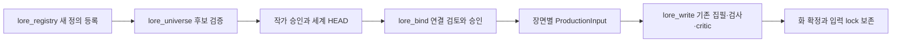

# SharedLore 채택·작품 연결·집필 입력

2026-10-07. [정의 등록부](SHARED_LORE_REGISTRY.md)에 이어 구현한 경로다. 소설 없이 공유 설정을 채택하고, 여러 작품이 같은 인물의 다른 시점과 정확한 세계 판본을 참조한다.

## 실행 순서와 소유



정의 등록은 용어·타입의 추가다. 세계 값과 원문 채택은 별도 승인이다. 세계는 공유 profile/state/추적 값을 소유하고, 작품은 역할·극적 목표·계획·원고·독자 공개 계약을 소유한다. 등록이나 세계 HEAD 변경만으로 작품의 binding을 갱신하지 않는다.

`world/`, `characters/`는 세계 디렉터리에서 사람이 읽고 편집할 수 있는 원문이다. 원문 손수정은 새로운 후보에 채택할 때까지 draft다. `.vibelore/`는 도구가 작성한다. 작품의 기존 캐릭터 파일은 보존하며, 연결에서 명시한 필드만 실행 DTO에 투영한다. 투영한 값을 작품 원문이나 Foundation 정본에 다시 저장하지 않는다.

## 세계 후보와 채택

`lore_universe` 공통 필수 인자는 `action,worldRoot,universeId`다. worldRoot는 registryRoot와 같은 공유 세계의 절대 경로이며 작품 디렉터리와 분리한다.

| action | 추가 입력 | 결과 |
| --- | --- | --- |
| status | 없음 | 현재 lore HEAD, registry 판본, 원문 drift, 레코드 수 |
| propose | expectedHead, registryRevisionId, content, reason | 검증된 불변 proposal, 실제 후보와 원문 before/after, 참조 작품의 판본 유지 안내 |
| decide | proposalId, expectedHead, decision=approve/reject | 사용자 결정으로 채택 또는 거절 |
| resolve | loreRevisionId, query | 지정한 과거/현재 판본의 값 조회. draft를 섞지 않음 |
| recover | 없음 | 발행 후 원문 반영이 중단됐을 때 승인 bytes 반영을 재개 |

propose는 전체 content checkpoint를 받는다. 신규 타입·필드가 필요하면 먼저 등록부에 추가하고 반환된 registryRevisionId를 사용한다. 기존 정의의 의미·타입 개정은 여전히 별도 이행이 필요하다.

```json
{
  "entities": [
    {"id": "character-a", "typeDefinitionRevisionId": "<type-character hash>", "documentIds": ["profile-a"], "valueIds": ["name-a"]}
  ],
  "states": [
    {
      "id": "state-transformed",
      "entityId": "character-a",
      "documentIds": ["transformed-note"],
      "valueIds": ["body-form-after"],
      "storyScope": {"continuityId": "main", "timelineId": "t1", "fromPointId": "transformed", "untilPointId": null}
    }
  ],
  "timelines": [{"id": "t1", "continuityId": "main", "pointIds": ["before", "transformed"]}],
  "values": [
    {
      "id": "name-a", "subject": {"kind": "entity", "entityId": "character-a"},
      "fieldDefinitionRevisionId": "<profile name field hash>", "owner": "profile", "value": "리아",
      "storyScope": {}, "evidenceIds": ["profile-a"]
    },
    {
      "id": "body-form-after", "subject": {"kind": "entity", "entityId": "character-a"},
      "fieldDefinitionRevisionId": "<body.form field hash>", "owner": "state", "value": "transformed",
      "storyScope": {"continuityId": "main", "timelineId": "t1", "fromPointId": "transformed", "untilPointId": null},
      "evidenceIds": ["transformed-note"]
    }
  ],
  "documents": [
    {"id": "profile-a", "path": "characters/character-a.md", "text": "# 리아\n기본 인물 설정\n", "visibility": "context"},
    {"id": "transformed-note", "path": "characters/states/transformed.md", "text": "# 변신 후\n해당 상태의 설정\n", "visibility": "context"}
  ],
  "worldDocumentIds": []
}
```

profile 값은 entity.valueIds에, state 값은 한 state.valueIds에 정확히 한 번 소유된다. state의 값 범위와 state.storyScope는 일치해야 한다. fact/relation/observer는 values에서 독립 추적한다. 모든 evidenceIds는 같은 후보의 실제 documents를 참조한다. 형식·참조·소유와 단일 값의 겹치는 기간 충돌을 검사한다. 원문에 실제로 적힌 사실과 AI 추출이 같은지는 형식 검사만으로 증명하지 않으며, 작가는 propose의 전체 후보와 근거를 보고 채택한다.

문서는 `universe.md` 또는 `world/`, `characters/` 아래 `.md/.json` 경로만 허용한다. 중첩 상태 문서도 지원하며 traversal과 symlink를 거부한다. 기존 채택 문서를 자동 삭제하는 경로는 제공하지 않는다. 폐기한 문서는 author 전용으로 보존한다.

세계의 HEAD는 원문 fingerprint·반영 전 bytes·content 판본을 봉인한 발행 manifest의 hash다. 바깥 hash를 `loreRevisionId`, typed content의 hash를 `contentRevisionId`로 반환한다. binding과 조회에는 loreRevisionId를 사용한다. registry HEAD, lore HEAD, 작품 publication HEAD는 독립이다.

## 작품 연결

먼저 기존 작품을 초기화한다. `lore_bind(action=inspect, project, workId, worldRoot, binding)`가 입력과 각 화의 요구값을 검증하고 실제 장면 데이터·투영·활성 아크와 EpisodePlan을 반환한다. 이를 검토해 승인한 뒤 같은 proposalId/expectedHead로 `action=apply`한다. 새 설정이 계획에 미치는 영향은 작가가 검토하며 자동으로 아크를 다시 작성하지 않는다.

```json
{
  "schemaVersion": 1,
  "workId": "novel-a",
  "universeId": "u1",
  "loreRevisionId": "<approved lore HEAD>",
  "registryRevisionId": "<registry hash>",
  "continuityId": "main",
  "cast": [
    {"localCharacterId": "hero", "entityId": "character-a", "projections": []}
  ],
  "chapters": [
    {
      "chapter": 1,
      "scenes": [
        {
          "id": "scene-awakening",
          "scope": {"continuityId": "main", "timelineId": "t1", "pointId": "transformed"},
          "entityIds": ["character-a"],
          "requirements": [{"entityId": "character-a", "fieldId": "field-body-form", "required": true}]
        }
      ]
    }
  ]
}
```

localCharacterId는 작품의 기존 인물 ID다. 같은 shared entity를 다른 작품에서 다른 local ID로 참조할 수 있다. 같은 binding에서 shared entity를 두 local 인물로 복제하는 출현 모델은 아직 지원하지 않는다. worldRoot는 위치 설정이며 binding의 의미 hash에 포함하지 않는다. 경로 변경도 검토된 작품 발행으로 반영하므로 이전 영수증을 재사용하지 않는다.

apply는 binding을 작품 발행 tree에 넣고 `work.md`의 managed section을 반영한다. 파일의 기존 작가 메모를 보존한다. work.md의 bytes 변경도 working-tree drift에 포함한다. 현재 work.md 손수정을 자동으로 binding으로 파싱·채택하지 않는다. 원래 bytes를 보관해 복원한 뒤 새 binding을 inspect/apply한다. `lore_sync`는 세계 연결을 바꾸는 도구가 아니다.

### 기존 작품 이행

이미 쓴 작품도 같은 inspect → apply 순서다. inspect 결과의 `migration`은 dry run이며 아무것도 바꾸지 않는다.

| 항목 | 내용 |
| --- | --- |
| `diff` | 화별·인물별 투영 대상의 로컬 값과 공유 값. `same`, `differs`, 장면마다 다른 `scene_specific` |
| `ownership` | 작품 → 공유로 권한이 넘어가는 대상과 현재 로컬 값 |
| `workOwned` | 작품이 계속 소유하는 인물 항목(역할·목표·mutable 등) |
| `preservedSources` | 그대로 보존되는 원고·인물·세계 원문과 work.md |
| `sameNameCandidates` | 이름·별칭이 공유 인물과 같은 비연결 로컬 인물. `not_merged`이며 자동 병합하지 않는다 |

apply는 로컬 인물 시트에 공유 값을 복사하지 않고 원고와 메모를 다시 쓰지 않는다. 검토 뒤 원고·work.md가 바뀌면 `WORKING_TREE_DRIFT`, 작품 HEAD가 바뀌면 `STALE_WORK_BINDING`이다. 되돌리기는 `lore_rollback`이 발행 tree와 work.md를 함께 복원한다. 이 경로는 임시 fixture로 검증했으며 사용자 작품에서 자동 실행하지 않는다.

새 화는 binding.chapters에 장면 시점이 있어야 한다. 미래 화의 시점이 아직 없으면 `SHARED_SCENE_CONTEXT_MISSING`으로 멈추고, 계획을 정한 뒤 inspect/apply로 추가한다. 이전 화의 시점을 다음 화에 암묵적으로 재사용하지 않는다. IF는 별도 continuity/timeline의 명시적 값을 선택하며 main 값 상속은 아직 지원하지 않는다.

## 집필 해석과 lock

LoreRuntime이 실제 초고·재작성·통합 집필 검사의 실행 Foundation을 구성한다. 각 장면에는 선택한 인물의 profile 원문, 그 시점에 적용되는 state 원문, 필요한 typed field 결과만 전달한다. author 문서는 prompt에서 제외한다. 선택하지 않은 미래 state 문서는 자동으로 전달하지 않는다. 전체 원문은 내부 lock에 보존되므로 author visibility는 prompt 선택 규칙이며 사용자 접근 권한 모델이 아니다. 독자 공개 계약과 공개용 소개집 필터는 별도 단계다.

공통 원문은 prompt에 한 번만 넣고 각 scene이 문서 ID를 참조한다. 공유 context의 초기 예산은 기존 tokenUnits 기준 6,000 units다. 넘으면 `SHARED_LORE_CONTEXT_BUDGET`으로 멈추고 필수 원문을 조용히 자르지 않는다. 설정을 주제·상태별 작은 문서로 나누고 장면에 필요한 인물·필드를 선택한다. 이 예산은 모델의 실제 tokenizer나 처리량 벤치마크를 의미하지 않는다.

기존 검사기에 명시적으로 전달할 필드는 projections로 연결한다:

```json
{"localCharacterId": "hero", "entityId": "character-a", "projections": [{"target": "intrinsic.gender", "fieldId": "field-body-gender"}]}
```

초기 target은 canonicalName, intrinsic.gender/genderLabel/ageBand/birthOrder/species/form/coreAppearance와 addressing의 acceptedPronouns/acceptedGenderedTerms/forbiddenGenderedTerms다. scalar는 text 또는 enum/one, 배열은 text/many를 요구한다. 매핑된 intrinsic event는 작품의 중복 소유 원천으로 다시 fold하지 않는다. 매핑하지 않은 역할·극적 목표·기존 변화는 작품이 계속 소유한다.

### 장면 단위 상태와 검사 (binding schemaVersion 2)

`schemaVersion: 2` binding의 장면은 `frame: "present" | "flashback"`을 가진다. resolver v2(`shared-lore-resolver-v2`)가 장면마다 상태를 해석하고, 화 수준 DTO에는 모든 present 장면이 같은 값만 넣는다. 다른 값은 `sceneVarying`으로 남기고 화 Foundation에는 표지값(gender `unknown`, 배열 `[]`, 문자열 안내문)만 둔다. 호칭·대명사·금지어 목록은 항상 장면별로 검사한다. 몸의 성별에서 호칭·대명사·자기 인식을 추론하지 않는다. 회상 장면의 상태는 현재 상태와 화 DTO를 바꾸지 않는다. 작품 소유 intrinsic 변화는 공유 투영 대상이 아니면 한 번만 적용된다.

검사 단계는 호스트 모델 요청 `shared-scene-map`으로 원고 문단을 장면에 대응시킨다. 응답은 `{proseHash, productionLockId, segments[{sceneId, fromParagraph, toParagraph}]}` 또는 `unresolved{reason, sceneIds}`이며 원고 hash와 lock에 묶인다. 누락·겹침·순서 오류는 거부하고, 경계를 정할 수 없으면 hard `SHARED_SCENE_BOUNDARY_UNRESOLVED`로 막는다. 그 뒤 각 장면 구간을 그 장면 상태의 금지어·허용어로 결정론 검사하고 위반 근거(장면·문단·어휘)를 남긴다. 결과는 검사 영수증 `sharedSceneCheck`에 들어가며 커밋이 다시 검증해 `sceneChecks[chapter]`로 봉인한다. 원고가 바뀌면 `STALE_SCENE_MAP`이라 이전 대응표·영수증을 재사용하지 않는다. 순서는 draft → check(장면 대응·검사) → critic → revise → receipt → commit 그대로이며 별도 커밋 경로는 없다.

schemaVersion 1 binding과 기존 lock은 resolver v1로 그대로 검증한다. v1에서 같은 화의 여러 장면이 다른 값이면 여전히 `requires_scene_checker`로 멈춘다. 새 동작을 쓰려면 v2 binding을 inspect/apply한다. 계획 도구(`lore_arc_plan`, 화별 계획)도 같은 resolver로 계획 범위의 값을 읽고, 화마다 다르면 장면별 표지와 화별 값을 받는다. 작품의 옛 인물 사본을 계획 입력으로 쓰지 않는다. 필수 field의 unknown과 모든 conflict/incomplete도 사용 가능한 lock을 발급하지 않는다. 사용자 정의 필드를 원고의 임의 표현과 비교하는 새 결정론 검사기가 등록만으로 생기지는 않는다. 해당 값은 scoped context로 기존 semantic WORLD 검토에 전달된다.

준비된 lock에는 binding/세계/등록부/resolver 판본, 장면별 결과와 근거, 정확한 원문, 재현에 필요한 registry와 발행 manifest가 들어간다. root 경로 없이 해석 결과를 검증할 수 있다. 세계 파일이 이후 변경·이동·삭제돼도 보존된 과거 lock은 검증 가능하다. 새 집필에는 현재 세계 원문 drift 검사와 지정 판본 읽기가 필요하므로 공유 세계 경로가 이용 가능해야 한다.

검사 identity에는 productionLockId·bindingRevisionId·registryRevisionId가 들어간다. 연결을 바꾸면 sourceHead와 identity가 바뀌어 이전 검사 영수증/원고 승인을 커밋에 사용할 수 없다. 화 확정은 원래 work-owned Foundation을 보존하고 `productionInputs[chapter]`에 lock을 같이 봉인한다. 세계 HEAD를 갱신해도 binding이 그대로면 해당 작품의 lock은 바뀌지 않는다.

## 중단·복구와 현재 범위

세계 채택은 불변 객체를 쓰고 HEAD를 바꾼 뒤 원문을 반영한다. 중단되면 recover가 승인 전 또는 이미 승인 후 bytes인 파일만 반영한다. 그 사이 새 작가 편집이 생기면 덮어쓰지 않고 drift로 멈춘다. 작품 binding은 같은 원칙의 recovery journal을 남기고 다음 MCP 호출에서 자동 재개한다. work.md와 다른 원문이 새로 바뀌면 자동 기준선 등록을 거부한다.

화 snapshot/rollback은 work.md와 발행 tree의 binding·과거 입력 lock을 함께 복원한다. 세계 자체의 HEAD를 rollback하지 않는다.

## 참조 이미지 카탈로그

`lore_assets`가 세계 root의 `.vibelore/shared-lore/assets/`에 불변 blob(내용 hash), asset revision, 표현 프로필, 카탈로그 revision과 독립 HEAD를 쓴다. 반입은 실제 바이트로 PNG/JPEG 컨테이너·크기·해상도를 검증하며 파일명·선언 MIME을 믿지 않는다. asset은 entity와 state ID, 표현 프로필, 원본/파생 관계(`derivedFrom`)를 가진다. 후보는 승인 전까지 어떤 lock에도 쓰이지 않는다. 같은 assetId 교체는 이전 revision을 parent로 갖는 새 revision이며, 오래된 parent로 만든 후보는 `STALE_ASSET_REVISION`이다. 표현 프로필에 values·intrinsic 같은 세계 값 키가 있으면 `EXPRESSION_PROFILE_OWNERSHIP`이다. 승인은 객체 → pending journal → HEAD 순서이고 중단은 `recover`가 완료하거나 버린다.

## 소설 없는 제작 원천: 장면 대본

ProductionSource는 두 종류다. `novel-chapters`는 기존 웹툰 원천(sourceVersion 1)을 그대로 쓰므로 진행 중인 장면 작업이 같은 hash로 계속 검증된다. `scene-script`(sourceVersion 2)는 `lore_scene_script`로 채택한 작품 소유 대본이다. 대본은 정확한 원문, 장면 순서, 장면별 세계 시점과 frame, cast와 승인 상태, 작품 언어, 표현 프로필, 승인 asset을 고정한다. apply는 resolver v2 lock(`sourceKind: scene-script`)과 asset 바이트를 작품의 `.vibelore/input-objects/{locks,blobs}`에 먼저 봉인한 뒤 대본 HEAD를 바꾸고 `scenes/<scriptId>.md`를 쓴다. 소설 Foundation·chapter·story state를 만들지 않는다. 읽기용 대본 파일을 손으로 고치면 `SCENE_SCRIPT_DRIFT`로 막고 inspect/apply로 채택해야 한다.

웹툰은 `lore_webtoon_scene(start, scriptId)`로 이 원천을 쓴다. 참조는 `{id, assetId, description}`이며 봉인된 바이트 경로로 바뀐다. 새 장면 작업은 완료 때 `.vibelore/productions/<workflowId>-r<revision>.json`에 원천 판본·lock·참조 asset revision과 hash·이미지 hash·검토 digest를 기록한다. `action=verify`는 이 기록, 봉인 lock, 참조와 이미지 바이트를 작품 안에서만 다시 검증하므로 세계 파일이 바뀌거나 이동·삭제돼도 동작한다. 경로로만 받은 참조는 `unpreserved`로 보고하며 재현을 주장하지 않는다. 웹툰 완료는 공유 세계와 소설 정본을 바꾸지 않는다.

## 공통 입력 계약과 지원 상태

다른 매체도 같은 입력 계약을 쓴다: 원천 판본(novel chapter 또는 script revision), 장면별 세계 시점·frame·cast 상태, 언어, 표현 프로필, 승인 asset revision과 바이트, 이를 묶은 production lock. 영상·게임·캐릭터북은 이 계약만 정의했고 제작 엔진은 없다.

| 동작 | 상태 |
| --- | --- |
| 화 안의 장면별 상태·회상 | 지원(v2) |
| 정의 AI 확장(검색→재사용→추가, 재개 멱등) | 지원(`lore_registry ensure`) |
| 이미지 카탈로그·교체·봉인 | 지원 |
| 소설 없는 대본 → 웹툰 | 지원 |
| 기존 작품 이행 dry run·rollback | 지원 |
| IF 분기 | 별도 continuity/timeline의 명시적 값 선택만. 부모 상속 없음 |
| 개인 경험 시간축(회귀 기억 등), 몸 바꾸기, 크로스오버 출현 복제 | 미지원. `REQUIRED_CAPABILITY`/`unsupported`로 거부 (`lore_registry status`의 `unsupportedCapabilities`) |
| 정의 개정 적용 | migration 후보 기록만. 적용 도구 없음 |

검증한 경로는 독립 세계 채택, 두 작품의 같은 인물·서로 다른 상태(MCP lore_write 포함), 한 화의 TS 전후 장면별 검사와 위반 검출, 회상 분리, 원고 변경 뒤 대응표·영수증 재사용 차단, 미래 상태·author 원문 배제, 새 정의 등록과 재개 시 중복 없음, 자산 교체 뒤 이전 lock 바이트 유지, 대본 기반 웹툰 preflight·완료·검증, 세계 삭제 뒤 보존 입력 검증, CAS 충돌·drift·발행 중단 복구·rollback이다. 모두 임시 fixture와 테스트 모델 응답으로 확인했고 실제 모델 품질이나 처리량을 측정한 것은 아니다.
